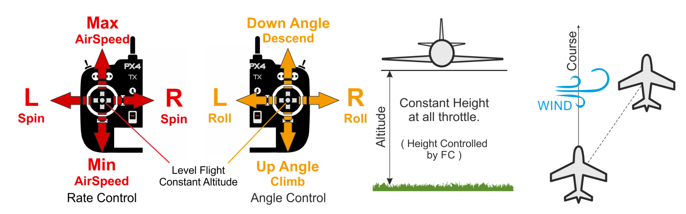

# 高度模式（固定翼）

&nbsp;&nbsp;

*高度模式*使操纵者更容易控制飞机高度，特别是到达并维持一个固定高度。 该模式不会试图抵抗风扰保持航向。

爬升/下沉率通过俯仰/升降舵杆操纵杆来控制。 操纵杆一旦回中，自动驾驶仪就会锁定当前的高度，并在偏航/滚转和任何空速条件下保持高度。

油门通道输入控制空速。 滚动和俯仰是角度控制的（因此不可能实现飞机滚转或环绕）。

当所有遥控输入都居中时（无滚动、俯仰、偏航，油门约50％），飞机将恢复直线水平飞行（受风影响）并保持其当前高度。

The diagram below shows the mode behaviour visually (for a [mode 2 transmitter](../getting_started/rc_transmitter_receiver.md#transmitter_modes)).

## 技术总结

遥控/手动模式，如稳定模式，但具有高度稳定性（杆回中使飞机进入直线和水平飞行并保持当前高度）。 但是飞行过程并不稳定，可能被风吹飘离。

* 回中的滚动/俯仰/偏航输入（在死区内）： 
  * 自动驾驶仪使飞机/机翼水平并且维持高度。
  * 如果空速传感器已连接，油门杆控制飞机速度。 在没有空速传感器的情况下，用户无法控制油门（在这种情况下，飞机将在巡航油门下([FW_THR_CRUISE](../advanced_config/parameter_reference.md#FW_THR_CRUISE)) 水平飞行，根据需要增加或减少油门以上升或下降。
* 外部中心： 
  * 俯仰摇杆控制高度。
  * Throttle stick controls the airspeed of the aircraft (as for centered Roll/Pitch/Yaw inputs).
  * 翻滚摇杆控制滚动角度。 自动驾驶仪将保持 [协调飞行](https://en.wikipedia.org/wiki/Coordinated_flight)。 This is same as in [Stabilized mode](../flight_modes/stabilized_fw.md).
  * Yaw stick actuates the rudder (signal will be added to the one calculated by the autopilot to maintain [coordinated flight](https://en.wikipedia.org/wiki/Coordinated_flight)). This is same as in [Stabilized mode](../flight_modes/stabilized_fw.md).

> **注** *可能需要手动输入（遥控器，或通过MAVLink连接的游戏手柄/拇指杆）。 *海拔高度通常使用气压计测量，在极端天气条件下可能会变得不准确。 带有激光雷达/距离传感器的飞机将能够以更高的可靠性和准确性控制高度。

## 参数

该模式受以下参数影响：<a href="../advanced_config/parameter_reference.md#FW_MAN_P_MAX">FW_MAN_P_MAX</a></td> 

<td>
  在高度稳定模式下手动控制的最大俯仰角。 默认：45度
</td></tr> 

<tr>
  <td>
    <a href="../advanced_config/parameter_reference.md#FW_MAN_R_MAX">FW_MAN_R_MAX</a></td> 
    
    <td>
      在高度稳定模式下手动控制的最大滚转角。 默认：45度
    </td></tr> 
    
    <tr>
      <td>
        <a href="../advanced_config/parameter_reference.md#fw-l1-control">FW L1 Control</a></td> 
        
        <td>
          维持指令高度和空速所需的滚转/偏航角也受固定翼L1控制参数的影响。
        </td></tr> </tbody> </table> 
        
        <!-- 
FW notes: 
FW position controller is basically 2 independent pieces

* L1 is for navigation - determines the roll and yaw needed to achieve the desired waypoint (or loiter)
* TECS is for speed and height control - determines throttle and elevator position needed to achieve the commanded altitude and airspeed
Overall that gives you an attitude setpoint (roll, pitch, yaw) and throttle which is sent off to the attitude controller
-->