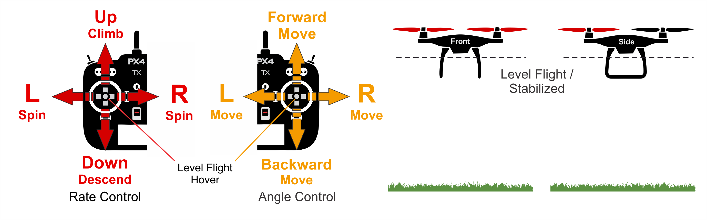

# 手动/稳定模式（多旋翼）

&nbsp;&nbsp;

*手动/稳定*模式在当遥控杆居中时可稳定多旋翼飞行器。 要手动移动/飞行飞机，您可以移动杆使其偏离居中位置。

> 如果设置*手动*或*稳定*模式，则启用此多旋翼模式。

在手动控制下，滚转和俯仰杆控制绕各个轴的飞机的*角度*（姿态），偏航杆控制水平面上方的旋转速度，油门控制高度/速度。

一旦释放操纵杆，它们就会返回中心死区。 一旦滚转和俯仰杆居中，多旋翼飞行器将平稳并停止运动。 然后飞机将悬停在适当的位置/保持高度——前提是它正确地配平，油门处于适当位置（参见[下面](#params)），并且不施加外力（例如风）。 飞行器将朝着任何风的方向漂移，你必须控制油门以保持高度。

## 技术描述

飞行员的输入将作为滚转、俯仰角度指令和一个偏航角速度指令传递给自动驾驶仪， 油门被重新调节（参见[下面的](#params)）并直接传递到输出混频器。 自动驾驶仪控制着飞机的姿态角，这意味着当 RC 摇杆居中时自驾仪调整飞机的滚转和俯仰角为零（从而实现飞机姿态的改平）。 自动驾驶仪不能补偿由于风（或其他来源）引起的漂移。

> **注** *可能需要手动输入（遥控器，或通过MAVLink连接的游戏手柄/拇指杆）。

## 参数 {#params}

| 参数                                                                                                  | 描述                                                                                                                                                                                                                                                                             |
| --------------------------------------------------------------------------------------------------- | ------------------------------------------------------------------------------------------------------------------------------------------------------------------------------------------------------------------------------------------------------------------------------ |
| [MPC_THR_HOVER](../advanced_config/parameter_reference.md#MPC_THR_HOVER) | 当油门杆居中并且` MPC_THR_CURVE `设置为默认值时输出的悬停油门。                                                                                                                                                                                                                                       |
| [MPC_THR_CURVE](../advanced_config/parameter_reference.md#MPC_THR_CURVE) | 定义油门比例。 默认设置为**重新调节至悬停推力**这意味着当油门杆居中时，输出配置的悬停油门（` MPC_THR_HOVER`）并且杆输入在其下方和上方线性重新调整（允许在稳定模式和高度/位置控制模式之间平滑过渡）。   
在功率大的飞机上，悬停油门可能非常低（例如低于20％），因此重新调整会使油门输入变形—— 即这里80％的推力将仅由杆输入的上半部分控制，20％由底部的来控制。 如果需要，可以将` MPC_THR_CURVE `设置为**无重新调整**，不进行重新调整（干输入对油门的映射的棒独立于`MPC_THR_HOVER`）。 |