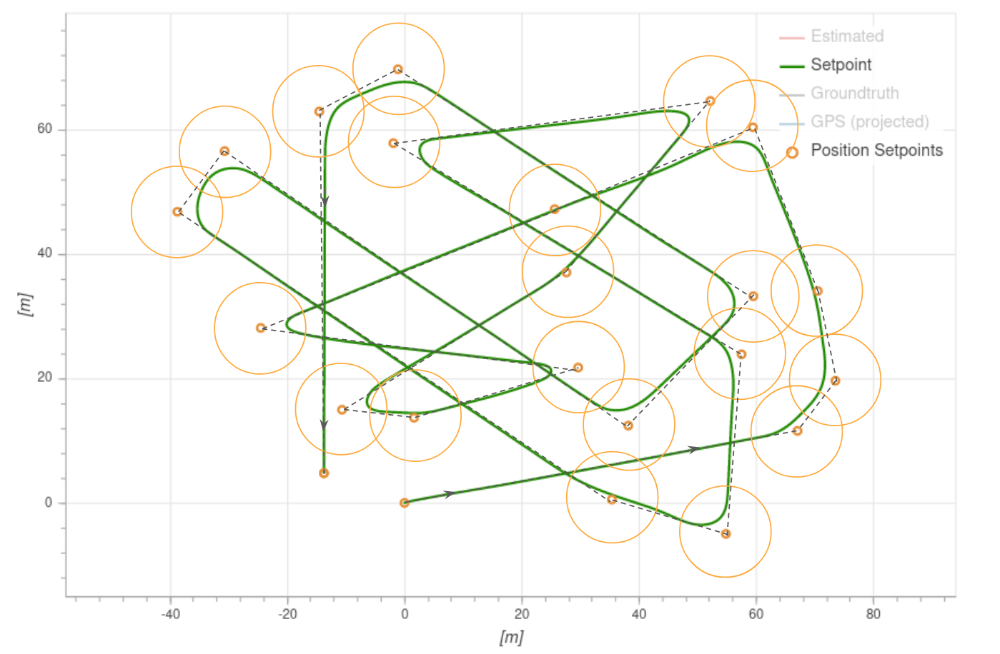

# 任务模式

*Mission mode* causes the vehicle to execute a predefined autonomous [mission](../flying/missions.md) (flight plan) that has been uploaded to the flight controller. 通常使用地面站（GCS）应用程序如 [QGroundControl](https://docs.qgroundcontrol.com/en/)（QGC）创建和上传任务。

:::note
* 此模式需要 3d 位置信息（如 GPS）。
* 使用此模式前必须先解锁。
* This mode is automatic - no user intervention is *required* to control the vehicle.
* 遥控器开关可以用于更改任何无人机的飞行模式。
* 在多旋翼中移动遥控器摇杆（或 VTOL 在多旋翼模式下）[默认情况下](#COM_RC_OVERRIDE)会将无人机切换到[位置模式](../flight_modes/position_mc.md)，除非是处理电池失效保护。 :::

## 参数描述

通常在地面控制站（例如，[QGroundControl](https://docs.qgroundcontrol.com/en/PlanView/PlanView.html)）中创建任务并在发射之前上载。 它们也可以由开发者API创建，和/或在飞行中上传。

Individual [mission commands](#mission_commands) are handled in a way that is appropriate for each vehicle's flight characteristics (for example loiter is implemented as *hover* for copter and *circle* for fixed-wing). VTOL飞机在固定翼模式下遵循固定翼的行为和参数，在多旋翼模式下遵循旋翼机的行为和参数。

:::note
Missions are uploaded onto a SD card that needs to be inserted **before** booting up the autopilot. :::

在高级别上，所有无人机类型在使用 MISSION 模式时表现相同：

1. 如果任务被存储并且PX4正在飞行，则它将从当前步骤执行
任务/飞行计划</ 0>。 </li> 
   
   1 如果存储了任务, 并且PX4着陆: 
     * 在旋翼机上 PX4 将执行[任务/飞行计划](../flying/missions.md). 如果任务没有 `TAKEOFF` 命令，则在从当前步骤执行飞行计划的剩余部分之前，PX4 将使飞机飞行到最小高度。
   * 在固定翼飞行器上，PX4 不会自动起飞（自动驾驶仪将检测运动并将油门设置为零）。 如果在任务模式下手动或弹射发射，飞机可以开始执行任务。
1 如果没有存储任务，或者 PX4 已完成所有任务命令： 
     * 如果正在飞行，飞机将会留待。
   * 如果已着陆，飞机将“等待”。
1 You can manually change the current mission command by selecting it in *QGroundControl*.
  
:::note
If you have a *Jump to item* command in the mission, moving to another item will **not** reset the loop counter. 也就意味着，如果将当前任务命令更改为 1，则不会“完全重启”任务。 :::

1 该任务仅在飞机锁定或上传新任务时重置。
  
:::tip
To automatically disarm the vehicle after it lands, in *QGroundControl* go to [Vehicle Setup > Safety](https://docs.qgroundcontrol.com/en/SetupView/Safety.html), navigate to *Land Mode Settings* and check the box labeled *Disarm after*. 输入飞机降落后，锁定前的等待时间。 :::</ol> 

可以通过激活[HOLD 模式](../flight_modes/hold.md)暂停任务。 当您重新激活 MISSION 飞行模式时，任务将从当前任务命令继续执行。 在任务模式下飞行时，如果决定中止任务，并且切换到了其他飞行模式，如位置模式，通过遥控器讲无人机飞到了其他地方，然后切换回任务模式，无人机将从当前位置继续执行任务，并会飞往下一个未访问的任务航点。

:::warning
在切换到其他遥控器模式之前，确保油门摇杆不为零（否则无人机将坠毁）。
我们建议您在切换到任何其他模式之前将摇杆置中。
::: 

有关任务规划的更多信息，请参阅：

* [任务规划](../flying/missions.md)
* [Plan View](https://docs.qgroundcontrol.com/en/PlanView/PlanView.html) (*QGroundControl* User Guide)

## QGroundControl 支持

*QGroundControl* provides additional GCS-level mission handling support (in addition to that provided by the flight controller). 更多信息请参阅：

* [飞机降落后解除任务](https://docs.qgroundcontrol.com/en/releases/stable_v3.2_long.html#remove-mission-after-vehicle-lands)
* [返航模式后恢复任务](https://docs.qgroundcontrol.com/en/releases/stable_v3.2_long.html#resume-mission)

## 任务参数

Mission behaviour is affected by a number of parameters, most of which are documented in [Parameter Reference > Mission](../advanced_config/parameter_reference.md#mission). 下面列出了一个很小的子集。

| 参数                                                                                                               | 参数描述                                                                                                  |
| ---------------------------------------------------------------------------------------------------------------- | ----------------------------------------------------------------------------------------------------- |
| [NAV_RCL_ACT](../advanced_config/parameter_reference.md#NAV_RCL_ACT)             | 遥控信号丢失失效保护模式（如果断开遥控无人机会怎样）- 例如进入保持模式，返航模式，终止等。                                                        |
| [NAV_LOITER_RAD](../advanced_config/parameter_reference.md#NAV_RCL_ACT)       | 固定翼悬停半径。                                                                                              |
| [COM_RC_OVERRIDE](../advanced_config/parameter_reference.md#COM_RC_OVERRIDE) | 控制多旋翼（或者多旋翼模式下的 VOTL）的摇杆移动是否将控制权交给位置模式下的飞手。 可以分别为自动模式和 offboard 模式启用此功能，默认情况下在自动模式下启用此功能。             |
| [COM_RC_STICK_OV](../advanced_config/parameter_reference.md#COM_RC_STICK_OV) | 导致发射机切换到 [位置模式](../flight_modes/position_mc.md) 的摇杆移动量（如果 [COM_RC_OVERRIDE](#COM_RC_OVERRIDE) 已启用）。 |

 

## 支持的任务命令

PX4 "accepts" the following MAVLink mission commands in Mission mode (with some _caveats_, given after the list). 除非另有说明，否则该实现与 MAVLink 规范中定义的一样。

* [MAV_CMD_NAV_WAYPOINT](https://mavlink.io/en/messages/common.html#MAV_CMD_NAV_WAYPOINT) 
    *  *Param3* (flythrough) is ignored. Flythrough is always enabled if *param 1* (time_inside) > 0.
* [MAV_CMD_NAV_LOITER_UNLIM](https://mavlink.io/en/messages/common.html#MAV_CMD_NAV_LOITER_UNLIM)
* [MAV_CMD_NAV_LOITER_TIME](https://mavlink.io/en/messages/common.html#MAV_CMD_NAV_LOITER_TIME)
* [MAV_CMD_NAV_LAND](https://mavlink.io/en/messages/common.html#MAV_CMD_NAV_LAND)
* [MAV_CMD_NAV_TAKEOFF](https://mavlink.io/en/messages/common.html#MAV_CMD_NAV_TAKEOFF)
* [MAV_CMD_NAV_LOITER_TO_ALT](https://mavlink.io/en/messages/common.html#MAV_CMD_NAV_LOITER_TO_ALT)
* [MAV_CMD_NAV_VTOL_TAKEOFF](https://mavlink.io/en/messages/common.html#MAV_CMD_NAV_VTOL_TAKEOFF)
  
    - `MAV_CMD_NAV_VTOL_TAKEOFF.param2` （过渡标题）被忽略。 取而代之的是，转向下一个航点用于过渡航向。 <!-- at LEAST until PX4 v1.11: https://github.com/PX4/PX4-Autopilot/issues/12660 -->
* [MAV_CMD_NAV_VTOL_LAND](https://mavlink.io/en/messages/common.html#MAV_CMD_NAV_VTOL_LAND)

* [MAV_CMD_NAV_FENCE_RETURN_POINT](https://mavlink.io/en/messages/common.html#MAV_CMD_NAV_FENCE_RETURN_POINT)
* [MAV_CMD_NAV_FENCE_POLYGON_VERTEX_INCLUSION](https://mavlink.io/en/messages/common.html#MAV_CMD_NAV_FENCE_POLYGON_VERTEX_INCLUSION)
* [MAV_CMD_NAV_FENCE_POLYGON_VERTEX_EXCLUSION](https://mavlink.io/en/messages/common.html#MAV_CMD_NAV_FENCE_POLYGON_VERTEX_EXCLUSION)
* [MAV_CMD_NAV_FENCE_CIRCLE_INCLUSION](https://mavlink.io/en/messages/common.html#MAV_CMD_NAV_FENCE_CIRCLE_INCLUSION)
* [MAV_CMD_NAV_FENCE_CIRCLE_EXCLUSION](https://mavlink.io/en/messages/common.html#MAV_CMD_NAV_FENCE_CIRCLE_EXCLUSION)
* [MAV_CMD_NAV_RALLY_POINT](https://mavlink.io/en/messages/common.html#MAV_CMD_NAV_RALLY_POINT)
* [MAV_CMD_DO_JUMP](https://mavlink.io/en/messages/common.html#MAV_CMD_DO_JUMP)
* [MAV_CMD_NAV_ROI](https://mavlink.io/en/messages/common.html#MAV_CMD_NAV_ROI)
* [MAV_CMD_DO_SET_ROI](https://mavlink.io/en/messages/common.html#MAV_CMD_DO_SET_ROI)
* [MAV_CMD_DO_SET_ROI_LOCATION](https://mavlink.io/en/messages/common.html#MAV_CMD_DO_SET_ROI_LOCATION)
* [MAV_CMD_DO_SET_ROI_WPNEXT_OFFSET](https://mavlink.io/en/messages/common.html#MAV_CMD_DO_SET_ROI_WPNEXT_OFFSET)
* [MAV_CMD_DO_SET_ROI_NONE](https://mavlink.io/en/messages/common.html#MAV_CMD_DO_SET_ROI_NONE)
* [MAV_CMD_DO_CHANGE_SPEED](https://mavlink.io/en/messages/common.html#MAV_CMD_DO_CHANGE_SPEED)
* [MAV_CMD_DO_SET_HOME](https://mavlink.io/en/messages/common.html#MAV_CMD_DO_SET_HOME)
* [MAV_CMD_DO_SET_SERVO](https://mavlink.io/en/messages/common.html#MAV_CMD_DO_SET_SERVO)
* [MAV_CMD_DO_LAND_START](https://mavlink.io/en/messages/common.html#MAV_CMD_DO_LAND_START)
* [MAV_CMD_DO_TRIGGER_CONTROL](https://mavlink.io/en/messages/common.html#MAV_CMD_DO_TRIGGER_CONTROL)
* [MAV_CMD_DO_DIGICAM_CONTROL](https://mavlink.io/en/messages/common.html#MAV_CMD_DO_DIGICAM_CONTROL)
* [MAV_CMD_DO_MOUNT_CONFIGURE](https://mavlink.io/en/messages/common.html#MAV_CMD_DO_MOUNT_CONFIGURE)
* [MAV_CMD_DO_MOUNT_CONTROL](https://mavlink.io/en/messages/common.html#MAV_CMD_DO_MOUNT_CONTROL)
* [MAV_CMD_IMAGE_START_CAPTURE](https://mavlink.io/en/messages/common.html#MAV_CMD_IMAGE_START_CAPTURE)
* [MAV_CMD_IMAGE_STOP_CAPTURE](https://mavlink.io/en/messages/common.html#MAV_CMD_IMAGE_STOP_CAPTURE)
* [MAV_CMD_VIDEO_START_CAPTURE](https://mavlink.io/en/messages/common.html#MAV_CMD_VIDEO_START_CAPTURE)
* [MAV_CMD_VIDEO_STOP_CAPTURE](https://mavlink.io/en/messages/common.html#MAV_CMD_VIDEO_STOP_CAPTURE)
* [MAV_CMD_DO_SET_CAM_TRIGG_DIST](https://mavlink.io/en/messages/common.html#MAV_CMD_DO_SET_CAM_TRIGG_DIST)
* [MAV_CMD_DO_SET_CAM_TRIGG_INTERVAL](https://mavlink.io/en/messages/common.html#MAV_CMD_DO_SET_CAM_TRIGG_INTERVAL)
* [MAV_CMD_SET_CAMERA_MODE](https://mavlink.io/en/messages/common.html#MAV_CMD_SET_CAMERA_MODE)
* [MAV_CMD_DO_VTOL_TRANSITION](https://mavlink.io/en/messages/common.html#MAV_CMD_DO_VTOL_TRANSITION)
* [MAV_CMD_NAV_DELAY](https://mavlink.io/en/messages/common.html#MAV_CMD_NAV_DELAY)
* [MAV_CMD_NAV_RETURN_TO_LAUNCH](https://mavlink.io/en/messages/common.html#MAV_CMD_NAV_RETURN_TO_LAUNCH)
* [MAV_CMD_DO_CONTROL_VIDEO](https://mavlink.io/en/messages/common.html#MAV_CMD_DO_CONTROL_VIDEO)
* [MAV_CMD_DO_GIMBAL_MANAGER_PITCHYAW](https://mavlink.io/en/messages/common.html#MAV_CMD_DO_GIMBAL_MANAGER_PITCHYAW)
* [MAV_CMD_DO_GIMBAL_MANAGER_CONFIGURE](https://mavlink.io/en/messages/common.html#MAV_CMD_DO_GIMBAL_MANAGER_CONFIGURE)
* [MAV_CMD_OBLIQUE_SURVEY](https://mavlink.io/en/messages/common.html#MAV_CMD_OBLIQUE_SURVEY)
* [MAV_CMD_DO_SET_CAMERA_ZOOM](https://mavlink.io/en/messages/common.html#MAV_CMD_DO_SET_CAMERA_ZOOM)
* [MAV_CMD_DO_SET_CAMERA_FOCUS](https://mavlink.io/en/messages/common.html#MAV_CMD_DO_SET_CAMERA_FOCUS)

注意：

- PX4 parses the above messages, but they are not necessary *acted* on. 例如，某些消息是针对飞机类型的。
- 对于任务命令，PX4 不支持本地坐标系（例如，[MAV_FRAME_LOCAL_NED](https://mavlink.io/en/messages/common.html#MAV_FRAME_LOCAL_NED)）。
- Not all messages/commands are exposed via *QGroundControl*.
- 添加消息时，列表可能已过时。 可以通过查看代码来检查当前设置。 Support is `MavlinkMissionManager::parse_mavlink_mission_item` in [/src/modules/mavlink/mavlink_mission.cpp](https://github.com/PX4/PX4-Autopilot/blob/release/1.13/src/modules/mavlink/mavlink_mission.cpp).
  
  :::note
如果发现缺失或错误消息，请添加问题报告或者 PR。
:::

## 圆角转弯：航点间轨迹

PX4 期望从上一个航点到当前目标遵循一条直线（不计划航点之间的任何其他类型路径 - 如果需要，可以通过添加额外航点来模拟）。

MC vehicles will change the *speed* when approaching or leaving a waypoint based on the [jerk-limited](../config_mc/mc_jerk_limited_type_trajectory.md#auto-mode) tuning. 无人机将朝着由接受半径（[ NAV_ACC_RAD ](../advanced_config/parameter_reference.md#NAV_ACC_RAD)）定义的下一个航路点（如果已定义）遵循一条平滑的圆弧曲线。 下图显示了您可能期望的各种路径。

进入接收半径的无人机会立即切换到下一个航路点：

- 对于多旋翼，该半径由 [NAV_ACC_RAD](../advanced_config/parameter_reference.md#NAV_ACC_RAD) 定义。
- 对于固定翼，接受半径由 “L1 distance” 定义。 
    - L1 距离是根据两个参数计算的： [FW_L1_DAMPING](../advanced_config/parameter_reference.md#FW_L1_DAMPING) 和 [FW_L1_PERIOD](../advanced_config/parameter_reference.md#FW_L1_PERIOD)，还有当前地速。
  - 默认情况下，约 70米。
  - The equation is: $$L_{1_{distance}}=\frac{1}{\pi}L_{1_{damping}}L_{1_{period}}\left \| \vec{v}_{ {xy}_{ground} } \right \|$$

