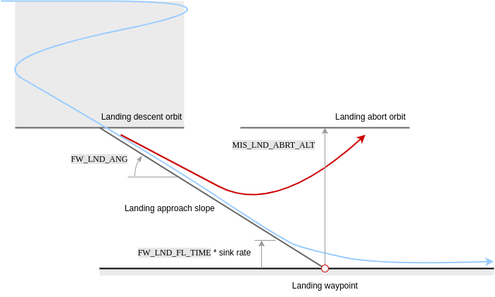

# 任务模式

*Mission mode* causes the vehicle to execute a predefined autonomous [mission](../flying/missions.md) (flight plan) that has been uploaded to the flight controller. The mission is typically created and uploaded with a Ground Control Station (GCS) application like [QGroundControl](https://docs.qgroundcontrol.com/master/en/) (QGC).

:::note
- This mode requires a global 3d position estimate (from GPS or inferred from a [local position](../ros/external_position_estimation.md#enabling-auto-modes-with-a-local-position)).
- 使用此模式前必须先解锁。
- This mode is automatic - no user intervention is *required* to control the vehicle.
- 遥控器开关可以用于更改任何无人机的飞行模式。
- RC stick movement in a multicopter (or VTOL in multicopter mode) will [by default](#COM_RC_OVERRIDE) change the vehicle to [Position mode](../flight_modes_mc/position.md) unless handling a critical battery failsafe. :::

## 参数描述

Missions are usually created in a ground control station (e.g. [QGroundControl](https://docs.qgroundcontrol.com/master/en/PlanView/PlanView.html)) and uploaded prior to launch. 它们也可以由开发者API创建，和/或在飞行中上传。

Individual [mission commands](#mission_commands) are handled in a way that is appropriate for each vehicle's flight characteristics (for example loiter is implemented as *hover* for copter and *circle* for fixed-wing). VTOL飞机在固定翼模式下遵循固定翼的行为和参数，在多旋翼模式下遵循旋翼机的行为和参数。

:::note
Missions are uploaded onto a SD card that needs to be inserted **before** booting up the autopilot. :::

在高级别上，所有无人机类型在使用 MISSION 模式时表现相同：

1. If no mission is stored, or if PX4 has finished executing all mission commands, or if the [mission is not feasible](#mission-feasibility-checks):

   - 如果正在飞行，飞机将会留待。
   - 如果已着陆，飞机将“等待”。
1. 如果任务被存储并且PX4正在飞行，则它将从当前步骤执行

任务/飞行计划</ 0>。</li> </ol></li> 
   
      - On copters PX4 will treat a takeoff item as a normal waypoint if already flying. 
     1. 如果存储了任务, 并且PX4着陆:
   - 在旋翼机上 PX4 将执行[任务/飞行计划](../flying/missions.md). 如果任务没有 `TAKEOFF` 命令，则在从当前步骤执行飞行计划的剩余部分之前，PX4 将使飞机飞行到最小高度。

   - 在固定翼飞行器上，PX4 不会自动起飞（自动驾驶仪将检测运动并将油门设置为零）。 If the currently active waypoint is a Takeoff, the system will automatically takeoff (see [FW Takeoff/Landing in Mission](#fw-mission-takeoff)).</ul> 

1. 如果没有存储任务，或者 PX4 已完成所有任务命令： 
      * 如果正在飞行，飞机将会留待。
   * 如果已着陆，飞机将“等待”。
1. You can manually change the current mission command by selecting it in *QGroundControl*.
   
:::note
If you have a *Jump to item* command in the mission, moving to another item will **not** reset the loop counter. 也就意味着，如果将当前任务命令更改为 1，则不会“完全重启”任务。 :::

1. 该任务仅在飞机锁定或上传新任务时重置。
   
:::tip
To automatically disarm the vehicle after it lands, in *QGroundControl* go to [Vehicle Setup > Safety](https://docs.qgroundcontrol.com/master/en/SetupView/Safety.html), navigate to *Land Mode Settings* and check the box labeled *Disarm after*. 输入飞机降落后，锁定前的等待时间。 :::

Missions can be paused by switching out of mission mode to any other mode (such as [Hold mode](../flight_modes_mc/hold.md) or [Position mode](../flight_modes_mc/position.md)). When you switch back to mission mode the vehicle will continue the mission, heading from the _current vehicle position_ to the current active mission item (the same waypoint it as heading towards originally). Note that if you moved the vehicle while the mission was paused you will no longer be following the original track towards the waypoint. A mission can be uploaded while the vehicle is paused, in which which case the current active mission item is set to 1.

:::warning
在切换到其他遥控器模式之前，确保油门摇杆不为零（否则无人机将坠毁）。
我们建议您在切换到任何其他模式之前将摇杆置中。
:::

有关任务规划的更多信息，请参阅：

- [任务规划](../flying/missions.md)
- [Plan View](https://docs.qgroundcontrol.com/master/en/PlanView/PlanView.html) (*QGroundControl* User Guide)

## Mission Feasibility Checks

PX4 runs some basic sanity checks to determine if a mission is feasible when it is uploaded, and when the vehicle is first armed. If any of the checks fail, the user is notified and it is not possible to start the mission.

A subset of the most important checks are listed below:

- First mission item too far away from vehicle ([MIS_DIST_1WP](#MIS_DIST_1WP))
- Any mission item conflicts with a plan or safety geofence
- More than one land start mission item defined ([MAV_CMD_DO_LAND_START](https://mavlink.io/en/messages/common.html#MAV_CMD_DO_LAND_START))
- A fixed-wing landing has an infeasible slope angle ([FW_LND_ANG](#FW_LND_ANG))
- Land start item (`MAV_CMD_DO_LAND_START`) appears in mission before an RTL item ([MAV_CMD_NAV_RETURN_TO_LAUNCH](https://mavlink.io/en/messages/common.html#MAV_CMD_NAV_RETURN_TO_LAUNCH))
- Missing takeoff and/or land item when these are configured as a requirement ([MIS_TKO_LAND_REQ](#MIS_TKO_LAND_REQ))

## QGroundControl 支持

*QGroundControl* provides additional GCS-level mission handling support (in addition to that provided by the flight controller).

更多信息请参阅：

- [飞机降落后解除任务](https://docs.qgroundcontrol.com/master/en/releases/stable_v3.2_long.html#remove-mission-after-vehicle-lands)
- [返航模式后恢复任务](https://docs.qgroundcontrol.com/master/en/releases/stable_v3.2_long.html#resume-mission)

## 任务参数

Mission behaviour is affected by a number of parameters, most of which are documented in [Parameter Reference > Mission](../advanced_config/parameter_reference.md#mission). 下面列出了一个很小的子集。

General parameters:

| 参数                                                                                                      | 参数描述                                                                                                                                                                                                    |
| ------------------------------------------------------------------------------------------------------- | ------------------------------------------------------------------------------------------------------------------------------------------------------------------------------------------------------- |
| [NAV_RCL_ACT](../advanced_config/parameter_reference.md#NAV_RCL_ACT)         | 遥控信号丢失失效保护模式（如果断开遥控无人机会怎样）- 例如进入保持模式，返航模式，终止等。                                                                                                                                                          |
| [NAV_LOITER_RAD](../advanced_config/parameter_reference.md#NAV_RCL_ACT)      | 固定翼悬停半径。                                                                                                                                                                                                |
| [COM_RC_OVERRIDE](../advanced_config/parameter_reference.md#COM_RC_OVERRIDE) | Controls whether stick movement on a multicopter (or VTOL in MC mode) gives control back to the pilot in [Position mode](../flight_modes_mc/position.md). 可以分别为自动模式和 offboard 模式启用此功能，默认情况下在自动模式下启用此功能。 |
| [COM_RC_STICK_OV](../advanced_config/parameter_reference.md#COM_RC_STICK_OV) | The amount of stick movement that causes a transition to [Position mode](../flight_modes_mc/position.md) (if [COM_RC_OVERRIDE](#COM_RC_OVERRIDE) is enabled).                                         |

Parameters related to [mission feasibility checks](#mission-feasibility-checks):

| 参数                                                                                                        | 参数描述                                                                                                                                                    |
| --------------------------------------------------------------------------------------------------------- | ------------------------------------------------------------------------------------------------------------------------------------------------------- |
| [MIS_DIST_1WP](../advanced_config/parameter_reference.md#MIS_DIST_1WP)         | The mission will not be started if the current waypoint is more distant than this value from the home position. Disabled if value is 0 or less.         |
| [FW_LND_ANG](../advanced_config/parameter_reference.md#FW_LND_ANG)             | Maximum landing slope angle.                                                                                                                            |
| [MIS_TKO_LAND_REQ](../advanced_config/parameter_reference.md#MIS_TKO_LAND_REQ) | Mission takeoff/landing requirement configuration. FW and VTOL both have it set to 2 by default, which means that the mission has to contain a landing. |

## 支持的任务命令

PX4 "accepts" the following MAVLink mission commands in Mission mode (with some _caveats_, given after the list). 除非另有说明，否则该实现与 MAVLink 规范中定义的一样。

* [MAV_CMD_NAV_WAYPOINT](https://mavlink.io/en/messages/common.html#MAV_CMD_NAV_WAYPOINT) 
    *  *Param3* (flythrough) is ignored. Flythrough is always enabled if *param 1* (time_inside) > 0.
* [MAV_CMD_NAV_LOITER_UNLIM](https://mavlink.io/en/messages/common.html#MAV_CMD_NAV_LOITER_UNLIM)
* [MAV_CMD_NAV_LOITER_TIME](https://mavlink.io/en/messages/common.html#MAV_CMD_NAV_LOITER_TIME)
* [MAV_CMD_NAV_LAND](https://mavlink.io/en/messages/common.html#MAV_CMD_NAV_LAND)
* [MAV_CMD_NAV_TAKEOFF](https://mavlink.io/en/messages/common.html#MAV_CMD_NAV_TAKEOFF)
* [MAV_CMD_NAV_LOITER_TO_ALT](https://mavlink.io/en/messages/common.html#MAV_CMD_NAV_LOITER_TO_ALT)
* [MAV_CMD_NAV_VTOL_TAKEOFF](https://mavlink.io/en/messages/common.html#MAV_CMD_NAV_VTOL_TAKEOFF)
  
    - `MAV_CMD_NAV_VTOL_TAKEOFF.param2` （过渡标题）被忽略。 取而代之的是，转向下一个航点用于过渡航向。 <!-- at LEAST until PX4 v1.13: https://github.com/PX4/PX4-Autopilot/issues/12660 -->
* [MAV_CMD_NAV_VTOL_LAND](https://mavlink.io/en/messages/common.html#MAV_CMD_NAV_VTOL_LAND)

* [MAV_CMD_NAV_FENCE_RETURN_POINT](https://mavlink.io/en/messages/common.html#MAV_CMD_NAV_FENCE_RETURN_POINT)
* [MAV_CMD_NAV_FENCE_POLYGON_VERTEX_INCLUSION](https://mavlink.io/en/messages/common.html#MAV_CMD_NAV_FENCE_POLYGON_VERTEX_INCLUSION)
* [MAV_CMD_NAV_FENCE_POLYGON_VERTEX_EXCLUSION](https://mavlink.io/en/messages/common.html#MAV_CMD_NAV_FENCE_POLYGON_VERTEX_EXCLUSION)
* [MAV_CMD_NAV_FENCE_CIRCLE_INCLUSION](https://mavlink.io/en/messages/common.html#MAV_CMD_NAV_FENCE_CIRCLE_INCLUSION)
* [MAV_CMD_NAV_FENCE_CIRCLE_EXCLUSION](https://mavlink.io/en/messages/common.html#MAV_CMD_NAV_FENCE_CIRCLE_EXCLUSION)
* [MAV_CMD_NAV_RALLY_POINT](https://mavlink.io/en/messages/common.html#MAV_CMD_NAV_RALLY_POINT)
* [MAV_CMD_DO_JUMP](https://mavlink.io/en/messages/common.html#MAV_CMD_DO_JUMP)
* [MAV_CMD_NAV_ROI](https://mavlink.io/en/messages/common.html#MAV_CMD_NAV_ROI)
* [MAV_CMD_DO_SET_ROI](https://mavlink.io/en/messages/common.html#MAV_CMD_DO_SET_ROI)
* [MAV_CMD_DO_SET_ROI_LOCATION](https://mavlink.io/en/messages/common.html#MAV_CMD_DO_SET_ROI_LOCATION)
* [MAV_CMD_DO_SET_ROI_WPNEXT_OFFSET](https://mavlink.io/en/messages/common.html#MAV_CMD_DO_SET_ROI_WPNEXT_OFFSET)
* [MAV_CMD_DO_SET_ROI_NONE](https://mavlink.io/en/messages/common.html#MAV_CMD_DO_SET_ROI_NONE)
* [MAV_CMD_DO_CHANGE_SPEED](https://mavlink.io/en/messages/common.html#MAV_CMD_DO_CHANGE_SPEED)
* [MAV_CMD_DO_SET_HOME](https://mavlink.io/en/messages/common.html#MAV_CMD_DO_SET_HOME)
* [MAV_CMD_DO_SET_SERVO](https://mavlink.io/en/messages/common.html#MAV_CMD_DO_SET_SERVO)
* [MAV_CMD_DO_LAND_START](https://mavlink.io/en/messages/common.html#MAV_CMD_DO_LAND_START)
* [MAV_CMD_DO_TRIGGER_CONTROL](https://mavlink.io/en/messages/common.html#MAV_CMD_DO_TRIGGER_CONTROL)
* [MAV_CMD_DO_DIGICAM_CONTROL](https://mavlink.io/en/messages/common.html#MAV_CMD_DO_DIGICAM_CONTROL)
* [MAV_CMD_DO_MOUNT_CONFIGURE](https://mavlink.io/en/messages/common.html#MAV_CMD_DO_MOUNT_CONFIGURE)
* [MAV_CMD_DO_MOUNT_CONTROL](https://mavlink.io/en/messages/common.html#MAV_CMD_DO_MOUNT_CONTROL)
* [MAV_CMD_IMAGE_START_CAPTURE](https://mavlink.io/en/messages/common.html#MAV_CMD_IMAGE_START_CAPTURE)
* [MAV_CMD_IMAGE_STOP_CAPTURE](https://mavlink.io/en/messages/common.html#MAV_CMD_IMAGE_STOP_CAPTURE)
* [MAV_CMD_VIDEO_START_CAPTURE](https://mavlink.io/en/messages/common.html#MAV_CMD_VIDEO_START_CAPTURE)
* [MAV_CMD_VIDEO_STOP_CAPTURE](https://mavlink.io/en/messages/common.html#MAV_CMD_VIDEO_STOP_CAPTURE)
* [MAV_CMD_DO_SET_CAM_TRIGG_DIST](https://mavlink.io/en/messages/common.html#MAV_CMD_DO_SET_CAM_TRIGG_DIST)
* [MAV_CMD_DO_SET_CAM_TRIGG_INTERVAL](https://mavlink.io/en/messages/common.html#MAV_CMD_DO_SET_CAM_TRIGG_INTERVAL)
* [MAV_CMD_SET_CAMERA_MODE](https://mavlink.io/en/messages/common.html#MAV_CMD_SET_CAMERA_MODE)
* [MAV_CMD_DO_VTOL_TRANSITION](https://mavlink.io/en/messages/common.html#MAV_CMD_DO_VTOL_TRANSITION)
* [MAV_CMD_NAV_DELAY](https://mavlink.io/en/messages/common.html#MAV_CMD_NAV_DELAY)
* [MAV_CMD_NAV_RETURN_TO_LAUNCH](https://mavlink.io/en/messages/common.html#MAV_CMD_NAV_RETURN_TO_LAUNCH)
* [MAV_CMD_DO_CONTROL_VIDEO](https://mavlink.io/en/messages/common.html#MAV_CMD_DO_CONTROL_VIDEO)
* [MAV_CMD_DO_GIMBAL_MANAGER_PITCHYAW](https://mavlink.io/en/messages/common.html#MAV_CMD_DO_GIMBAL_MANAGER_PITCHYAW)
* [MAV_CMD_DO_GIMBAL_MANAGER_CONFIGURE](https://mavlink.io/en/messages/common.html#MAV_CMD_DO_GIMBAL_MANAGER_CONFIGURE)
* [MAV_CMD_OBLIQUE_SURVEY](https://mavlink.io/en/messages/common.html#MAV_CMD_OBLIQUE_SURVEY)
* [MAV_CMD_DO_SET_CAMERA_ZOOM](https://mavlink.io/en/messages/common.html#MAV_CMD_DO_SET_CAMERA_ZOOM)
* [MAV_CMD_DO_SET_CAMERA_FOCUS](https://mavlink.io/en/messages/common.html#MAV_CMD_DO_SET_CAMERA_FOCUS)

注意：

- PX4 parses the above messages, but they are not necessary *acted* on. 例如，某些消息是针对飞机类型的。
- 对于任务命令，PX4 不支持本地坐标系（例如，[MAV_FRAME_LOCAL_NED](https://mavlink.io/en/messages/common.html#MAV_FRAME_LOCAL_NED)）。
- Not all messages/commands are exposed via *QGroundControl*.
- 添加消息时，列表可能已过时。 可以通过查看代码来检查当前设置。 Support is `MavlinkMissionManager::parse_mavlink_mission_item` in [/src/modules/mavlink/mavlink_mission.cpp](https://github.com/PX4/PX4-Autopilot/blob/release/1.14/src/modules/mavlink/mavlink_mission.cpp).
  
  :::note
如果发现缺失或错误消息，请添加问题报告或者 PR。
:::

## 圆角转弯：航点间轨迹

PX4 期望从上一个航点到当前目标遵循一条直线（不计划航点之间的任何其他类型路径 - 如果需要，可以通过添加额外航点来模拟）。

MC vehicles will change the *speed* when approaching or leaving a waypoint based on the [jerk-limited](../config_mc/mc_jerk_limited_type_trajectory.md#auto-mode) tuning. 无人机将朝着由接受半径（[ NAV_ACC_RAD ](../advanced_config/parameter_reference.md#NAV_ACC_RAD)）定义的下一个航路点（如果已定义）遵循一条平滑的圆弧曲线。 下图显示了您可能期望的各种路径。

进入接收半径的无人机会立即切换到下一个航路点：

- 对于多旋翼，该半径由 [NAV_ACC_RAD](../advanced_config/parameter_reference.md#NAV_ACC_RAD) 定义。
- 对于固定翼，接受半径由 “L1 distance” 定义。 
    - The L1 distance is computed from two parameters: [NPFG_DAMPING](../advanced_config/parameter_reference.md#NPFG_DAMPING) and [NPFG_PERIOD](../advanced_config/parameter_reference.md#NPFG_PERIOD), and the current ground speed.
  - 默认情况下，约 70米。
  - The equation is: $$L_{1_{distance}}=\frac{1}{\pi}L_{1_{damping}}L_{1_{period}}\left \| \vec{v}_{ {xy}_{ground} } \right \|$$

## MC Mission Takeoff

Plan a multicopter mission takeoff by adding a `Takeoff` mission item to the map (this corresponds to the [MAV_CMD_NAV_TAKEOFF](https://mavlink.io/en/messages/common.html#MAV_CMD_NAV_TAKEOFF) MAVLink command).

During mission execution this will cause the vehicle to ascend vertically to the minimum takeoff altitude defined in the [MIS_TAKEOFF_ALT](../advanced_config/parameter_reference.md#MIS_TAKEOFF_ALT) parameter, then head towards the 3D position defined in the mission item.

If a mission with no takeoff mission item is started, the vehicle will ascend to the minimum takeoff altitude and then proceed to the first `Waypoint` mission item.

If the vehicle is already flying when the mission is started, a takeoff mission item is treated as a normal waypoint.

## FW Mission Takeoff

Starting flights with mission takeoff (and landing using a mission landing) is the recommended way of operating a plane autonomously.

Both [runway takeoff](../flight_modes_fw/takeoff.md#runway-takeoff) and [hand-launched takeoff](../flight_modes_fw/takeoff.md#catapult-hand-launch) are supported — for configuration information see [Takeoff mode (FW)](../flight_modes_fw/takeoff.md).

The takeoff behaviour is defined in a Takeoff mission item, which corresponds to the [MAV_CMD_NAV_TAKEOFF](https://mavlink.io/en/messages/common.html#MAV_CMD_NAV_TAKEOFF) MAVLink command. During mission execution the vehicle will takeoff towards this waypoint, and climb until the specified altitude is reached. The mission item is then accepted, and the mission will start executing the next item.

More specifically, the takeoff mission item defines the takeoff course and clearance altitude. The course is the line between the vehicle starting point and the horizontal position defined in the mission item,  while the clearance altitude is the mission item altitude.

For a runway takeoff, the `Takeoff` mission item will cause the vehicle to arm, throttle up the motors and take off. When hand-launching the vehicle will arm, but only throttle up when the vehicle is thrown (the acceleration trigger is detected). In both cases, the vehicle should be placed (or launched) facing towards the takeoff waypoint when the mission is started. If possible, always make the vehicle takeoff into the wind.

:::note
A fixed-wing mission requires a `Takeoff` mission item to takeoff; if however the vehicle is already flying when the mission is started the takeoff item will be treated as a normal waypoint. :::

For more infomormation about takeoff behaviour and configuration see [Takeoff mode (FW)](../flight_modes_fw/takeoff.md).

## FW Mission Landing

Fixed-wing mission landing is the recommended way to land a plane autonomously. This can be planned in *QGroundControl* using [fixed-wing landing pattern](https://docs.qgroundcontrol.com/master/en/PlanView/pattern_fixed_wing_landing.html).

If possible, always plan the landing such that it does the approach into the wind.

The following sections describe the landing sequence, land abort and nudging, safety considerations, and configuration. 

### Landing Sequence

A landing pattern consists of a loiter waypoint ([MAV_CMD_NAV_LOITER_TO_ALT](https://mavlink.io/en/messages/common.html#MAV_CMD_NAV_LOITER_TO_ALT)) followed by a land waypoint ([MAV_CMD_NAV_LAND](https://mavlink.io/en/messages/common.html#MAV_CMD_NAV_LAND)). The positions of the two points define the start and end point of the landing approach, and hence the glide slope for the landing approach.

This pattern results in the following landing sequence:

1. **Fly to landing location**: The aircraft flies at its current altitude towards the loiter waypoint.
2. **Descending orbit to approach altitude**: On reaching the loiter radius of the waypoint, the vehicle performs a descending orbit until it reaches the "approach altitude" (the altitude of the loiter waypoint). The vehicle continues to orbit at this altitude until it has a tanjential path towards the land waypoint, at which point the landing approach is initiated.

4. **Landing approach**: The aircraft follows the landing approach slope towards the land waypoint until the flare altitude is reached.

5. **Flare**: The vehicle flares until it touches down.

### Landing Approach

The vehicle tracks the landing slope (generally at a slower speed than cruise) until reaching the flare altitude.

Note that the glide slope is calculated from the 3D positions of the loiter and landing waypoints; if its angle exceeds the parameter [FW_LND_ANG](#FW_LND_ANG) the mission will be rejected as unfeasible on upload.

The parameters that affect the landing approach are listed below.

| 参数                                                                                            | 参数描述                                                                                                                                       |
| --------------------------------------------------------------------------------------------- | ------------------------------------------------------------------------------------------------------------------------------------------ |
| [FW_LND_ANG](../advanced_config/parameter_reference.md#FW_LND_ANG) | The maximum achievable landing approach slope angle. Note that smaller angles may still be commanded via the landing pattern mission item. |
| [FW_LND_EARLYCFG](../advanced_config/parameter_reference.md#FW_LND_EARLYCFG)                | Optionally deploy landing configuration during the landing descent orbit (e.g. flaps, spoilers, landing airspeed).                         |
| [FW_LND_AIRSPD](../advanced_config/parameter_reference.md#FW_LND_AIRSPD)                    | Calibrated airspeed setpoint during landing.                                                                                               |
| [FW_FLAPS_LND_SCL](../advanced_config/parameter_reference.md#FW_FLAPS_LND_SCL)              | Flaps setting during landing.                                                                                                              |
| [FW_LND_THRTC_SC](../advanced_config/parameter_reference.md#FW_LND_THRTC_SC)                | Altitude time constant factor for landing (overrides default [TECS tuning](../config_fw/position_tuning_guide_fixedwing.md)).              |

### Flaring / Roll-out

Flaring consists of a switch from altitude tracking to a shallow sink rate setpoint and constraints on the commandable throttle, resulting in nose up manuevering to slow the descent and produce a softer touchdown.

The flaring altitude is calculated during the final approach via "time-to-impact" ([FW_LND_FL_TIME](#FW_LND_FL_TIME)) and the approach descent rate. An additional safety parameter [FW_LND_FLALT](#FW_LND_FLALT) sets the minimum altitude at which the vehicle will flare (if the time based altitude is too low to allow a safe flare maneuver).

If belly landing, the vehicle will continue in the flaring state until touchdown, land detection, and subsequent disarm. For runway landings, [FW_LND_TD_TIME](#FW_LND_TD_TIME) enables setting the time post flare start to pitch down the nose (e.g. consider tricycle gear) onto the runway ([RWTO_PSP](#RWTO_PSP)) and avoid bouncing. This time roughly corresponds to the touchdown post flare, and should be tuned for a given airframe during test flights only after the flare has been tuned.

The parameters that affect flaring are listed below.

| 参数                                                                                                     | 参数描述                                                                                                                                                                |
| ------------------------------------------------------------------------------------------------------ | ------------------------------------------------------------------------------------------------------------------------------------------------------------------- |
| [FW_LND_FL_TIME](../advanced_config/parameter_reference.md#FW_LND_FL_TIME)  | Time before impact (at current descent rate) at which the vehicle should flare.                                                                                     |
| [FW_LND_FL_SINK](../advanced_config/parameter_reference.md#FW_LND_FL_SINK) | A shallow sink rate the aircraft will track during the flare.                                                                                                       |
| [FW_LND_FLALT](../advanced_config/parameter_reference.md#FW_LND_FLALT)     | Minimum altitude above ground the aircraft must flare. This is only used when the time-based flare altitude is too low.                                             |
| [FW_LND_FL_PMAX](../advanced_config/parameter_reference.md#FW_LND_FL_PMAX) | Maximum allowed pitch during the flare.                                                                                                                             |
| [FW_LND_FL_PMIN](../advanced_config/parameter_reference.md#FW_LND_FL_PMIN) | Minimum allowed pitch during the flare (often necessary to avoid negative pitch angles commanded to increase airspeed, as the throttle is reduced to idle setting.) |
| [FW_LND_TD_TIME](../advanced_config/parameter_reference.md#FW_LND_TD_TIME) | The time after flare start when the vehicle should pitch the nose down.                                                                                             |
| [RWTO_PSP](../advanced_config/parameter_reference.md#RWTO_PSP)               | Pitch setpoint while on the runway. For tricycle gear, typically near zero. For tail draggers, positive.                                                            |
| [FW_THR_IDLE](../advanced_config/parameter_reference.md#FW_THR_IDLE)       | Idle throttle setting. The vehicle will retain this setting throughout the flare and roll out.                                                                      |

### Abort

#### Operator Abort

The landing may be aborted by the operator at any point during the final approach using the [MAV_CMD_DO_GO_AROUND](https://mavlink.io/en/messages/common.html#MAV_CMD_DO_GO_AROUND) command. On _QGroundControl_ a popup button appears during landing to enable this.

Aborting the landing results in a climb out to an orbit pattern centered above the land waypoint. The maximum of the aircraft's current altitude and [MIS_LND_ABRT_ALT](#MIS_LND_ABRT_ALT) is set as the abort orbit altitude height relative to (above) the landing waypoint. Landing configuration (e.g. flaps, spoilers, landing airspeed) is disabled during abort and the aicraft flies in cruise conditions.

The abort command is disabled during the flare for safety. Operators may still manually abort the landing by switching to any manual mode, such as [Stabilized mode](../flight_modes_fw/stabilized.md)), though it should be noted that this is risky!

#### Automatic Abort

Automatic abort logic is additionally available for several conditions, if configured. Available automatic abort criteria may be enabled via bitmask parameter [FW_LND_ABORT](#FW_LND_ABORT). One example of an automatic abort criteria is the absence of a valid range measurement from a distance sensor.

:::warning
Landing without a distance sensor is **strongly** discouraged. Disabling terrain estimation with [FW_LND_USETER](#FW_LND_USETER) and select bits of [FW_LND_ABORT](#FW_LND_ABORT) will remove the default distance sensor requirement, but consequently falls back to GNSS altitude to determine the flaring altitude, which may be several meters too high or too low, potentially resulting in damage to the airframe. :::

| 参数                                                                                                         | 参数描述                                                                       |
| ---------------------------------------------------------------------------------------------------------- | -------------------------------------------------------------------------- |
| [MIS_LND_ABRT_ALT](../advanced_config/parameter_reference.md#MIS_LND_ABRT_ALT) | The minimum altitude above the land point an abort orbit can be commanded. |
| [FW_LND_ABORT](../advanced_config/parameter_reference.md#FW_LND_ABORT)         | Determines which automatic abort criteria are enabled.                     |
| [FW_LND_USETER](../advanced_config/parameter_reference.md#FW_LND_USETER)       | Enables use of the distance sensor during the final approach.              |

### Nudging

In the case of minor GNSS or map discrepancies causing an offset approach, small manual adjustments to the landing approach and roll out can be made by the operator (via yaw stick) when [FW_LND_NUDGE](../advanced_config/parameter_reference.md#FW_LND_NUDGE) is enabled. Options include either nudging the approach angle or the full approach path.

In both cases, the vehicle remains in full auto mode, tracking the shifted approach vector. [FW_LND_TD_OFF](../advanced_config/parameter_reference.md#FW_LND_TD_OFF) allows determination of how far to the left or right of the landing waypoint the projected touchdown point may be nudged. Yaw stick input corresponds to a nudge "rate". Once the stick is released (zero rate), the approach path or angle will stop moving.

Approach path nudging is frozen once the flare starts. If conducting a runway landing with steerable nose wheel, the yaw stick command passes directly to the nose wheel from flare start, during roll out, until disarm. Note that if the wheel controller is enabled ([FW_W_EN](#FW_W_EN)), the controller will actively attempt to steer the vehicle to the approach path, i.e. "fighting" operator yaw stick inputs.

:::note
Nudging should not be used to supplement poor position control tuning. If the vehicle is regularly showing poor tracking peformance on a defined path, please refer to the [fixed-wing control tuning guide](../flight_modes_fw/position.md) for instruction. :::

| 参数                                                                                                   | 参数描述                                                                               |
| ---------------------------------------------------------------------------------------------------- | ---------------------------------------------------------------------------------- |
| [FW_LND_NUDGE](../advanced_config/parameter_reference.md#FW_LND_NUDGE)   | Enable nudging behavior for fixed-wing landing.                                    |
| [FW_LND_TD_OFF](../advanced_config/parameter_reference.md#FW_LND_TD_OFF) | Configure the allowable touchdown lateral offset from the commanded landing point. |
| [FW_W_EN](../advanced_config/parameter_reference.md#FW_W_EN)             | Enable the nose wheel steering controller.                                         |

### Near Ground Safety Constraints

In landing mode, the distance sensor is used to determine proximity to the ground, and the airframe's geometry is used to calculate roll contraints to prevent wing strike.

| 参数                                                                           | 参数描述                                                      |
| ---------------------------------------------------------------------------- | --------------------------------------------------------- |
| [FW_WING_SPAN](../advanced_config/parameter_reference.md#FW_WING_SPAN)     | Wing span of the airframe.                                |
| [FW_WING_HEIGHT](../advanced_config/parameter_reference.md#FW_WING_HEIGHT) | Height of wing from bottom of gear (or belly if no gear). |

## VTOL Mission Takeoff

Plan a VTOL mission takeoff by adding a `VTOL Takeoff` mission item to the map.

During mission execution the vehicle will ascend vertically to the minimum takeoff altitude defined in the [MIS_TAKEOFF_ALT](../advanced_config/parameter_reference.md#MIS_TAKEOFF_ALT) parameter, then transition to fixed-wing mode with the heading defined in the mission item. After transitioning the vehicle heads towards the 3D position defined in the mission item.

A VTOL mission requires a `VTOL Takeoff` mission item to takeoff; if however the vehicle is already flying when the mission is started the takeoff item will be treated as a normal waypoint.

