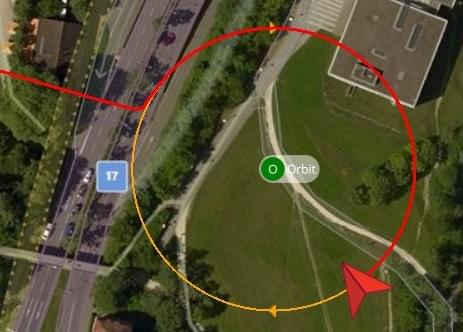

# 环绕模式 （多旋翼）

&nbsp;

*轨道* 引导飞行模式允许控制多旋翼无人机（或者 多旋翼模式下的 VTOL）绕圈飞行，[默认](https://mavlink.io/en/messages/common.html#ORBIT_YAW_BEHAVIOUR) 偏航，使其时钟朝向中心。<0>

*需要* *QGroundControl* （或其他兼容的 GCS 或 MAVLink API）来使能该模式，并且设置轨迹中心位置，初始半径和高度。 一旦启用后，无人机将尽快飞到控制的圆周轨迹上的最近点，并在规划的圆周上朝中心方向缓慢（1 m/s）顺时针旋转。

关于如何启动轨道模式的说明在这里：[FlyView > Orbit Location](https://docs.qgroundcontrol.com/en/FlyView/FlyView.html#orbit) （*QGroundControl* 指南）。

:::note
使用遥控是*可选的*。 如果没有遥控，则环绕模式如上所述。 无法使用遥控来启动该模式（如果使用遥控切换该模式，无人机会处于空闲状态）。
:::

遥控可以用于改变绕圈的高度，半径，速度和绕圈方向：

- **左摇杆：** 
  - *上/下：* 控制上升/下降速度，像在[定点模式](../flight_modes/position_mc.md)中一样。 当在中部死区时，高度被锁定。
  - *左/右：* 无效。
- **右摇杆：** 
  - *左/右：* 控制顺时针/逆时针方向的加速度。 当居中时，当前速度被锁定。 
    - 最大速度为 10 m/s，进一步的限制是将向心加速度保持在 2 m/s^2 以下。 
  - *上/下：* 控制绕圈半径（更小/更大）。 当居中时，当前半径被锁定。 
    - 最小半径是 1 米。 最大半径是 100 米。

下图直观的显示了模式行为（对于一个[模式 2 发送器](../getting_started/rc_transmitter_receiver.md#transmitter_modes)）。

切换到其他飞行模式（使用遥控或 QGC 地面站）可以停止此模式。

## 参数/限制

没有特定的环绕模式参数。

下面的限制是写死的：

- 初始/默认是顺时针方向 1 m/s 旋转。
- 最大加速度限制在 2 2 m/s^2，优先保持控制的圆周轨迹而不是地速（即， 如果加速度超过 2 m/s^2，无人机将减速以达到正确的圆周）。
- 最大半径是 100 米。

## MAVLink 消息 （开发者）

环绕模式使用以下 MAVLink 命令：

- [MAV_CMD_DO_ORBIT](https://mavlink.io/en/messages/common.html#MAV_CMD_DO_ORBIT) - 启动一个指定中心点，半径，方向，高度，速度和[偏航方向](https://mavlink.io/en/messages/common.html#ORBIT_YAW_BEHAVIOUR)的轨道（无人机默认朝向轨道中心）。
- [ORBIT_EXECUTION_STATUS](https://mavlink.io/en/messages/common.html#ORBIT_EXECUTION_STATUS) - 在轨道模式发出的轨道状态，以更新当前轨道参数的 GCS（可以由遥控改这些参数）。