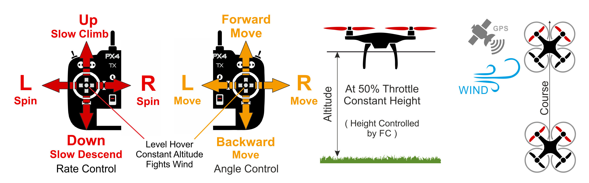

# 位置模式（多旋翼）

&nbsp;&nbsp;

*位置模式*是一种易于驾驶的遥控模式，其中滚动和俯仰操纵杆在左右和前后方向（相对于飞机的“前部”）控制地面速度，并且油门控制上升-下降的速度。 当杆被释放/居中时，飞机将主动制动、改平并锁定到3D空间中的位置——补偿风和其他力。

> 位置模式是对于新手而言最安全的手动模式。 与[高度](../flight_modes/altitude_mc.md)和[手动/稳定](../flight_modes/manual_stabilized_mc.md)模式不同，当摇杆居中时飞机将停止运动，而不是持续运动直至被风阻减慢为止。

下图显示了模式行为（对于模式2发射器）。

> 在此模式下降落时必须小心。 首次在此模式下着陆时, 准备切换到 [手动/稳定模式](../flight_modes/manual_stabilized_mc.md), 以便能够锁定飞机。 如果正确地检测到着陆, 电机会在触地后停止旋转, 然后在不久后锁定。 如果电机继续在较高的转速旋转或开始加速旋转, 首先切换到[手动/稳定(多旋翼)](../flight_modes/manual_stabilized_mc.md), 然后锁定。 请注意，由于GPS漂移，飞机可能会翻倒在地面上。

## 技术总结

遥控/手动模式，其中RPT摇杆 在相应的方向控制 *速度*。 中心摇杆水平飞机, 并保持它的固定位置和高度逆风。

* 回正的RPT摇杆（在死区内）可以抗风并保持飞机X、Y、Z位置稳定以及姿态水平。
* 中心以外： 
  * 滚转/俯仰摇杆控制相对于飞机”前部“的左右前后方向的速度。
  * 油门摇杆控制上升-下降的速度。
  * 偏航摇杆控制水平面上方的角度旋转速率。
* Takeoff: 
  * When landed, the vehicle will take off if the throttle stick is raised above 62.5% percent (of the full range from bottom).
* Landing: 
  * When close to the ground ([MPC_LAND_ALT2](#MPC_LAND_ALT2)), horizontal velocity is limited ([MPC_LAND_VEL_XY](#MPC_LAND_VEL_XY)).

> **注** *可能需要手动输入（遥控器，或通过MAVLink连接的游戏手柄/拇指杆）。 注 该模式需要GPS。

### 参数

[ Multicopter Position Control ](../advanced_config/parameter_reference.md#multicopter-position-control)组中的所有参数都是相关的。 下面列出了一些特别注意的参数。

| 参数                                                                                                          | 描述                                                                                                                                                                                                                                                                                                    |
| ----------------------------------------------------------------------------------------------------------- | ----------------------------------------------------------------------------------------------------------------------------------------------------------------------------------------------------------------------------------------------------------------------------------------------------- |
| [MPC_HOLD_DZ](../advanced_config/parameter_reference.md#MPC_HOLD_DZ)             | 启用位置保持的摇杆的死区。 默认值：0.1（摇杆行程的10％）。                                                                                                                                                                                                                                                                      |
| [MPC_Z_VEL_MAX_UP](../advanced_config/parameter_reference.md#MPC_Z_VEL_MAX_UP) | 最大垂直上升速度。 默认：3m/s。                                                                                                                                                                                                                                                                                    |
| [MPC_Z_VEL_MAX_DN](../advanced_config/parameter_reference.md#MPC_Z_VEL_MAX_DN) | 最大垂直下降速度。 默认：1m/s。                                                                                                                                                                                                                                                                                    |
| [MPC_LAND_VEL_XY](../advanced_config/parameter_reference.md#MPC_LAND_VEL_XY)     | Horizontal velocity limit when close to ground ([MPC_LAND_ALT2](#MPC_LAND_ALT2) meters above ground, or above home if distance-to-ground is unknown). Default: 2 m/s.                                                                                                                               |
| [MPC_LAND_ALT1](../advanced_config/parameter_reference.md#MPC_LAND_ALT1)         | Altitude for triggering first phase of slow landing. Affects maximum allowed horizontal velocity setpoint. Default 5m.                                                                                                                                                                                |
| [MPC_LAND_ALT2](../advanced_config/parameter_reference.md#MPC_LAND_ALT2)         | Altitude for second phase of slow landing. In this phase maximum horizontal velocity is limited to [MPC_LAND_VEL_XY](#MPC_LAND_VEL_XY). Default 2m.                                                                                                                                                 |
| `RCX_DZ`                                                                           | RC dead zone for channel X. The value of X for throttle will depend on the value of [RC_MAP_THROTTLE](../advanced_config/parameter_reference.md#RC_MAP_THROTTLE). For example, if the throttle is channel 4 then [RC4_DZ](../advanced_config/parameter_reference.md#RC4_DZ) specifies the deadzone. |
| `MPC_XXXX`                                                                         | Most of the MPC_xxx parameters affect flight behaviour in this mode (at least to some extent). For example, [MPC_THR_HOVER](../advanced_config/parameter_reference.md#MPC_THR_HOVER) defines the thrust at which a vehicle will hover.                                                              |