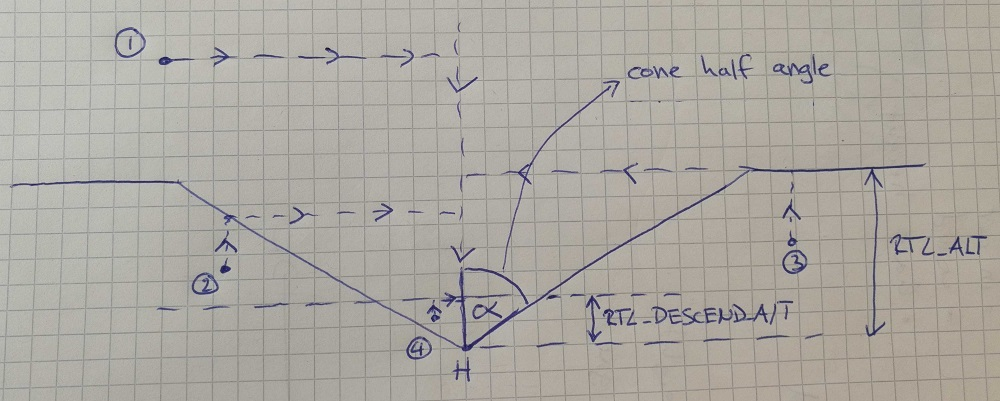

# 返航模式

返航模式用于使无人机在通向安全目的地的畅通路径上安全飞行，这里可以等待（悬停或绕圈）或着陆。

PX4 提供了几种机制来选择安全的返航路径，返航目的地和着陆，包括使用其实位置，集结（“安全”）点，任务路径和任务着陆顺序。

以下章节解释了如何配置 [返航类型](#return_types)， [返航高度](#return_altitude) 和 [降落/抵达行为](#arrival)。 最后，有几节说明了每种[载具类型](#default_configuration)的*默认*（预配置）行为。

:::note

- 该模式需要 GPS。
- 该模式是自动的 - 不 *需要* 用户干预即可控制无人机。
- 遥控开关可以在任何无人机上更改飞行模式。
- 在多旋翼中移动遥控器摇杆（或 VTOL 在多旋翼模式下）[默认情况下](#COM_RC_OVERRIDE)会将无人机切换到[位置模式](../flight_modes/position_mc.md)，除非是处理电池失效保护。
:::

## 返航类型（RTL_TYPE）

PX4 提供了四种替代方法（[ RTL_TYPE ](#RTL_TYPE)），用于找到通向安全目的地和/或着陆的畅通路径：

- [返航到起始位置/集结点](#home_return)（`RTL_TYPE=0`）: 上升到安全高度并通过直接路径返回到最近的集结点或起始地点。
- [任务降落/集结点返航](#mission_landing_return)（`RTL_TYPE=1`）：爬升到安全的高度，直接飞往最近的目的地*除了起始位置*：集结点或任务着陆开始。 如果未定义任务着陆点或集结点，请通过直接路径返回起始位置。
- [任务路径返航](#mission_path_return)（`RTL_TYPE=2`）：使用任务路径并快速继续执行任务着陆（如果已定义）。 如果未定义任务降落，则将快速回退到任务起始位置。 如果未定义任务，直接返航到起始位置（集结点将被忽略）。
- [最近的安全目的地返航](#safety_point_return)（` RTL_TYPE = 3 `）：上升到安全高度并通过直接路径返回最近的目的地：起始位置，任务着陆点的开始位置或集结点。 如果目的地是飞行任务着陆模式，则按照该模式降落。

以下各节提供了每种类型的更详细说明。

### 起始位置/集结点返航类型（RTL_TYPE=0）

无人机在该返航类型中：

- 爬升到一个安全的[返航高度](#return_altitude)（高于任何可预期的障碍物）。
- 通过直接路径飞往起始位置或集结点（以最近者为准）。
- [降落或等待](#arrival)处于下降高度（取决于着陆参数）。

:::note
如果未定义集结点，则与*返航*（RTL）/ *返回到起始位置*（RTH）相同。
:::

### 任务着陆/集结点返航类型 (RTL_TYPE=1)

无人机在该返航类型中：

- 爬升到一个安全的[返航高度](#return_altitude)（高于任何可预期的障碍物）。
- 通过直接路径飞行到一个集结点或[任务着陆模式](#mission_landing_pattern)的起点（以最近者为准）。 如果未定义任务降落或集结点，无人机通过直接路径返回到起始位置。
- 如果目的地是飞行任务着陆模式，则按照该模式降落。
- 如果目的地是集结点或者起始位置，无人机将在降落高度（取决于着陆参数）[降落或等待](#arrival)。

:::note
任务着陆模式包括[ MAV_CMD_DO_LAND_START ](https://mavlink.io/en/messages/common.html#MAV_CMD_DO_LAND_START)，一个或多个位置航点和[ MAV_CMD_NAV_LAND ](https://mavlink.io/en/messages/common.html#MAV_CMD_NAV_LAND)。
:::

:::warning
当此类型设置时，PX4 会拒绝任何没有有效着陆模式的任务。
:::

### 任务路径返航类型（RTL_TYPE=2）

这个返航类型使用任务(如果定义的话)，提供一个安全的返回 *路径*和飞行任务着陆模式（如果定义的话）以提供着陆行为。 如果有任务但没有任务着陆模式，则该任务*反向飞行*。 集结点，如果有的话，将被忽略。

:::note
该行为相当复杂，因为它取决于飞行模式以及是否定义了任务和任务着陆。
:::

任务 *带有* 着陆模式：

- **任务模式：**在“快进模式”下继续执行任务（跳过，延迟和任何其他非位置命令被忽略，悬停和其他位置航点转换为简单航路点），然后着陆。
- **任务模式以外的自动模式：** 
  - 爬升到一个安全的[返航高度](#return_altitude) 高于任何可预期的障碍物。
  - 直接飞到最近的航点（对固定翼而言，不是着陆航点），然后降落到航点高度。
  - 从该航点以快速模式继续执行任务。
- **手动模式:** 
  - 爬升到一个安全的[返航高度](#return_altitude)高于任何可预期的障碍物。
  - 直接飞到降落序列位置并下降到航点高度。
  - 使用任务降落模式着陆。

*没有*定义着陆模式的任务。

- **任务模式:** 
  - 从上一个航点开始以“快退”（反向）飞行的任务 
    - 跳，延迟和其他任何非定位命令都会被忽略，悬停和其他位置航点将转换为简单航点。
    - VTOL 无人机在反向飞行任务之前切换到固定翼模式（如果需要）。
  - 在到达航点1时，无人机会上升到[返回高度](#return_altitude)并飞到原始位置（在该位置[着陆或等待](#arrival)）。
- **任务模式以外的自动模式：** 
  - 直接飞到最近的航点（不是固定翼的着陆航点），然后下降到航点高度。
  - 反向执行任务，就像在任务模式中触发返航模式一样（上图）。
- **手动模式：** 直接飞到起始位置然后降落。

如果未定义任务，PX4 将直接飞回起始位置并着陆（集结点将被忽略）。

如果任务在返航模式期间发生更改，则将按照与上述相同的规则根据新任务重新评估行为（例如，如果新任务没有降落顺序并且你在一个任务中，则任务将被逆转）。

### 最近的安全目的地返回类型（RTL_TYPE=3）

无人机在该返航类型中：

- 爬升到一个安全的[返航高度](#return_altitude)（高于任何可预期的障碍物）。
- 飞到最近目的地的直接路径：起始位置，任务着陆模式或集结点。
- 如果目的地是飞行任务着陆模式，则按照该模式降落。
- 如果目的地是起始位置或者集结点，无人机会下降到下降高度（[ RTL_DESCEND_ALT ](#RTL_DESCEND_ALT)），然后[着陆或等待](#arrival)。

## 返航高度

无人机通常会在返航之前首先上升到安全的高度，以躲避其与目的地之间的任何障碍。

:::note
对于大多数 [返航类型](#return_types) 来说都是如此。 例外是在任务内执行[任务路径返回](#mission_path_return)时，无人机遵循任务航点飞行（我们可以假定这些航点避开了障碍物）。
:::

固定翼返回高度是使用参数 [RTL_RETURN_ALT](#RTL_RETURN_ALT) 配置的。 多旋翼和 VTOL 无人机的返航高度使用 [RTL_RETURN_ALT](#RTL_RETURN_ALT) 和 [RTL_CONE_ANG](#RTL_CONE_ANG) 来配置，这两个参数定义了一个以目标（起始位置或者安全点）为中心的半圆锥。

<!-- Original draw.io diagram can be found here: https://drive.google.com/file/d/1W72XeZYSOkRlBSbPXCCiam9NMAyAWSg-/view?usp=sharing -->

如果无人机是：

- 高于[RTL_RETURN_ALT](#RTL_RETURN_ALT) (1)，无人机将在当前高度返航。
- 在圆锥下方，它将返回与圆锥（2）或[ RTL_DESCEND_ALT ](#RTL_DESCEND_ALT)（以较高者为准）相交的位置。
- 在圆锥（3）之外，它将首先爬升，直到达到[ RTL_RETURN_ALT ](#RTL_RETURN_ALT)。
- 在圆锥内： 
  - 高于[RTL_DESCEND_ALT](#RTL_DESCEND_ALT) (4)，无人机将在当前高度返航。
  - 低于 [RTL_DESCEND_ALT](#RTL_DESCEND_ALT) (5)，它将会先爬升到 `RTL_DESCEND_ALT`的高度。

注意：

- 如果 [RTL_CONE_ANG](#RTL_CONE_ANG) 为 0 度，则没有 "圆锥"： 
  - 无人机在`RTL_RETURN_ALT`的高度或者（或以上）返航。
- 如果 [RTL_CONE_ANG](#RTL_CONE_ANG) 是90度，无人机将更大程度在 `RTL_DESCEND_ALT` 的高度和当前高度返航。
- 无人机总是会爬升到至少[RTL_DESCEND_ALT](#RTL_DESCEND_ALT)的高度返航。

## 悬停/降落在目的地

除非执行任务着陆（例如，如果执行[起始位置返航](#home_return)或[最安全目的地返航](#safety_point_return)），无人机才会到达目的地，并迅速降落到[RTL_DESCEND_ALT](#RTL_DESCEND_ALT) 高度。

无人机会在悬停一段指定的时间（[RTL_LAND_DELAY](#RTL_LAND_DELAY)）后降落。 如果 [RTL_LAND_DELAY=-1](#RTL_LAND_DELAY) 它将无限期悬停。

## 无人机默认行为

在所有无人机类型中，该模式几乎完全以相同的方式*实现* (例外情况是，固定翼在等候时会绕圈而不是悬停)， 并因此使用相同的参数调试。

然而，*默认配置* 是为了适合无人机类型而设计的，如下所述。

### 多旋翼（MC）

多旋翼默认使用[起始位置返航](#home_return)（并使用一下配置）：

- 爬升到 [RTL_RETURN_ALT](#RTL_RETURN_ALT)（[RTL_CONE_ANG=0](#RTL_CONE_ANG) - 未使用锥体）。
- 以直线和恒定的高度飞到起始位置（如果已经超过返航高度，它将在当前高度返航）。
- 快速下降到[RTL_DESCEND_ALT](#RTL_DESCEND_ALT)的高度。
- 立即或多或少降落（小[RTL_LAND_DELAY](#RTL_LAND_DELAY)）。

### 固定翼（FW）

固定翼默认使用[任务降落返航](#mission_landing_return)：

- 如果定义了任务降落，直接飞往任务降落起点，然后着陆。
- 否则直接飞到起始位置，并在半径上方圆环 [NAV_LOITER_RAD](#NAV_LOITER_RAD)。

如果未跟随任务降落，且[ RTL_LAND_DELAY ](#RTL_LAND_DELAY)设置为 -1，则无人机将按照主题[着陆（固定翼）](../flying/fixed_wing_landing.md)中所述降落。

固定翼 [安全返回高度](#return_altitude) 仅取决于 [RTL_RETURN_ALT](#RTL_RETURN_ALT) (未使用 [RTL_CONE_ANG](#RTL_CONE_ANG) 定义的圆锥)

遥控器摇杆操作被忽略。

### 垂直起降

VTOL 默认使用[任务降落返航](#mission_landing_return):

- 如果定义了任务降落，直接飞往任务降落起点，然后着陆。
- 否则直接飞向起始位置，切换到多旋翼模式，然后像多旋翼一样着陆。
  
:::note
如果不在任务降落中，VTOL 在固定翼模式下将*始终*在着陆前切换回多旋翼模式（忽略 [NAV_FORCE_VT](../advanced_config/parameter_reference.md#NAV_FORCE_VT)）。
:::

## 参数

RTL 参数列于 [参数 > 返航模式](../advanced_config/parameter_reference.md#return-mode) (以及下面的概述)。

| 参数                                                                                                       | 描述                                                                                                                                                                                                                                                                            |
| -------------------------------------------------------------------------------------------------------- | ----------------------------------------------------------------------------------------------------------------------------------------------------------------------------------------------------------------------------------------------------------------------------- |
| [RTL_TYPE](../advanced_config/parameter_reference.md#RTL_TYPE)                  | 返航机制（路径和目的地）。  
`0`：通过直接路径返回到集结点或起始点（以最近者为准）。  
`1`：返回到集结点或任务着陆模式的起点（以最近者为准），通过直接路径。 如果未定义任务着陆点或集结点，通过直接路径返回起始位置。 如果目的地是任务着陆模式，则按照该模式着陆。  
`2`：如果定义了着陆模式，则使用任务路径快速着陆，否则快速返回起始位置。 忽略集结点。 如果没有定义任务规划，直接飞往起始位置。  
`3`：通过直接路径返航到最近目的地：起始位置，任务降落起始点或者安全点。 如果目的地是飞行任务着陆模式，则按照该模式降落。 |
| [RTL_RETURN_ALT](../advanced_config/parameter_reference.md#RTL_RETURN_ALT)   | 当[RTL_CONE_ANG](../advanced_config/parameter_reference.md#RTL_CONE_ANG)为 0 时，返航高度以米为单位（默认：60 米）。 如果已经超过这个值, 飞机将返回当前的高度。                                                                                                                                                     |
| [RTL_DESCEND_ALT](../advanced_config/parameter_reference.md#RTL_DESCEND_ALT) | 最小返航高度和无人机从较高的返航高度到减速或者停止的初始下降高度（默认： 30米）。                                                                                                                                                                                                                                    |
| [RTL_LAND_DELAY](../advanced_config/parameter_reference.md#RTL_LAND_DELAY)   | 着陆前在`RTL_DESCEND_ALT`高度悬停时间（默认： 0.5秒）- 默认情况下这个段时间很短，因此无人机智慧减速然后立即着陆。 如果设置为-1，系统将在 `RTL_DESCEND_ALT` 高度悬停而不是降落。 延迟能够使你为起落架的展开部署配置时间（自动触发）。                                                                                                                                     |
| [RTL_MIN_DIST](../advanced_config/parameter_reference.md#RTL_MIN_DIST)       | 能够触发无人机上升到返航高度，距离起始位置的最小水平距离由那个"锥形"指定。 如果无人机在水平方向比这个相对于起始位置的距离更近，它将在当前高度或者在`RTL_DESCEND_ALT`高度（以较高者为准）返航，而不是先上升到RTL_RETURN_ALT）。                                                                                                                                            |
| [RTL_CONE_ANG](../advanced_config/parameter_reference.md#RTL_CONE_ANG)       | 圆锥半角决定无人机的 RTL 返航高度。 数值(度数)：0、25、45、65、80、90。 请注意，0 为“无圆锥”（始终返回` RTL_RETURN_ALT `或更高），而 90 则表示无人机必须在当前高度或在` RTL_DESCEND_ALT `高度（以较高者为准）返航。                                                                                                                                    |
| [COM_RC_OVERRIDE](../advanced_config/parameter_reference.md#COM_RC_OVERRIDE) | 控制多旋翼（或者多旋翼模式下的 VOTL）的摇杆移动量来切换到 [位置模式](../flight_modes/position_mc.md) (除非无人机在处理紧急的电池失效保护)。 可以分别为自动模式和 offboard 模式启用此功能，默认情况下在自动模式下启用此功能。                                                                                                                                     |
| [COM_RC_STICK_OV](../advanced_config/parameter_reference.md#COM_RC_STICK_OV) | 导致发射机切换到 [位置模式](../flight_modes/position_mc.md) 的摇杆移动量（如果 [COM_RC_OVERRIDE](#COM_RC_OVERRIDE) 已启用）。                                                                                                                                                                         |
| [NAV_LOITER_RAD](../advanced_config/parameter_reference.md#NAV_LOITER_RAD)   | [仅限固定翼] 悬停的绕圈半径（[RTL_LAND_DELAY](#RTL_LAND_DELAY)）。                                                                                                                                                                                                                         |