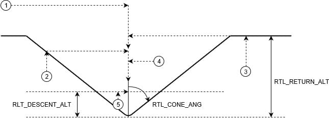

# 返航模式

返航模式用于使无人机在通向安全目的地的畅通路径上安全飞行，这里可以等待（悬停或绕圈）或着陆。

PX4 提供了几种机制来选择安全的返航路径，返航目的地和着陆，包括使用其实位置，集结（“安全”）点，任务路径和任务着陆顺序。

以下章节解释了如何配置 [返航类型](#return_types)， [返航高度](#return_altitude) 和 [降落/抵达行为](#arrival)。 最后，有几节说明了每种[载具类型](#default_configuration)的*默认*（预配置）行为。

:::note

- 该模式需要 GPS。
- 该模式是自动的 - 不 *需要* 用户干预即可控制无人机。
- 遥控开关可以在任何无人机上更改飞行模式。
- 在多旋翼中移动遥控器摇杆（或 VTOL 在多旋翼模式下）[默认情况下](#COM_RC_OVERRIDE)会将无人机切换到[位置模式](../flight_modes/position_mc.md)，除非是处理电池失效保护。
:::

## 返航类型（RTL_TYPE）

PX4 提供了四种替代方法（[ RTL_TYPE ](#RTL_TYPE)），用于找到通向安全目的地和/或着陆的畅通路径：

- [返航到起始位置/集结点](#home_return)（`RTL_TYPE=0`）: 上升到安全高度并通过直接路径返回到最近的集结点或起始地点。
- [任务降落/集结点返航](#mission_landing_return)（`RTL_TYPE=1`）：爬升到安全的高度，直接飞往最近的目的地*除了起始位置*：集结点或任务着陆开始。 如果未定义任务着陆点或集结点，请通过直接路径返回起始位置。
- [任务路径返航](#mission_path_return)（`RTL_TYPE=2`）：使用任务路径并快速继续执行任务着陆（如果已定义）。 如果未定义任务降落，则将快速回退到任务起始位置。 如果未定义任务，直接返航到起始位置（集结点将被忽略）。
- [最近的安全目的地返航](#safety_point_return)（` RTL_TYPE = 3 `）：上升到安全高度并通过直接路径返回最近的目的地：起始位置，任务着陆点的开始位置或集结点。 如果目的地是飞行任务着陆模式，则按照该模式降落。

以下各节提供了每种类型的更详细说明。

### 起始位置/集结点返航类型（RTL_TYPE=0）

无人机在该返航类型中：

- 爬升到一个安全的[返航高度](#return_altitude)（高于任何可预期的障碍物）。
- 通过直接路径飞往起始位置或集结点（以最近者为准）。
- [降落或等待](#arrival)处于下降高度（取决于着陆参数）。

:::note
如果未定义集结点，则与*返航*（RTL）/ *返回到起始位置*（RTH）相同。
:::

### 任务着陆/集结点返航类型 (RTL_TYPE=1)

无人机在该返航类型中：

- 爬升到一个安全的[返航高度](#return_altitude)（高于任何可预期的障碍物）。
- 通过直接路径飞行到一个集结点或[任务着陆模式](#mission_landing_pattern)的起点（以最近者为准）。 如果未定义任务降落或集结点，无人机通过直接路径返回到起始位置。
- 如果目的地是飞行任务着陆模式，则按照该模式降落。
- 如果目的地是集结点或者起始位置，无人机将在降落高度（取决于着陆参数）[降落或等待](#arrival)。

:::note
任务着陆模式包括[ MAV_CMD_DO_LAND_START ](https://mavlink.io/en/messages/common.html#MAV_CMD_DO_LAND_START)，一个或多个位置航点和[ MAV_CMD_NAV_LAND ](https://mavlink.io/en/messages/common.html#MAV_CMD_NAV_LAND)。
:::

:::warning
当此类型设置时，PX4 会拒绝任何没有有效着陆模式的任务。
:::

### 任务路径返航类型（RTL_TYPE=2）

这个返航类型使用任务(如果定义的话)，提供一个安全的返回 *路径*和飞行任务着陆模式（如果定义的话）以提供着陆行为。 如果有任务但没有任务着陆模式，则该任务*反向飞行*。 集结点，如果有的话，将被忽略。

:::note
该行为相当复杂，因为它取决于飞行模式以及是否定义了任务和任务着陆。
:::

任务 *带有* 着陆模式：

- **任务模式：**在“快进模式”下继续执行任务（跳过，延迟和任何其他非位置命令被忽略，悬停和其他位置航点转换为简单航路点），然后着陆。
- **任务模式以外的自动模式：** 
  - 爬升到一个安全的[返航高度](#return_altitude) 高于任何可预期的障碍物。
  - 直接飞到最近的航点（对固定翼而言，不是着陆航点），然后降落到航点高度。
  - 从该航点以快速模式继续执行任务。
- **手动模式:** 
  - 爬升到一个安全的[返航高度](#return_altitude)高于任何可预期的障碍物。
  - 直接飞到降落序列位置并下降到航点高度。
  - 使用任务降落模式着陆。

*没有*定义着陆模式的任务。

- **任务模式:** 
  - 从上一个航点开始以“快退”（反向）飞行的任务 
    - 跳，延迟和其他任何非定位命令都会被忽略，悬停和其他位置航点将转换为简单航点。
    - VTOL vehicles transition to FW mode (if needed) before flying the mission in reverse.
  - On reaching waypoint 1, the vehicle ascends to the [return altitude](#return_altitude) and flies to the home position (where it [lands or waits](#arrival)).
- **任务模式以外的自动模式：** 
  - Fly directly to closest waypoint (for FW not a landing WP) and descend to waypoint altitude.
  - Continue the mission in reverse, exactly as though Return mode was triggered in mission mode (above)
- **手动模式：** 直接飞到起始位置然后降落。

If no mission is defined PX4 will fly directly to home location and land (rally points are ignored).

If the mission changes during return mode, then the behaviour is re-evaluated based on the new mission following the same rules as above (e.g. if the new mission has no landing sequence and you're in a mission, the mission is reversed).

### 最近的安全目的地返回类型（RTL_TYPE=3）

In this return type the vehicle:

- Ascends to a safe [return altitude](#return_altitude) (above any expected obstacles).
- Flies a direct path to the closest destination of: home location, mission landing pattern or rally point.
- If the destination is a mission landing pattern the vehicle will follow the pattern to land
- If the destination is a home location or rally point, the vehicle will descend to the descent altitude ([RTL_DESCEND_ALT](#RTL_DESCEND_ALT)) and then [Land or waits](#arrival).

## 返航高度

A vehicle will usually first ascend to a safe altitude before returning, in order to avoid any obstacles between it and the destination.

:::note
This is true for most [return types](#return_types). The exception is when executing a [mission path return](#mission_path_return) from within a mission, where the vehicle follows mission waypoints (we can assume these avoid any obstacles).
:::

The return altitude for a fixed-wing vehicle is configured using the parameter [RTL_RETURN_ALT](#RTL_RETURN_ALT). The return altitude for multicopter and VTOL vehicles is configured using the parameters [RTL_RETURN_ALT](#RTL_RETURN_ALT) and [RTL_CONE_ANG](#RTL_CONE_ANG), which define a half cone centered around the destination (home location or safety point).

<!-- Original draw.io diagram can be found here: https://drive.google.com/file/d/1W72XeZYSOkRlBSbPXCCiam9NMAyAWSg-/view?usp=sharing -->

If the vehicle is:

- Above [RTL_RETURN_ALT](#RTL_RETURN_ALT) (1) it will return at its current altitude.
- Below the cone it will return where it intersects the cone (2) or [RTL_DESCEND_ALT](#RTL_DESCEND_ALT) (whichever is higher).
- Outside the cone (3) it will first climb until it reaches [RTL_RETURN_ALT](#RTL_RETURN_ALT).
- Inside the cone: 
  - Above [RTL_DESCEND_ALT](#RTL_DESCEND_ALT) (4) it will return at its current altitude.
  - Below [RTL_DESCEND_ALT](#RTL_DESCEND_ALT) (5) it will first ascend to `RTL_DESCEND_ALT`.

Note:

- If [RTL_CONE_ANG](#RTL_CONE_ANG) is 0 degrees there is no "cone": 
  - the vehicle returns at `RTL_RETURN_ALT` (or above).
- If [RTL_CONE_ANG](#RTL_CONE_ANG) is 90 degrees the vehicle will return at the greater of `RTL_DESCEND_ALT` and the current altitude.
- The vehicle will always ascend at least [RTL_DESCEND_ALT](#RTL_DESCEND_ALT) for the return.

## 悬停/降落在目的地

Unless executing a mission landing (e.g. if executing a [home location return](#home_return) or [closest safe destination return](#safety_point_return)), the vehicle will arrive at its destination, and rapidly descend to the [RTL_DESCEND_ALT](#RTL_DESCEND_ALT) altitude.

The vehicle will the loiter for a specified time ([RTL_LAND_DELAY](#RTL_LAND_DELAY)) and then land. If [RTL_LAND_DELAY=-1](#RTL_LAND_DELAY) it will loiter indefinitely.

## 无人机默认行为

The mode is *implemented* in almost exactly the same way in all vehicle types (the exception being that fixed wing vehicles will circle rather than hover when waiting), and are hence tuned using the same parameters.

However the *default configuration* is tailored to suit the vehicle type, as described below.

### 多旋翼（MC）

Multicopters use a [home location return](#home_return) by default (and the following configuration):

- Ascend to [RTL_RETURN_ALT](#RTL_RETURN_ALT) ([RTL_CONE_ANG=0](#RTL_CONE_ANG) - cone not used).
- Fly to the home position in a straight line and constant altitude (if already above the return altitude it will return at its current altitude).
- Rapidly descend to the [RTL_DESCEND_ALT](#RTL_DESCEND_ALT) altitude.
- Land more or less immediately (small [RTL_LAND_DELAY](#RTL_LAND_DELAY)).

### 固定翼（FW）

Fixed-wing aircraft use a [mission landing return type](#mission_landing_return) by default:

- If a mission landing is defined, fly direct to the mission landing start point and then land.
- Otherwise fly directly to the home position and circle above it at radius [NAV_LOITER_RAD](#NAV_LOITER_RAD).

If not following a mission landing, and [RTL_LAND_DELAY](#RTL_LAND_DELAY) is set to -1, the vehicle will land as described in the topic: [Landing (Fixed Wing)](../flying/fixed_wing_landing.md).

The fixed wing [safe return altitude](#return_altitude) depends only on [RTL_RETURN_ALT](#RTL_RETURN_ALT) (the cone defined by [RTL_CONE_ANG](#RTL_CONE_ANG) is not used)

RC stick movement is ignored.

### 垂直起降

VTOL aircraft use a [mission landing return type](#mission_landing_return) by default:

- If a mission landing is defined, fly direct to the mission landing start point and then land.
- Otherwise fly directly to the home position, transition to multicopter mode, and land as a multicopter.
  
  :::note If not in a mission landing, a VTOL in FW mode will *always* transition back to MC just before landing (ignoring [NAV_FORCE_VT](../advanced_config/parameter_reference.md#NAV_FORCE_VT)).
:::

## 参数

The RTL parameters are listed in [Parameter Reference > Return Mode](../advanced_config/parameter_reference.md#return-mode) (and summarised below).

| 参数                                                                                                       | 描述                                                                                                                                                                                                                                                                                                                                                                                                                                                                                                                                                                                                                                                                                                                                                                                             |
| -------------------------------------------------------------------------------------------------------- | ---------------------------------------------------------------------------------------------------------------------------------------------------------------------------------------------------------------------------------------------------------------------------------------------------------------------------------------------------------------------------------------------------------------------------------------------------------------------------------------------------------------------------------------------------------------------------------------------------------------------------------------------------------------------------------------------------------------------------------------------------------------------------------------------- |
| [RTL_TYPE](../advanced_config/parameter_reference.md#RTL_TYPE)                  | Return mechanism (path and destination).  
`0`: Return to a rally point or home (whichever is closest) via direct path.  
`1`: Return to a rally point or the mission landing pattern start point (whichever is closest), via direct path. If neither mission landing or rally points are defined return home via a direct path. If the destination is a mission landing pattern, follow the pattern to land.  
`2`: Use mission path fast-forward to landing if a landing pattern is defined, otherwise fast-reverse to home. Ignore rally points. Fly direct to home if no mission plan is defined.  
`3`: Return via direct path to closest destination: home, start of mission landing pattern or safe point. If the destination is a mission landing pattern, follow the pattern to land. |
| [RTL_RETURN_ALT](../advanced_config/parameter_reference.md#RTL_RETURN_ALT)   | Return altitude in meters (default: 60m) when [RTL_CONE_ANG](../advanced_config/parameter_reference.md#RTL_CONE_ANG) is 0. 如果已经超过这个值, 飞机将返回当前的高度。                                                                                                                                                                                                                                                                                                                                                                                                                                                                                                                                                                                                                                            |
| [RTL_DESCEND_ALT](../advanced_config/parameter_reference.md#RTL_DESCEND_ALT) | Minimum return altitude and altitude at which the vehicle will slow or stop its initial descent from a higher return altitude (default: 30m)                                                                                                                                                                                                                                                                                                                                                                                                                                                                                                                                                                                                                                                   |
| [RTL_LAND_DELAY](../advanced_config/parameter_reference.md#RTL_LAND_DELAY)   | Time to hover at `RTL_DESCEND_ALT` before landing (default: 0.5s) -by default this period is short so that the vehicle will simply slow and then land immediately. 如果设置为-1, 系统将在 `RTL_DESCEND_ALT` 徘徊, 而不是降落。 The delay is provided to allow you to configure time for landing gear to be deployed (triggered automatically).                                                                                                                                                                                                                                                                                                                                                                                                                                                                  |
| [RTL_MIN_DIST](../advanced_config/parameter_reference.md#RTL_MIN_DIST)       | Minimum horizontal distance from home position to trigger ascent to the return altitude specified by the "cone". If the vehicle is horizontally closer than this distance to home, it will return at its current altitude or `RTL_DESCEND_ALT` (whichever is higher) instead of first ascending to RTL_RETURN_ALT).                                                                                                                                                                                                                                                                                                                                                                                                                                                                          |
| [RTL_CONE_ANG](../advanced_config/parameter_reference.md#RTL_CONE_ANG)       | Half-angle of the cone that defines the vehicle RTL return altitude. Values (in degrees): 0, 25, 45, 65, 80, 90. Note that 0 is "no cone" (always return at `RTL_RETURN_ALT` or higher), while 90 indicates that the vehicle must return at the current altitude or `RTL_DESCEND_ALT` (whichever is higher).                                                                                                                                                                                                                                                                                                                                                                                                                                                                                   |
| [COM_RC_OVERRIDE](../advanced_config/parameter_reference.md#COM_RC_OVERRIDE) | If enabled, stick movement on a multicopter (or VTOL in multicopter mode) gives control back to the pilot in [Position mode](../flight_modes/position_mc.md) (except when vehicle is handling a critical battery failsafe). This can be separately enabled for auto modes and for offboard mode, and is enabled in auto modes by default.                                                                                                                                                                                                                                                                                                                                                                                                                                                      |
| [NAV_LOITER_RAD](../advanced_config/parameter_reference.md#NAV_LOITER_RAD)   | [Fixed Wing Only] The radius of the loiter circle (at [RTL_LAND_DELAY](#RTL_LAND_DELAY).                                                                                                                                                                                                                                                                                                                                                                                                                                                                                                                                                                                                                                                                                                     |