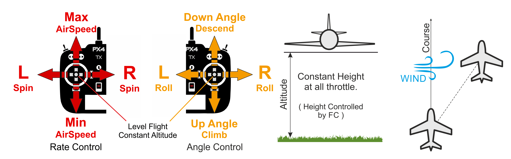

# Altitude Mode (Fixed-wing)

&nbsp;&nbsp;

The _Altitude_ flight mode is the safest and easiest non-GPS manual mode. It makes it easier for pilots to control vehicle altitude, and in particular to reach and maintain a fixed altitude. The mode will not attempt to hold the vehicle course against wind. Airspeed is actively controlled if an airspeed sensor is installed.

爬升/下沉率通过俯仰/升降舵杆操纵杆来控制。 操纵杆一旦回中，自动驾驶仪就会锁定当前的高度，并在偏航/滚转和任何空速条件下保持高度。
:::

油门通道输入控制空速。 滚动和俯仰是角度控制的（因此不可能实现飞机滚转或环绕）。

当所有遥控输入都居中时（无滚动、俯仰、偏航，油门约 50％），飞机将恢复直线水平飞行（受风影响）并保持其当前高度。 This makes it easy to recover from any problems when flying. Roll, pitch and yaw are all angle-controlled (so it is impossible to roll over or loop the vehicle).

The yaw stick can be used to increase/reduce the yaw rate of the vehicle in turns. If left at center the controller does the turn coordination by itself, meaning that it will apply the necessary yaw rate for the current roll angle to perform a smooth turn.

下图直观的显示了该模式（对于一个[美国手的发射机](../getting_started/rc_transmitter_receiver.md#transmitter_modes)）。

## 技术总结

Altitude mode like [Stabilized mode](../flight_modes_fw/stabilized.md) but with altitude stabilization. Airspeed is also stabilized if an airspeed sensor is present. 但是飞行过程并不稳定，可能被风吹飘离。

- 回中的滚动/俯仰/偏航输入（在死区内）：
  - Autopilot levels vehicle and maintains altitude and airspeed.
- 外部中心：
  - 俯仰摇杆控制高度。
  - 如果空速传感器已连接，油门杆控制飞机速度。 Without an airspeed sensor the vehicle will fly level at trim throttle ([FW_THR_TRIM](../advanced_config/parameter_reference.md#FW_THR_TRIM)), increasing or decreasing throttle as needed to climb or descend.
  - 横滚摇杆控制横滚角度。 自动驾驶仪将保持 [协调飞行](https://en.wikipedia.org/wiki/Coordinated_flight)。
  - 偏航摇杆操纵会驱动方向舵（指令将被加到自动驾驶仪计算的指令中以维持 [协调飞行](https://en.wikipedia.org/wiki/Coordinated_flight)）。 这和[稳定模式](../flight_modes/stabilized_fw.md)一样。
- Manual control input is required (such as RC control, joystick).
- An altitude measurement source is required (usually barometer or GPS)

## 参数

该模式受以下参数影响：

| 参数                                                                                                      | 描述                                       |
| ------------------------------------------------------------------------------------------------------- | ---------------------------------------- |
| [FW_AIRSPD_MIN](../advanced_config/parameter_reference.md#FW_AIRSPD_MIN)     | 最小空速/油门。 默认：10 m/s。                      |
| [FW_AIRSPD_MAX](../advanced_config/parameter_reference.md#FW_AIRSPD_MAX)     | 最大空速/油门。 默认：20 m/s。                      |
| [FW_AIRSPD_TRIM](../advanced_config/parameter_reference.md#FW_AIRSPD_TRIM)   | 巡航速度。 默认：15 m/s。                         |
| [FW_MAN_P_MAX](../advanced_config/parameter_reference.md#FW_MAN_P_MAX)       | 在高度稳定模式下手动控制的最大俯仰角。 默认：45 度。             |
| [FW_MAN_R_MAX](../advanced_config/parameter_reference.md#FW_MAN_R_MAX)       | 在高度稳定模式下手动控制的最大滚转角。 默认：45 度。             |
| [FW NPFG Control](../advanced_config/parameter_reference.md#fw-npfg-control)   | Max climb rate setpoint. Default: 3 m/s. |
| [FW_T_SINK_R_SP](../advanced_config/parameter_reference.md#FW_T_SINK_R_SP) | Max sink rate setpoint. Default: 2 m/s.  |

<!--
FW notes:
FW position controller is basically 2 independent pieces
* L1 is for navigation - determines the roll and yaw needed to achieve the desired waypoint (or loiter)
* TECS is for speed and height control - determines throttle and elevator position needed to achieve the commanded altitude and airspeed
Overall that gives you an attitude setpoint (roll, pitch, yaw) and throttle which is sent off to the attitude controller
-->
