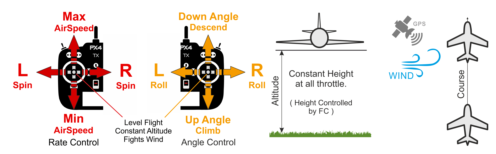

# Position Mode (Fixed-wing)

&nbsp;&nbsp;

_Position mode_ is the easiest and safest manual mode. It is supported on vehicles that have a position estimate (e.g. GPS).

油门取决于空速（在 50％ 油门时，飞机将以预设的巡航速度保持其当前高度）。 俯仰用于爬升或下降。 The throttle determines airspeed — at 50% throttle the aircraft will hold its current altitude with a preset cruise speed. 翻滚、俯仰和偏航是角度控制的（因此不可能实现飞机滚转或环绕）。

When all sticks are released/centered (no roll, pitch, yaw, and ~50% throttle) the aircraft will return to straight, level flight, and keep its current altitude and flight path irrespective of wind. This makes it easy to recover from any problems when flying.

下图直观的显示了该模式（对于一个[美国手的发射机](../getting_started/rc_transmitter_receiver.md#transmitter_modes)）。

## 技术描述

Manual mode where centered sticks put vehicle into straight and level flight where vehicle posture/attitude, altitude, and the straight line vehicle path are maintained against wind (and other forces).

- Centered Roll/Pitch/Yaw sticks
  - Level flight that follows a straight line ground track in the current direction against any wind.
- Outside center:
  - Pitch stick controls altitude (same as [Altitude mode](../flight_modes_fw/altitude.md)).
  - Roll stick controls roll angle. Autopilot will maintain [coordinated flight](https://en.wikipedia.org/wiki/Coordinated_flight) (same as [Stabilized mode](../flight_modes_fw/stabilized.md)).
  - Throttle sets airspeed (same as [Altitude mode](../flight_modes_fw/altitude.md)).
  - Roll and pitch are angle-controlled (so it is impossible to roll over or loop the vehicle).
  - Yaw stick adds an additional yaw rate setpoint (signal will be added to the one calculated by the autopilot to maintain [coordinated flight](https://en.wikipedia.org/wiki/Coordinated_flight)). This is the same as [Stabilized mode](../flight_modes_fw/stabilized.md).
- Global position estimate is required.
- Manual control input is required (such as RC control, joystick).
- Roll, Pitch, Yaw, Throttle: Assistance from autopilot to hold position against wind.

## 参数

| 参数     | 描述     |
| ------ | ------ |
| &nbsp; | &nbsp; |
