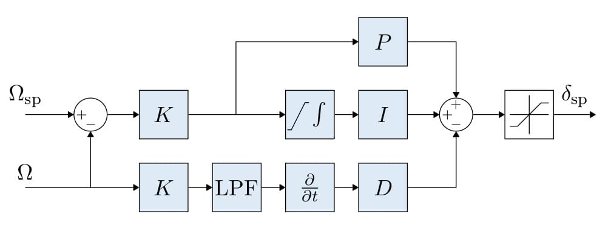

# 控制器图解

本节包括PX4主要控制器的图解。

下面的图解使用标准 [PX4 注释](../contribute/notation.md) (附有详细图例注解)。

<!--    The diagrams were created with LaTeX / TikZ.
        The code can be found in assets/diagrams/mc_control_arch_tikz.tex.
        The easiest way to generate the diagrams and edit them is to copy the code and paste it an Overleaf (www.overleaf.com/) document to see the output.
-->

## 多旋翼的控制架构

* 这是一个标准的级联控制架构。
* 控制器采用P和PID控制的组合方式。
* 状态估计来自[EKF2](../advanced_config/tuning_the_ecl_ekf.md)模块。
* 在某些模式下，外环(位置回路) 可能会被绕过 (在图中表示为外环之后增加一个多路开关)。 只有在位置保持模式或某轴无速度请求时，位置回路才会发挥作用。

### 多旋翼角速率控制器

* 采用K-PID控制器。 详情请参阅 [Rate Controller](../config_mc/pid_tuning_guide_multicopter.md#rate-controller) 文件。
* 为了防止积分饱和，积分环节的权重是受限的，
* 在微分路径上采用低通滤波器（LPF）来降低噪声。
* A Low Pass Filter (LPF) is used on the derivative path to reduce noise (the gyro driver provides a filtered derivative to the controller).

:::note
The IMU pipeline is: gyro data > apply calibration parameters > remove estimated bias > notch filter (`IMU_GYRO_NF_BW` and `IMU_GYRO_NF_FREQ`) > low-pass filter (`IMU_GYRO_CUTOFF`) > vehicle_angular_velocity (*filtered angular rate used by the P and I controllers*) > derivative -> low-pass filter (`IMU_DGYRO_CUTOFF`) > vehicle_angular_acceleration (*filtered angular acceleration used by the D controller*)

  
:::
  
  <!-- source for image is https://github.com/PX4/PX4-Autopilot/blob/850d0bc588af79186286652af4c8293daafd2c4c/src/lib/mixer/MultirotorMixer/MultirotorMixer.cpp#L323-L326 -->

### 多旋翼姿态控制器

* 姿态控制器使用 [四元数](https://en.wikipedia.org/wiki/Quaternion)。
* 姿态控制器是以这篇 [文章](https://www.research-collection.ethz.ch/bitstream/handle/20.500.11850/154099/eth-7387-01.pdf)为基础实现的
* 当你调整这个控制器时，唯一需要考虑的参数是增益 P。
* 输出的角速率命令是饱和的。

### 多旋翼速度控制器

* 采用PID控制器来稳定速度。 该控制器输出的命令是加速度。
* 积分器包括了一个采用钳制方法的反复位饱和措施。
* 输出的加速度命令是饱和的。

### 多旋翼位置控制器

* 采用简单的P控制器来控制速度。
* 输出的速度命令是饱和的，目的是保持一定的速度限制。

#### 静态力矩 (PI) 缩放补偿

<!-- The drawing is on draw.io: https://drive.google.com/open?id=13Mzjks1KqBiZZQs15nDN0r0Y9gM_EjtX
Request access from dev team. -->

## 固定翼位置控制器

### 总能量控制系统(TECS)
通过总能量控制系统(TECS)，PX4可以同时对固定翼飞行器的空速和高度进行控制。 这其中的代码通过一个用库（这个库是用于固定翼位置控制模块）作为接口。

从上面的图表可以看出，TECS 接受空速和高度需求量，然后输出油门和俯仰角控制量。 这两个输出控制量输入到固定翼的姿态控制器（姿态控制器实施姿态控制） 因此，TECS 是直接受到俯仰控制逻辑环的性能影响。 对飞行器俯仰角度的预测不准往往会导致对空速和高度的预测不准。

在试图调试总能量控制系统 TECS 前，请一定要调试好姿态控制器。 增加飞行器的俯仰角度不仅会导致高度上升还会导致空速下降。

同时控制飞机的空速和高度不是一件简单的事。 增加飞行器的俯仰角会导致高度上升，同时也会导致空速下降。 推力（通过油门控制）增加整个飞机的总能量。 因此，俯仰角和油门两个输入量都会对空速和高度产生影响，从而使控制问题变得难了。

TECS 提供了一种解决方案，即根据能量而不是初始设定值来反映问题。 一架飞行器的总能量是飞行器动能和势能之和。 推力（通过油门控制）可以增加飞机的总能量。 一个给定的总能量状态可以通过势能和动能的任意组合来实现。 换句话说，飞行器在高海拔以低空速飞行和在低海拔以高空速飞行时的总能量是等价的。 我们称这种情况叫做比能量平衡，它是根据当前高度和真实空速设定值计算的。 可以通过控制俯仰角来控制飞行器的比能量平衡。 俯仰角增加将动能转变为势能，俯仰角减少则情况相反。 这样，通过将初始空速和海拔设定值转化为能量大小（空速和海拔存在耦合，而能量大小可以独立控制），就可以把控制问题解耦。 我们利用油门调节飞行器的特定总能量，利用俯仰角来维持势能（高度）和动能（真空速）的特定平衡点。

#### 总能量控制回路

#### 比能量控制回路

一架飞行器的总能量包括动能和势能。

$$E_T = \frac{1}{2} m V_T^2 + m g h$$

对时间求微分，就可以得到能量的变化率：

$$\dot{E_T} = m V_T \dot{V_T} + m g \dot{h}$$

通过上式，我们可以定义能量变化率：

$$\dot{E} = \frac{\dot{E_T}}{mgV_T}  = \frac{\dot{V_T}}{g} + \frac{\dot{h}}{V_T} = \frac{\dot{V_T}}{g} + sin(\gamma)$$

其中$\gamma{}$是飞行器纵平面的速度角。 当$\gamma{}$很小时，我们可以近似认为sin（$\gamma{}$）=$\gamma{}$，所以可以得到下式：

$$\dot{E} \approx  \frac{\dot{V_T}}{g} + \gamma$$

列出飞行器的动力学方程，我们可以得到下式：

$$T - D = mg(\frac{\dot{V_T}}{g} + sin(\gamma)) \approx mg(\frac{\dot{V_T}}{g} + \gamma)$$

这里面的 T 和 D 分别是飞行器的推力和受到的阻力。 在水平飞行中，推力和阻力应该相等，所以推力的变化会导致下面式子：

$$\Delta T = mg(\frac{\dot{V_T}}{g} + \gamma)$$

正如可以看到的，$\Delta T{}$ 成正比 $\dot{E}{}$，因此推力设置值应该用于控制总能量。

另一方面，对升降舵的控制是能量守恒的，因此用来交换动力能源，反之亦然。控制升降舵可以将势能转换为动能，反之亦然。 为此，特定的能量平衡变化率定义为：

$$\dot{B} = \gamma - \frac{\dot{V_T}}{g}$$

## 固定翼姿态控制器

<!-- The drawing is on draw.io: https://drive.google.com/file/d/1ibxekmtc6Ljq60DvNMplgnnU-JOvKYLQ/view?usp=sharing
Request access from dev team. -->

姿态控制器采用级联环路的方法工作。 外环计算姿态设定值和估计值的误差，并将误差乘上一个增益（比例控制器），产生角速率设定值。 内环计算角速率误差，并采用（比例+积分）控制器产生一个所需要的角加速度。

然后可以根据期望的角加速度和系统先验信息，通过控制分配 (又叫混控)，计算出执行机构 (副翼，水平尾翼，垂直尾翼，等) 的角偏移量。 此外，由于控制面在高速时更有效，而在低速时效率较低，因此根据巡航速度调整的控制器使用空速测量值进行缩放（如果使用这样的传感器）。

如果没有安装空速传感器，固定翼姿态控制的增益调整将被禁用 (它是开环的)；您将无法在总能量控制系统中使用空速反馈。 但是，为了将飞机侧滑产生的侧向加速度最小化，偏航控制器利用转向协调约束产生偏航速率设定值。

前馈增益用于补偿空气动力阻尼。 基本上，绕机体轴的两个主要力矩分量分别来自：控制翼面 (副翼，水平尾翼，垂直尾翼 - 驱动机体转动) 和 空气动力阻尼 (与机体角速率成正比 - 阻止机体转动) 。 为了保持恒定的角速率, 可以在角速率回路中使用前馈来补偿这种气动阻尼。

滚转和俯仰控制器具有相同的结构，并且假设纵向和横向动力学足够解耦，可以独立工作。 但是，为了将飞机侧滑产生的侧向加速度最小化，偏航控制器利用转向协调约束产生偏航速率设定值。 偏航速率控制器同样有助于抵消偏航效应带来的负面影响 (https://youtu.be/sNV_SDDxuWk) 并且可以提供额外的方向阻尼以减小 [荷兰滚效应](https://en.wikipedia.org/wiki/Dutch_roll)。

## VTOL 飞行控制器

<!-- The drawing is on draw.io: https://drive.google.com/file/d/1tVpmFhLosYjAtVI46lfZkxBz_vTNi8VH/view?usp=sharing
Request access from dev team. -->

本节简要介绍垂直起降（VTOL）无人机的控制架构。 垂直起降飞行控制器由多旋翼控制器和固定翼控制器组成，多旋翼控制器在垂直起降模式下运行，固定翼控制器在平飞模式下运行，二者在过渡模式下同时运行。 上图是一个简化的控制流程图。 注意到 VTOL 姿态控制器模块，它主要对不同 VTOL 模式间的必要切换和混控逻辑，以及过渡模式下 VTOL 机型的特定控制动作（例如，在前向过渡期间加速标准 VTOL 的推进马达）起到促进作用。 此模块的输入称为“虚拟输入”，因为控制器会根据当前的 VTOL 模式而忽略一些输入。

对于标准和倾转旋翼 VTOL，在过渡期间，固定翼姿态控制器产生角速率设定值，然后将其输入到单独的角速率控制器中，从而产生多旋翼和固定翼执行器的扭矩指令。 而对尾座式 VTOL，在过渡期间，多旋翼姿态控制器独立运行。

VTOL姿态模块的输出是多旋翼执行器（典型的 `actuator_controls_0`）和固定翼（典型的 `actuator_controls_1`）执行器的独立的扭矩和力指令。 这些是在一个特定机型的混控器文件中处理的（参见[ Mixing](../concept/mixing.md)）。

有关调整 VTOL 模块内部过渡逻辑的更多信息，请参阅 [VTOL 配置](../config_vtol/README.md)。

### 空速缩放补偿

本节的目的是：通过公式来解释怎样根据空速调整角速率回路 (PI) 和前馈控制器 (FF) 的输出，以及为何如此。 我们首先给出简化的滚转轴线性力矩方程，然后说明空速对力矩产生的直接影响，最后是空速对匀速滚转运动的影响。

如上所示的固定翼姿态控制器，角速率控制器输出角加速度设定值，传递给控制分配器 (这里叫“混控”)。 为了达到期望的角加速度，混控必须利用气动控制面 (例如：典型的飞机有两个副翼，两个水平尾翼和一个垂直尾翼) 产生力矩。 气动控制面产生的力矩受以下因素影响最大：飞机的相对空速和空气密度，更准确的说，是气动压力。 如果没有针对空速的刻度化处理，在某一特定巡航速度下调参的控制器，将会使飞机在高速下发生振荡，或者在在低速下达不到理想的随动效果。

读者们首先必须明白 [真实空速 (TAS)](https://en.wikipedia.org/wiki/True_airspeed) 和 [指示空速 (IAS)](https://en.wikipedia.org/wiki/Indicated_airspeed) 这二者的读数差别很大，除非你在海平面上飞行。

气动压力的定义是

$$\bar{q} = \frac{1}{2} \rho V_T^2$$

$$\rho$$ 代表空气密度，$$V_T$$ 代表真实空速 (TAS)。

以滚转轴为例，带量纲的滚转轴力矩可以表示为：

$$\ell = \frac{1}{2}\rho V_T^2 S b C_\ell = \bar{q} S b C_\ell$$

$$\ell$$ 代表滚转力矩，$$b$$ 代表飞机翼展，$$S$$ 代表参考面。

无量纲的滚转力矩系数 $$C_\ell$$ 可以通过通过以下几个系数建模得到：副翼效率系数 $$C_{\ell_{\delta_a}}$$，滚转阻尼系数 $$C_{\ell_p}$$ 和二面角系数 $$C_{\ell_\beta}$$。

$$C_\ell = C_{\ell_0} + C_{\ell_\beta}\:\beta + C_{\ell_p}\:\frac{b}{2V_T}\:p + C_{\ell_{\delta_a}} \:\delta_a$$

$$\beta$$ 代表侧滑角，$$p$$ 代表滚转角速率，$$\delta_a$$ 代表副翼偏转角。

假设一架飞机对称 ($$C_{\ell_0} = 0$$) 且无侧滑 ($$\beta = 0$$) ，上面的方程就可以简化到只有滚转率阻尼和副翼产生的滚转力矩。

$$\ell = \frac{1}{2}\rho V_T^2 S b \left [C_{\ell_{\delta_a}} \:\delta_a + C_{\ell_p}\:\frac{b}{2V_T} \: p \right ]$$

刚才推导出的这个最终方程，将会作为后面两个小节的基线。

#### 静态力矩 (PI) 缩放补偿

在滚转角速率为0 ($$p = 0$$) 的情况下, 阻尼项将会消失，并得到一个瞬时常量:

$$\ell = \frac{1}{2}\rho V_T^2 S b \: C_{\ell_{\delta_a}} \:\delta_a = \bar{q} S b \: C_{\ell_{\delta_a}} \:\delta_a$$

转换成 $$\delta_a$$ 的表达式

$$\delta_a = \frac{2bS}{C_{\ell_{\delta_a}}} \frac{1}{\rho V_T^2} \ell = \frac{bS}{C_{\ell_{\delta_a}}} \frac{1}{\bar{q}} \ell$$

观察上面的公式可以知道，第一项是个常值，第二项则取决于空气密度和真实空速的平方。

更进一步，先不用空气密度和TAS做刻度化，可以发现指示空速 (IAS, $$V_I$) 在本质上是受空气密度影响的，在低空低速情况下，IAS可以乘以一个简单的密度误差因子转换成TAS

$$V_T = V_I \sqrt{\frac{\rho_0}{\rho}}$$

$$\rho_o$$ 代表海平面15°C下的空气密度。

现在我们能清楚地看到气动压力与IAS的平方成正比

$$\bar{q} = \frac{1}{2} \rho V_T^2 = \frac{1}{2} V_I^2 \rho_0$$

现在我们能清楚地看到气动压力与IAS的平方成正比:

$$\bar{q} \propto V_I^2$$

之前用TAS和空气密度表示的刻度因数，最终可以用IAS重写成以下形式

$$\delta_a = \frac{2bS}{C_{\ell_{\delta_a}}\rho_0} \frac{1}{V_I^2} \ell$$

#### 角速率回路 (FF) 缩放补偿

角速率控制器前馈通道的主要作用是补偿转动阻尼。 回到我们的基线方程，这次在匀速滚转的条件下做简化，副翼产生的力矩必须恰好可以补偿阻尼项

$$- C_{\ell_{\delta_a}} \:\delta_a = C_{\ell_p} \frac{b}{2 V_T} \: p$$

公式重组后，得到理想的副翼偏转角方程

$$\delta_a = -\frac{b \: C_{\ell_p}}{2 \: C_{\ell_{\delta_a}}} \frac{1}{V_T} \: p$$

第一项给出了理想的前馈值，我们可以看到刻度因数相对TAS是线性的。 请注意那个负号，之后会与滚转阻尼系数的负号相互抵消。

#### 总结

角速率回路PI控制器的输出必须由指示空速 (IAS) 的平方刻度化，角速率回路前馈通道 (FF) 必须由真实空速 (TAS) 刻度化。

最终，由于执行器的输出是归一化的，并且假定混控和伺服模块是线性的，我们可以将上述方程重写如下:

where $V_{I_0}{}$ and $V_{T_0}{}$ are the IAS and TAS at trim conditions.

最终，由于执行器的输出是归一化的，并且假定混控和伺服模块是线性的，我们可以将上述方程重写如下:

$$\dot{\mathbf{\omega}}*{sp}^b = \frac{V*{I_0}^2}{V_I^2} \dot{\mathbf{\omega}}*{sp*{PI}}^b + \frac{V_{T_0}}{V_T} \dot{\mathbf{\omega}}*{sp*{FF}}^b$$,

该方程可以直接在滚转速率，俯仰速率和偏航速率控制器中实现

#### 调参建议

这套空速刻度化算法的巧妙之处就是它不需要特别的调参 但是对空速传感器的输出质量将直接影响它的性能

进一步讲，如果要将稳定飞行包线最大化，你应该在最小飞行速度和最大飞行速度的中点进行调参 (例如： 一架飞机的飞行速度在15 ~ 25m/s 之间，则应在20m/s调参)。 然而，空速传感器的质量将直接影响它的性能。

此外，如果要使稳定的飞行包络线最大化，您应该在最小飞行速度和最大飞行速度的中点位置进行调参 (例如： 一架飞机的飞行速度在 15~25 m/s 之间，则应在 20 m/s调参)。 [FW_AIRSPD_TRIM](../advanced/parameter_reference.md#FW_AIRSPD_TRIM) 参数. 必须被置为这个 "调参" 空速。
