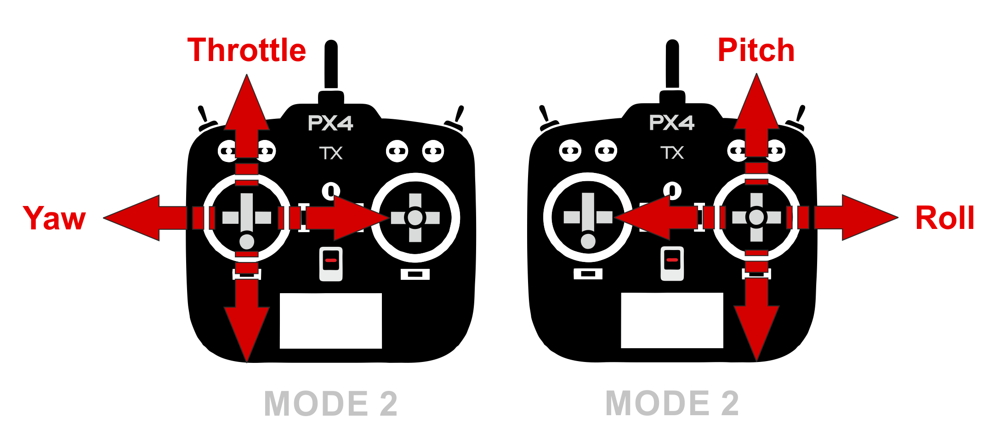
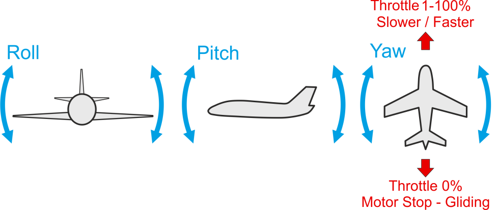

# 飞行 101

该主题介绍了用[遥控器](../getting_started/rc_transmitter_receiver.md)以手动或者自动-辅助飞行模式（自主飞行请参阅：[任务](../flying/missions.md)）来控制飞行器的基本飞行。

:::note
Before you fly for the first time you should read our [First Flight Guidelines](../flying/first_flight_guidelines.md).
:::

## Arm the Vehicle

Before you can fly the vehicle it must first be [armed](../getting_started/px4_basic_concepts.md#arming). This will power all motors and actuators; on a multicopter it will start propellers turning.

To arm the drone:

- First disengage the [safety switch](../getting_started/px4_basic_concepts.md#safety_switch).
- Use the arm command for your vehicle - put the throttle stick in the bottom right corner. 
  - Alternatively configure an [arm/disarm switch](../config/safety.md#arming_switch).
  - You can also arm in *QGroundControl* (PX4 does not require a radio control for flying autonomously).

:::tip
The vehicle will not arm until it is [calibrated/configured](../config/README.md) and has a position lock. [Vehicle Status Notifications](../getting_started/vehicle_status.md) (including on-vehicle LEDs, audio notifications and *QGroundControl* updates) can tell you when the vehicle is ready to fly (and help you work out the cause when it is not ready to fly).
:::

:::note
The vehicle will (by [default](../advanced_config/parameter_reference.md#COM_DISARM_PRFLT)) automatically [disarm](../advanced_config/prearm_arm_disarm.md#auto-disarming) (turn off motors) if you take too long to take off! This is a safety measure to ensure that vehicles return to a safe state when not in use.
:::

:::note
A VTOL vehicle can only arm in multicopter mode (by default - arming in fixed-wing mode can be enabled using [CBRK_VTOLARMING](../advanced_config/parameter_reference.md#CBRK_VTOLARMING)).
:::

## 起飞 Takeoff

The easiest way to takeoff (after [arming the vehicle](#arm)) is to use the automatic [Takeoff mode](../flight_modes/takeoff.md). Usually this is triggered from an [RC switch](../config/flight_mode.md) or ground station.

Multicopter (and VTOL in multicopter mode) pilots can take off *manually* by enabling [position mode](../flight_modes/README.md#position_mc), arming the vehicle, and then raising the throttle stick above 62.5%. Above this value all controllers are enabled and the vehicle goes to the throttle level required for hovering ([MPC_THR_HOVER](../advanced_config/parameter_reference.md#MPC_THR_HOVER)).

:::tip
The automatic takeoff mode is highly recommended, in particular for Fixed Wing vehicles!
:::

:::note
The vehicle may disarm if you take too long to take off after arming (tune the timeout using [COM_DISARM_PRFLT](../advanced_config/parameter_reference.md#COM_DISARM_PRFLT)).
:::

:::note
The [Failure Detector](../config/safety.md#failure_detector) will automatically stop the engines if there is a problem on takeoff.
:::

## 着陆

The easiest way to land is to use the automatic [Land](../flight_modes/land.md) or [Return](../flight_modes/return.md) modes.

For multicopter (and VTOL in multicopter mode) pilots can land manually by pressing the throttle stick down until the vehicle lands and disarms.

Note that vehicles automatically disarm on landing by default:

- Use [COM_DISARM_LAND](../advanced_config/parameter_reference.md#COM_DISARM_LAND) to set the time to auto-disarm after landing (or disable it altogether).
- Manually disarm by putting the throttle stick in the bottom left corner.

:::note
If you see the vehicle "twitch" during landing (turn down the motors, and then immediately turn them back up) this is probably caused by a poor [Land Detector Configuration](../advanced_config/land_detector.md) (specifically, a poorly set [MPC_THR_HOVER](../advanced_config/parameter_reference.md#MPC_THR_HOVER)).
:::

:::tip
Automatic landing is highly recommended, in particular for Fixed Wing vehicles.
:::

## 飞行控制/命令

All flying, including takeoff and landing, is controlled using the 4 basic commands: roll, yaw, pitch and throttle.

In order to control your aircraft you need to understand how the basic Roll, Pitch, Yaw and Throttle commands affect movement in 3D space. This differs depending on whether you're controlling a forward-flying aircraft like a plane, or a "hover aircraft" like a multicopter.

### 悬停飞机

Hover aircraft (Copter, VTOL in hover mode) respond to the movement commands as shown below:

- Pitch => Forward/back.
- 横滚 => 往左 / 往右。
- 偏航 => 围绕机身中心左 / 右旋转。
- 油门 => 改变高度 / 速度。

### 前飞飞机

Forward-flying aircraft (planes, VTOL in forward flight) respond to the movement commands as shown below:

- 俯仰 => 上 / 下升降舵。
- 横滚 => 左 / 右副翼。
- 偏航 => 左 / 右方向舵。
- 油门 => 改变前飞速度。

:::note
The best turn for airplanes is called a coordinated turn, and is performed using roll and little yaw at the same time. This maneuver requires experience!
:::

## 辅助飞行

Even with an understanding of how the vehicle is controlled, flight in fully manual mode can be quite unforgiving. New users should [configure their transmitter](../config/flight_mode.md) to use flight modes where the autopilot automatically compensates for erratic user input or environmental factors.

The following three modes are highly recommended for new users:

- 自稳模式-飞行器很难侧翻，并且如果摇杆被释放飞行器将趋于平稳（但不是位置定点）。
- 高度模式 - 爬升和降落由最大速率控制。
- 位置模式 - 当摇杆被释放飞行器将保持飞行（位置定点，不会随风漂移）。

:::note
You can also access automatic modes through the buttons on the bottom of the *QGroundControl* main flight screen.
:::