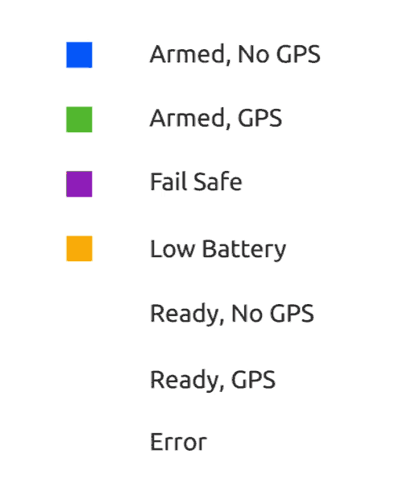

# LED Meanings (Pixhawk Series)

[Pixhawk-series flight controllers](../flight_controller/pixhawk_series.md) have an RGB LED to indicate the current status of the vehicle. The image below shows the relationship between LED and vehicle status.

> **Warning** It is possible to have a GPS lock (Green LED) and still not be able to arm the vehicle because PX4 has not yet [passed preflight checks](../flying/pre_flight_checks.md). **A valid global position estimate is required to takeoff!**

> **Tip** In the event of an error (blinking red), or if the vehicle can't achieve GPS lock (change from blue to green), check for more detailed status information in *QGroundControl* including calibration status, and errors messages reported by the [Preflight Checks (Internal)](../flying/pre_flight_checks.md). Also check that the GPS module is properly attached, Pixhawk is reading your GPS properly, and that the GPS is sending a proper GPS position.

* **[Solid Blue] Armed, No GPS Lock:** Indicates vehicle has been armed and has no position lock from a GPS unit. When vehicle is armed, PX4 will unlock control of the motors, allowing you to fly your drone. As always, exercise caution when arming, as large propellers can be dangerous at high revolutions. Vehicle cannot perform guided missions in this mode.

* **[Pulsing Blue] Disarmed, No GPS Lock:** Similar to above, but your vehicle is disarmed. This means you will not be able to control motors, but all other subsystems are working.

* **[Solid Green] Armed, GPS Lock:** Indicates vehicle has been armed and has a valid position lock from a GPS unit. When vehicle is armed, PX4 will unlock control of the motors, allowing you to fly your drone. As always, exercise caution when arming, as large propellers can be dangerous at high revolutions. In this mode, vehicle can perform guided missions.

* **[Pulsing Green] Disarmed, GPS Lock:** Similar to above, but your vehicle is disarmed. This means you will not be able to control motors, but all other subsystems including GPS position lock are working.

* **[Solid Purple] Failsafe Mode:** This mode will activate whenever vehicle encounters an issue during flight, such as losing manual control, a critically low battery, or an internal error. During failsafe mode, vehicle will attempt to return to its takeoff location, or may simply descend where it currently is.

* **[Solid Amber] Low Battery Warning:** Indicates your vehicle's battery is running dangerously low. After a certain point, vehicle will go into failsafe mode. However, this mode should signal caution that it's time to end this flight.

* **[Blinking Red] Error / Setup Required:** Indicates that your autopilot needs to be configured or calibrated before flying. Attach your autopilot to a Ground Control Station to verify what the problem is. If you have completed the setup process and autopilot still appears as red and flashing, there may be another error.