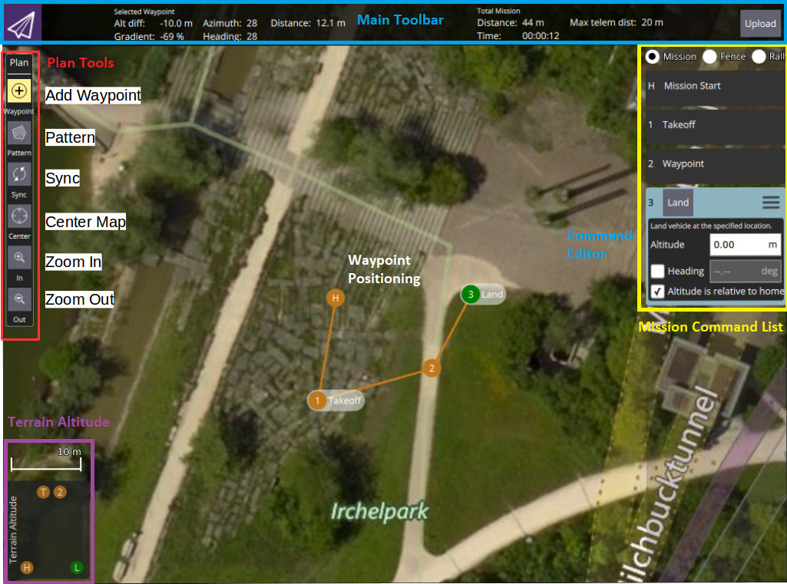

# 任务

## 规划任务

手动规划任务非常简单:

- 切换到mission视图
- 在左上选择 ** 添加航点 ** ("加号") 图标。 
- 点击地图添加航点。
- 使用右侧的航点列表修改航点参数和类型。底部的高度指示器提供每个航点的相对高度。
- 完成后, 单击 ** 上载 ** 按钮 (右上), 将任务发送到飞行器。

You can also use the *Pattern* tool to automate creation of survey grids.

> **Tip** For more information see the [QGroundControl User Guide](https://docs.qgroundcontrol.com/en/PlanView/PlanView.html).

## 执行飞行任务

一旦任务上传, 切换到飞行视图。 该任务以便于跟踪进度的方式显示 (在此视图中无法修改航点)。

