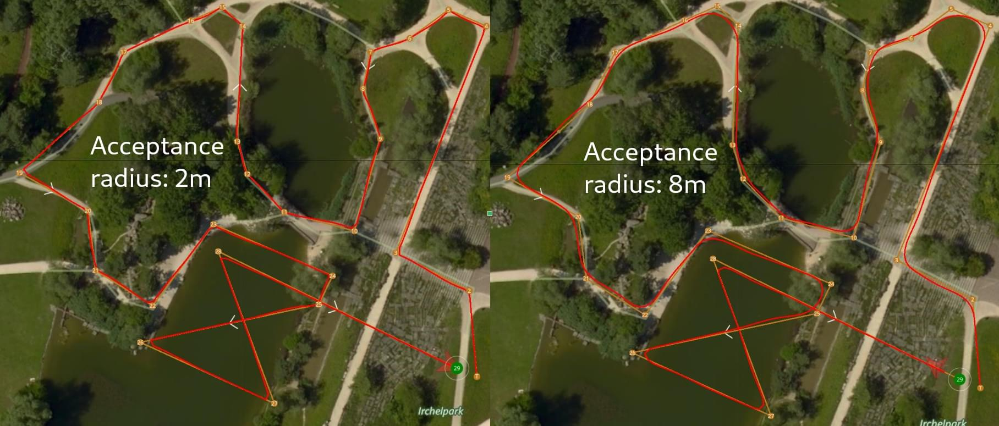

# 任务

A mission is a predefined flight plan, which can be planned in QGroundControl and uploaded to the flight controller, and then executed autonomously in [Mission mode](../flight_modes_mc/mission.md).

Missions typically include items for controlling taking off, flying a sequence of waypoints, capturing images and/or video, deploying cargo, and landing. QGroundControl allows you to plan missions using a fully manual approach, or you can use its more advanced features to plan ground area surveys, corridor surveys, or structure surveys.

This topic provides an overview of how to plan and fly missions.

## 规划任务

手动规划任务非常简单:

- 切换到任务视图
- 在左上角选择**添加航点**（“加号”）图标。
- 点击地图添加航点。
- 使用右侧的航点列表修改航点参数和类型。底部的高度指示器提供每个航点的相对高度。
- 完成后，单机**上传**按钮（右上角）发送任务到飞行器。

You can also use the _Pattern_ tool to automate creation of survey grids.

:::tip
For more information see the [QGroundControl User Guide](https://docs.qgroundcontrol.com/master/en/qgc-user-guide/plan_view/plan_view.html). :::

### 任务可行性检查

PX4进行了一些基本的健全性检查确定任务是否可行。 For example, whether the mission is close enough to the vehicle, if the mission will conflict with a geofence, or if a mission landing pattern is required but is not present.

检查是在任务上传上传或者任务运行之前立即运行。 如果检查失败，将通知用户不能启动任务。

关于检查和运行的更多详情，请参阅：[任务模式>任务可行性检查](../flight_modes/mission.md#mission-feasibility-checks)。

### 设置机体航向

设置后，多旋翼机体航向将会朝向配置的**航向**值（对应[MAV_CMD_NAV_WAYPOINT.param4](https://mavlink.io/en/messages/common.html#MAV_CMD_NAV_WAYPOINT)）。

如果**航向**没有明确设置目标航点（`参数4=NaN`）那么机体将要朝着参数[MPC_YAW_MODE](../advanced_config/parameter_reference.md#MPC_YAW_MODE)中指定的位置飞去。 默认情况下，是指向下一个航点。

Vehicle types that cannot independently control yaw and direction of travel will ignore yaw settings (e.g. Fixed-wing).

### 设置航点/转弯半径

The _acceptance radius_ defines the circle around a waypoint within which a vehicle considers it has reached the waypoint, and will immediately switch to (and start turning towards) the next waypoint.

对于多旋翼无人机，使用参数[NAV_ACC_RAD](../advanced_config/parameter_reference.md#NAV_ACC_RAD)调整航点半径。 默认情况下，半径设置的很小以确保多旋翼无人机通过航路点上方，但可以增加半径以创建更平滑的路径，这时无人机在到达航路点之前便开始转弯。

下图显示了相同任务以不同的航点半径参数飞行的轨迹：

转弯速度是根据航点半径（=转弯半径）和最大允许速度和加加速度自动计算的。

:::tip
关于航点半径的更多信息，见： [任务模式 > 航点间的轨迹](../flight_modes/mission.md#rounded-turns-inter-waypoint-trajectory)。 :::

### Package Delivery (Cargo) Missions

PX4 supports cargo delivery in missions using a gripper.

This kind of mission is planned in much the same as any other [waypoint mission](../flying/missions.md), with mission start, takeoff waypoint, various path waypoints, and possibly a return waypoint. The only difference is that a package delivery mission must include a mission items to indicate how the package is released and the deployment mechanism. For more information see: [Package Delivery Mission](../flying/package_delivery_mission.md).

## 飞行任务

任务上传后，切换到飞行视图。 任务将显示为一条航线，这样可以方便跟踪（在此视图中无法修改）。

