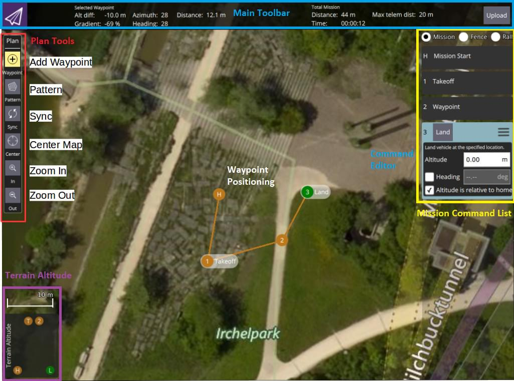

# 任务

## 规划任务

手动规划任务非常简单:

- 切换到mission视图
- 在左上选择 ** 添加航点 ** ("加号") 图标。 
- 点击地图添加航点。
- 使用右侧的航点列表修改航点参数和类型。底部的高度指示器提供每个航点的相对高度。
- 完成后, 单击 ** 上载 ** 按钮 (右上), 将任务发送到飞行器。

You can also use the *Pattern* tool to automate creation of survey grids.

> **Tip** For more information see the [QGroundControl User Guide](https://docs.qgroundcontrol.com/en/PlanView/PlanView.html).

### Setting Vehicle Yaw

If set, a multi-rotor vehicle will yaw to face the **Heading** value specified in the target waypoint (corresponding to [MAV_CMD_NAV_WAYPOINT.param4](https://mavlink.io/en/messages/common.html#MAV_CMD_NAV_WAYPOINT)).

If **Heading** has not been explicitly set for the target waypoint (`param4=NaN`) then the vehicle will yaw towards a location specified in the parameter [MPC_YAW_MODE](../advanced_config/parameter_reference.md#MPC_YAW_MODE). By default this is the next waypoint.

Vehicle types that cannot independently control yaw and direction of travel will ignore yaw settings (e.g. Fixed Wing).

## 执行飞行任务

Once the mission is uploaded, switch to the flight view. The mission is displayed in a way that makes it easy to track progress (it cannot be modified in this view).

