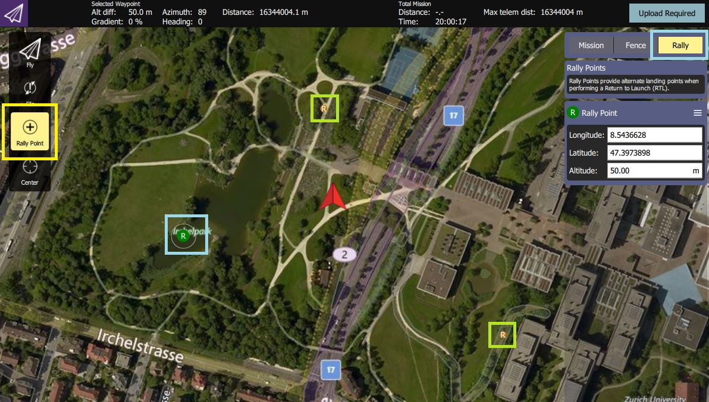

# 安全点(集结点)

安全点是[返航模式](../flight_modes/return.md)目的/降落点。 启用后，机体将从HOME点、任务降落点或安全点选择*最近的返航目的地*。

## 创建/定义安全点

在QGroundControl中创建安全点（也称为“集结点”）。

总结：
1. Open **QGroundControl > Plan View**
1. 在 *规划编辑器* (屏幕右侧) 选择 **集结** 标签/按钮。
1. 选择工具栏(屏幕左侧)上的 **Rally Point** 按钮 。
1. 在地图上点击任意位置来添加集结/安全点。
   - *规划编辑器*显示并允许您编辑当前（在地图上显示为绿色**R**）的集结点。
   - 您可以选择另一个（在地图上显示为橙色/黄色的**R**）集结点来进行编辑。
1. 选择**需要上传**按钮将集结点（连同任务和地理围栏）上传到机体。

:::tip
More complete documentation can be found in the *QGroundControl User Guide*: [Plan View - Rally Points](https://docs.qgroundcontrol.com/master/en/PlanView/PlanRallyPoints.html).
:::

## 使用安全点

默认情况下不启用安全点（有许多不同的[返回模式类型](../flight_modes/return.md#return_types)）。

启用安全点的方法：
1. 使用 [QGroundControl 参数编辑器](../advanced_config/parameters.md)设置参数：[RTL_TYPE=3](../advanced_config/parameter_reference.md#RTL_TYPE)。
