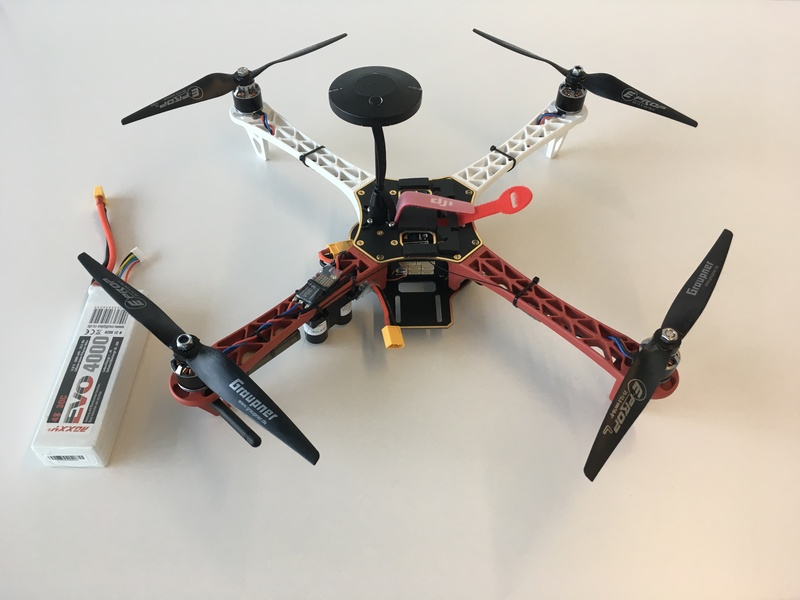
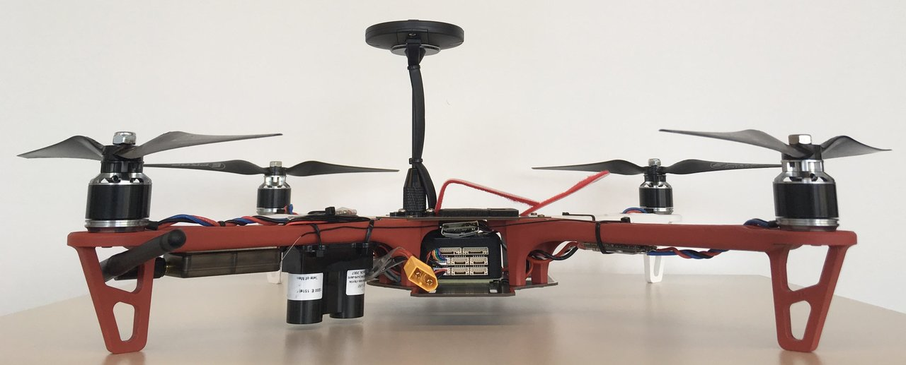
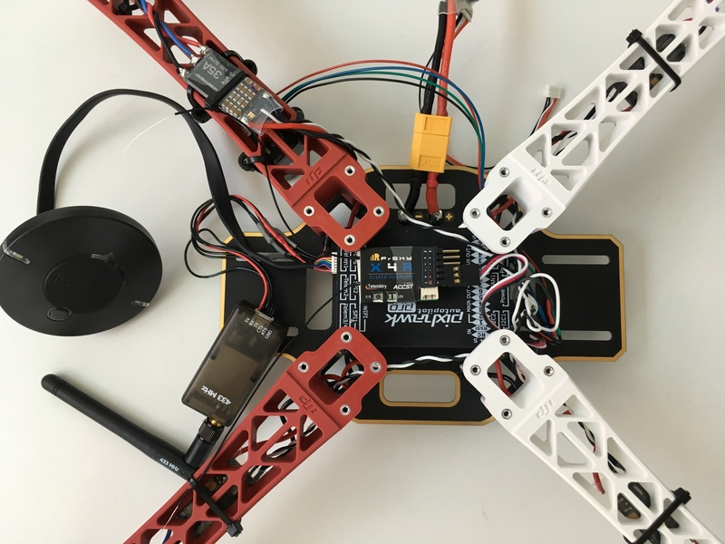
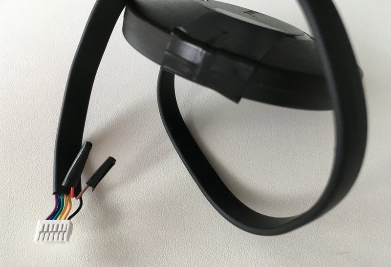
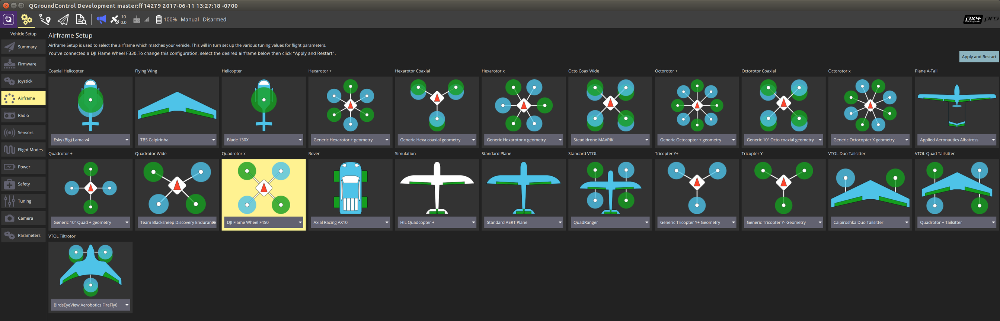
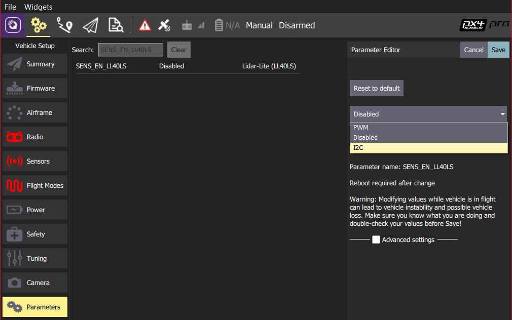

# 带距离传感器和RTK全球定位系统的大疆F450(Pixhawk 3 Pro)

The *DJI&reg; Flame Wheel F450* Quadcopter is designed for amateur aerial photography, first person view applications, and general flying entertainment. This topic provides full build and configuration instructions for using the frame with the Pixhawk 3 Pro flight controller. Additionally this build includes an RTK GPS and a distance sensor for precision positioning.

Key information:

- **Frame:** DJI Flame Wheel 450
- **Flight controller:** [Pixhawk 3 Pro](../flight_controller/pixhawk3_pro.md)
- **Positioning:** RTK GPS

## 配件列表

- Autopilot: [Pixhawk 3 Pro](../flight_controller/pixhawk3_pro.md)
- Frame: [DJI Flamewheel 450](http://www.dji.com/flame-wheel-arf)
- Motors: 3DR Iris Plus 950kv rebranded T-Motors MN2213
- ESCs: Hobbywing XRotor 35A Micro 3-6S BLHeli
- Blades: Graupner 10"x5" (You need to print [these adapters](https://drive.google.com/file/d/0B2piootk_fIKMWhIVzVPWEFGLU0/view) to be M6 compatible) <!--TODO-->

- Distance sensor: Lidar-Lite V3

- GPS: Here+ RTK GPS
- Telemetry: 3DR Telemetry
- Battery: Roxxy LiPo - 4S, 4000mAh

In addition we use a FrSky X4R-SB 3/16ch 2.4Ghz receiver and a FrSky Taranis controller. You will also need zip ties, double sided tape, a soldering iron and a 3D printer in case you use the same Blades, for this build. The GPS mast was reused from an Intel Aero.

The *Pixhawk 3 Pro* can be attached using the double sided tape because the IMU inside is already dampened.

In this setup the autopilot is rotated by 180 degrees so that it's easier to access the SD card. But if you rotate the base plate by 180 degrees instead, the flight controller board can be mounted facing forward. Either way works, just make sure to set the board rotation correctly in *QGroundControl* afterwards.

## 接线和连接

General pinout for the Pixhawk 3 Pro can be found [here](https://drotek.gitbook.io/pixhawk-3-pro/hardware/inputs-outputs).

### 3DR Telemetry

The 3DR Telemetry does not come with a JST GH connector which the *Pixhawk 3 Pro* uses. The pinout remains the same and just the plug needs to be changed. Use the Telem 1 port on the *Pixhawk 3 Pro*.

| 引脚 | Pixhawk 3 Pro Telem 1 | 3DR Telemetry |
| -- | --------------------- | ------------- |
| 1  | VCC                   | VCC           |
| 2  | TX                    | RX            |
| 3  | RX                    | TX            |
| 4  | CTS                   | CTS           |
| 5  | RTS:                  | RTS:          |
| 6  | GND                   | GND           |

### Lidar-Lite V3

The pinout for the *Lidar Lite V3* and the *Pixhawk 3 Pro* I2C 1 port is as follows.

| 引脚 | Pixhawk 3 Pro I2C 1 | Lidar Lite V3    |
| -- | ------------------- | ---------------- |
| 1  | VCC                 | VCC              |
| 2  | SCL                 | - (Power enable) |
| 3  | SDA                 | - (Mode control) |
| 4  | GND                 | SCL              |
| 5  | -                   | SDA              |
| 6  | -                   | GND              |

### Here+ RTK GPS

The Here+ GPS comes with an 8 pin connector suited for the Pixhawk 2. In order to use it with the *Pixhawk 3 Pro* (or a Pixracer), a 6 pin connector has to be used and pin 6 and 7 are not needed (see below). The additional pins are for the safety button and can be attached as well if needed. More information on the pinout can be found in [this document](http://www.hex.aero/wp-content/uploads/2016/07/DRS_Pixhawk-2-17th-march-2016.pdf), page 17.

| 引脚 | Here+ GPS  | 引脚 | Pixhawk 3 Pro GPS |
| -- | ---------- | -- | ----------------- |
| 1  | VCC_5V     | 1  | VCC               |
| 2  | GPS_RX     | 2  | GPS_TX            |
| 3  | GPS_TX     | 3  | GPS_RX            |
| 4  | SCL        | 4  | SCL               |
| 5  | SDA        | 5  | SDA               |
| 6  | BUTTON     | -  | -                 |
| 7  | BUTTON_LED | -  | -                 |
| 8  | GND        | 6  | GND               |

## 配置

General documentation on how to setup your quad in *QGroundControl* can be found in [Basic Configuration](../config/README.md). Specific setup instructions are provided below.

### 机架

Select the airframe **DJI Flame Wheel 450** in **QGC > Airframe > Quadrotor x**.

### RTK GPS

RTK GPS is plug and play. For more instructions see [here](../advanced_features/rtk-gps.md).

### Lidar-Lite

To enable the *Lidar-Lite V3* (connected via I2C), the parameter [SENS_EN_LL40LS](../advanced_config/parameter_reference.md#SENS_EN_LL40LS) has to be set to `I2C`.

This can be done in *QGroundControl* [Parameters](https://docs.qgroundcontrol.com/en/SetupView/Parameters.html) as shown below:

:::note
After setting the `SENS_EN_LL40LS` you will need to restart the flight controller.
:::

### Others

Set the following parameters as well:

- `EKF2_HGT_MODE=2`: this makes sure the Lidar-Lite is used as height source
- `MAV_PROTO_VER=2`: use MAVLink protocol version 2
- `CBRK_IO_SAFETY=22027`: disable the safety button
- `EKF2_GPS_POS_X`, `EKF2_GPS_POS_Y`, `EKF2_GPS_POS_Z`: set the GPS device offset with respect to the board (NED coordinates).

## 视频

@[youtube](https://youtu.be/JovSwzoTepU)