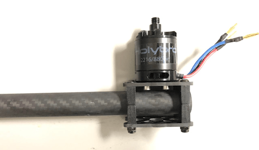

# Holybro X500 + Pixhawk4 Build

This topic provides full instructions for building the kit and configuring PX4 using *QGroundControl*.

## Key information

- **Full Kit:** [Holybro X500 Kit](https://shop.holybro.com/x500-kit_p1180.html)
- **Frame:** [Holybro X500](https://shop.holybro.com/x500-frame-kit_p1178.html)
- **Flight controller:** [Pixhawk 4](../flight_controller/pixhawk4.md)
- **Assembly time (approx.):** 3.75 hours (180 minutes for frame, 45 minutes for autopilot installation/configuration)

## Bill of materials

The Holybro [X500 Kit](https://shop.holybro.com/x500-kit_p1180.html) includes almost all the required components:

* [Pixhawk 4 autopilot](../flight_controller/pixhawk4.md)
* [Pixhawk 4 GPS](https://shop.holybro.com/pixhawk-4-gps-module_p1094.html)
* [Power Management - PM07](https://shop.holybro.com/pixhawk-4-power-module-pm07_p1095.html)
* [Holybro Motors - 2216 KV880 x4](https://shop.holybro.com/motor2216-880kv-1pc_p1154.html)
* [Holybro BLHeli S ESC 20A x4](https://shop.holybro.com/blheli-s-esc-20a_p1143.html)
* [Propellers - 1045 x4](https://shop.holybro.com/propeller10452pair_p1155.html)
* Battery Strap
* Power and Radio Cables
* Wheelbase - 500 mm
* Dimensions - 410x410x300 mm
* 433 MHz Telemetry Radio/915 MHz Telemetry Radio

Additionally you will need a battery and receiver ([compatible radio system](../getting_started/rc_transmitter_receiver.md)) if you want to control the drone manually.

## 硬件

This section lists all hardware for the frame and the autopilot installation.

| Item                         | 描述                                               | Quantity |
| ---------------------------- | ------------------------------------------------ | -------- |
| Bottom plate                 | Carbon fiber (2mm thick)                         | 16       |
| Top plate                    | Carbon fiber (1.5mm thick)                       | 4        |
| Arm                          | Carbon fiber tube (Diameter: 16mm length: 200mm) | 4        |
| Landing gear - Vertical pole | Carbon fiber tube + engineering plastic          | 2        |
| Landing gear - Cross bar     | Carbon fiber tube + engineering plastic + foam   | 1        |
| Motor base                   | Consists of 6 parts and 4 screws 4 nuts          | 1        |
| Slide bar                    | Diameter: 10mm length: 250mm                     | 2        |
| Battery mounting board       | Thickness: 2mm                                   | 12       |
| Battery pad                  | 3mm Silicone sheet black                         | 1        |
| Platform board               | Thickness: 2mm                                   | 8        |
| Hanger & rubber ring gasket  | Inner hole diameter: 10mm black                  | 8        |

### Electronics

| Items                                                      | Quantity |
| ---------------------------------------------------------- | -------- |
| Pixhawk 4                                                  | 1        |
| Pixhawk4 GPS Module                                        | 1        |
| Power Management PM07 (with pre-soldered ESC power cables) | 2        |
| Motors 2216 KV880（V2 Update)                               | 3        |
| Holybro BLHeli S ESC 20A x4                                | 2        |
| 433MHz Telemetry Radio / 915MHz Telemetry Radio            | 1        |

### Tools needed

The following tools are used in this assembly:

- 1.5 mm Hex screwdriver
- 2.0 mm Hex screwdriver
- 2.5 mm Hex screwdriver
- 3mm Phillips screwdriver
- 5.5 mm socket wrench or small piler
- Wire cutters
- Precision tweezers

## Assembly

Estimate time to assemble is 3.75 hours (180 minutes for frame, 45 minutes for autopilot installation/configuration)

**Step 1:** We are going to start by assembling the landing gear to the vertical pole. Unscrew the landing gear screws and insert the vertical pole, see figures 1 and 2.

(Figure 1)

(Figure 2)

**Step 2:** We proceed to put the 4 arms through the 4 motor bases shown in figure 3. Make sure the rods protrude the base slightly and are consistent throughout all 4 arms, and be sure to have the motor wires facing outward.

(Figure 3)

**Step 3:** Insert 4 nylon screws and nylon standoffs and attach the power module PM07 to the bottom plate using 4 nylon nuts as shown in Figures 4.

(Figure 4)

**Step 4:** Feed the 4 motor ESCs through each of the arms and connect the 3-wires end to the motors shown in Figure 5.

(Figure 5)

**Step 5:** Connect the ESCs power wires onto the power module PM07, black->black and red->red, ESC PWM signal wires goes to "FMU-PWM-Out". Make sure you connect the motor ESC PWM wires in the correct order. Refer to Figure 7 for airframe motor number and connect to the corrsponding number on the PM07 board.

The color on top of the motor indicate the spin direction (figure 7-1), black tip is clockwise, and white tip is counter-clockwise. Make sure the follow the px4 quadrotor x airframe reference for direction.

 (Figure 6)

(Figure 7)                                                  (Figure 7-1)

**Step 6:** Connect the 10 pin cables to FMU-PWM-in, the 6 pin cables to the PWR1 on the PM07 power module.

 (Figure 8)

**Step 7** If you want to mount the GPS on the top plate, you can now secure the GPS mount onto the top plate using 4 screws and nuts.

(Figure 9)

**Step 8:** Feed the PM07 cables through the top plate. Connect the top and bottom plate by using 4 U-shaped nylon straps, screws, and nuts on each side, ensure that the motor ESC cables are inside the U-shape nylon straps like Figure 10, keep the nut loose.

(Figure 10-1)                                                   (Figure 10-2)

**Step 9:** Push the arm tubes a bit into the frame and make sure the amount of protrusion (red square from Figure 11) are consistent on all 4 arms. Ensure all the motors are pointed directly upward, then tighten all the nuts and screws.

**Step 10:** Put the hanger gaskets into the 4 hangers (Figure 11) and mount them onto the bottom plate using 8 hex screws. The screw holes are noted by the white arrow in Figure 12. It is recommended to tilt the drone sideway to make the installation easier.

(Figure 11)

(Figure 12)

**Step 11:** Insert the slide bars (Figure 13) to the hanger rings. Assemble the battery mount and platform board and mount them onto the slide bars as shown in Figure 14.

(Figure 13)

(Figure 14)

**Step 12** Mount the landing gear onto the bottom plate. It is recommended to tilt the drone sideway to make this installation process easier.

(Figure 15)

**Step 13** Use the tape and stick the GPS to the top of the GPS mast and mount the GPS mast, make sure the arrow on the gps (Figure 16) is pointing forward.

(Figure 16)

**Step 14:** Mount the telemetry radio onto the top plate. Plug the telemetry cable into TELEM1 port and GPS module to GPS MODULE port on the flight controller. Plug the cable from PM07 FMU-PWM-in to FMU-PWM-out and PWR1 to POWER1 on the flight controller shown in Figure 17.

(Figure 17)

Please refer to [Pixhawk 4 Quick Start](../assembly/quick_start_pixhawk4.md) for more information

(Fully assembled X500 Kit)

## 组装

*QGroundControl* is used to install the PX4 autopilot and configure/tune it for the X500 frame. [Download and install](http://qgroundcontrol.com/downloads/) *QGroundControl* for your platform.

:::tip
Full instructions for installing and configuring PX4 can be found in [Basic Configuration](../config/README.md).
:::

First update the firmware and airframe:
* [Firmware](../config/firmware.md)
* [Airframe](../config/airframe.md)

:::note
You will need to select the *Holybro S500* airframe (**Quadrotor x > Holybro S500**).
:::

Then perform the mandatory setup/calibration:
* [固件](../config/flight_controller_orientation.md)
* [机架](../config/compass.md)
* [Accelerometer](../config/accelerometer.md)
* [Level Horizon Calibration](../config/level_horizon_calibration.md)
* [Radio Setup](../config/radio.md)
* [Flight Modes](../config/flight_mode.md)

Ideally you should also do:
* [传感器方向](../advanced_config/esc_calibration.md)
* [罗盘](../config/battery.md)
* [加速度计 Accelerometer](../config/safety.md)

## Tuning

Airframe selection sets *default* autopilot parameters for the frame. These are good enough to fly with, but it is a good idea to tune the parameters for a specific frame build.

For general information on tuning see: [Multicopter PID Tuning Guide](../config_mc/pid_tuning_guide_multicopter.md).

## 调试

This build log was provided by the Dronecode Test Flight Team.
