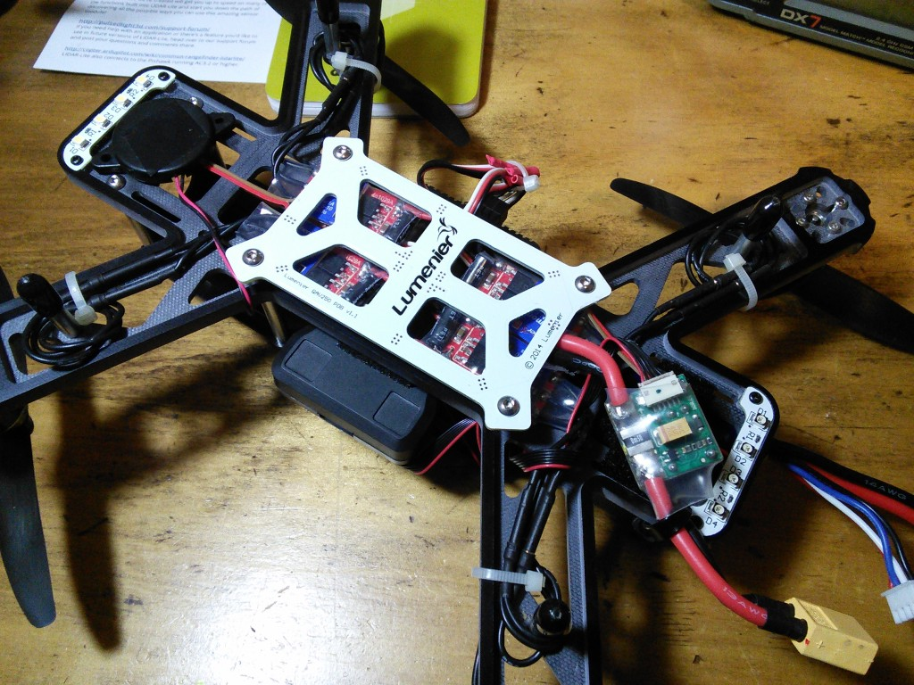

# Lumenier QAV250 Pixhawk & AUAV-X2 Builds

The [Lumenier QAV250 Mini FPV Quadcopter](https://www.lumenier.com/products/legacy/qav250) is a small but fully functional FPV multicopter frame. This topic provides build guidance for using the frame with the *Pixhawk* and AUAV-X2 flight controllers.

:::note
Our [HolyBro QAV250 Pixhawk4-Mini Build](holybro_qav250_pixhawk4_mini.md) contains more complete build instructions for working with the QAV250. :::

Key information:

-   **Frame:** Lumenier QAV250 CF
-   **Flight controller:** Pixhawk or AUAV-X2
-   **Assembly time (approx.):** -

## Frame Assembly

The frame assembly guide is here: [Build Manual](https://www.lumenier.com/products/legacy/build-manual) <!-- QAV250 G10 Build Manual -->

## Pixhawk Guidance

There wasn't quite enough room to orient the Pixhawk lengthwise, so I rotated it 90 degrees and positioned the 4 foam mounting pads as far apart as possible on the frame. Don't forget to specify the correct autopilot orientation when you are setting parameters.

The buzzer is mounted to the bottom front of the frame with servo tape and the safety switch fit neatly in one of the holes at the rear of the top frame.

To save some weight and make power cabling easier, I removed the XT60 from the output end of the power module and soldered its leads directly to the PDB.

Flying weight as pictured with 3S/1300mAh Nano-tech LiPo and Mobius camera, but no FPV gear is 547g and hover throttle is about 50%.

## AUAV-X2 Guidance

The photo below shows the QAV250 with the smaller form-factor AUAV-X2 instead of a Pixhawk.

It is mounted underneath the top plate to move it further away from the EMI generated by the PDB and ESCs. This allows flight without an external GPS/compass since the internal compass is usable with the reduced EMI.

The X2 is mounted in a sintered nylon case with a "baro chamber" which reduces sensitivity of the barometer altitude to pressure effects created by wind and turbulence.

:::note
Originally this case could be ordered from Phil Kocmoud's Shapeways store: "auav x2 r4 screwless nylon case nylon".
It is no longer available (but not "required").
:::

Also note that you must order the top and bottom case halves separately.

