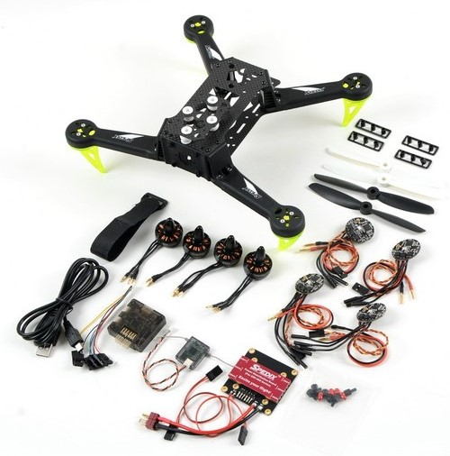
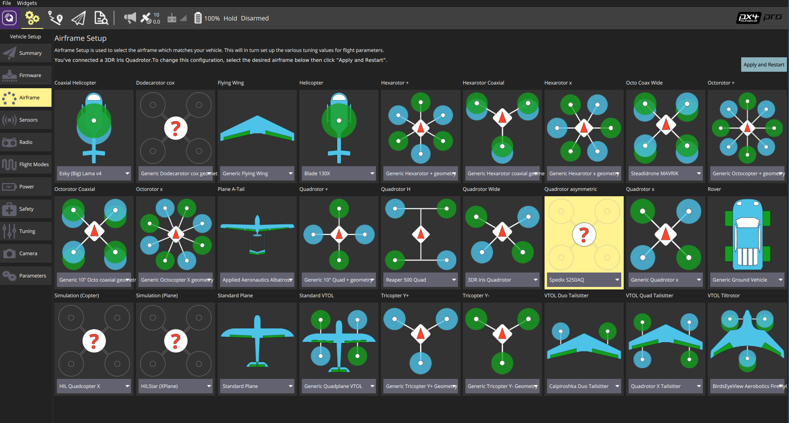

# Spedix S250AQ

The Spedix S250 is a asymmetric racing quadcopter perfectly suited for the [Pixracer](../flight_controller/pixracer.md) autopilot.

## 硬件

The hardware required for this build is displayed below.

## Mounting and Wiring

Connect GPS and the Wifi module as shown in the [Pixracer instructions](../flight_controller/pixracer.md).

Connect the motors in the layout and order defined in the [Airframe Reference](../airframes/airframe_reference.md#quadrotor-asymmetric), and as reproduced below.

<table style="float: right; width: 70%; font-size:1.5rem;">
 <colgroup><col></colgroup>
 <thead>
   <tr><th>常规输出接法</th></tr>
 </thead>
<tbody>
<tr>
 <td style="vertical-align: top;"><ul><li><b>MAIN1</b>: motor1 (front right: CCW)</li><li><b>MAIN2</b>: motor2 (back left: CCW)</li><li><b>MAIN3</b>: motor3 (front left: CW)</li><li><b>MAIN4</b>: motor4 (back right: CW)</li><li><b>MAIN5</b>: feed-through of RC AUX1 channel</li><li><b>MAIN6</b>: feed-through of RC AUX2 channel</li></ul></td>
</tr>
</tbody></table>

## Airframe Configuration

Select the Quadrotor asymmetric Spedix S250AQ configuration as shown below. This will not only put PX4 into quadrotor mode, but also load decent default tuning gains.

