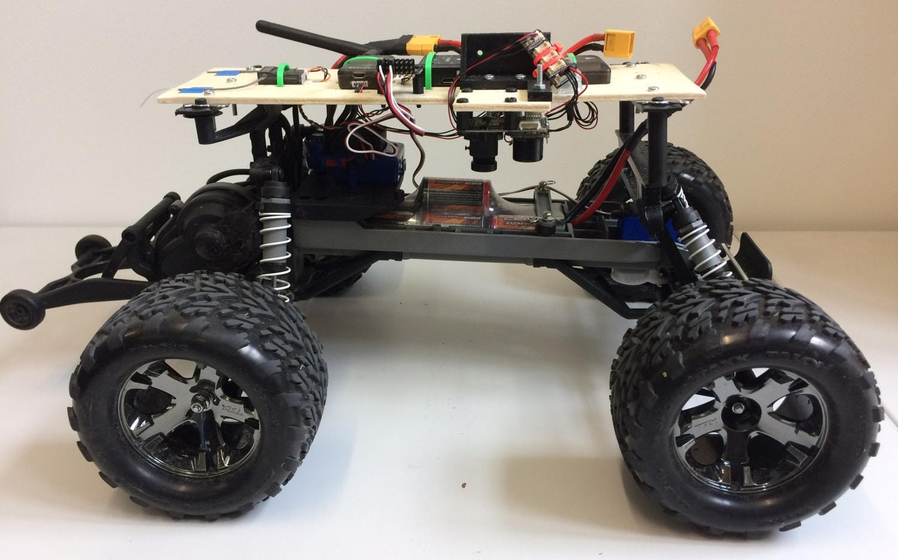
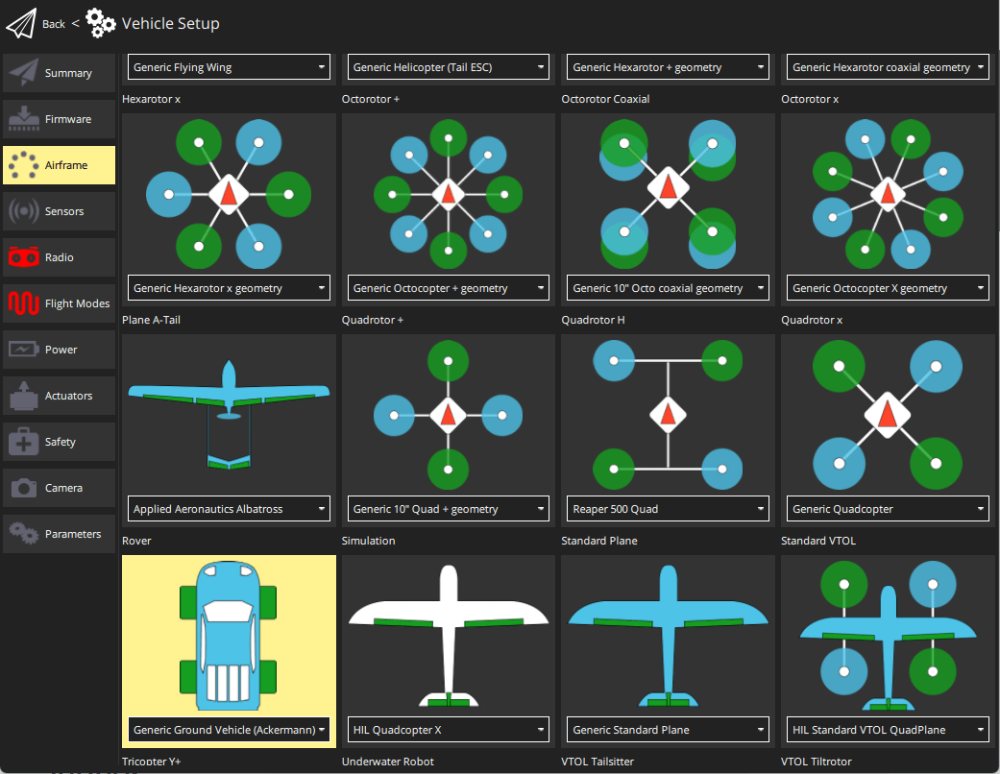
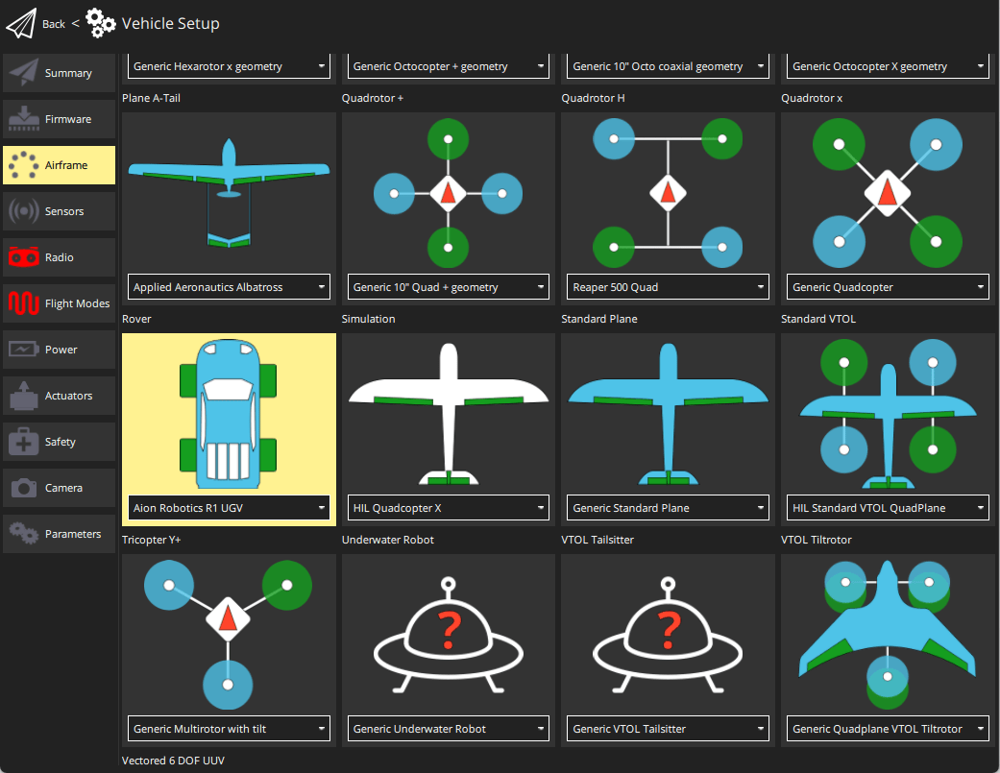

# Rovers (UGVs)

:::warning
Support for rover is [experimental](../airframes/README.md#experimental-vehicles).

- Does not have a maintainer.
- Not regularly tested by the core development team.
- Limited support for different types of vehicles.

Maintainer volunteers, [contribution](../contribute/README.md) of new features, new frame configurations, or other improvements would all be very welcome!
:::

PX4 supports rovers (Unmanned Ground Vehicles - UGVs) with [ackermann and differential](#rover-types) steering.

This section contains build logs/instructions for assembling as well as configuring a number of UGV frames.

## Rover Types

PX4 supports rovers with:

- **Differential steering**: direction is controlled by moving the left- and right-side wheels at different speeds. This kind of steering commonly used on bulldozers, tanks, and other tracked vehicles.
- **Ackermann steering**: direction is controlled by pointing wheels in the direction of travel ([ackermann geometry](https://en.wikipedia.org/wiki/Ackermann_steering_geometry) compensates for the fact that wheels on the inside and outside of the turn move at different rates). This kind of steering is used on most commercial vehicles, including cars, trucks etc.

The supported frames can be seen in [Airframes Reference > Rover](../airframes/airframe_reference.md#rover).

## How to Configure a Rover

### Ackermann Steering Configuration

Setting up a rover with Ackermann steering is straightforward:

1. In the [Airframe](../config/airframe.md) configuration, select the _Generic Ground Vehicle_.

   

   Select the **Apply and Restart** button.

1. Open the [Actuators Configuration & Testing](../config/actuators.md) to map the steering and throttle functions to flight controller outputs.

### Differential Steering Configuration

1. In the [Airframe](../config/airframe.md) configuration, select either the _Aion Robotics R1 UGV_ or _NXP Cup car: DF Robot GPX_

   

Select the **Apply and Restart** button.

1. Open the [Actuators Configuration & Testing](../config/actuators.md) and map the left and right motor functions to flight controller outputs.

## Simulation

[Gazebo Classic](../sim_gazebo_classic/README.md) provides simulations for both types of steering:

- Ackermann: [ackermann rover](../sim_gazebo_classic/gazebo_vehicles.md#ackermann-ugv)
- Differential: [r1 rover](../sim_gazebo_classic/gazebo_vehicles.md#differential-ugv)

## 视频

This video shows the [Traxxas Stampede Rover](../frames_rover/traxxas_stampede.md) (an Ackermann vehicle).

@[youtube](https://youtu.be/N3HvSKS3nCw)
