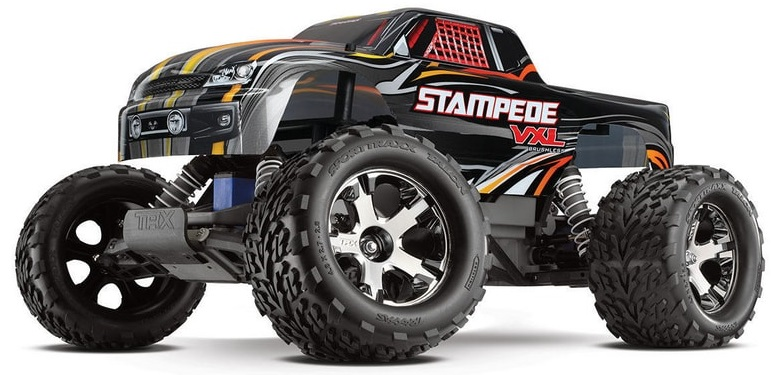
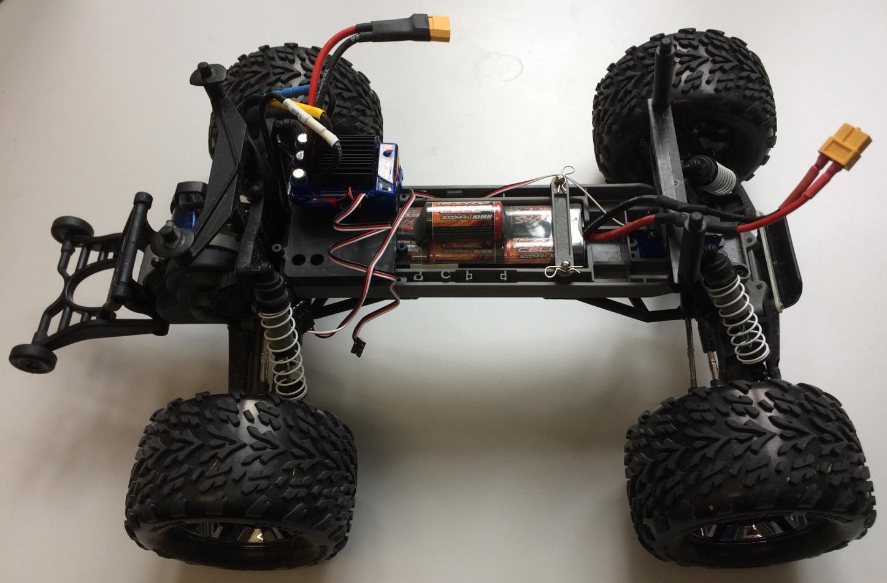
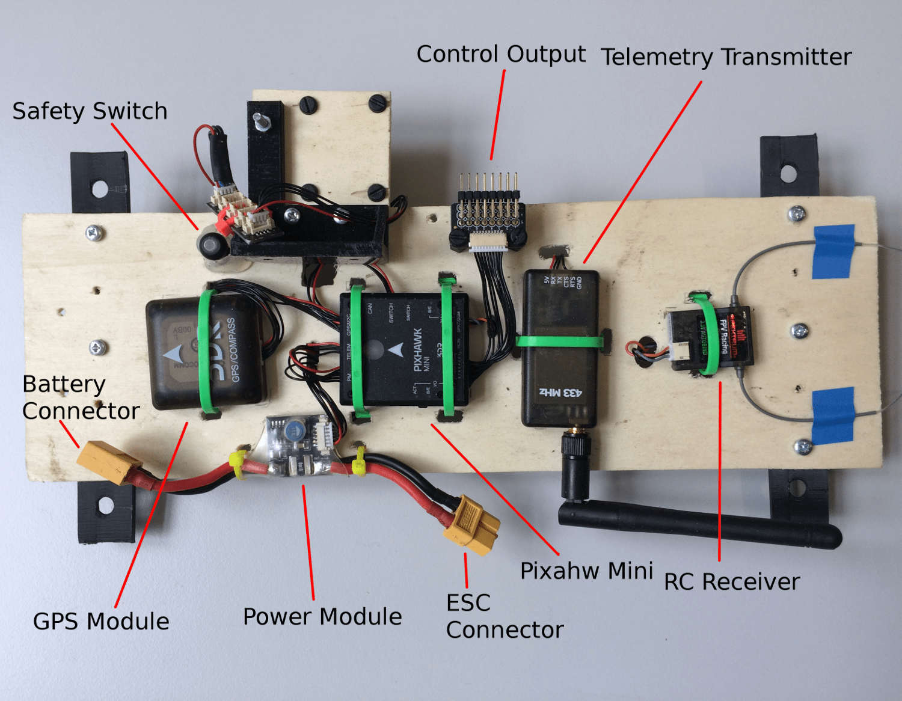
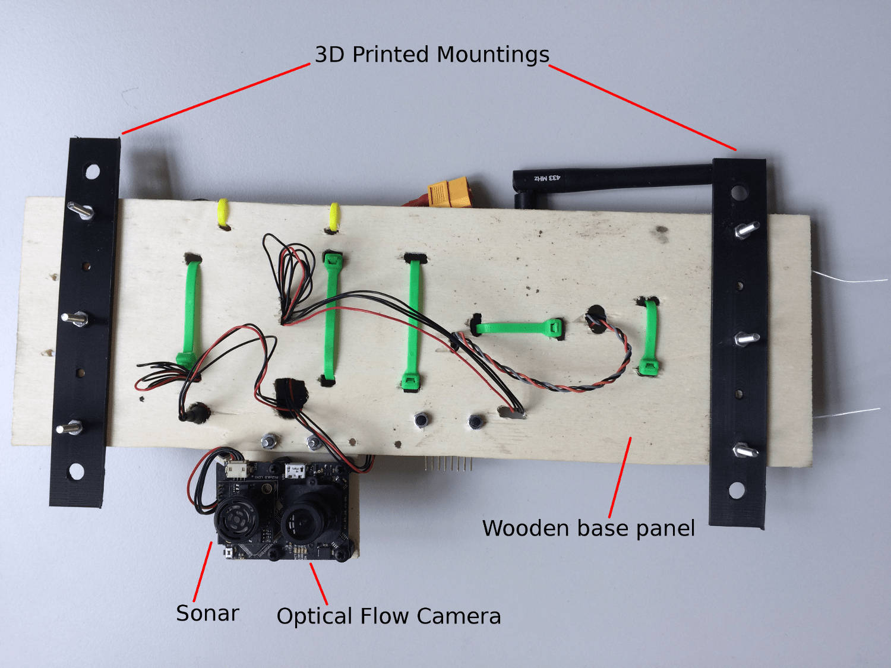
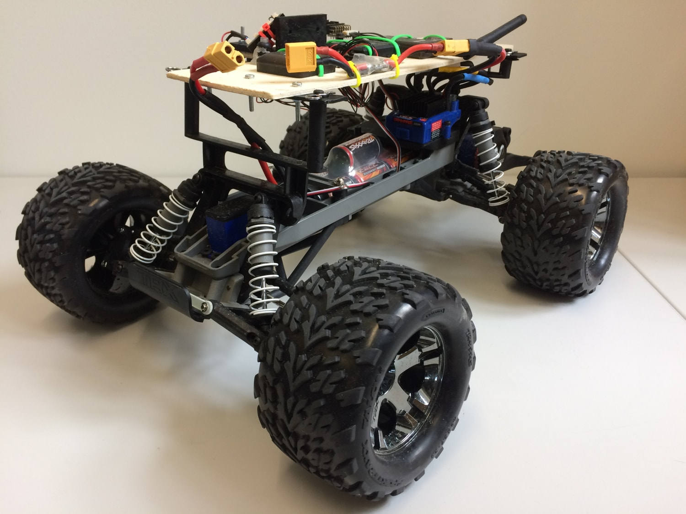
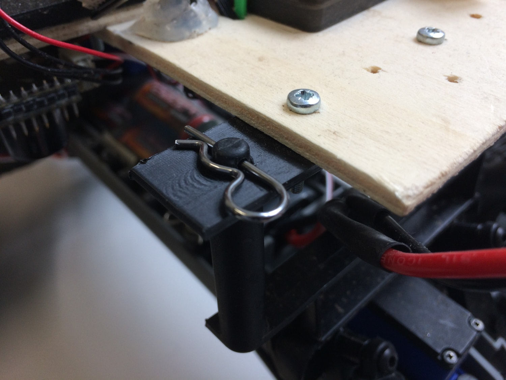
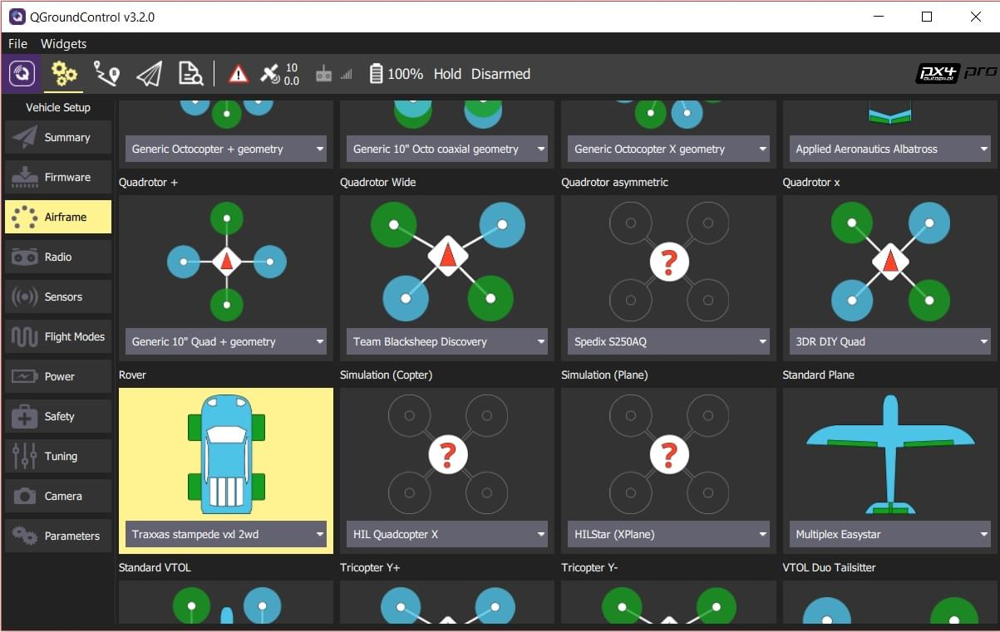
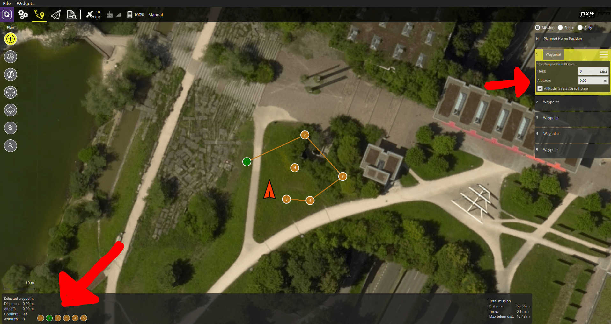

# Traxxas Stampede VXL

选择这辆车是为了了解Pixhawk如何能够用于轮式平台。 我们选择使用 Traxxas 车辆，因为它们非常受欢迎，是遥控车社区中一个非常强大的品牌。 其目的是建立一个平台，便于使用自动驾驶器控制轮式UGV。

## 配件列表

* [Traxxas Stampede](https://traxxas.com/products/models/electric/stampede-vxl-tsm) 除了顶部塑料封面外，其余部分都被使用。
* [Pixhawk Mini （停产）](../flight_controller/pixhawk_mini.md)
  * 3DR 10S 电源模块
  * 3DR 433MHz Telemetry Module (EU)
* [Spektrum Dxe Controller](http://www.spektrumrc.com/Products/Default.aspx?ProdId=SPM1000) 或其他 PX4 兼容的遥控器
* [Spektrum Quad Race 系列接收机 w/Diversity](http://www.spektrumrc.com/Products/Default.aspx?ProdID=SPM4648)
* [PX4Flow](../sensor/px4flow.md) (Deprecated)

## 组装

组装体由一个木质框组成，上面安装所有的自驾仪部件。 测试显示，应使用良好的减震装置，尤其是对于Pixhawk飞控和光流模块。

对于这个特定的安装，我们选择使用由小车提供的架子来连接上覆板。 为此，使用3D打印了两个支架。 The CAD files are provided [here](https://github.com/PX4/PX4-user_guide/raw/v1.14/assets/airframes/rover/traxxas_stampede_vxl/plane_holders.zip).

:::warning
It is **HIGHLY RECOMMENDED** to set the ESC in training mode (see Traxxas Stampede Manual), which reduces power to 50%.
:::

## 输出接口

| PWM 输出 | 执行器        |
| ------ | ---------- |
| MAIN2  | 转向马达/舵机    |
| MAIN4  | 油门 (ESC输入) |

:::note
As documented in the Airframe Reference: [Generic ground vehicle (Ackermann)](../airframes/airframe_reference.md#rover_rover_generic_ground_vehicle_(ackermann)).
:::

## 配置

Rovers are configured using *QGroundControl* in the same way as any other vehicle.

主要的跟小车相关的配置是要设置正确的机架类型：
1. Switch to the [Basic Configuration](../config/README.md) section in *QGroundControl*
1. 选择 [Airframe](../config/airframe.md) 选项卡。
1. Scroll down the list to find the **Rover** icon.
1. Choose **Traxxas stampede vxl 2wd** from the drop down list.

## 用法

目前，当ESC遥控器时，PX4只支持 [MISSION](../flight_modes/mission.md) 和MANUAL 模式。 要使用任务模式，请先通过QGC上传一个新任务。 然后，在ARMING之前，选择 `MISSION` 然后再选择ARM。

:::warning
It is very important to do a mission composed *only** of normal waypoints (i.e. no takeoff waypoints etc.) and it is crucial to set the waypoint height of **every** waypoint to 0 for correct execution. 如果不这样做，驾驶员就会继续在航点周围旋转。
:::

正确的任务设置如下：

## 视频

<iframe width="740" height="416" src="https://www.youtube.com/embed/N3HvSKS3nCw" frameborder="0" allow="accelerometer; autoplay; clipboard-write; encrypted-media; gyroscope; picture-in-picture" allowfullscreen></iframe>
