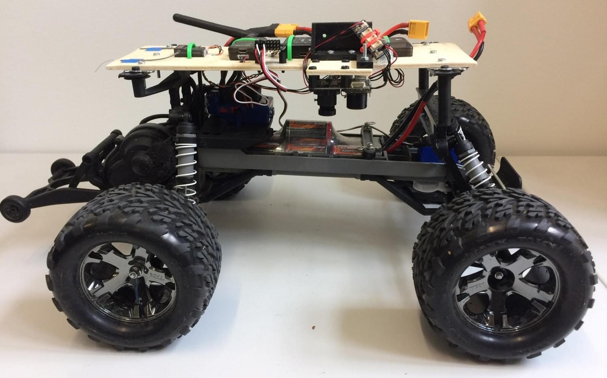

# Traxxas Stampede VXL

This vehicle was chosen to understand how a Pixhawk could be used for wheeled platforms. We chose to use a Traxxas vehicle as they are very popular and it is a very strong brand in the RC community. The idea was to develop a platform that allows for easy control of wheeled UGVs with an autopilot.

https://youtu.be/N3HvSKS3nCw

## Parts List

- [Traxxas Stampede](https://traxxas.com/products/models/electric/stampede-vxl-tsm) All of this is used except for the top plastic cover.
- [Pixhawk Mini （停产）](../flight_controller/pixhawk_mini.md) 
    - 3DR 10S Power Module
    - [3DR 433MHz Telemetry Module (EU)
- [Spektrum Dxe Controller](http://www.spektrumrc.com/Products/Default.aspx?ProdId=SPM1000) or other PX4-compatible remotes
- [Spektrum Quad Race Serial Receiver w/Diversity](http://www.spektrumrc.com/Products/Default.aspx?ProdID=SPM4648)
- [PX4Flow](../sensor/px4flow.md)

## Assembly

The assembly consists of a wooden frame on which all the autopilot parts were attached. Tests showed that a better vibration insulation should be used, especially for the Pixhawk and the Flow module.

For this particular mounting we chose to use the clip supplied with the rover to attach the upper plate. For this, two supports were 3D printed. The CAD files are provided [here](https://github.com/PX4/px4_user_guide/raw/master/assets/airframes/rover/traxxas_stampede_vxl/plane_holders.zip).

> **Warning** It is **HIGHLY RECOMMENDED** to set the ESC in training mode (see Traxxas Stampede Manual) so to reduce the power to 50%.

## Output Connections

| PWM Output | Actuator       |
| ---------- | -------------- |
| MAIN2      | Steering servo |
| MAIN4      | ESC input      |

> **Note** As documented in the [Airframe reference here](../airframes/airframe_reference.md#rover_rover_traxxas_stampede_vxl_2wd).

## 配置

Rovers are configured using *QGroundControl* in the same way as any other vehicle.

The main rover-specific configuration is setting the correct frame:

1. Switch to the [Basic Configuration](../config/README.md) section in *QGroundControl*
2. Select the [Airframe](../config/airframe.md) tab. 
3. Scroll down the list to find the **Rover** icon. 
4. Choose **Traxxas stampede vxl 2wd** from the drop down list.

## 用法

At the current time, PX4 only supports [MISSION](../flight_modes/mission.md) and MANUAL modes when a RC remote is connected. To use the mission mode, first upload a new mission to the vehicle with QGC. Then, BEFORE ARMING, select `MISSION` and then arm.

> **Warning** It is ***VERY IMPORTANT*** to do a mission composed ***ONLY*** of normal waypoints (i.e. ***NO TAKEOFF WAYPOINTS***) and it is crucial to ***SET THE WAYPOINT HEIGHT OF EVERY WAYPOINT TO 0*** for a correct execution. Failing to do so will cause the rover to continuously spin around a waypoint.

A correct mission setup looks as follows:

