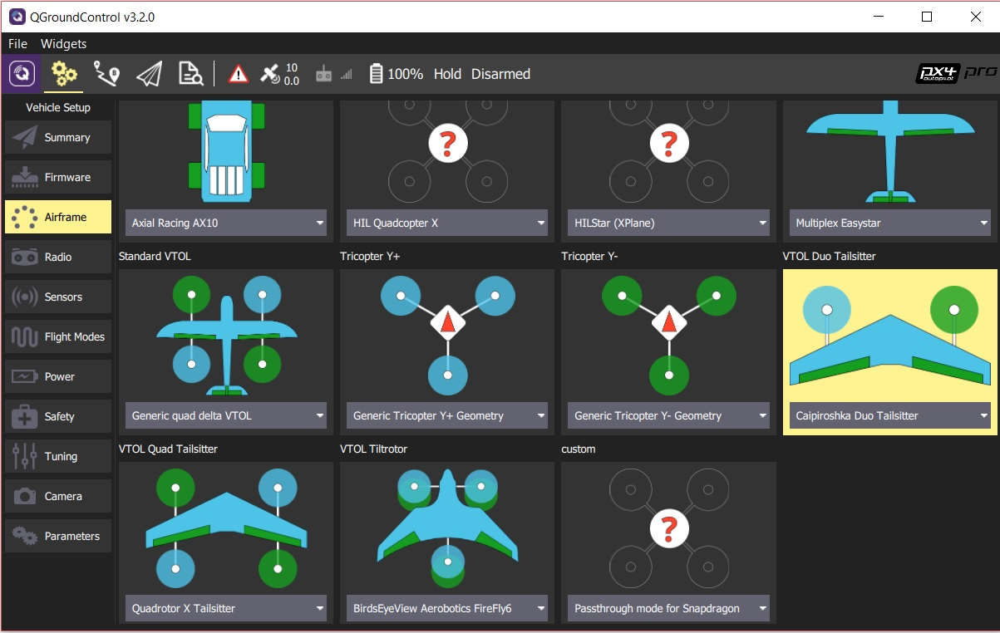

# TBS Caipiroshka

The Caipiroshka VTOL is a slightly modified *TBS Caipirinha*.

> **Note** The *TBS Caipirinha* has been superceded and is no longer available. These instructions *should* work with the updated vehicle: [TBS Caipirinha 2](https://team-blacksheep.com/products/prod:tbs_caipi2_pnp). A number of other components have been updated in the parts list too.

https://www.youtube.com/watch?v=acG0aTuf3f8&vq=hd720

## 配件列表

* TBS Caipirinha Wing (no longer available - try [TBS Caipirinha 2](https://team-blacksheep.com/products/prod:tbs_caipi2_pnp)) 
* 3D 打印的左右电机安装架（<a href="https://github.com/PX4/px4_user_guide/raw/master/assets/airframes/vtol/caipiroshka/motor_mounts.zip" target="_blank">设计文件 </a>）
* CW 8045 propeller ([Eflight store](https://www.banggood.com/GEMFAN-Carbon-Nylon-8045-CWCCW-Propeller-For-Quadcopters-1-Pair-p-950874.html))
* CCW 8045 propeller ([Eflight store](https://www.banggood.com/GEMFAN-Carbon-Nylon-8045-CWCCW-Propeller-For-Quadcopters-1-Pair-p-950874.html))
* 2x 1800 kV 120-180W motors
  
  * [ePower 2208](https://www.galaxus.ch/en/s5/product/epower-22081400-fuer-2-3-lipo-imax-rc-electric-motors-8355913)
  * [Armattan 2208 1800kV Multirotor Motor](https://www.amazon.com/Armattan-2208-1800kV-Multirotor-Motor/dp/B00UWLW0C8) <!-- equivalent replacement must match: kV (1800), motor size (2208) and number of LiPo cells (3S). -->

* 2x 20-30S ESC
  
  * [GetFPV](https://www.getfpv.com/lumenier-30a-blheli-s-esc-opto-2-4s.html)
* BEC（3A，5-5.3V）（如果你的电调不能提供5V的输出，可以用这个）
* 3S 2200 mA锂电池 
  * Team Orion 3S 11.1V 50 C（[Hobbyshop 商城](https://www.hobbyshop.ch/modellbau-elektronik/akku/team-orion-lipo-2200-3s-11-1v-50c-xt60-ori60163.html)）
* [Pixracer 飞控 + 电源模块](../flight_controller/pixracer.md)
* [数字空速传感器](https://hobbyking.com/en_us/hkpilot-32-digital-air-speed-sensor-and-pitot-tube-set.html)

## 组装

The picture below shows what a fully assembled Caipiroshka could look like.

下面有一些如何装机的小技巧。

### 飞控

在靠近飞机重心的地方安装飞控。

### 安装电机

使用上面清单列表中的STL文件，打印电机架。 在每一边的机翼上各安装一个电机，并让电机轴处在升降副翼的中心。 上面图片中电机之间的水平距离的 56cm。 Once you have marked the correct position on the wing you can cover the area which will be in contact with the mount with standard transparent tape on both the upper and lower wing side. Then apply a layer of hot glue onto this area and glue the motor mount onto the wing. The reason for having tape in between the wing surface and the hot glue is that you can very easily remove the motor mount by ripping of the tape from the wing without any damage. 在你更换损坏的电机时是非常有用的。

### 电调:

电调可以用胶水或扎带绑在电机架周围平整的地方上。 将电池线绑在电池托架上。 你也可以用电烙铁在泡沫上烫出一条线槽。 将电源线连接到电调上，然后焊上插头。 你也可以连接电调到电源模块上。 如果你没有能提供5V 输出的电源模块，你可以使用外置的电源供给设备（BEC）。

### GPS

GPS 可以安装在飞机后部中间的位置。 This helps shifting the weight of the plane to the back since the two motors, a camera and a potentially bigger battery can make it quite nose heavy. 加长了 12V供电线的长度，也可以减轻对外置的磁罗盘的干扰。

### 空速传感器

将空速管安装在一侧机翼靠近外测的地方。 确保空速管不会受到螺旋桨尾流的影响。 空速管到电机轴的距离比螺旋桨的半径大会比较好。 使用电烙铁可以给空速管和传感器烫出几个槽来进行安装。 也可以给线缆开出合适的槽来进行安装。

### 连接传感器到 I2C 接口

空速计和磁罗盘都要连接到飞控的 I2C 接口。 因此，你需要一个部件清单里的 I2C 扩展板。 把扩展板连接到飞控的 I2C 接口。 然后用 I2C 连接线，连接空速计和磁罗盘到扩展板上。 上面的图片中，扩展板在 GPS 单元旁边。

### 升降副翼

升降副翼可以用透明胶带粘在上面。 你也可以查看黑羊团队提供的TBS Caiprinha 安装手册。

### 普通安装规则

Before mounting all the components to the wing, use tape to hold them in the approximate position and check if the CG of the wing is in the recommended range specified in the build manual for the TBS Caipirinha. 根据你增加的设备重量（例如，GoPro 或更大的电池），然后改变部件的位置来匹配重心。

## 机架设置

连接传感器 下拉列表，找到* VTOL Duo Tailsitter *图标， 选择下拉列表里的 *Caipiroshka Duo Tailsitter*。

## 连接舵机

下面的描述需要将飞机平放在桌子上、机头朝你进行。

| 输出    | 频率     | 执行器  |
| ----- | ------ | ---- |
| MAIN1 | 400 Hz | 右侧电机 |
| MAIN2 | 400 Hz | 左侧电机 |
| MAIN3 | 400 Hz | 空    |
| MAIN4 | 400 Hz | 空    |
| MAIN5 | 50 Hz  | 右副翼  |
| MAIN6 | 50 Hz  | 左副翼  |