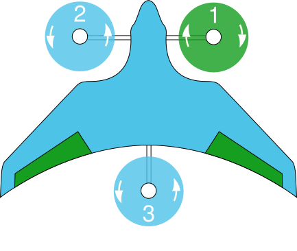
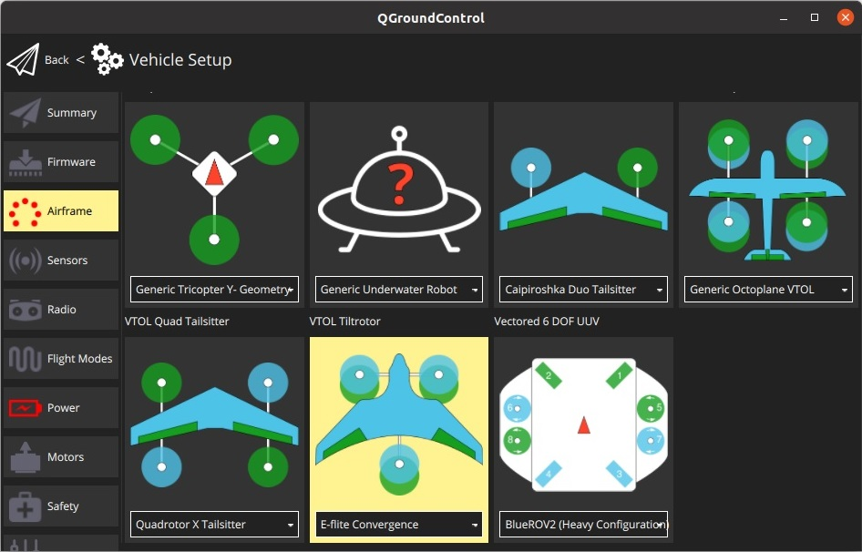

# E-Flite Convergence 倾转旋翼 （Pixfalcon）

The [E-Flite Convergence](https://youtu.be/HNedXQ_jhYo) can easily be converted to a fully autonomous VTOL with PX4. There is not much space but it's enough for a [Pixfalcon](../flight_controller/pixfalcon.md) flight controller with GPS and telemetry.

:::note
The original [Horizon Hobby *E-Flite Convergence*](https://www.modelflight.com.au/e-flite-convergence-vtol-bnf-basic.html) frame and [Pixfalcon](../flight_controller/pixfalcon.md) have been discontinued. Alternatives are provided in the [Purchase](#purchase) section.
:::

@[youtube](https://youtu.be/E61P2f2WPNU)

## Purchase

Vehicle frame options:
- **WL Tech XK X450** - [Banggood](https://usa.banggood.com/XK-X450-VTOL-2_4G-6CH-EPO-450mm-Wingspan-3D-or-6G-Mode-Switchable-Aerobatics-RC-Airplane-RTF-p-1533418.html), [AliExpress](https://www.aliexpress.com/item/1005001946025611.html)
- **JJRC M02** - [Banggood (AU)](https://au.banggood.com/JJRC-M02-2_4G-6CH-450mm-Wingspan-EPO-Brushless-6-axis-Gyro-Aerobatic-RC-Airplane-RTF-3D-or-6G-Mode-Aircraft-p-1588201.html), [AliExpress](https://www.aliexpress.com/item/4001031497018.html)

Flight controller options ():
- [Pixhawk 4 Mini](../flight_controller/pixhawk4_mini.md)
- [Holybro Pixhawk Mini](../flight_controller/pixhawk_mini.md).
- Any other compatible flight controller with small enough form-factor.

## Hardware Setup

The vehicle needs 7 PWM signals, which must be connected to the flight controller outputs as specified in [Airframe Reference > VTOL Tiltrotor > E-flite Convergence](../airframes/airframe_reference.md#vtol_vtol_tiltrotor_e-flite_convergence). This mapping is reproduced below.

| Port   | 接口定义  |
| ------ | ----- |
| MAIN 1 | 右电机   |
| MAIN 2 | 左电机   |
| MAIN 3 | 尾电机   |
| MAIN 4 | 空     |
| MAIN 5 | 右倾转舵机 |
| MAIN 6 | 左倾转舵机 |
| MAIN 7 | 右翼升降舵 |
| MAIN 8 | 左翼升降舵 |

Note that left and right in the reference are defined from the perspective of a human pilot inside a real plane (or looking from above, as shown below):

### Flight Controller

The flight controller can be mounted at the same place the original autopilot was.

### Telemetry Radio

The telemetry module fits into the bay meant to hold FPV transmission gear.

### GPS

For the GPS we cut out a section of foam inside the "cockpit". That way the GPS can be put inside the body and is nicely stowed away without compromising the vehicle appearance.

## PX4 Configuration

Follow the [Standard Configuration](../config/README.md) in *QGroundControl* (radio, sensors, flight modes, etc.).

The particular settings that are relevant to this vehicle are:
- [Airframe](../config/airframe.md)
  - Select the airframe configuration **E-flite Convergence** under **VTOL Tiltrotor** and restart *QGroundControl*. 
- [Flight Modes/Switches](../config/flight_mode.md)
  - As this is a VTOL vehicle, you must [assign an RC controller switch](../config/flight_mode.md#what-flight-modes-and-switches-should-i-set) for transitioning between multicopter and fixed-wing modes.
