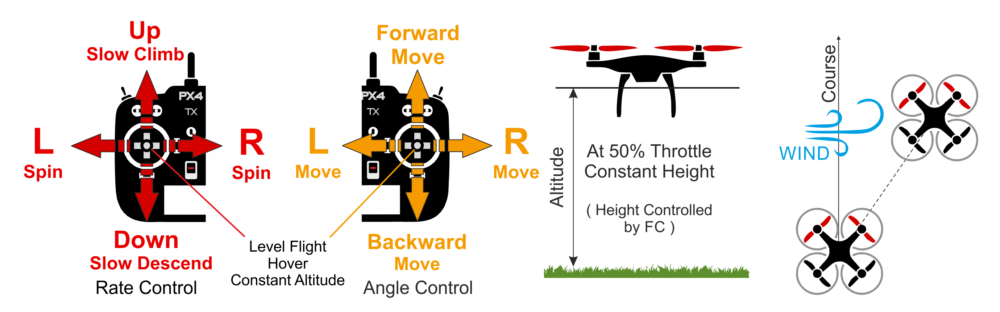
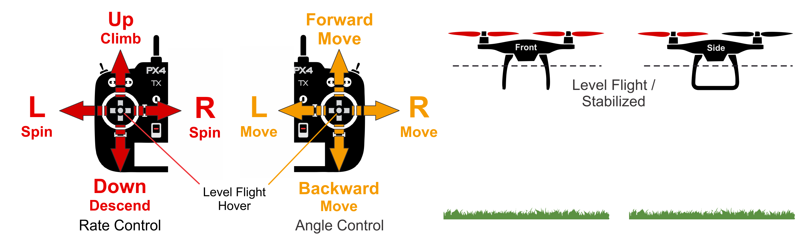
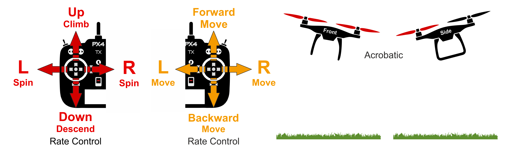
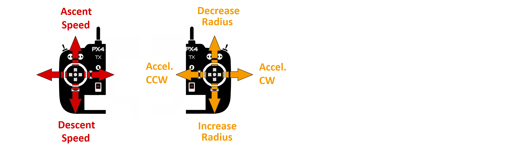
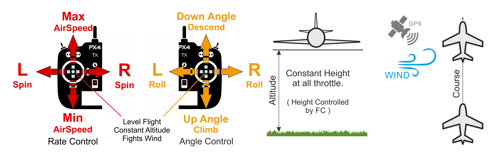
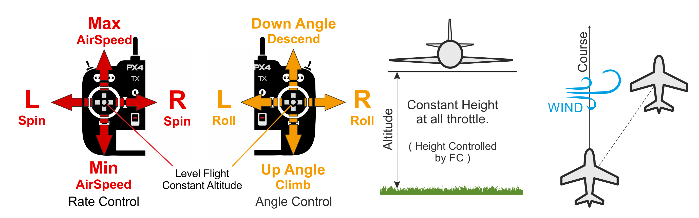
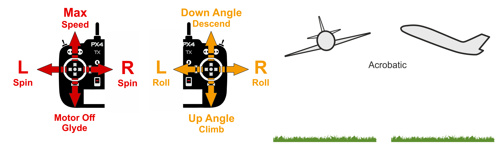

# PX4 飞行模式总览

> **Warning** 该主题正在建设中。 它尚未完整，尚未经过全面审核。

飞行模式定义了自驾仪如何响应遥控输入，以及它如何在全自主飞行期间管理飞行器运动。

这些模式为用户（飞行员）提供不同类型／级别的自动驾驶辅助，包括从起飞和着陆等常见任务的自动化，到更容易重新获得水平飞行及将飞行器保持在固定路径或位置的机制，等等。

这一主题概述了可用的飞行模式，以及多旋翼飞行器（MC）、固定翼（FW）和 VTOL 默认行为中的（大部分情况下很小）差异。

> **Tip** 关于特定飞行模式的详细信息，请参考 [飞行 > 飞行模式](../flight_modes/README.md)。

## 飞行模式切换

飞行员可以使用遥控上的开关或地面站来切换飞行模式（见 [飞行模式配置](../config/flight_mode.md)）。

并非所有飞行器都可以使用所有飞行模式，并且某些模式在不同飞行器类型上表现不同。

一些飞行模式仅在飞行前和飞行中某些特定条件下起作用（如 GPS 锁定，空速传感器，某个轴的姿态感测）。 除非满足合适的条件，否则 PX4 不会允许切换到这些模式。

## 自主和手动模式 {#categories}

Flight Modes are, generally speaking, either *manual* or *autonomous*. 手动模式是用户通过 RC 控制杆（或操纵杆）控制飞行器运动的模式，然而 *自主*模式完全由自驾仪控制，并且不需要驾驶员／遥控输入。

> **Tip** 某些手动模式可能具有自驾辅助机制，以便更容易获得或恢复受控飞行。 如当遥控摇杆居中时，大部分飞行模式将使飞行器水平。

手动模式可以进一步分为 “简单” 和 ”特技“ 模式。 在简单模式中，滚转和俯仰摇杆设定飞行器角度，这将会分别导致*水平面上*的左右和前后运动。 这将不仅可以使运动变得可预测，而且因为角度受控，飞行器无法翻转。 在特技模式中，RC 摇杆控制角度旋转的速率（绕相应轴）。 飞行器可以翻转，虽然机动性更强，但更难飞行。

固定翼:

* 手动－简单： [位置](#position_fw), [高度](#altitude_fw), [自稳](#stabilized_fw), [手动](#manual_fw)
* 手动－特技：[特技](#acro_fw)
* Autonomous: [Hold](#hold_fw), [Return](#return_fw), [Mission](#mission_fw), [Takeoff](#takeoff_fw), [Land](#land_fw), [Offboard](#offboard_fw)

多旋翼:

* Manual-Easy: [Position](#position_mc), [Altitude](#altitude_mc), [Manual/Stabilized](#manual_stabilized_mc), [Orbit](#orbit_mc)
* 手动-特技： [半自动](#rattitude_mc), [特技](#acro_mc)
* 自主：[保持](#hold_mc), [返航](#return_mc), [任务](#mission_mc), [起飞](#takeoff_mc), [降落](#land_mc), [跟随我](#followme_mc), [Offboard](#offboard_mc)

## 键

本文档中使用下列的图标在</td> 

<td>
  手动模式 需要遥控
</td></tr> 

<tr>
  <td>
    </td> 
    
    <td>
      自动模式. 除非切换模式，否则 RC 控制被默认失能。
    </td></tr> 
    
    <tr>
      <td>
        </td> 
        
        <td>
          需要定位（如 GPS，VIO， 或其它定位系统）。
        </td></tr> 
        
        <tr>
          <td>
            
          </td>
          
          <td>
            需要高度（如来自气压计、测距仪）。
          </td>
        </tr>
        
        <tr>
          <td>
            <a href="#key_difficulty">&nbsp;&nbsp;</a></td> 
            
            <td>
              飞行模式难度（简单到困难）
            </td></tr> </tbody> </table> 
            
            <h2 id="mc_flight_modes">
              多旋翼
            </h2>
            
            <h3 id="position_mc">
              位置控制模式
            </h3>
            
            

              &nbsp;&nbsp;
            

            
            

              <a href="../flight_modes/position_mc.md">位置模式</a> 是一种容易飞行的 RC 模式，其中滚转和俯仰摇杆在左右和前后方向控制相对地面的速度。 当摇杆被释放／居中时，车辆将主动制动，保持水平，并锁定到 3D 空间的某个位置-消除风和其它力的影响。
            

            
            <blockquote>
              

                <strong>Tip</strong>位置模式是新飞手最安全的手动模式。 与 <a href="#altitude_mc">高度</a> 和 <a href="#manual_stabilized_mc">手动/自稳</a> 模式不同，当摇杆居中时，飞行器将会制动，而不是继续运动直到风阻使其减速。
              

            </blockquote>
            
            

              
            

            
            <h3 id="altitude_mc">
              高度模式
            </h3>
            
            

              &nbsp;&nbsp;
            

            
            

              <a href="../flight_modes/altitude_mc.md">高度模式</a>是一个 <em>相对</em> 容易飞行的 RC 模式，其中滚转和俯仰摇杆控制飞行器在左右和前后方向（相对飞行器的”前面“）的运动，偏航摇杆控制水平面的旋转速率，油门摇杆控制升降的速度。
            

            
            

              当杆被释放/回中时，飞机将恢复水平并保持当前的<em>高度</em>。 如果在水平面上运动，飞机将继持续运动直到任何动量被风阻力消散。 如果刮风，飞机会向风的方向漂移。
            

            
            <blockquote>
              

                <strong>Tip</strong><em>高度模式</em> 是新飞手在没有 GPS 的手动模式中最安全的模式。 它就像 <a href="#manual_stabilized_mc">手动/自稳</a> 模式，但在释放摇杆时还额外可以稳定飞行器高度。
              

            </blockquote>
            
            

              
            

            
            <h3 id="manual_stabilized_mc">
              手动／自稳模式
            </h3>
            
            

              &nbsp;&nbsp;
            

            
            

              The <a href="../flight_modes/manual_stabilized_mc.md">Manual/Stabilized</a> mode stabilizes the multicopter when the RC control sticks are centered. To manually move/fly the vehicle you move the sticks outside of the center.
            

            
            <blockquote>
              

                <strong>Note</strong>如果为 MC 飞行器设置 <em>手动</em>　或 <em>自稳</em>　模式，则启用此多旋翼模式。
              

            </blockquote>
            
            

              当在手动控制下，滚转和俯仰摇杆控制飞行器角度（姿态），偏航摇杆控制水平面内的旋转速率，油门摇杆控制高度／速度。
            

            
            

              As soon as you release the control sticks they will return to the center deadzone. 一旦滚转和俯仰摇杆居中，多旋翼飞行器将会水平并停止。 假如被合适的平衡，油门被合适的设定，并且没有施加外部力（如风），飞行器将会悬停在适当位置／保持高度。 飞行器将会朝着风的方向飘移，并且必须控制油门以保持高度。
            

            
            

              
            

            
            <h3 id="rattitude_mc">
              半自稳
            </h3>
            
            

              &nbsp;&nbsp;
            

            
            

              <a href="../flight_modes/rattitude_mc.md">半自稳模式</a> 允许飞行员在大多数时间使用<a href="#manual_stabilized_mc">手动/自稳</a>飞行，但在需要时仍然可以执行 <a href="#acro_mc">特技模式</a>式的翻转和其它技巧。
            

            
            

              当滚转／俯仰摇杆在中心区域移动时，飞行器表现为 <em>手动/自稳 模式</em>；当摇杆在外围区域移动时，飞行器表现为特技模式（默认情况下，手动／自稳模式占据摇杆范围的 80%）。 当摇杆居中时，多旋翼飞行器将会水平（但是仍然在会在风和预先存在的动量方向上漂移）。
            

            
            <!-- Image missing: https://github.com/PX4/px4_user_guide/issues/189 -->
            
            <h3 id="acro_mc">
              特技模式
            </h3>
            
            

              &nbsp;&nbsp;
            

            
            

              <a href="../flight_modes/acro_mc.md">特技模式</a>是用于执行特技动作的 RC 模式，如滚转和环绕。
            

            
            

              滚转、俯仰和偏航杆控制绕相应轴的旋转角速率，并且油门直接传递到输出混控器。 当操纵杆居中时，飞机将停止旋转，但保持其当前朝向（在其侧面，倒置或任何其他方向）并根据当前动量移动。
            

            
            

              
            

            
            <!-- image above incorrect: https://github.com/PX4/px4_user_guide/issues/182 -->
            
            <h3 id="orbit_mc">
              Orbit Mode
            </h3>
            
            

              &nbsp;
            

            
            

              The <a href="../flight_modes/orbit.md">Orbit mode</a> allows you to command a multicopter (or VTOL in multicopter mode) to fly in a circle, yawing so that it always faces towards the center.
            

            
            

              A GCS is <em>required</em> to enable the mode, and to set the center position and initial radius of the orbit. By default the vehicle will then perform a slow ongoing orbit around the center position (1m/s) in a clockwise direction. RC control is optional, and can be used to change the orbit altitude, radius, speed, and direction.
            

            
            

              
            

            
            <h3 id="hold_mc">
              Hold Mode
            </h3>
            
            

              &nbsp;
            

            
            

              <a href="../flight_modes/hold.md">Hold mode</a> causes the multicopter to stop and hover at its current position and altitude (maintaining position against wind and other forces). The mode can be used to pause a mission or to help regain control of a vehicle in an emergency. It can be activated with a pre-programmed RC switch or the <em>QGroundControl</em> <strong>Pause</strong> button.
            

            
            <h3 id="return_mc">
              Return Mode
            </h3>
            
            

              &nbsp;
            

            
            

              <a href="../flight_modes/return.md">Return mode</a> causes the vehicle to return (at a safe height) to its home position and land. The mode may be activated manually (via a pre-programmed RC switch) or automatically (i.e. in the event of a failsafe being triggered).
            

            
            <h3 id="mission_mc">
              Mission Mode
            </h3>
            
            

              &nbsp;
            

            
            

              <a href="../flight_modes/mission.md">Mission mode</a> causes the vehicle to execute a predefined autonomous <a href="../flying/missions.md">mission</a> (flight plan) that has been uploaded to the flight controller. The mission is typically created and uploaded with a Ground Control Station (GCS) application.
            

            
            <blockquote>
              

                <strong>Tip</strong> PX4 GCS 称为 <a href="https://docs.qgroundcontrol.com/en/">QGroundControl</a>。 <em>QGroundControl</em>是我们用来 <a href="../config/README.md">配置 PX4</a>的相同的应用程序。
              

            </blockquote>
            
            <h3 id="takeoff_mc">
              Takeoff Mode
            </h3>
            
            

              &nbsp;
            

            
            

              <a href="../flight_modes/takeoff.md">Takeoff</a> mode causes the multicopter to climb vertically to takeoff altitude and hover in position.
            

            
            <h3 id="land_mc">
              Land Mode
            </h3>
            
            

              &nbsp;
            

            
            

              <a href="../flight_modes/land.md">Land mode</a> causes the multicopter to land at the location at which the mode was engaged.
            

            
            <h3 id="followme_mc">
              Follow Me Mode
            </h3>
            
            

              &nbsp;
            

            
            

              <a href="../flight_modes/follow_me.md">Follow Me mode</a> causes a multicopter to autonomously follow and track a user providing their current position setpoint. Position setpoints might come from an Android phone/tablet running <em>QGroundControl</em> or from a MAVSDK app.
            

            
            <h3 id="offboard_mc">
              Offboard Mode
            </h3>
            
            

              &nbsp;
            

            
            

              <a href="../flight_modes/offboard.md">Offboard mode</a> causes the multicopter to obey a position, velocity or attitude setpoint provided over MAVLink.
            

            
            <blockquote>
              

                <strong>Note</strong> 此模式适用于机载计算机和地面站。
              

            </blockquote>
            
            <h2 id="fw_flight_modes">
              固定翼
            </h2>
            
            <h3 id="position_fw">
              Position Mode
            </h3>
            
            

              &nbsp;&nbsp;
            

            
            

              <a href="../flight_modes/position_fw.md">Position mode</a> is an easy-to-fly RC mode in which, when the sticks are released/centered, the vehicle will level and fly a straight line ground track in the current direction — compensating for wind and other forces.
            

            
            

              The throttle determines airspeed (at 50% throttle the aircraft will hold its current altitude with a preset cruise speed). Pitch is used to ascend/descend. Roll, pitch and yaw are all angle-controlled (so it is impossible to roll over or loop the vehicle).
            

            
            <blockquote>
              

                <strong>Tip</strong>位置模式是新飞手最安全的固定翼手动模式。
              

            </blockquote>
            
            

              
            

            
            <h3 id="altitude_fw">
              Altitude Mode
            </h3>
            
            

              &nbsp;&nbsp;
            

            
            

              <a href="../flight_modes/altitude_fw.md">Altitude mode</a> makes it easier for users to control vehicle altitude, and in particular to reach and maintain a fixed altitude. The mode will not attempt to hold the vehicle course against wind.
            

            
            

              The climb/descent rate is controlled via the pitch/elevator stick. Once centered the autopilot latches onto the current altitude and will maintain it during yaw/roll, and at any airspeed. The throttle input controls airspeed. Roll and pitch are angle-controlled (so it is impossible to roll over or loop the vehicle).
            

            
            

              When all remote control inputs are centered (no roll, pitch, yaw, and ~50% throttle) the aircraft will return to straight, level flight (subject to wind) and keep its current altitude.
            

            
            <blockquote>
              

                <strong>Tip</strong> <em>高度模式</em> 是最安全的非 GPS 引导模式，适合初学者学习如何飞行。 这就像 <a href="#manual_fw">手动</a>模式，但当俯仰摇杆被释放，额外稳定飞行器的高度。
              

            </blockquote>
            
            

              
            

            
            <h3 id="stabilized_fw">
              Stabilized Mode
            </h3>
            
            

              &nbsp;&nbsp;
            

            
            

              <a href="../flight_modes/stabilized_fw.md">Stabilized mode</a> mode puts the vehicle into straight and level flight when the RC sticks are centered, maintaining the horizontal posture against wind (but not vehicle heading and altitude).
            

            
            

              The vehicle climb/descends based on pitch input and performs a coordinated turn if the roll/pitch sticks are non-zero. Roll and pitch are angle controlled (you can't roll upside down or loop).
            

            
            <blockquote>
              

                <strong>Tip</strong> <em>自稳模式 </em>比 <a href="#manual_fw">手动模式 </a>更容易飞行，因为您不能翻转它，并且很容易通过居中摇杆来使飞行器水平。
              

            </blockquote>
            
            

              The vehicle will glide if the throttle is lowered to 0% (motor stops). In order to perform a turn the command must beheld throughout the maneuver because if the roll is released the plane will stop turning and level itself (the same is true for pitch and yaw commands).
            

            
            

              
            

            
            <h3 id="acro_fw">
              Acro Mode
            </h3>
            
            

              &nbsp;&nbsp;
            

            
            

              <a href="../flight_modes/acro_fw.md">Acro mode</a> is the RC mode for performing acrobatic maneuvers e.g. rolls, flips, stalls and acrobatic figures.
            

            
            

              The roll, pitch and yaw sticks control the rate of angular rotation around the respective axes and throttle is passed directly to the output mixer. When sticks are centered the vehicle will stop rotating, but remain in its current orientation (on its side, inverted, or whatever) and moving according to its current momentum.
            

            
            

              
            

            
            <h3 id="manual_fw">
              Manual Mode
            </h3>
            
            

              &nbsp;&nbsp;
            

            
            

              <a href="../flight_modes/manual_fw.md">Manual mode</a> sends RC stick input directly to the output mixer for "fully" manual control.
            

            
            <blockquote>
              

                <strong>Tip</strong>这是最难飞行的模式，因为没有什么是稳定的。 与<a href="#acro_fw">特技模式</a>不同，如果 RP 摇杆居中，飞行器将不会自动停止绕轴转动-飞行员实际上必须移动摇杆以向另一个方向施加力。
              

            </blockquote>
            
            

              

            

            
            <blockquote>
              

                <strong>Note</strong> 这是唯一忽略 FMU 的模式（即命令通过安全协处理器发送）。 它提供了一个安全机制，允许在 FMU 固件出现故障时，通过遥控完全控制油门、升降舵、副翼和方向舵。
              

            </blockquote>
            
            <h3 id="hold_fw">
              Hold Mode
            </h3>
            
            

              &nbsp;
            

            
            

              <a href="../flight_modes/hold.md">Hold</a> causes a fixed-wing vehicle to start circling around the current position at its current altitude. The mode can be used to pause a mission or to help regain control of a vehicle in an emergency. It can be activated with a pre-programmed RC switch or the <em>QGroundControl</em> <strong>Pause</strong> button.
            

            
            <h3 id="return_fw">
              Return Mode
            </h3>
            
            

              &nbsp;
            

            
            

              <a href="../flight_modes/return.md">Return mode</a> causes the vehicle to fly back to its home position (at a safe height) and circle over it. The mode may be activated manually (via a pre-programmed RC switch) or automatically (i.e. in the event of a failsafe being triggered).
            

            
            <h3 id="mission_fw">
              Mission Mode
            </h3>
            
            

              &nbsp;
            

            
            

              <a href="../flight_modes/mission.md">Mission mode</a> causes the vehicle to execute a predefined autonomous <a href="../flying/missions.md">mission</a> (flight plan) that has been uploaded to the flight controller. The mission is typically created and uploaded with a Ground Control Station (GCS) application.
            

            
            <blockquote>
              

                <strong>Tip</strong> PX4 GCS 称为 <a href="https://docs.qgroundcontrol.com/en/">QGroundControl</a>。 我们同样使用<em>QGroundControl</em>来配置 PX4。
              

            </blockquote>
            
            <h3 id="takeoff_fw">
              Takeoff Mode
            </h3>
            
            

              &nbsp;
            

            
            

              <a href="../flight_modes/takeoff.md#fixed_wing">Takeoff</a> mode initiates the vehicle takeoff sequence. The specific launch behaviour depends on the configured takeoff mode (catapult/hand-launch mode or runway takeoff mode).
            

            
            <h3 id="land_fw">
              Land Mode
            </h3>
            
            

              &nbsp;
            

            
            

              <a href="../flight_modes/land.md">Land mode</a> causes the vehicle to turn and land at the location at which the mode was engaged. Fixed wing landing logic and parameters are explained in the topic: <a href="../flying/fixed_wing_landing.md">Landing (Fixed Wing)</a>.
            

            
            <h3 id="offboard_fw">
              Offboard Mode
            </h3>
            
            

              &nbsp;
            

            
            

              <a href="../flight_modes/offboard.md">Offboard mode</a> causes the fixed wing vehicle to obey attitude setpoints provided over MAVLink.
            

            
            <blockquote>
              

                <strong>Note</strong> This mode is intended for companion computers and ground stations!
              

            </blockquote>
            
            <h2>
              垂直起降（VTOL）
            </h2>
            
            

              A VTOL aircraft can fly as either a multicopter or as fixed-wing vehicle. The multicopter mode is mainly used for take off and landing while the fixed wing mode is used for efficient travel and/or mission execution.
            

            
            

              Generally the flight modes for VTOL vehicles are the same as for <a href="#mc_flight_modes">multicopter</a> when flying in MC mode and <a href="#fw_flight_modes">fixed-wing</a> when flying in FW mode.
            

            
            

              The switch between modes is initiated either by the pilot using an RC switch or automatically by PX4 when needed in the Auto modes.
            

            
            <h2>
              更多信息
            </h2>
            
            <ul>
              <li>
                <a href="../flight_modes/README.md">飞行> 飞行模式 </a> - 所有模式的详细技术说明。
              </li>
              <li>
                <a href="../config/flight_mode.md">基本配置 > 飞行模式 </a> - 如何将 RC 控制开关映射到特定飞行模式。
              </li>
            </ul>