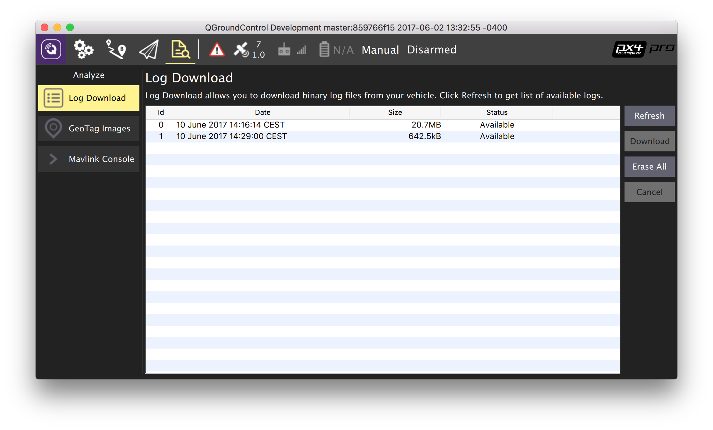

# Flight Reporting

PX4 logs detailed aircraft performance data once the system has been armed until it is disarmed. These flight logs can also be used to analyze performance issues.

> **Tip** Keeping flight logs is a legal requirement in some jurisdictions.

## Downloading Logs from the Flight Controller

Logs can be downloaded using [QGroundControl](http://qgroundcontrol.com/) (v3.2 or later): **Analyze View > Log Download**.

## Sharing the Log Files for Review by PX4 Developers

Upload the log files to <http://review.px4.io>. The log file link can then be shared for review in [discussion forums](../README.md#support) or a [Github issue](../README.md#reporting-bugs--issues).

> **Tip** The topic [Flight Log Analysis](https://dev.px4.io/en/log/flight_log_analysis.html) (PX4 Developer Guide) contains basic information about log file analysis (and alternative analysis tools).