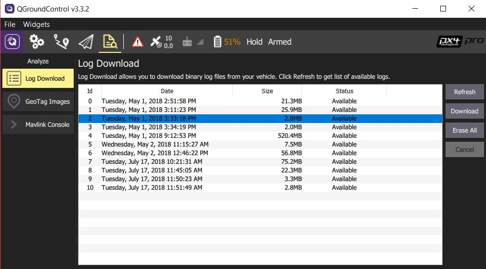

# 飞行报告

PX4记录详细的飞机性能数据，从系统一开始被解锁直到加锁。 这些飞行日志还可以用来分析性能问题。

> **Tip** 在一些司法管辖区，保留飞行日志是一项法律规定。

## 从飞行控制器下载日志

日志数据可以使用 [QGroundControl](http://qgroundcontrol.com/) (v3.2 or later) 下载：**[Analyze View > Log Download](https://docs.qgroundcontrol.com/en/analyze_view/log_download.html)**.

## 分析日志

上传日志到 [Flight Review](http://logs.px4.io)（http://logs.px4.io）在线工具。

[Log Analysis using Flight Review](../log/flight_review.md) 解释了怎样分析图形，这可以帮你确认/排除一些常见的问题：过大的震动、很差的PID调优、控制器饱和、车辆不平衡、GPS 噪声、等等。

> **Note** [Flight Log Analysis](../log/flight_log_analysis.md) 包含很多好用的日志工具。

## 给 PX4 开发人员共享日志文件

上传日志到 [Flight Review](http://logs.px4.io) 后，这个日志链接可以在 [support forums](../README.md#support) 或者 [Github issue](../README.md#reporting-bugs--issues) 中分享。

## 额外的配置

日志系统默认配置为使用 [Flight Review](http://logs.px4.io) 收集日志。

日志将来可以使用 [SD Logging](../advanced_config/parameter_reference.md#sd-logging) 参数配置。 下面列出了您最可能更改的参数。

| 参数                                                                       | 描述                                                                                      |
| ------------------------------------------------------------------------ | --------------------------------------------------------------------------------------- |
| [SDLOG_MODE](../advanced_config/parameter_reference.md#SDLOG_MODE)       | 日志模式定义日志何时开始和停止。  
- `0`：解锁时开始记录直到加锁 (默认)。  
- `1`：系统启动开始记录直到加锁。  
- `2`：系统启动时开始记录直到断电。 |
| [SDLOG_PROFILE](../advanced_config/parameter_reference.md#SDLOG_PROFILE) | 日志配置文件。 使用此功能可以进行不太常见的日志/分析 (例如，用于 EKF2 重放、用于 PID 和过滤器调优的高速率日志记录、热温度校准)。                |
| [SDLOG_MISSION](../advanced_config/parameter_reference.md#SDLOG_MISSION) | 创建非常小的额外“任务日志”。  
此日志*不* 能使用 *Flight Review*，但当您需要一个用于地理标记或法规遵从性的小日志时，该日志非常有用。          |

> **Note** * 开发人员* 可以通过 [logger](https://dev.px4.io/en/middleware/modules_system.html#logger) 模块选择记录需要的信息 (例如，如果你想记录自己的主题，可以使用这个模块)。 更多信息参考： [Logging](https://dev.px4.io/en/log/logging.html) (PX4 开发者手册)。