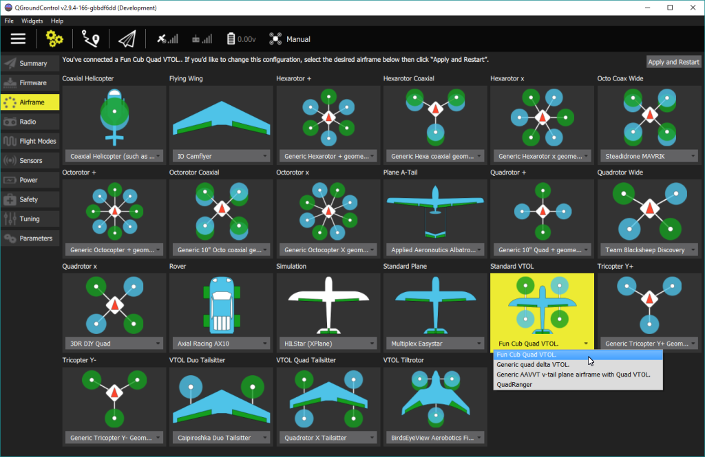

# 机架选择

## 空中飞行器

If you plan using PX4 for flying aircraft the most important question you should answer is, what will be the application. Is it for fun or for work, what is the planned flight times and coverage.

- If you need precision hovering and you don't mind shorter flight times then focus on **Multicopters**.
- For longer flights and larger areas of coverage you will need fixed wing aircraft i.e. **Airplanes**.
- There is even mixed type of aircraft called **VTOL** - Vertical Takeoff and Landing aircraft. It can take off in vertical mode like Multicopter and then transition in forward flight like Airplane.

The [airframe reference](../airframes/airframe_reference.md) lists frames that have been tuned for perfect flight with PX4.

Once you select and buy or assemble your air-frame you will have to preset it in *QGroundControl* with a template during the [Initial Setup process](../config/README.md).

<!-- 
### Types of VTOL

Depending on the way the VTOL flies in copter mode or how it makes the transition there are three main types of VTOL aircraft.

**Multicopter - Airplane** - Generic airplane with pusher/puller motor and separate motors for vertical thrust. The VTOL hovers with its vertical motors. The transition is done when the forward motors are enabled and after the plane reaches cruising speed the hover motors are disabled in horizontal flight.

**Tail-sitter** - Airplane with two or more motors that sits on its tail while landed, then in vertical flight it balances in vertical frame orientation. The transition is made when the whole airplane changes its orientation from vertical to horizontal.

**Tilt-rotor** - Airplane with two or more motors that mechanical swing around an Y axis. The transition is done when gradually the motors change the thrust vector from vertical to horizontal.

-->

## 地面车辆

## 海洋船只