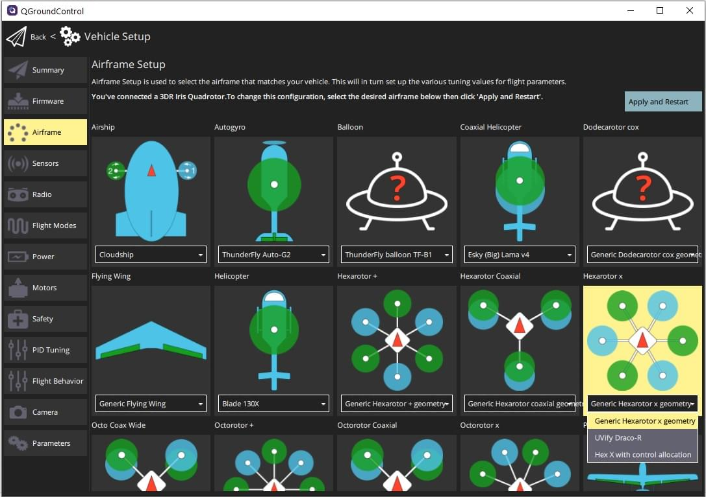

# 载具选择

PX4支持空中、地面、水面、水下载具。这里你可以查看所有经过测试和调试过的载具列表： [Airframe Reference](../airframes/airframe_reference.md).

根据需要选择框架：

- **多轴飞行器** 能够提供精确的悬停和垂直起飞，但代价是飞行时间较短且通常较慢。 PX4具有使它们易于飞行的模式，并且它们是最受欢迎的飞行载具类型。
- **固定翼飞机** 固定翼提供更长，更快的飞行，因此可以更好地进行地面测量等。但是，它们比多轴飞行器更难飞行和着陆，因此如果您需要悬停或缓慢飞行（比如进行垂直测量），则不适合使用。
- **垂直起降固定翼飞机** 垂直起降固定翼飞机有多种类型：倾转旋翼，尾推，四轴等。它们提供了两个方面的优势：像多轴飞行器一样在垂直模式下起飞，然后像固定翼飞机一样在向前飞行。它们通常比多轴飞行器和固定翼飞机都昂贵，并且难以制造和调试。
- **飞艇/气球** 比飞机轻的飞行器，通常提供高海拔长时间飞行，通常以有限的（或不控制）飞行速度和方向为代价。
- **漫游车** 类似汽车的地面载具。它们易于控制，使用起来常常很有趣。
- **船** 水面载具。
- **潜水艇** 水下载具。

:::注解
在* QGroundControl *的"initital setup"中配置PX4的载具设置：[Airframe setup](../config/airframe.md).

:::
