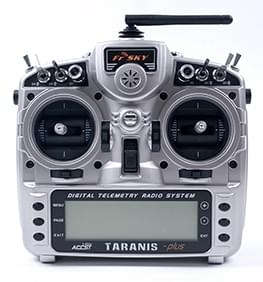

# 基本概念

本主题提供了无人机和使用 PX4 的基本介绍（主要面向新手用户，但对有经验的用户也是一个很好的介绍）。

如果你已经熟悉了基本概念，你可以转到 [基本组装](../assembly/README.md) 以了解如何连接特定的自驾仪硬件。 要加载固件并使用 *QGC 地面站* 设置飞行器，请查看 [基本配置](../config/README.md)。

## 无人机是什么？

无人机是无人驾驶的“机器人”设备，可以远程或自动控制。

无人机可被用于 [消费级、工业级、政府、军工应用](https://px4.io/ecosystem/commercial-systems/)。 这包括（非详尽）：航空摄影/录像，载货，竞速，搜索和测绘等。

> **Tip** 存在用于空中、地面、海洋和水下各种不同类型的无人机。 这些（更正式地）被称为无人驾驶飞行器（UAV），无人驾驶飞行器系统（UAS），无人驾驶地面车辆（UGV），无人驾驶水面船只（USV），无人驾驶水下潜航器（UUV）。

无人机的“大脑”被称为自动驾驶仪。 它由在 *载具控制器*（“飞行控制器”）硬件上运行的 *飞行栈* 软件组成。

## PX4 自动驾驶仪 {#autopilot}

[PX4](http://px4.io/) 是强大的开源自动驾驶仪 *飞行栈*。

PX4 的一些主要功能包括：

- 可控制[许多不同的设备机架/类型](../airframes/airframe_reference.md)，包括：飞机（多旋翼，固定翼和垂直起降），地面车辆和水下潜航器。 
- 适用于[设备控制器](#vehicle_controller)，传感器和其他外围设备的硬件选择。
- 灵活而强大的[飞行模式](#flight_modes)和[安全功能](#safety)。

PX4 是一个大型无人机平台的核心部分，它们都包括 [QGC 地面站](#qgc)，[Pixhawk 硬件](https://pixhawk.org/)，还有[MAVSDK](http://mavsdk.mavlink.io) 用于与机载计算机集成，相机还有其他使用 MAVLink 协议的硬件。 PX4 由 [Dronecode 项目](https://www.dronecode.org/) 支持。

## QGC 地面站 {#qgc}

Dronecode 地面控制站称为 [QGC 地面站](http://qgroundcontrol.com/)。 您可以使用* QGroundControl *将（闪存）PX4 加载到[飞行器控制硬件上](flight_controller_selection.md)，您可以设置飞行器，更改不同参数，获取实时飞行信息以及创建和执行完全自主的任务。

*QGroundControl* 可以在 Windows，Android，MacOS 或 Linux 上运行。 从 [这里](http://qgroundcontrol.com/downloads/) 下载并安装。

## 机体/飞行控制板 {#vehicle_controller}

PX4最初设计为在 [Pixhawk 系列](../flight_controller/pixhawk_series.md) 飞控上运行，但现在可以在 Linux 计算机和其他硬件上运行。 选择飞行控制板时，您应当考虑飞行器的物理尺寸限制，想要执行的活动，还有必不可少的成本。

更多信息，请参阅：[飞行控制器选择](flight_controller_selection.md)。

## 传感器

PX4 使用传感器来确定飞行器状态（稳定和启用自动控制所需）。 系统*最低要求 *陀螺仪，加速度计，磁力计（罗盘）和气压计。 需要 GPS 或其他定位系统来启用所有自动[模式](../getting_started/flight_modes.md#categories)和一些辅助模式。 固定翼和 VTOL 飞行器还应包括空速传感器（强烈推荐）。

有关详细信息，请参阅︰

- [传感器](../getting_started/sensor_selection.md) 
- [外设](../peripherals/README.md)

## 电调 & 电机

许多 PX4 无人机使用无刷电机，其由飞行控制器通过电子调速器（ESC）驱动（ESC将来自飞行控制器的信号转换为合适的功率水平，传递给电机）。

有关 PX4 支持的电调和电机的信息，请参阅：

- [电调 & 电机](../peripherals/esc_motors.md)
- [电调校准](../advanced_config/esc_calibration.md)
- [电调固件和协议概述](https://oscarliang.com/esc-firmware-protocols/)（oscarliang.com）

## 电池/电源

PX4 无人机通常由锂聚合物（LiPo）电池供电。 电池通常使用*电源模块 *或*电源管理板 *连接到系统，它为飞行控制器和 ESC（用于电动机）提供单独的动力。

有关电池和电池配置的信息，请参见[电池配置](../config/battery.md)和[基本组件](../assembly/README.md)（例如[ Pixhawk 4 接线快速入门>电源](../assembly/quick_start_pixhawk4.md#power)）。

## 无线电控制（遥控） {#rc_systems}

[遥控（RC）](../getting_started/rc_transmitter_receiver.md)系统用于 *手动* 控制机体。 它由一个遥控装置组成，使用发射机来与飞行器上的接收机通信。 一些 RC 系统还可以接自动驾驶仪传回的收遥测信息。

> **Note** PX4 在自主飞行模式中不需要遥控系统。

[遥控系统选择](../getting_started/rc_transmitter_receiver.md) 说明如何选择遥控系统。 其他相关主题包括：

- [遥控设置](../config/radio.md) - *QGC 地面站* 中的遥控配置。
- [飞行 101](../flying/basic_flying.md) - 学习如何使用遥控器飞行。
- [FrSky 数传](../peripherals/frsky_telemetry.md) - 设置遥控发射机以从 PX4 接收数传/状态更新。

## 地面站游戏手柄控制器 {#joystick}

通过 *QGC 地面站* 连接 [计算机游戏手柄](../config/joystick.md) 也可以用来手动控制 PX4（QGC 将游戏手柄的动作转换为 MAVLink 消息通过数传链接发送）。 This approach is used by ground control units that have an integrated ground control station, like the *UAVComponents* [MicroNav](https://www.uavcomp.com/command-control/micronav/) shown below. Joysticks are also commonly used to fly the vehicle in simulation.

## 安全开关 {#safety_switch}

It is common for vehicles to have a *safety switch* that must be engaged before the vehicle can be [armed](#arming) (when armed, motors are powered and propellers can turn). Commonly the safety switch is integrated into a GPS unit, but it may also be a separate physical component.

> **Note** A vehicle that is armed is potentially dangerous. The safety switch is an additional mechanism that prevents arming from happening by accident.

## 数传电台

[数传电台](../telemetry/README.md) 可以在诸如 *QGC 地面站* 与运行 PX4 的机体之间提供无线 MAVLink 连接。 This makes it possible to tune parameters while a vehicle is in flight, inspect telemetry in real-time, change a mission on the fly, etc.

## Offboard/机载计算机

PX4 can be controlled from a separate on-vehicle companion computer via a serial cable or wifi. The companion computer will usually communicate using a MAVLink API like the MAVSDK or MAVROS.

> **Note** Using a Robotics API requires software development skills, and is outside the scope of this guide.

- [Offboard 模式](../flight_modes/offboard.md) - 用于从地面站或机载计算机对 PX4 进行 Offboard 控制的飞行模式。 
- [机器人 API](https://dev.px4.io/master/en/robotics/)（PX4开发人员指南）

## SD卡（可移除储存器） {#sd_cards}

PX4 uses SD memory cards for storing [flight logs](../getting_started/flight_reporting.md), and they are also required in order to use UAVCAN peripherals and fly [missions](../flying/missions.md).

By default, if no SD card is present PX4 will play the [format failed (2-beep)](../getting_started/tunes.md#format-failed) tune twice during boot (and none of the above features will be available).

> **Tip** Pixhawk 飞控板支持的最大 SD 卡大小为 32 GB 。 [强烈推荐使用](https://dev.px4.io/master/en/log/logging.html#sd-cards) SanDisk Extreme U3 32GB（开发者指南）。

SD cards are never-the-less optional. Flight controllers that do not include an SD Card slot may:

- Disable notification beeps are disabled using the parameter [CBRK_BUZZER](../advanced_config/parameter_reference.md#CBRK_BUZZER).
- [Stream logs](https://dev.px4.io/master/en/log/logging.html#log-streaming) to another component (companion).
- Store missions in RAM/FLASH. <!-- Too low-level for this. But see FLASH_BASED_DATAMAN in  Intel Aero: https://github.com/PX4/Firmware/blob/master/boards/intel/aerofc-v1/src/board_config.h#L115 -->

## 解锁和加锁 {#arming}

Vehicles may have moving parts, some of which are potentially dangerous when powered (in particular motors and propellers)!

To reduce the chance of accidents:

- PX4 vehicles are *disarmed* (unpowered) when not in use, and must be explicitly *armed* before taking off.
- Some vehicles additionally require a [safety switch](../getting_started/px4_basic_concepts.md#safety_switch) be disengaged before arming can succeed.
- Arming is prevented if the vehicle is not in a "healthy" state.
- A vehicle will also usually revert to the disarmed state after landing or if a pilot does not take off quickly enough.

Arming is triggered by default (Mode 2 transmitters) by holding the RC throttle/yaw stick on the *bottom right* for one second (to disarm, hold stick on bottom left). It is also possible to configure PX4 to arm using an RC button on the RC control (and arming commands can be sent from a ground station).

A detailed overview of arming and arming configuration can be found here: [Prearm, Arm, Disarm Configuration](../advanced_config/prearm_arm_disarm.md).

## 飞行模式 {#flight_modes}

飞行模式为用户（飞手）提供不同类型/级别的飞行器自动化和自动驾驶辅助。 自主模式完全由自驾仪控制，无需飞手/遥控输入。 例如，它们可用于自动执行诸如起飞，返回 Home 点和着陆等常见任务。 其他自主模式执行预编程任务，跟随 GPS 信标，或接受来自机载计算机或地面站的命令。

*手动模式* 由用户（通过遥控控制杆/手柄）在自驾仪的协助下实现控制。 不同的手动模式可以实现不同的飞行特性 - 例如，某些模式可以实现特技动作，而其他模式则无法翻转并且会抗风以保持位置/航向。

> **Tip** 并非所有的飞行模式都适用于所有飞行器，并且某些模式只能在满足特定条件时使用（例如，许多模式需要全局位置估计）。

可用飞行模式的概述 [可在这里找到](../getting_started/flight_modes.md)。 [飞行模式配置](../config/flight_mode.md) 中提供了有关如何设置遥控开关以打开不同飞行模式的说明。

## 安全设置（故障保护） {#safety}

PX4 具有可配置的故障安全系统，可在出现问题时保护和挽回您的飞行器！ 这些允许您指定可以安全飞行的区域和条件，以及触发故障保护时将执行的操作（例如，着陆、保持位置或返回指定点）。

> **Note** You can only specify the action for the *first* failsafe event. Once a failsafe occurs the system will enter special handling code, such that subsequent failsafe triggers are managed by separate system level and vehicle specific code.

主要的故障保护范围如下：

- Low Battery 低电量
- Remote Control (RC) Loss 遥控信号丢失
- Position Loss 位置信息丢失（全局位置估计质量太低）
- Offboard Loss 机载计算机控制指令丢失（如与机载计算机失去连接）
- Data Link Loss 数传信号丢失（如失去与地面站的数传连接）
- Geofence Breach 超出地理围栏 (限制飞行器在虚拟圆柱体内飞行)
- Mission Failsafe 任务故障保护（防止先前的任务在新的起飞地点运行）
- Traffic avoidance 交通避障（由来自如 ADS-B 转发器的数据触发）

有关详细信息，请参阅：[安全性](../config/safety.md)（基本配置）。

## 朝向与航向

所有车辆，船只和飞机都具有朝向或基于其前进运动的航向。

知道机体朝向，以使自驾仪与设备运动矢量对齐是重要的。 即使多旋翼从各个方向都对称，但其也有朝向！ 通常制造商使用彩色螺旋桨或带颜色的机臂来表示朝向。

在我们的插图中，我们将使用红色的前螺旋桨来显示多旋翼的朝向。

您可以在 [飞行控制器方向](../config/flight_controller_orientation.md) 中深入了解朝向。