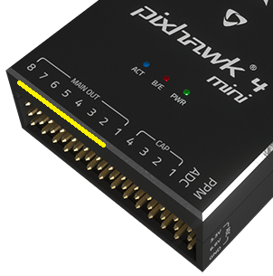

# 基本概念

本主题提供了无人机和使用 PX4 的基本介绍（主要面向新手用户，但对有经验的用户也是一个很好的介绍）。

如果你已经熟悉了基本概念，你可以转到 [基本组装](../assembly/README.md) 以了解如何连接特定的自驾仪硬件。 要加载固件并使用 *QGC 地面站* 设置飞行器，请查看 [基本配置](../config/README.md)。

## 无人机是什么？

无人机是无人驾驶的“机器人”设备，可以远程或自动控制。

无人机可被用于 [消费级、工业级、政府、军工应用](https://px4.io/ecosystem/commercial-systems/)。 这包括（非详尽）：航空摄影/录像，载货，竞速，搜索和测绘等。

:::tip
不同类型的无人机可用于空中、地面、海上和水下。 这些（更正式地）被称为无人驾驶飞行器（UAV），无人驾驶飞行器系统（UAS），无人驾驶地面车辆（UGV），无人驾驶水面船只（USV），无人驾驶水下潜航器（UUV）。
:::

无人机的“大脑”被称为自动驾驶仪。 它由 *载具控制器*（“飞行控制器”）硬件和运行其上的 *飞行栈* 软件组成。

## PX4 自动驾驶仪

[PX4](https://px4.io/) is powerful open source autopilot *flight stack*.

PX4 的一些主要功能包括：

- 可控制[许多不同的设备机架/类型](../airframes/airframe_reference.md)，包括：飞机（多旋翼，固定翼和垂直起降），地面车辆和水下潜航器。 
- 适用于[设备控制器](#vehicle_controller)，传感器和其他外围设备的硬件选择。
- 灵活而强大的[飞行模式](#flight_modes)和[安全功能](#safety)。

PX4 是一个大型无人机平台的核心部分，它们都包括 [QGC 地面站](#qgc)，[Pixhawk 硬件](https://pixhawk.org/)，还有[MAVSDK](http://mavsdk.mavlink.io) 用于与机载计算机集成，相机还有其他使用 MAVLink 协议的硬件。 PX4 由 [Dronecode 项目](https://www.dronecode.org/) 支持。

## QGroundControl

Dronecode 地面控制站称为 [QGC 地面站](http://qgroundcontrol.com/)。 您可以使用*QGroundControl* 将PX4 加载（烧写）到[飞行器控制硬件上](flight_controller_selection.md)，您可以设置飞行器，更改不同参数，获取实时飞行信息以及创建和执行完全自主的任务。

*QGroundControl* 可以在 Windows，Android，MacOS 或 Linux 上运行。 从 [这里](http://qgroundcontrol.com/downloads/) 下载并安装。

## 机体/飞行控制板

PX4最初设计为在 [Pixhawk 系列](../flight_controller/pixhawk_series.md) 飞控上运行，但现在可以在 Linux 计算机和其他硬件上运行。 选择飞行控制板时，您应当考虑飞行器的物理尺寸限制，想要执行的活动，还有必不可少的成本。

更多信息，请参阅：[飞行控制器选择](flight_controller_selection.md)。

## 传感器

PX4 使用传感器来确定飞行器状态（稳定和启用自动控制所需）。 系统*最低要求 *陀螺仪，加速度计，磁力计（罗盘）和气压计。 需要 GPS 或其他定位系统来启用所有自动[模式](../getting_started/flight_modes.md#categories)和一些辅助模式。 固定翼和 VTOL 飞行器还应包括空速传感器（强烈推荐）。

有关详细信息，请参阅︰

- [传感器](../getting_started/sensor_selection.md) 
- [外设](../peripherals/README.md)

## 输出:电机，舵机，执行器

PX4使用*输出*来控制:电机速度(例如通过[ESC](#esc_and_motors))，飞行平面如副翼和襟翼，相机触发器，降落伞，抓手，和许多其他类型的有效载荷。

例如，下面的图像显示 [Pixhawk 4](../flight_controller/pixhawk4.md) 和 [Pixhawk 4 mini](../flight_controller/pixhawk4_mini.md) 的 PWM 输出端口。

 

输出分为 `MAIN` 和 `AUX`，并单独编号(`MAINn` 和 `AUXn`, `n` 通常是从1到6或8)。

:::tip
每个输出的特定目的是在每个机身的基础上硬编码的。 所有机架的输出映射都在 [机架参考](../airframes/airframe_reference.md) 中。
:::

:::warning
飞行控制器可能只有`MAIN` 输出， (比如 *Pixhawk 4 Mini*)，也可能只有6个`MAIN` 或 `AUX`输出。 确保您选择的控制器有足够的端口/输出接口适应您的[机身](../airframes/airframe_reference.md)。
:::

通常情况下， `MAIN` 端口用于核心飞行控制。 `AUX` 用于非关键执行器/载荷（但是，比如VTOL机型，如果 `MAIN`没有足够的接口， `AUX`也可能用来做飞行控制）。 例如, [通用四旋翼](../airframes/airframe_reference.md#copter_quadrotor_x_generic_quadcopter) 用 `MAIN` 输出的 1-4 来控制电机，其余的 `MAIN` 和`AUX` 输出可以用来做 RC 透传。

[飞行控制器](#vehicle_controller) 上的实际输出端口/总线取决于硬件和 PX4 配置。 *通常* 端口像如上所示的被映射为PWM输出，丝印一般为 `MAIN OUT` and `AUX OUT`。

它们也可能被标记为 `FMU PWM OUT` 或 `IO PWM Out` (或类似)。 Pixhawk 控制器又一个 "主" FMU 和*可能存在的* 独立的 IO 板。 如果有IO 板, `AUX` 端口直接连接到 FMU 和 `MIAN` 端口连接到IO板。 否则， `MAIN` 端口已连接到FMU，没有 `AUX` 端口。 FMU输出端口可以使用 [D-shot](../peripherals/dshot.md) 或 *One-shot* 协议 (当然也有 PWM), 它们的延迟低很多。 这对于需要更好性能的穿越机和其他机体来说是有用的。

输出端口也可以映射到 UAVCAN节点 (例如，UAVCAN [电机控制器](../peripherals/uavcan_escs.md))。 在这种情况下使用(相同的)输出到节点的机架映射。

**备注：**

- `MAIN` 和 `AUX` 中仅有6-8个输出，因为大多数飞行控制器只有这么多的 PWM/Dshot/Oneshot 输出。 理论上来说，如果总线支持，可以有更多的输出（比如UAVCAN就不限于这几个节点）。

## 电调 & 电机

许多 PX4 无人机使用无刷电机，其由飞行控制器通过电子调速器（ESC）驱动（ESC将来自飞行控制器的信号转换为合适的功率水平，传递给电机）。

有关 PX4 支持的电调和电机的信息，请参阅：

- [电调 & 电机](../peripherals/esc_motors.md)
- [电调（ESC）校准](../advanced_config/esc_calibration.md)
- [电调固件和协议概述](https://oscarliang.com/esc-firmware-protocols/)（oscarliang.com）

## 电池/电源

PX4 无人机通常由锂聚合物（LiPo）电池供电。 电池通常使用*电源模块 *或*电源管理板 *连接到系统，它为飞行控制器和 ESC（用于电动机）提供单独的动力。

有关电池和电池配置的信息，请参见[电池配置](../config/battery.md)和[基本组件](../assembly/README.md)（例如[ Pixhawk 4 接线快速入门>电源](../assembly/quick_start_pixhawk4.md#power)）。

## 无线电控制（遥控）

[遥控（RC）](../getting_started/rc_transmitter_receiver.md)系统用于 *手动* 控制机体。 它由一个遥控装置组成，使用发射机来与飞行器上的接收机通信。 一些 RC 系统还可以接自动驾驶仪传回的收遥测信息。

:::note PX4 在自主飞行模式中不需要遥控系统。
:::

[遥控系统选择](../getting_started/rc_transmitter_receiver.md) 说明如何选择遥控系统。 其他相关主题包括：

- [遥控设置](../config/radio.md) - *QGC 地面站* 中的遥控配置。
- [飞行 101](../flying/basic_flying.md) - 学习如何使用遥控器飞行。
- [FrSky 数传](../peripherals/frsky_telemetry.md) - 设置遥控发射机以从 PX4 接收数传/状态更新。

## 地面站游戏手柄控制器

通过*QGroundControl*连接的[游戏手柄](../config/joystick.md)也可以用来手动控制PX4 (QGC将操纵杆的运动转换为通过遥测链路发送的MAVLink消息)。 这种方法被一些集成了地面站的地面端遥控器所使用的，如 *Auterion* [Skynav](https://auterion-gs.com/skynav/) or *UAVComponents* [MicroNav](https://www.uavcomp.com/command-control/micronav/)。 游戏手柄也经常被用于无人机的飞行仿真中。

## 安全开关

机体通常必须有一个 *安全开关*，然后才能使用 [解锁](#arming)（解锁后，电机会供电，螺旋桨开始旋转）。 通常，安全开关被整合到GPS设备中，但也可能是一个单独的物理组件。

:::warning
解锁后的机体是有潜在危险的。 安全开关是防止意外解锁发生的一个附加机制。
:::

## 数传电台

[数传电台](../telemetry/README.md) 可以在诸如 *QGC 地面站* 与运行 PX4 的机体之间提供无线 MAVLink 连接。 这使得飞机飞行中调试参数、实时检查遥测信息、更改任务等等成为了可能。

## 机载计算机

PX4 可以通过串行接线或 WiFi 由独立的机载伴飞计算机进行控制。 机载计算机通常使用 MAVLink API（如 MAVSDK 或 MAVROS）进行通信。

有关主题包括:

- [Offboard 模式](../flight_modes/offboard.md) - 用于从地面站或机载计算机对 PX4 进行 Offboard 控制的飞行模式。 
- [Robotics APIs](../robotics/README.md)

## SD卡（可移除储存器）

PX4 使用 SD 储存卡存储 [飞行日志](../getting_started/flight_reporting.md)，而且还需要内存卡才能使用 UAVCAN 外围设备，运行 [飞行任务](../flying/missions.md)。

默认情况下，如果没有 SD 卡，PX4 将在启动时播放 [格式化失败（2-声短响）](../getting_started/tunes.md#format-failed) 两次（且上述需要储存卡的功能都不可用）。

:::tip
Pixhawk 飞控板支持的最大 SD 卡大小为 32 GB 。 [强烈推荐](../dev_log/logging.md#sd-cards)使用*SanDisk Extreme U3 32GB* 。
:::

SD 卡在某些情况下也是可选的。 不包含 SD 卡槽的飞行控制器可以：

- 使用参数 [CBRK_BUZZER](../advanced_config/parameter_reference.md#CBRK_BUZZER) 禁用通知蜂鸣器。
- [推流日志](../dev_log/logging.md#log-streaming) 到另一个组件（机载计算机）。
- 在 RAM/FLASH 中储存任务。<!-- Too low-level for this. But see FLASH_BASED_DATAMAN in  Intel Aero: https://github.com/PX4/PX4-Autopilot/blob/master/boards/intel/aerofc-v1/src/board_config.h#L115 -->

## 解锁和加锁

机体是有可活动的部件的，其中一些在通电后会有潜在的危险性（特别是电机和螺旋桨）！

为了减少事故概率：

- 当不在使用时， PX4 机体是 *加锁状态的*（未供电的），必须在起飞前进行 *解锁*。
- A vehicle will automatically disarm if a pilot does not take off quickly enough, and after landing (the disarm time is configurable).
- Some vehicles also have a [safety switch](#safety_switch) that must be disengaged before arming can succeed (often this switch is part of the GPS).
- Arming is prevented if the vehicle is not in a "healthy" state.
- Arming is prevented if a VTOL vehicle is in fixed-wing mode ([by default](../advanced_config/parameter_reference.md#CBRK_VTOLARMING)).

解锁默认情况下（美国手发射机）可以通过保持遥控油门+ YAW 摇杆到*右下角*一秒钟来解锁，要想加锁，则保持摇杆在左下角。 还可以使用遥控上的按钮来配置 PX4 解锁（也可以从地面站发送解锁命令）。

还有更细节的解锁和加锁的配置的详细解读可以在这里找到：[预解锁，解锁，加锁配置](../advanced_config/prearm_arm_disarm.md)。 

## 飞行模式

飞行模式为用户（飞手）提供不同类型/级别的飞行器自动化和自动驾驶辅助。 自主模式完全由自驾仪控制，无需飞手/遥控输入。 例如，它们可用于自动执行诸如起飞，返回 Home 点和着陆等常见任务。 其他自主模式执行预编程任务，跟随 GPS 信标，或接受来自机载计算机或地面站的命令。

*手动模式* 由用户（通过遥控控制杆/手柄）在自驾仪的协助下实现控制。 不同的手动模式可以实现不同的飞行特性 - 例如，某些模式可以实现特技动作，而其他模式则无法翻转并且会抗风以保持位置/航向。

:::tip
并非所有的飞行模式都适用于所有飞行器，并且某些模式只能在满足特定条件时使用（例如，许多模式需要全局位置估计）。
:::

可用飞行模式的概述可在 [这里](../getting_started/flight_modes.md)找到。 [飞行模式配置 ](../config/flight_mode.md)中提供了有关如何设置遥控开关以打开不同飞行模式的说明。

## 安全设置（故障保护）

PX4 具有可配置的故障安全系统，可在出现问题时保护和挽回您的飞行器！ 这些允许您指定可以安全飞行的区域和条件，以及触发故障保护时将执行的操作（例如，着陆、保持位置或返回指定点）。

:::note
您只能为 *第一个* 故障保护事件指定操作。 一旦发生故障保护，系统将执行特殊处理代码，以便后续故障保护触发器由单独的系统层级和飞行器特定代码管理。
:::

主要的故障保护事件如下：

- 低电量
- 遥控(RC) 信号丢失
- 位置信息丢失（全局位置估计质量太低）
- 机载计算机控制指令丢失（如与机载计算机失去连接）
- 数传信号丢失（如失去与 GCS 的遥测连接）
- 超出地理围栏 (限制飞行器在虚拟圆柱体内飞行)。
- 任务故障保护（防止先前的任务在新的起飞地点运行）。
- 交通避障（由来自如 ADS-B 转发器的数据触发）。

有关详细信息，请参阅：[安全](../config/safety.md)（基本配置）。

## 航向和运动方向

所有车辆，船只和飞机都具有航向（机头朝向）或基于其前进运动的方向。

:::note
对于 VTOL Tailsitter 机头朝向是与多旋翼配置相关的(比如无人机在起飞，悬停，降落时的姿态)。
:::

知道机体朝向，以使自驾仪与设备运动矢量对齐是重要的。 即使多旋翼从各个方向都对称，但其也有朝向！ 通常制造商使用彩色螺旋桨或带颜色的机臂来表示朝向。

在我们的插图中，我们将使用红色的前螺旋桨来显示多旋翼的航向。

您可以在 [飞行控制器方向](../config/flight_controller_orientation.md) 中深入了解朝向。