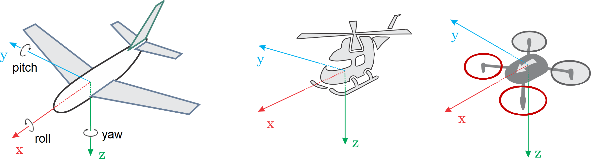

# 基本概念

本主题提供了无人机和使用 PX4 的基本介绍（主要面向新手用户，但对有经验的用户也是一个很好的介绍）。

如果你已经熟悉了基本概念，你可以转到 [基本组装](../assembly/README.md) 以了解如何连接特定的自驾仪硬件。 要加载固件并使用 *QGC 地面站* 设置飞行器，请查看 [基本配置](../config/README.md)。

## 无人机是什么？

无人机是无人驾驶的“机器人”设备，可以远程或自动控制。

无人机可被用于 [消费级、工业级、政府、军工应用](https://px4.io/ecosystem/commercial-systems/)。 这包括（非详尽）：航空摄影/录像，载货，竞速，搜索和测绘等。

:::tip
不同类型的无人机可用于空中、地面、海上和水下。 这些（更正式地）被称为无人驾驶飞行器（UAV），无人驾驶飞行器系统（UAS），无人驾驶地面车辆（UGV），无人驾驶水面船只（USV），无人驾驶水下潜航器（UUV）。
:::

无人机的“大脑”被称为自动驾驶仪。 它由 *载具控制器*（“飞行控制器”）硬件和运行其上的 *飞行栈* 软件组成。

## PX4 自动驾驶仪

[PX4](https://px4.io/)是强大的开源自动驾驶*飞行栈*。

PX4的一些主要功能包括：

- 可控制[许多不同的设备机架/类型](../airframes/airframe_reference.md)，包括：飞机（多旋翼，固定翼和垂直起降），地面车辆和水下潜航器。 
- 适用于[设备控制器](#vehicle-flight-controller-board)，传感器和其他外围设备的硬件选择。
- 灵活而强大的[飞行模式](#flight-modes)和[安全功能](#safety-settings-failsafe)。

PX4是一个大型无人机平台的核心部分，整个平台包括了[QGroundControl](#qgroundcontrol)地面站，[Pixhawk硬件设备](https://pixhawk.org/)，以及[MAVSDK](http://mavsdk.mavlink.io)用于集成记载计算机，相机和其他使用MAVLink协议的硬件设备。 PX4 由 [Dronecode 项目](https://www.dronecode.org/) 支持。

## QGroundControl

Dronecode 地面控制站称为 [QGC 地面站](http://qgroundcontrol.com/)。 您可以使用*QGroundControl*将PX4加载（闪存）到[飞行器控制硬件](flight_controller_selection.md)中，您可以设置飞行器，修改不同的参数，获取实时飞行信息，创建并执行全自主任务。

*QGroundControl*可以在Windows，安卓，MacOS或Linux平台上运行。 从[这里](http://qgroundcontrol.com/downloads/)下载并安装。

## 机体/飞行控制板

PX4最初设计用于在[Pixhawk系列](../flight_controller/pixhawk_series.md)飞控上运行，但是现在可以在Linux计算机或者其他硬件上运行。 在选择飞控板时你应当考虑飞机的物理尺寸限制、想要进行的活动，当然还需要考虑成本。

更多信息，请参阅[飞行控制器选择](flight_controller_selection.md)。

## 传感器

PX4使用传感器确定机体状态（这是稳定和启动自动控制所必须的）。 该系统*最低要求*为一套陀螺仪，加速度计，磁力计（罗盘）和气压计。 GPS和其他定位系统是启用所有的自动[模式](../getting_started/flight_modes.md#categories)以及部分辅助模式所必须的。 固定翼和 VTOL 飞行器还应包括空速传感器（强烈推荐）。

更多信息请参阅：

- [传感器](../getting_started/sensor_selection.md) 
- [外设](../peripherals/README.md)

## 输出:电机，舵机，执行器

PX4使用*输出*来控制：电机转速（例如通过[ECS（电调）](#escs-motors)），飞行器表面如副翼和襟翼，相机快门，降落伞，抓手以及多种其他类型的有效载荷。

输出可能是PWM端口或映射到UAVCAN节点（例如，UAVCAN[电机控制器](../peripherals/uavcan_escs.md)）。 The same airframe mapping of outputs to nodes is used in both cases case.

下面的图片显示了[Pixhawk 4](../flight_controller/pixhawk4.md)和[Pixhawk 4 Mini](../flight_controller/pixhawk4_mini.md)的PWM输出端口。

 

输出分为 `MAIN` 和 `AUX`，并单独编号(`MAINn` 和 `AUXn`, `n` 通常是从1到6或8)。

:::tip
每个输出的特定目的是在每个机身的基础上硬编码的。 所有机架的输出映射都在 [机架参考](../airframes/airframe_reference.md) 中。
:::

:::warning
每个飞行控制器可能只有`MAIN`PWM输出（例如*Pixhawk 4 Mini*），也可能只有6个`MIAN`或`AUX`输出。 Ensure that you select a controller that has enough of the right types of ports/outputs for your [airframe](../airframes/airframe_reference.md).
:::

Typically the `MAIN` port is used for core flight controls while `AUX` is used for non-critical actuators/payloads (though `AUX` may be used for flight controls if there aren't enough `MAIN` ports for the vehicle type- e.g. VTOL). For example, in a [Generic Quadcopter](../airframes/airframe_reference.md#copter_quadrotor_x_generic_quadcopter) the `MAIN` outputs 1-4 are used for corresponding motors, while the remaining `MAIN` and some `AUX` outputs are used for RC passthrough.

The actual ports/bus used for the outputs on the [flight controller](#vehicle_controller) depends on the hardware and PX4 configuration. *Usually* the ports are mapped to PWM outputs as shown above, which are commonly screen printed `MAIN OUT` and `AUX OUT`.

They might also be marked as `FMU PWM OUT` or `IO PWM Out` (or similar). Pixhawk controllers have a "main" FMU board and *may* have a separate IO board. If there is an IO board, the `AUX` ports are connected directly to the FMU and the `MAIN` ports are connected to the IO board. Otherwise the `MAIN` ports are connected to the FMU, and there are no `AUX` ports. The FMU output ports can use [D-shot](../peripherals/dshot.md) or *One-shot* protocols (as well as PWM), which provide much lower-latency behaviour. This can be useful for racers and other airframes that require better performance.

**Notes:**

- `MAIN` 和 `AUX` 中仅有6-8个输出，因为大多数飞行控制器只有这么多的 PWM/Dshot/Oneshot 输出。 理论上来说，如果总线支持，可以有更多的输出（比如UAVCAN就不限于这几个节点）。

## 电调 & 电机

Many PX4 drones use brushless motors that are driven by the flight controller via an Electronic Speed Controller (ESC) (the ESC converts a signal from the flight controller to an appropriate level of power delivered to the motor).

For information about what ESC/Motors are supported by PX4 see:

- [电调 & 电机](../peripherals/esc_motors.md)
- [电调（ESC）校准](../advanced_config/esc_calibration.md)
- [电调固件和协议概述](https://oscarliang.com/esc-firmware-protocols/)（oscarliang.com）

## 电池/电源

PX4 drones are mostly commonly powered from Lithium-Polymer (LiPo) batteries. The battery is typically connected to the system using a *Power Module* or *Power Management Board*, which provide separate power for the flight controller and to the ESCs (for the motors).

Information about batteries and battery configuration can be found in [Battery Configuration](../config/battery.md) and the guides in [Basic Assembly](../assembly/README.md) (e.g. [Pixhawk 4 Wiring Quick Start > Power](../assembly/quick_start_pixhawk4.md#power)).

## 无线电控制（遥控）

A [Radio Control \(RC\)](../getting_started/rc_transmitter_receiver.md) system is used to *manually* control the vehicle. It consists of a remote control unit that uses a transmitter to communicate stick/control positions with a receiver based on the vehicle. Some RC systems can additionally receive telemetry information back from the autopilot.

:::note PX4 does not require a remote control system for autonomous flight modes.
:::

[RC System Selection](../getting_started/rc_transmitter_receiver.md) explains how to choose an RC system. Other related topics include:

- [遥控设置](../config/radio.md) - *QGC 地面站* 中的遥控配置。
- [飞行 101](../flying/basic_flying.md) - 学习如何使用遥控器飞行。
- [FrSky 数传](../peripherals/frsky_telemetry.md) - 设置遥控发射机以从 PX4 接收数传/状态更新。

## 地面站游戏手柄控制器

A [computer joystick](../config/joystick.md) connected through *QGroundControl* can also be used to manually control PX4 (QGC converts joystick movements into MAVLink messages that are sent over the telemetry link). This approach is used by ground control units that have an integrated ground control station, like the *Auterion* [Skynav](https://auterion-gs.com/skynav/) or *UAVComponents* [MicroNav](https://www.uavcomp.com/command-control/micronav/). Joysticks are also commonly used to fly the vehicle in simulation.

## 安全开关

It is common for vehicles to have a *safety switch* that must be engaged before the vehicle can be [armed](#arming-and-disarming) (when armed, motors are powered and propellers can turn). Commonly the safety switch is integrated into a GPS unit, but it may also be a separate physical component.

:::warning
A vehicle that is armed is potentially dangerous. The safety switch is an additional mechanism that prevents arming from happening by accident.
:::

## 数传电台

[Data/Telemetry Radios](../telemetry/README.md) can provide a wireless MAVLink connection between a ground control station like *QGroundControl* and a vehicle running PX4. This makes it possible to tune parameters while a vehicle is in flight, inspect telemetry in real-time, change a mission on the fly, etc.

## 机载计算机

PX4 can be controlled from a separate on-vehicle companion computer via a serial cable or wifi. The companion computer will usually communicate using a MAVLink API like the MAVSDK or MAVROS.

Relevent topics include:

- [Offboard 模式](../flight_modes/offboard.md) - 用于从地面站或机载计算机对 PX4 进行 Offboard 控制的飞行模式。 
- [Robotics APIs](../robotics/README.md)

## SD卡（可移除储存器）

PX4 uses SD memory cards for storing [flight logs](../getting_started/flight_reporting.md), and they are also required in order to use UAVCAN peripherals and fly [missions](../flying/missions.md).

By default, if no SD card is present PX4 will play the [format failed (2-beep)](../getting_started/tunes.md#format-failed) tune twice during boot (and none of the above features will be available).

:::tip
The maximum supported SD card size on Pixhawk boards is 32GB. The *SanDisk Extreme U3 32GB* is [highly recommended](../dev_log/logging.md#sd-cards).
:::

SD cards are never-the-less optional. Flight controllers that do not include an SD Card slot may:

- 使用参数 [CBRK_BUZZER](../advanced_config/parameter_reference.md#CBRK_BUZZER) 禁用通知蜂鸣器。
- [推流日志](../dev_log/logging.md#log-streaming) 到另一个组件（机载计算机）。
- 在 RAM/FLASH 中储存任务。<!-- Too low-level for this. But see FLASH_BASED_DATAMAN in  Intel Aero: https://github.com/PX4/PX4-Autopilot/blob/master/boards/intel/aerofc-v1/src/board_config.h#L115 -->

## 解锁和加锁

Vehicles may have moving parts, some of which are dangerous when powered (in particular motors and propellers)!

To reduce accidents, PX4 defines three power states:

- **Disarmed:** All motors and actuators are unpowered.
- **Prearmed:** Motors are unpowered, but actuators are not (allowing non-dangerous actuators to be bench-tested).
- **Armed:** Motors and other actuators are powered, and propellers may be spinning. 

Vehicles are *armed* only when necessary. Some vehicles may even have a [safety switch](#safety-switch) that must be disengaged before arming can succeed (often this switch is part of the GPS).

By default:

- Vehicles are *disarmed* (unpowered) when not in use, and must be explicitly *armed* before taking off.
- Vehicles automatically disarm if a pilot does not take off quickly enough (the disarm time is configurable).
- Vehicles automatically disarm after landing (the disarm time is configurable).
- Arming is prevented if the vehicle is not in a "healthy" state.
- Arming is prevented if a VTOL vehicle is in fixed-wing mode ([by default](../advanced_config/parameter_reference.md#CBRK_VTOLARMING)).
- Prearming may be used safely bench-test actuators, while still keeping motors unpowered.

Arming is triggered by default (Mode 2 transmitters) by holding the RC throttle/yaw stick on the *bottom right* for one second (to disarm, hold stick on bottom left). It is alternatively possible to configure PX4 to arm using an RC switch or button (and arming MAVLink commands can also be sent from a ground station).

A detailed overview of arming and disarming configuration can be found here: [Prearm, Arm, Disarm Configuration](../advanced_config/prearm_arm_disarm.md).

## 飞行模式

Flight modes provide different types/levels of vehicle automation and autopilot assistance to the user (pilot). *Autonomous modes* are fully controlled by the autopilot, and require no pilot/remote control input. These are used, for example, to automate common tasks like takeoff, returning to the home position, and landing. Other autonomous modes execute pre-programmed missions, follow a GPS beacon, or accept commands from an offboard computer or ground station.

*Manual modes* are controlled by the user (via the RC control sticks/joystick) with assistance from the autopilot. Different manual modes enable different flight characteristics - for example, some modes enable acrobatic tricks, while others are impossible to flip and will hold position/course against wind.

:::tip
Not all flight modes are available on all vehicle types, and some modes can only be used when specific conditions have been met (e.g. many modes require a global position estimate).
:::

An overview of the available flight modes [can be found here](../getting_started/flight_modes.md). Instructions for how to set up your remote control switches to turn on different flight modes is provided in [Flight Mode Configuration](../config/flight_mode.md).

## 安全设置（故障保护）

PX4 has configurable failsafe systems to protect and recover your vehicle if something goes wrong! These allow you to specify areas and conditions under which you can safely fly, and the action that will be performed if a failsafe is triggered (for example, landing, holding position, or returning to a specified point).

:::note
You can only specify the action for the *first* failsafe event. Once a failsafe occurs the system will enter special handling code, such that subsequent failsafe triggers are managed by separate system level and vehicle specific code.
:::

The main failsafe areas are listed below:

- Low Battery
- Remote Control (RC) Loss
- Position Loss (global position estimate quality is too low).
- Offboard Loss (e.g. lose connection to companion computer)
- Data Link Loss (e.g. lose telemetry connection to GCS).
- Geofence Breach (restrict vehicle to flight within a virtual cylinder).
- Mission Failsafe (prevent a previous mission being run at a new takeoff location).
- Traffic avoidance (triggered by transponder data from e.g. ADSB transponders).

For more information see: [Safety](../config/safety.md) (Basic Configuration).

## 航向和运动方向

All the vehicles, boats and aircraft have a heading direction or an orientation based on their forward motion.

:::note
For a VTOL Tailsitter the heading is relative to the multirotor configuration (i.e. vehicle pose during takeoff, hovering, landing).
:::

It is important to know the vehicle heading direction in order to align the autopilot with the vehicle vector of movement. Multicopters have a heading even when they are symmetrical from all sides! Usually manufacturers use a colored props or colored arms to indicate the heading.

In our illustrations we will use red coloring for the front propellers of multicopter to show heading.

You can read in depth about heading in [Flight Controller Orientation](../config/flight_controller_orientation.md)