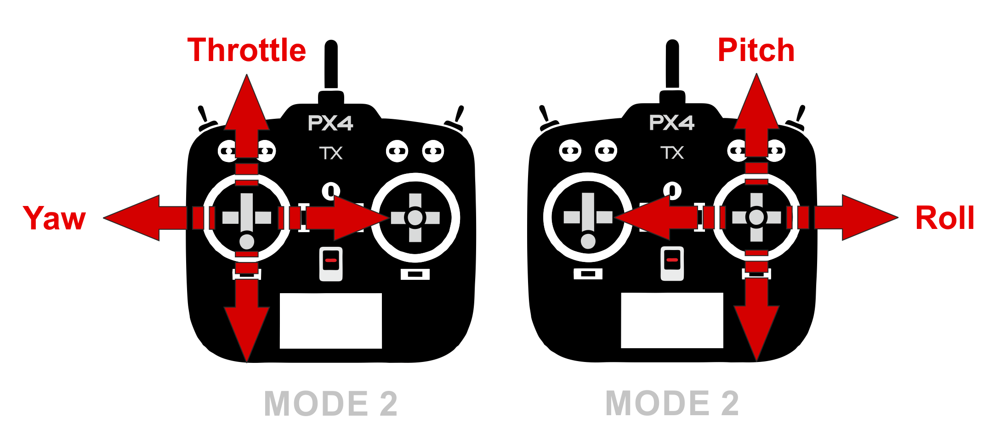

# 遥控系统

如果你想用一个手持发射机 *手动* 控制你的飞机，那么你需要一个遥控系统（简称RC）。 这个章节解释了一些关于 RC 如何工作，如何为你的飞行器（车辆）选择一个合适的无线电系统和怎么连接到飞控。

:::tip PX4 在自动飞行模式可以不需要遥控器。 可以在[参数设置](../advanced_config/parameters.md)里禁用遥控器检查: [COM_RC_IN_MODE](../advanced_config/parameter_reference.md#COM_RC_IN_MODE) 设置为1.
:::

## 遥控系统是如何工作的？

*RC系统* 有一个地面 *远程控制单元*，飞手可以用它来控制无人机。 远程控制单元有物理结构来控制无人机的运动（例如，速度、方向、油门、偏航、俯仰和横滚等）和 [飞行模式 ](../flight_modes/README.md)（例如，起飞、着陆、返航、任务等）。 带有*遥测功能*的 遥控系统，远程控制单元也可以接收并显示飞机的信息（例如，电池电量、飞行模式）。

远程控制单元有一个可以和飞机上的无线电模块相互绑定、通信的无线电模块。 飞机上的单元连接到飞控上。 自驾仪根据当前飞机的飞行模式和飞机状态来发送命令，正确驱动电机和伺服器。

<!-- image showing the different parts here would be nice -->

:::note
地面和空中的无线模块也被称作“发射机”和“接收机”（即使它们支持双向通信），也被称作*成对的发射机/接收机*。 远程控制单元和它包含的无线模块也被称作“发射机”。
:::

遥控系统的一个重要质量指标是它支持多少个通道。 通道的数量决定了远程控制单元上多少个物理控制器可以用来发送命令来控制无人机（比如多少开关、转盘、控制摇杆可以用）。

一个飞行器最少支持4个通道（横滚、俯仰、偏航、油门）。 地面车辆最少需要两个通道（转向和油门）。 8或16通道的遥控器可以提供额外的通道，用来控制其他机械结构或激活自驾仪上不同的[飞行模式](../flight_modes/README.md)。

## 远程控制的类型

### 飞机的远程控制单元

无人机最常用的远程控制单元*形式*如下所示。 横滚/俯仰和油门/偏航的控制分别布置在摇杆上（飞行器最少需要4个通道）。

摇杆、开关等有许多可能的布局。 最常用的布局被给予了特定的“模式”号。 *日本手*和*美国手*只在油门的位置有差别。

:::note
选择什么模式看你的喜好（ 美国手更受欢迎点）。
:::

## 地面设备的远程控制单元

一个 UGV/车辆最少需要两个发射机通道来发送转向和速度指令。 常见的发射机使用一个滚轮和扳机、两个单自由度的摇杆、或一个双自由度的摇杆来发射这些指令。

当然你也可以使用更多的通道/控制机构，其他有趣的激励器和飞行模式也非常有用。

## 选择 RC 系统组件

你需要选择互相兼容的成对发射机/接收机。 另外，接收机必须兼容 [PX4](#compatible_receivers)和飞行控制器硬件。

兼容的无线系统通常一起销售。 例如，[FrSky Taranis X9D 和 FrSky X8R](https://hobbyking.com/en_us/frsky-2-4ghz-accst-taranis-x9d-plus-and-x8r-combo-digital-telemetry-radio-system-mode-2.html?___store=en_us)是一个受欢迎的选择。

### 成对的发射机/接收机

*FrSky Taranis X9D*是最受欢迎的 RC 单元之一。 它拥有内置的发射机模块和可以配对的*FrSky X4R-SB*（(S-BUS，低延迟）或*X4R*（PPM-Sum，老式）外置接收机。 它还有一个可以自定义的无线发射机模块接口和自定义的 OpenTX 开源固件。

:::note
使用[ FrSky ](../peripherals/frsky_telemetry.md)的无线模块可以开启遥测功能。
:::

其他常用的成对发射机/接收机。

* Turnigy，例如，FrSky的发射机/接收机模块。
* Futaba 发射机和兼容 Futaba S-Bus 接收机。
* 远距离~900MHz，低延迟：“黑羊的Crossfire”或“Crossfire Micro”。（例如，Taranis）。
* 长距离 ~433MHz：ImmersionRC EzUHF(例如，Taranis)。

### PX4 兼容的接收机

另外接收机和发射机需要兼容，接收机也必须和 PX4 和其他控制硬件兼容。

PX4 和 *Pixhawk*兼容的接收机如下所示：

* 所有的 Spektrum 和 DSM 无线接收机。
* 所有的 Futaba S.BUS 和 S.BUS2 接收机。
* 所有的 FrSky PPM 和 S.Bus 模块。
* Graupner HoTT。（一种新的2.4 g 无线通信技术，可以语音遥测和搭配大量传感器，可以进行4 km或100 mW 范围内的控制 ）
* 所有其他制造商的 PPM 模块。

## 连接接收机

作为一般指导，接收器连接到飞行控制器使用支持其协议的端口:

* Spektrum 和 DSM 接收机使用** SPKT/DSM ** 接口连接。
* Graupner HoTT receivers: SUMD 输出必须连接到 **SPKT/DSM** 输入.
* PPM 和 S.Bus接收机可以直接连接在** RC **的地、正、信号引脚（通常标记为 RC 或 RCIN）。
* PPM 接收机通过一个 PPM 编码器将每一个通道通过一根线连接到 RCIN 通道上[如这个所示](http://www.getfpv.com/radios/radio-accessories/holybro-ppm-encoder-module.html)（PPM-Sum 接收机所有通道可以只需要一根信号线）。

特定遥控器的连接可以查阅下面提供的快速指南。

* [Pixhawk 1](../assembly/quick_start_pixhawk.md#radio-control)
* [Pixracer](../assembly/quick_start_pixracer.md)
* [Pixhawk 4](../assembly/quick_start_pixhawk4.md)

:::tip
相关信息可以查阅遥控器制造商提供的说明书。
:::

## 发射机/接收机对频

在你校准和/使用无线系统之前，你需要先将接收机和发射机*对频*，好让他们之间进行通信。 各种遥控器的对频方法各不相同（参照遥控器说明书）。

如果你使用* Spektrum *的接收机，你可以使用 *QGroundControl* 的[遥控器设置 > 对频 ](../config/radio.md#spektrum_bind)进行对频.

## 设置信号丢失动作

遥控器接收器有不同方式指示信号损失：

* 无输出(由PX4自动检测)
* 输出低油门值(您可以 [配置 PX4 来检测这个](../config/radio.md#rc_loss_detection))。
* 输出最后收到的信号 (PX4 无法处理此情况!)

首选一个当RC断开时无输出的接收机，然后才是低油门的接收机。 可能需要配置接收器(请参阅手册)。

欲了解更多信息，请参阅 [Radio Control Setup > RC Loss Detection](../config/radio.md#rc_loss_detection).

## 相关章节

* [遥控器设置](../config/radio.md) - 使用 PX4设置你的遥控器。
* [飞行 101](../flying/basic_flying.md) - 学习如何使用遥控器飞行。