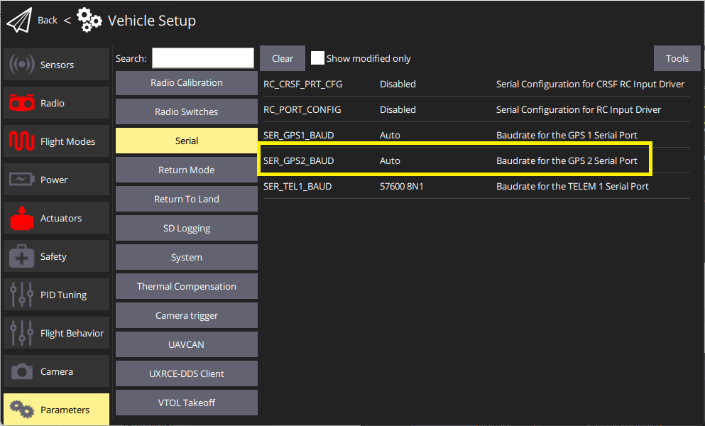

# GPS&罗盘

PX4 supports global navigation satellite systems (GNSS) (including GPS, GLONASS, Galileo, BeiDou, QZSS and SBAS) using receivers that communicate via the UBlox, MTK Ashtech or Emlid protocols, or via UAVCAN. 它还支持 [实时动态（RTK）GPS接收器](../gps_compass/rtk_gps.md) ，它将 GPS 系统扩展到厘米级精度。

PX4可用于以下指南针部件（磁强计）：博世BMM 150 MEMS（通过I2C总线）、HMC5883/HMC5983（I2C或SPI）、IST8310（I2C）和 LIS3MDL（I2C或SPI）。

> **Note** The set of supported compasses can be inferred from the [magnetometer drivers](https://github.com/PX4/PX4-Autopilot/tree/master/src/drivers/magnetometer) in the source code.

最多可以连接4个内部或外部磁强计，但实际上只有一个磁强计可用作标题源。 系统根据其内部优先级自动选择可用的最佳罗盘（外部磁强计具有更高的优先级）。 如果主指南针在飞行中失败它将跳转到下一个指南针。 如果它在飞行前失败，将无法起飞。

> **Tip** 在使用 [Pixhawk-系列](../flight_controller/pixhawk_series.md) 飞行控制器时，我们建议使用安装在远离飞机/esc电源线的地方使用 *整合GPS和罗盘* - 通常安装在基座或机翼上（适用于固定翼飞机）。 内部指南针 *可能* 在较大的机型（如垂直起降机型）上有用，在这些车辆上，通过安装Pixhawk距离电源线很远，可以减少电磁干扰。 在小型飞行器上，几乎总是需要外置罗盘。

## 组合GPS/罗盘选项

一些流行的GSP/指南针选项包括：

- [带罗盘的Ublox Neo-M8N GPS](https://hobbyking.com/en_us/ublox-neo-m8n-gps-with-compass.html?gclid=Cj0KCQjwqM3VBRCwARIsAKcekb3ojv1ZhLz1-GuvCsUuGT8ZZuw8meMIV_I6pgUCj6DJRzHBY9OApekaAgI5EALw_wcB&gclsrc=aw.ds&___store=en_us)（Hobbyking）
- [mRo GPS u-Blox Neo-M8N Dual Compass LIS3MDL+ IST8310](https://store.mrobotics.io/ProductDetails.asp?ProductCode=mro-gps003-mr) (mRo store)
- [Drotek uBlox GPS/Compasses](https://drotek.com/shop/en/184-u-blox) (drotek)
- [Holybro Pix32 M8N GPS Module](https://shop.holybro.com/pix32-gps-module_p1099.html) ([Holybro Shop](https://shop.holybro.com/pix32-gps-module_p1099.html)) ([getfpv](https://www.getfpv.com/holybro-pix32-neo-m8n-gps.html))
- [Holybro Micro M8N GPS Module](https://shop.holybro.com/micro-m8n-gps_p1009.html) ([Holybro Shop](https://shop.holybro.com/micro-m8n-gps_p1009.html)) ([getfpv](https://www.getfpv.com/holybro-micro-m8n-gps-module.html))
- [Holybro Pixhawk 4 GPS Module (10 pin)](https://shop.holybro.com/pixhawk-4-gps-module_p1094.html) ([Holybro Shop](https://shop.holybro.com/pixhawk-4-gps-module_p1094.html))) ([getfpv](https://www.getfpv.com/holybro-pixhawk-4-neo-m8n-gps.html))
- [Holybro Pixhawk 4 2nd GPS Module (6 pin)](https://shop.holybro.com/pixhawk4-2nd-gps-module_p1145.html) (Holybro Shop)
- [Here GNSS GPS (M8N)](https://www.getfpv.com/here-gnss-gps-m8n.html) (getfpv)
- [Hex Here2 GNSS GPS (M8N)](../gps_compass/gps_hex_here2.md)
- [Zubax GNSS 2](https://zubax.com/products/gnss_2) (zubax.com)
- [Avionics Anonymous UAVCAN GNSS/Mag](https://www.tindie.com/products/avionicsanonymous/uavcan-gps-magnetometer/) (Tindie)
- 3DR uBlox GPS与罗盘kit</0 >(getfpv)-*停产*</li> </ul> 
  
  GPS与罗盘的连接说明通常由厂家（至少支持更通用的 [自驾仪](../flight_controller/README.md)）提供
  
  > **Note** [Pixhawk系列](../flight_controller/pixhawk_series.md) 控制器通常有一个标记明确的端口用于连接GPS，指南针连接I2C或SPI总线（取决于设备）。 The [Zubax GNSS 2](https://zubax.com/products/gnss_2) and [Avionics Anonymous GNSS/Mag](https://www.tindie.com/products/avionicsanonymous/uavcan-gps-magnetometer/) can also be connected via [UAVCAN](../uavcan/README.md).
  
  

  
  > **Tip** 连接GPS模块时，请注意引脚。 虽然这些都是软件兼容，有几个不同的引脚。
  
  ## GPS (Only) Options
  
  - [Emlid Reach M+](https://emlid.com/reach/) (emlid.com) > **Note** At time of writing PX4 does not support RTK GPS with this module (only "ordinary" GPS). Support is expected in the near future.
  
  ## Compass (Only) Options
  
  - [Avionics Anonymous UAVCAN Magnetometer](https://www.tindie.com/products/avionicsanonymous/uavcan-magnetometer/) (Tindie)
  
  ## RTK-GPS设备
  
  有关支持的设备和setup/配置的信息，请参阅边栏下的 [RTK GPS](../gps_compass/rtk_gps.md)。
  
  ## 配置
  
  ### Primary GPS
  
  GPS configuration on Pixhawk is handled transparently for the user - simply connect the GPS module to the port labeled **GPS** and everything should work.
  
  > **Note** The default [Serial Port Configuration](../peripherals/serial_configuration.md#default_port_mapping) works for most devices. If you are using the *Trimble MB-Two* you will need to modify the configuration to explicitly set the rate to 115200 baud.
  
  

  
  ### Secondary GPS (Dual GPS System)
  
  To use a secondary GPS, attach it to any free port, and then perform a [Serial Port Configuration](../peripherals/serial_configuration.md) to assign [GPS_2_CONFIG](../advanced_config/parameter_reference.md#GPS_2_CONFIG) to the selected port.
  
  The following steps show how to configure a secondary GPS on the `TELEM 2` port in *QGroundControl*:
  
  1. [Find and set](../advanced_config/parameters.md) the parameter [GPS_2_CONFIG](../advanced_config/parameter_reference.md#GPS_2_CONFIG) to **TELEM 2**. 
    - Open *QGroundControl* and navigate to the **Vehicle Setup > Parameters** section.
    - 选择 **GPS** 选项卡(1)，然后打开 [GPS_2_CONFIG](../advanced_config/parameter_reference.md#GPS_2_CONFIG) 参数(2)，并从下拉列表(3) 中选择 *TELEM 2*。 
  2. Reboot the vehicle in order to make the other parameters visible.
  3. 选择 **串口** 选项卡，并打开 [SER_TEL2_BAUD](../advanced_config/parameter_reference.md#SER_TEL2_BAUD) 参数 (`TELEM 2`端口波特率)：将其设置为 *Auto*。 
  
  After setting up the second GPS port:
  
  1. Configure the ECL/EKF2 estimator to blend data from both GPS systems. For detailed instructions see: [Using the ECL EKF > Dual Receivers](../advanced_config/tuning_the_ecl_ekf.md#dual-receivers).
  
  ### 罗盘
  
  指南针校准内容包括在：[罗盘配置](../config/compass.md) 中。 该过程非常简单，将校准所有连接的磁强计。
  
  可以使用 [CAL\ *MAGx*](../advanced_config/parameter_reference.md#CAL_MAG0_EN) parameters（`x=0-3`）[performed](../advanced_config/parameters.md) 其他配置。 通常，您不需要 *修改* 这些，因为罗盘是自动检测的，优先排序，并且都是同时校准的（可能的例外是 [CAL\_MAGx\_EN](../advanced_config/parameter_reference.md#CAL_MAG0_EN) 可能用于禁用内部指南针）。 但是，您可能希望阅读它们，因为它们会让您知道哪些磁强计是内部或外部（[CAL\_MAGx\_EN](../advanced_config/parameter_reference.md#CAL_MAG0_EN)），哪些是用作主要标题源（[CAL_MAG_PRIME](../advanced_config/parameter_reference.md#CAL_MAG_PRIME)）。
  
  ## 开发人员信息
  
  - GPS/RTK-GPS 
    - [RTK-GPS](../advanced/rtk_gps.md)
    - [GPS驱动程序](../modules/modules_driver.md#gps)
    - [UAVCAN示例](../uavcan/README.md)
  - [Driver source code](https://github.com/PX4/PX4-Autopilot/tree/master/src/drivers/magnetometer) (Compasses)