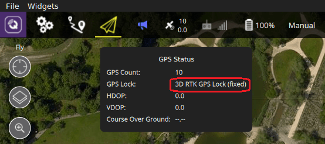
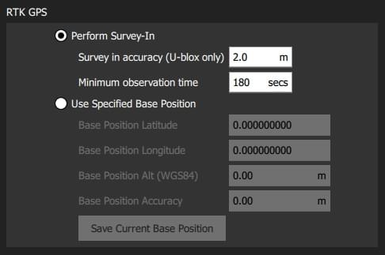

# RTK GPS

实时差分可以将 GNSS/GPS 的精度提高到厘米级。 装备 RTK 后可以将 PX4 应用到需要精确定位的精确测绘中。

你需要：

- 一对[RTK GPS 设备](#supported-rtk-devices)（地面站和移动站）
- 一台装有 QGroundControl 的 *PC 或笔记本*（Android/iOS 的 QGroundControl 地面站不支持 RTK）
- 一架连接有 WiFi 或数传的飞机

> **Note***QGroundControl*理论上可以在多台飞机启用 RTK GPS（每台设备上都安装一个移动站）。 在编写本文时, 此用发还未进行测试。

## 支持的 RTK 设备

PX4 支持[u-blox M8P](https://www.u-blox.com/en/product/neo-m8p) 和[Trimble MB-Two](https://www.trimble.com/Precision-GNSS/MB-Two-Board.aspx) 以及纳入的GPS产品。 下面的 RTK 设备已经经过测试。

- [CUAV C-RTK GPS](../gps_compass/rtk_gps_cuav_c-rtk.md)
- [Drotek XL RTK GPS](../gps_compass/rtk_gps_drotek_xl.md)
- [Here+ RTK GPS](../gps_compass/rtk_gps_hex_hereplus.md)
- [Trimble MB-Two](../gps_compass/rtk_gps_trimble_mb_two.md)

> **Note**有一些 RTK 模块只能作为基站或移动站，有的则可以两用。

## 硬件安装

### RTK 移动站（飞机）

连接飞机上的移动站到飞控的 GPS 端口上（其他的 GPS模块同理）。

实际的接线可能因飞控和 RTK 而有所差异（详情参看所[选设备的说明书](#supported-rtk-devices)）。

### Base RTK Module (Ground)

使用 USB 连接基站到*QGroundControl*。 基站在使用中必须保持不动。

> **Tip**选择一个不会移动的地方，上方开阔，最好避开建筑物。 使用三脚架或安装在屋顶，效果更好。

### 电台/WiFi

飞机和地面站之间必须使用 [wifi 或电台](../assembly/quick_start_pixhawk.md#telemetry-radios-optional)连接。 <!-- this should be a link to a telemetry topic, but we don't have one yet -->

The link *must* use the MAVLink2 protocol as it makes more efficient use of the channel. This should be set by default, but if not, follow the [MAVLink2 configuration instructions](#mavlink2) below.

## RTK Connection Process

The RTK GPS connection is essentially plug and play:

1. Start *QGroundControl* and attach the base RTK GPS via USB to the ground station. The device is recognized automatically. 
2. Start the vehicle and make sure it is connected to *QGroundControl*.
    
    > **Tip** An RTK GPS status icon is displayed in the top icon bar while an RTK GPS device is connected (in addition to the normal GPS status icon). The icon is red while RTK is being set up, and then changes to white once RTK GPS is active. You can click the icon to see the current state and RTK accuracy.

3. *QGroundControl* then starts the RTK setup process (known as "Survey-In").
    
    Survey-In is a startup procedure to get an accurate position estimate of the base station. The process typically takes several minutes (it ends after reaching the minimum time and accuracy specified in the [RTK settings](#rtk-gps-settings)).
    
    You can track the progress by clicking the RTK GPS status icon.
    
    

4. Once Survey-in completes:

- The RTK GPS icon changes to white and *QGroundControl* starts to stream position data to the vehicle:
    
    

- Vehicle GPS switches to RTK mode. The new mode is displayed in the *normal* GPS status icon (`3D RTK GPS Lock`):
    
    

## PX4 可用的设置

下面的设置可能需要设置。（使用*QGroundControl*）。

### RTK GPS 设置

The RTK GPS settings are specified in the *QGroundControl* [General Settings](https://docs.qgroundcontrol.com/en/SettingsView/General.html#rtk-gps) (**SettingsView > General Settings**).

These settings define the minimum duration and minimum accuracy for completing the RTK GPS setup process (known as "Survey-In).

### MAVLink2

The MAVLink2 protocol must be used because it makes more efficient use of lower-bandwidth channels. This should be enabled by default on recent builds.

To ensure MAVLink2 is used:

- Update the telemetry module firmware to the latest version (see [QGroundControl > Setup > Firmware](https://docs.qgroundcontrol.com/en/SetupView/Firmware.html)).
- Set [MAV_PROTO_VER](../advanced_config/parameter_reference.md#MAV_PROTO_VER) to 2 (see [QGroundControl Setup > Parameters](https://docs.qgroundcontrol.com/en/SetupView/Parameters.html))

### Tuning

You may also need to tune some parameters as the default parameters are tuned assuming a GPS accuracy in the order of meters, not centimeters. For example, you can decrease [EKF2_GPS_V_NOISE](../advanced_config/parameter_reference.md#EKF2_GPS_V_NOISE) and [EKF2_GPS_P_NOISE](../advanced_config/parameter_reference.md#EKF2_GPS_P_NOISE) to 0.2.

<!-- 

- Video demonstration would be nice.
- something that shows positioning of base, connection of RTK rover, survey in process. Some sort of short precision survey. 
-->

## Vehicle Setup Example

The airframe build topic [DJI Flamewheel 450 with distance sensor and RTK GPS](https://dev.px4.io/en/airframes_multicopter/dji_flamewheel_450.html) describes an airframe setup with the Here+ RTK GPS and a Pixhawk 3 Pro.