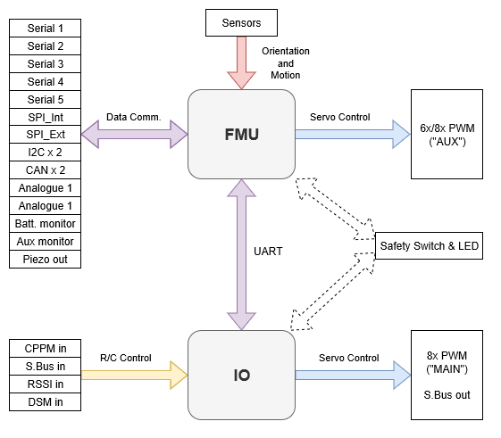

# PX4 参考飞行控制器设计

PX4 参考设计是飞行控制器的 [Pixhawk 系列 ](../flight_controller/pixhawk_series.md)。 该设计于2011年首次发布，现已进入第5 [代](#reference_design_generations)（第六代电路板设计正在进行中）。

## 二进制兼容性

所有按照特定设计制造的主板预计与二进制兼容（即可以运行相同的固件）。 从2018年起，我们将提供一个二进制兼容性测试套件，使我们能够验证兼容性。

第1-3代 FMU 设计用于开源硬件，但到了第4-5代只提供 pin 输出引脚和供电规格（原理图由个人开发者生成）。 为了可以更好的确保兼容性，FMUv6 及更新的版本重新提供完整的设计模型。

## 参考设计迭代：

* FMUv1：开发板 \（STM32F407, 128 KB RAM, 1MB flash, [原理图](https://github.com/PX4/Hardware/tree/master/FMUv1)\）（PX4 不再支持）
* FMUv2：Pixhawk \（STM32F427, 168 MHz, 192 KB RAM, 1MB flash, [原理图](https://github.com/PX4/Hardware/tree/master/FMUv2)\）
* FMUv3：2MB Flash 的 Pixhawk 变种 \（3DR Pixhawk 2 \（Solo\）， Hex Pixhawk 2.1，Holybro Pixfalcon，3DR Pixhawk Mini，STM32F427，168 MHz，256 KB RAM，2 MB flash，[原理图](https://github.com/PX4/Hardware/tree/master/FMUv3_REV_D)\）
* FMUv4：Pixracer \（STM32F427, 168 MHz, 256 KB RAM, 2MB flash, [原理图](https://docs.google.com/spreadsheets/d/1raRRouNsveQz8cj-EneWG6iW0dqGfRAifI91I2Sr5E0/edit#gid=1585075739)\）
* FMUv4 PRO: Drotek Pixhawk 3 PRO \(STM32F469, 180 MHz, 384 KB RAM, 2 MB flash, [输出引脚](https://docs.google.com/spreadsheets/d/1raRRouNsveQz8cj-EneWG6iW0dqGfRAifI91I2Sr5E0/edit#gid=1585075739)\)
* FMUv5: Holybro Pixhawk 4 \(STM32F765, 216 MHz, 512 KB RAM, 2 MB flash, [输出引脚](https://docs.google.com/spreadsheets/d/1-n0__BYDedQrc_2NHqBenG1DNepAgnHpSGglke-QQwY/edit#gid=912976165)\)
* FMUv6：尚未完成，最终命名为 TBD，变种 6s \(STM32H7, 400 MHz, 2 MB RAM,  2 MB flash\) 和变种 6i \(i.MX RT1050, 600 MHz, 512 KB RAM, 外部 flash\)

## Main/IO 功能分解

下图展示了在Pixhawk系列飞行控制器（这些板被合并进一个单独的物理模块中）中 FMU 和 I/O 板之间总线和功能的职能划分。

<!-- Draw.io version of file can be found here: https://drive.google.com/file/d/1H0nK7Ufo979BE9EBjJ_ccVx3fcsilPS3/view?usp=sharing -->

一些Pixhawk系列控制器为了减少空间或复杂性，或者更好解决使用问题，没有通过I/O板构建。

I/O 板被设置参数 [SYS_USE_IO=0](../advanced_config/parameter_reference.md#SYS_USE_IO) 禁用。 当I/O 板被禁用时：
- 主混合器文件被加载到FMU(所以列在[机型参考](../airframes/airframe_reference.md)的“主”输出出现在标有AUX的端口上） AUX 混合器不被加载，所以定义在文件中的输出不会使用。
- 遥控输出不通过IO板，而是直接连接在FMU上。

没有I/O板的飞行控制器有`MAIN`端口，但是它们*没*有`AUX端口`。 因此，他们只能在哪些不使用AUX端口或者使用非必要途径(例如 遥控直通）的机型使用。 They can be used for most multicopters and *fully* autonomous vehicles (without a safety pilot using RC control), as these typically only use `MAIN` ports for motors/essential controls.

:::warning
Flight controllers without an I/O board cannot be used in [airframes](../airframes/airframe_reference.md) that map any `AUX` ports to essential flight controls or motors (as they have no `AUX` ports).
:::

:::note
Manufacturer flight controller variants without an I/O board are often named as a "diminutive" of a version that includes the I/O board: e.g. _Pixhawk 4_ **Mini**_, _CUAV v5 **nano**_.
:::

Most PX4 PWM outputs are mapped to either `MAIN` or `AUX` ports in mixers. A few specific cases, including camera triggering and Dshot ESCs, are directly mapped to the FMU pins (i.e. they will output to *either* `MAIN` or `AUX`, depending on whether or not the flight controller has an I/O board).
