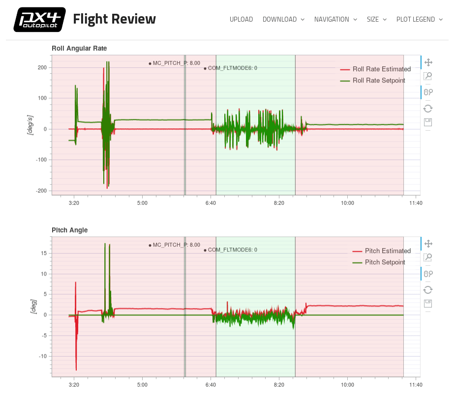
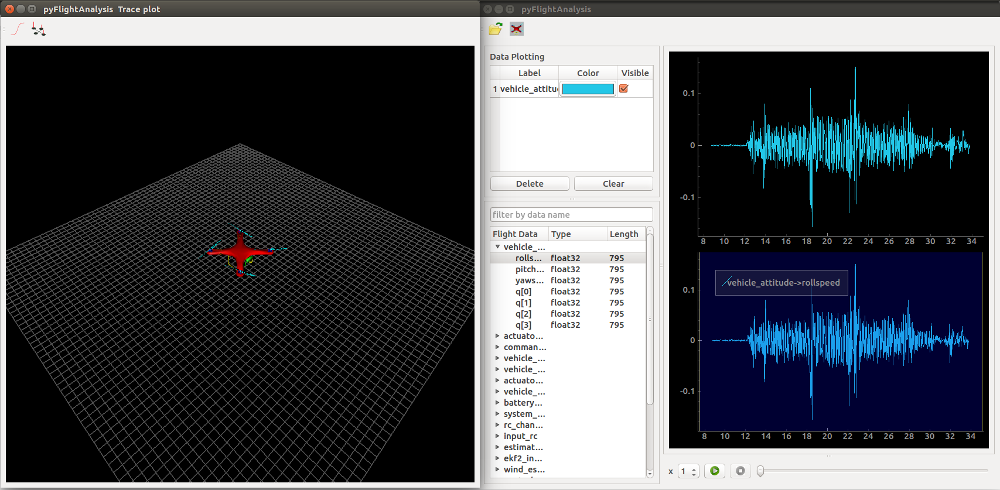
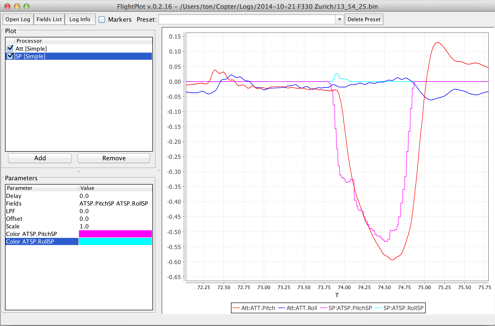
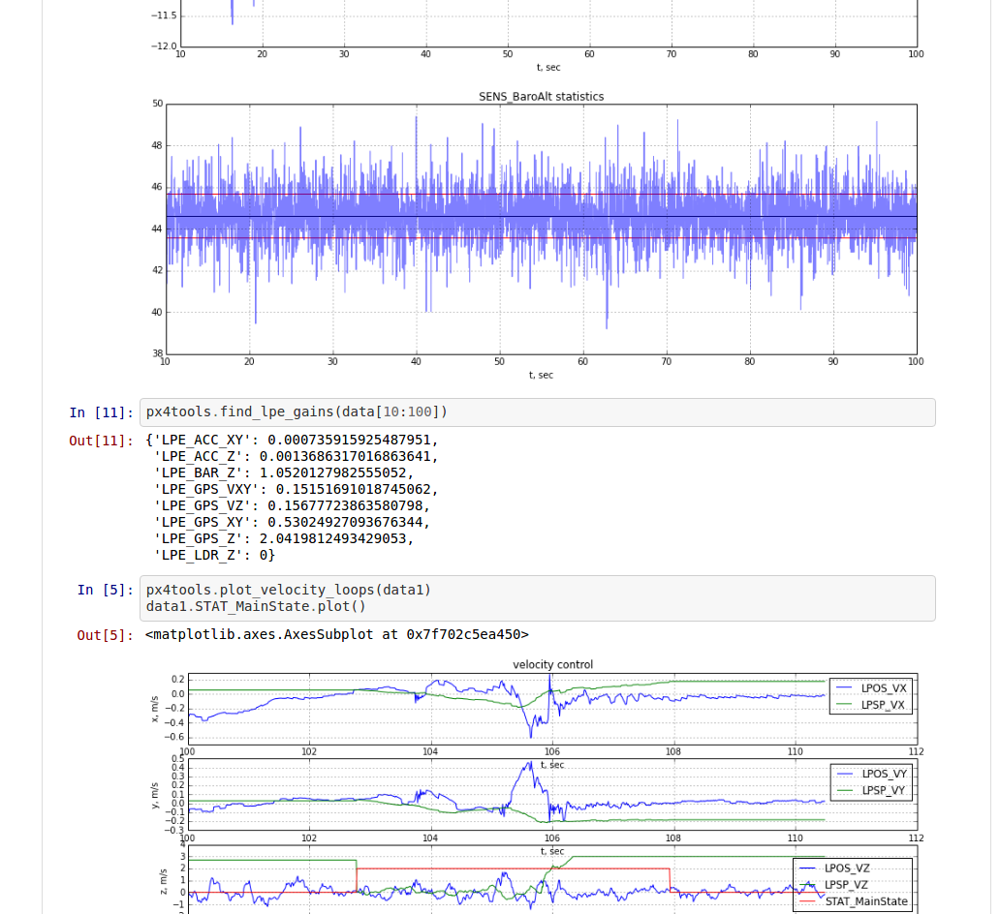
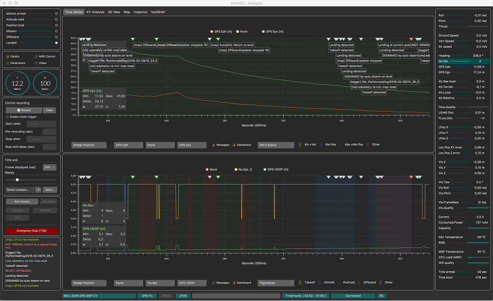
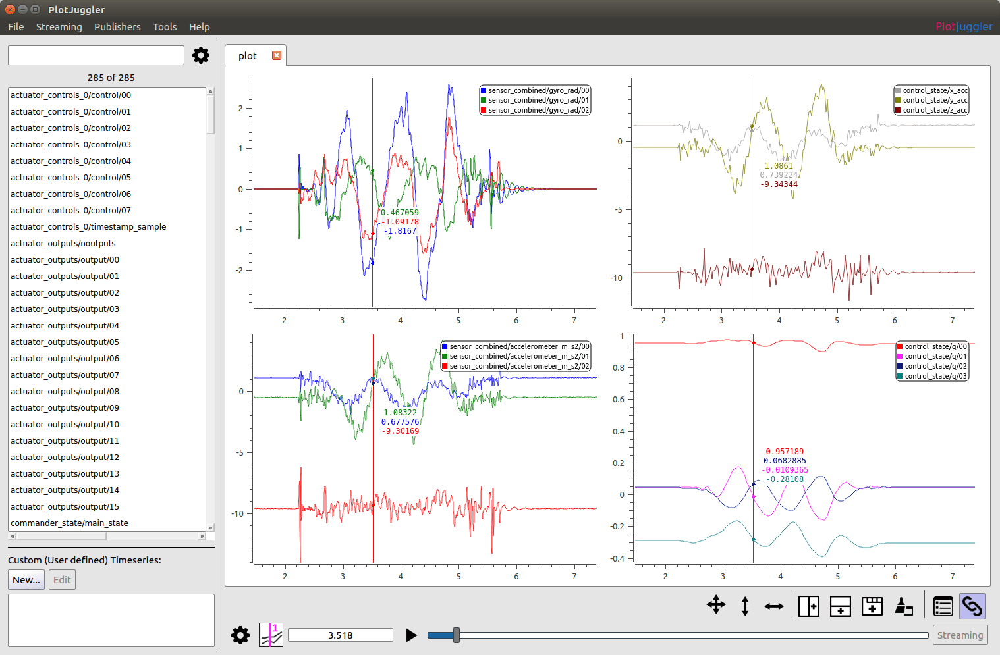

# 飞行日志分析

本主题概述了用于 PX4 飞行日志分析的方法和软件包。

## 飞行报告

[飞行报告](../getting_started/flight_reporting.md) 说明了如何下载日志并与开发团队报告/讨论有关飞行的问题。

## 结构化分析

在分析飞行日志之前，重要的是建立它的上下文：

* 如果分析是在故障发生之后进行的，那么日志是捕捉到了这次故障还是在半空中停止了记录呢？
* 所有的控制器都跟踪到了它的设定值吗？ 最简单的方法是将的横滚和俯仰的角速度与它们的设定值进行比较。
* 传感器数据看起来有效吗？ 是否有非常强的震动（一个合理的判断强烈震动的阈值是所有的峰峰值是否超过 2-3m/s/s）。
* 如果根本原因不针对于特定车辆，请确保在 [PX4问题跟踪器](https://github.com/PX4/PX4-Autopilot/issues/new) 的报告中有日志文件的链接（以及视频如果有的话）。

## 排除电力故障

If a log file ends mid-air, two main causes are possible: a power failure *or* a hard fault of the operating system.

在基于 [STM32系列](http://www.st.com/en/microcontrollers/stm32-32-bit-arm-cortex-mcus.html?querycriteria=productId=SC1169) 的自动驾驶仪上，会将操作系统的硬故障记录到SD卡上。 These are located on the top level of the SD card and named _fault\_date.log_, e.g. **fault\_2017\_04\_03\_00\_26\_05.log**. 如果飞行日志突然终止，请一直检查此文件是否存在。

## 分析工具

### Flight Review（在线工具）

[Flight Review](http://logs.px4.io) is the successor of *Log Muncher*. 他能与新的 [ULog](../dev_log/ulog_file_format.md) 日志格式结合使用。

主要特性：
* 基于 web，非常适合终端用户。
* 用户可以上传、下载、并且与他人分享报告。
* 交互式绘图。



关于介绍，请参阅 [Log Analysis using Flight Review](flight_review.md)。

### pyulog

[pyulog](https://github.com/PX4/pyulog) 是用于分析 ulog 文件的 python 包，以及一组用于提取/显示 ulog 信息并转换为其他文件格式的命令行脚本。

主要特性：
* 用于分析 ulog 文件的 python 库。 许多其他 ULog 分析和可视化工具使用的基本库。
* 提取/显示 ulog 信息的脚本：
  * *ulog_info*: display information from an ULog file.
  * *ulog_messages*: display logged messages from an ULog file.
  * *ulog_params*: extract parameters from an ULog file.
* 转换 ulog 文件为其他格式的脚本：
  * *ulog2csv*: convert ULog to (several) CSV files.
  * *ulog2kml*: convert ULog to (several) KML files.

所有脚本都作为系统范围的应用程序安装 (例如，在命令行上调用它们-前提是安装了 Python)，并支持 `-h` 标志来获取使用说明。 例如：
```
$ ulog_info -h
usage: ulog_info [-h] [-v] file.ulg

Display information from an ULog file

positional arguments:
  file.ulg       ULog 输入文件

optional arguments:
  -h, --help     显示这个帮助信息然后退出
  -v, --verbose  详细输出
```

Below we see the kind of information exported from a sample file using *ulog_info*.
```
$ ulog_info sample.ulg
Logging start time: 0:01:52, duration: 0:01:08
Dropouts: count: 4, total duration: 0.1 s, max: 62 ms, mean: 29 ms
Info Messages:
 sys_name: PX4
 time_ref_utc: 0
 ver_hw: AUAV_X21
 ver_sw: fd483321a5cf50ead91164356d15aa474643aa73

Name (multi id, message size in bytes)    number of data points, total bytes
 actuator_controls_0 (0, 48)                 3269     156912
 actuator_outputs (0, 76)                    1311      99636
 commander_state (0, 9)                       678       6102
 control_state (0, 122)                      3268     398696
 cpuload (0, 16)                               69       1104
 ekf2_innovations (0, 140)                   3271     457940
 estimator_status (0, 309)                   1311     405099
 sensor_combined (0, 72)                    17070    1229040
 sensor_preflight (0, 16)                   17072     273152
 telemetry_status (0, 36)                      70       2520
 vehicle_attitude (0, 36)                    6461     232596
 vehicle_attitude_setpoint (0, 55)           3272     179960
 vehicle_local_position (0, 123)              678      83394
 vehicle_rates_setpoint (0, 24)              6448     154752
 vehicle_status (0, 45)                       294      13230
```


### pyFlightAnalysis

[pyFlightAnalysis](https://github.com/Marxlp/pyFlightAnalysis) 是一个跨平台的 PX4 飞行日志 (ulog) 可视化分析工具，灵感来源于 [FlightPlot](#flightplot)。

主要特性：
* 用于显示数据的动态筛选器
* 无人机姿态和位置三维可视化
* 使用 pyqtgraph 的 ROI (感兴趣的区域) 轻松回放
* 基于 Python 的，跨平台的。




### FlightPlot

[FlightPlot](https://github.com/PX4/FlightPlot) is a desktop based tool for log analysis. It can be downloaded from [FlightPlot Downloads](https://github.com/PX4/FlightPlot/releases) (Linux, MacOS, Windows).

主要特性：
* 基于 Java 的，跨平台的
* 直观的图形用户界面，不需要编程知识
* 支持新的和旧的 PX4 日志格式 (比如 .px4log，.ulg，.bin)
* 允许保存图形为图像




### PX4Tools

[PX4Tools](https://github.com/dronecrew/px4tools) is a log analysis toolbox for the PX4 autopilot written in Python. The recommended installation procedure is to use [anaconda3](https://conda.io/docs/index.html). See [px4tools github page](https://github.com/dronecrew/px4tools) for details.

主要特性：
* Easy to share, users can view notebooks on Github (e.g. [15-09-30 Kabir Log.ipynb](https://github.com/jgoppert/lpe-analysis/blob/master/15-09-30%20Kabir%20Log.ipynb))
* Python based, cross platform, works with anaconda 2 and anaconda3
* 使用 iPython/jupyter notebooks 可以方便地共享分析
* 高级绘图功能，允许进行详细分析




### MAVGCL

[MAVGCL](https://github.com/ecmnet/MAVGCL) is an in-flight log analyzer for PX4. It can also be used in offline mode with downloaded uLog files.

主要特性：
* 基于 MAVLink 消息或 MAVLink 上 ULOG 数据的实时数据采集( 50 ms 采样，100 ms 滚动显示)
* 由消息( MAVLink 和 ULog) 和参数更改(仅 MAVLink) 注释的时间图
* 选定的关键指标的 XY 分析
* 3D 视图 (飞行器和观察者视角)
* MAVLink inspector 面板(报告原始 MAVLink 消息)
* 离线模式：从 PX4Log/ULog 导入关键指标(通过 WiFi 从设备上获取文件或最后一次日志)
* 基于 Java 在 MacOS 和 Ubuntu 上运行。
* 更多……




### PlotJugler

[PlotJuggler](https://github.com/facontidavide/PlotJuggler) is a Qt5 desktop application that allows users to easily visualize and analyze data expressed in the form of time series.

It supports __ULog files__ (.ulg) since version 2.1.4.

主要特性：

* 直观的拖放界面。
* 可以将数据安排在多个图表、选项卡或窗口中。
* 整理好数据后，将其保存到“布局”文件中，这样支持多次重新加载。
* 可以在 PlotJuggler 里处理你的数据，使用定制的“数据转换”。

Source code and downloads are available on [Github](https://github.com/facontidavide/PlotJuggler).




### Data Comets

[Data Comets](https://github.com/dsaffo/DataComets) is a interactive PX4 flight log analysis tool that allows you to encode flight data onto the flight path, filter and brush the data by time - and much more!

You can use the online version of the tool for small log files (< 32Mb), or run it locally in order to analyze longer flights.


