# 使用 Flight Review 进行日志分析

[飞行复查](http://logs.px4.io)可以绘制图表来分析一般的车辆状况。

这些图是不言自明的，但是需要一些经验来了解哪些范围是可以接受的，以及一个图应该是什么样的。 本页介绍如何解释这些情节并识别常见问题。

## 一般用法

许多图形共有的功能:

- Plot background color is used to indicate flight mode during recording (where graphs depend on mode): 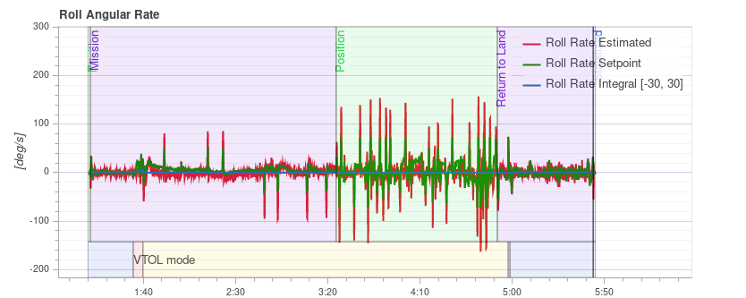
  - **Flight mode:** Background colour on the body of the plot indicates flight mode. 将鼠标悬停在绘图上将显示飞行模式标签。
  - **VTOL flight mode:** VTOL vehicles additionally show the VTOL mode as background colour in the bottom part of the plot (blue for multicopter, yellow for fixed wing, and red for transition).
- 鼠标在特定的绘图轴上滚动可缩放该轴 (水平或垂直)。
- 鼠标在图形内滚动可缩放两个轴。

## PID 性能跟踪

根据飞行模式, 车辆控制器可能会尝试跟踪位置、速度、高度或速率设定值 (跟踪的设定值取决于模式, 例如: 在稳定模式下没有速度设定值)。

The **Estimated** line (red) should closely match with the **Setpoint** (green). 如果没有，在大多数情况下，需要调整该控制器的 PID 增益。

[多轴 PID 调优指南](../config_mc/pid_tuning_guide_multicopter.md)包含示例图和有关分析跟踪性能的信息。

:::tip
For the rate controller in particular, it is useful to enable the high-rate logging profile ([SDLOG_PROFILE](../advanced_config/parameter_reference.md#SDLOG_PROFILE)) to get more details when zooming in.
:::

## 振动

Vibration is one of the most common problems for multirotor vehicles. High vibration levels can lead to:
- 飞行效率低, 飞行时间缩短
- 电机温度升高
- 增加材料磨损
- 无法严格调整车辆，导致飞行性能下降。
- 传感器接线
- 位置估计失败，可能偏离飞行。

It is therefore important to keep an eye on the vibration levels and improve the setup if needed.

There is a point where vibration levels are clearly too high, and generally lower vibration levels are better. However there is a broad range between 'everything is ok' and 'the levels are too high'. This range depends on a number of factors, including vehicle size - as larger vehicles have higher inertia, allowing for more software filtering (at the same time the vibrations on larger vehicles are of lower frequency).

The following paragraphs and sections provide information about what plots to use for checking vibration levels, and how to analyse them.

:::tip
It is worth looking at multiple charts when analyzing vibration (different charts can better highlight some issues).
:::

### FFT 制动器控制

:::note
You need to enable the high-rate logging profile ([SDLOG_PROFILE](../advanced_config/parameter_reference.md#SDLOG_PROFILE)) to see this plot.
:::

This graph shows a frequency plot for the roll, pitch and yaw axis based on the actuator controls signal (the PID output from the rate controller). It helps to identify frequency peaks and configuring the software filters. There should only be a single peak at the lowest end (below around 20 Hz), the rest should be low and flat.

Note that the y-axis scaling is different for different vehicles, but logs from the same vehicle can be directly compared to each other.

#### 例子：良好的振动

[QAV-R 5" Racer](../frames_multicopter/qav_r_5_kiss_esc_racer.md) frame (excellent vibration).

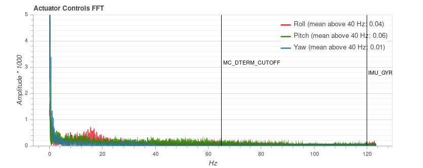

:::note
The excellent vibration characteristics of the above frame mean that we can considerably increase the cutoff frequency of the [software filters](../config_mc/filter_tuning.md) (reducing control latency).
:::

DJI F450 frame (good vibration).

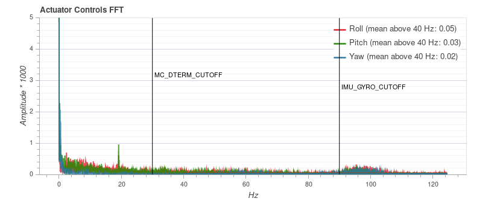

S500 frame:

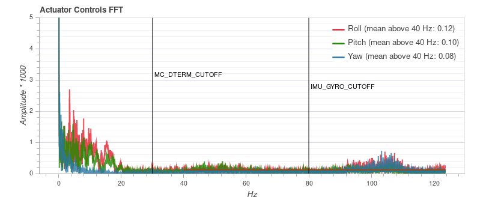

:::note
While the plot above looks good, the [Raw Acceleration graph for the same flight](#raw_acc_s500) shows that the vibration levels are a bit high for x and y. This is a good example of why it is worth checking several graphs!
:::

#### 例子：不好的振动

This example shows a peak in frequency close to 50 Hz (in this case due to "loose" landing gear).

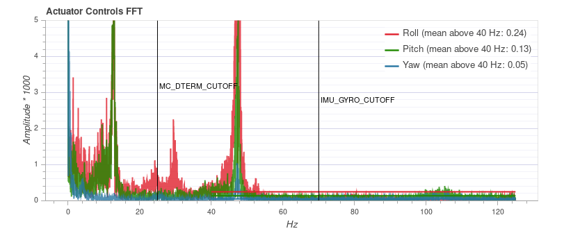

### 加速度功率谱密度

This is a 2D frequency plot showing the frequency response of the raw accelerometer data over time (it displays the sum for the x, y and z axis). The more yellow an area is, the higher the frequency response at that time and frequency.

Ideally only the lowest part up to a few Hz is yellow, and the rest is mostly green or blue.

#### 例子：良好的振动

[QAV-R 5" Racer](../frames_multicopter/qav_r_5_kiss_esc_racer.md) frame (excellent vibration).

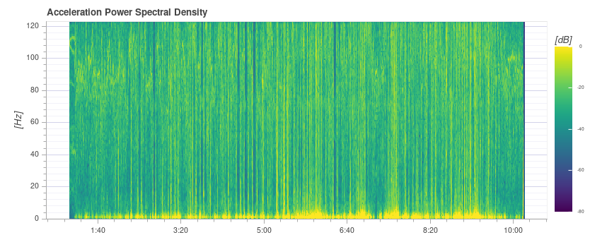
<!-- https://logs.px4.io/plot_app?log=cd88b091-ec89-457c-85f6-e63e4fa0f51d -->

DJI F450 frame (good vibration). 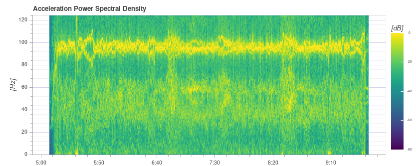

:::note
Above you can see the blade passing frequency of the propellers at around 100 Hz.
:::

S500 frame: 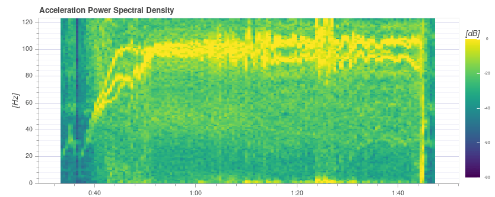

#### 例子：不好的振动

The strong yellow lines at around 100Hz indicate a potential issue that requires further investigation (starting with a review of the other charts).

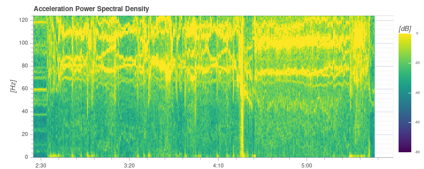

This plot below shows a peak in frequency close to 50 Hz (in this case due to "loose" landing gear).

:::tip
This indicates a possible problem because it is a strong single low frequency that is close to the vehicle dynamics.
With the default filter settings of 80 Hz vibrations at 50 Hz will not be filtered.
:::

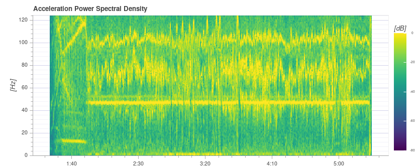

Extremely high (unsafe) vibration! Note that the graph is almost completely yellow.

:::warning
You should not fly with such high vibration levels.
:::

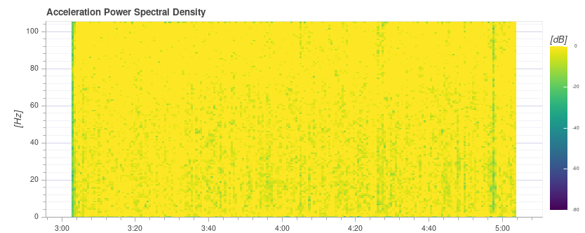

### 原始加速度

This graph shows the raw accelerometer measurements for the x, y and z axis. Ideally each line is thin and clearly shows the vehicle's accelerations.

As a rule of thumb if the z-axis graph is touching the x/y-axis graph during hover or slow flight, the vibration levels are too high.

:::tip
The best way to use this graph is to zoom in a bit to a part where the vehicle is hovering.
:::

#### 例子：良好的振动

[QAV-R 5" Racer](../frames_multicopter/qav_r_5_kiss_esc_racer.md) frame (excellent vibration).

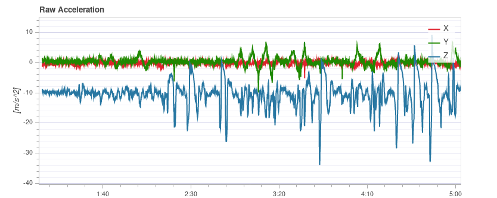

DJI F450 frame (good vibration). 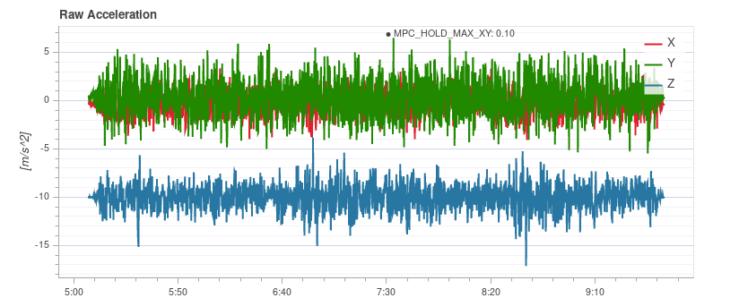

<!-- https://logs.px4.io/plot_app?log=cd88b091-ec89-457c-85f6-e63e4fa0f51d -->

#### 例子：不好的振动

S500 frame. Borderline vibration levels - a bit high for x and y (which is typical for an S500 airframe). 这是它开始对飞行性能产生负面影响的极限。

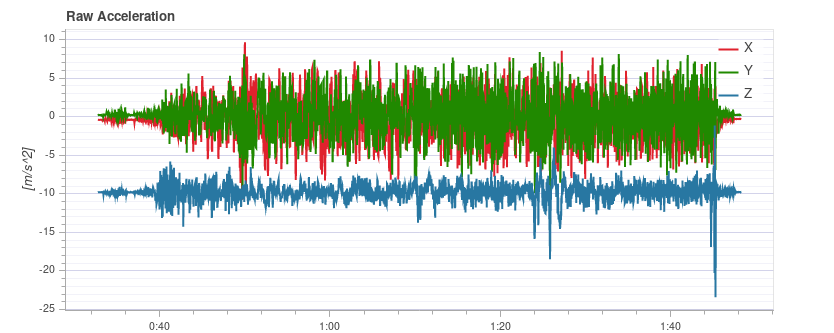

Vibration too high. Note how the graph of the z-axis overlaps with the x/y-axis graph:

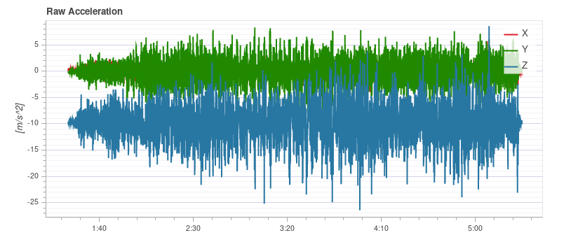

Vibration levels are too high. Note how the graph of the z-axis overlaps with the x/y-axis graph:

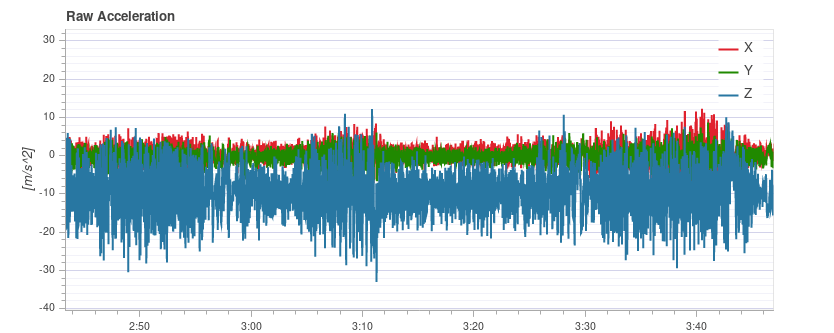

Very high (unsafe) vibration levels.

:::warning
You should not fly with such high vibration levels.
:::

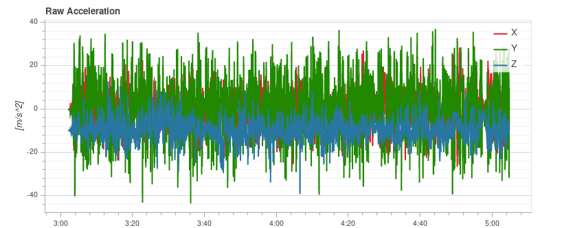

### Raw High-rate IMU Data Plots

For an in-depth analysis there is an option to log the raw IMU data at full rate (several kHz, depending on the IMU). This allows inspection of much higher frequencies than with normal logging, which can help when selecting vibration mounts or configuring low-pass and notch filters appropriately.

To use it, some parameters need to be changed:
- Set [IMU_GYRO_RATEMAX](../advanced_config/parameter_reference.md#IMU_GYRO_RATEMAX) to 400. This ensures that the raw sensor data is more efficiently packed when sent from the sensor to the rest of the system, and reduces the log size (without reducing useful data). 
  <!-- Explanation in https://github.com/PX4/PX4-user_guide/pull/751/files#r440509688
  Data is sent in a fixed size array that will largely empty if sent at higher rate. The "empty data" is also logged.-->
- Use a good SD card, as the IMU data requires a high logging bandwidth (Flight Review will show dropouts if the logging rate gets too high).

:::tip
See [Logging > SD Cards](../dev_log/logging.md#sd-cards) for a comparison of popular SD card.
:::
- Enable either the gyro or accel high-rate FIFO profile in [SDLOG_PROFILE](../advanced_config/parameter_reference.md#SDLOG_PROFILE) and disable the rest of the entries. If you are using a really good SD card (seeing few/no dropouts), you can:
  - either enable both accel and gyro profiles
  - or enable accel/gyro plus the default logging profile

Example plot:

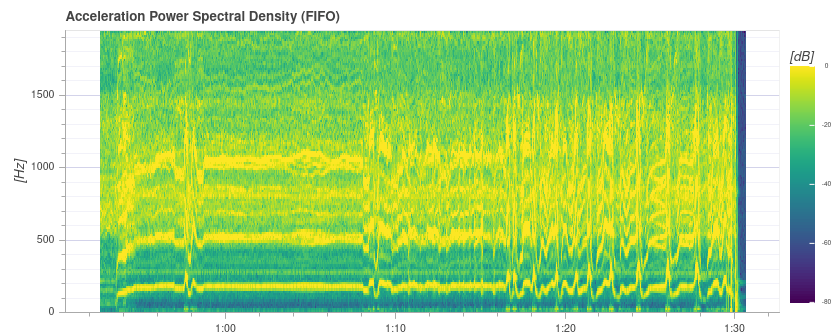

:::note
Data of the first IMU is logged, which is not necessarily the same as the one used for flying.
This is mostly only important in cases where IMU's are mounted differently (e.g. hard-mounted vs. soft-mounted).
:::

:::note
Do not forget to restore the parameters after testing.
:::

### Fixing Vibration Problems

Often a source of vibration (or combination of multiple sources) cannot be identified from logs alone.

In this case the vehicle should be inspected. [Vibration Isolation](../assembly/vibration_isolation.md) explains some basic things you can check (and do) to reduce vibration levels.

## 制动器输出

The *Actuator Outputs* graph shows the signals that are sent to the individual actuators (motors/servos). Generally it is in the range between the minimum and maximum configured PWM values (e.g. from 1000 to 2000).

This is an example for a quadrotor where everything is OK (all of the signals are within the range, approximately overlap each other, and are not too noisy): 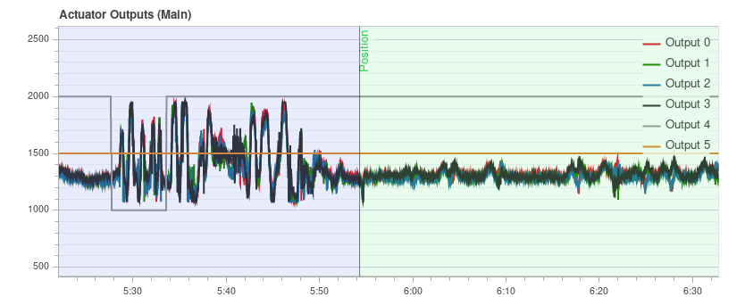

The plot can help to identify different problems:
- If one or more of the signals is at the maximum over a longer time, it means the controller runs into **saturation**. 这并不一定是一个问题，例如在全速飞行时，这是意料之中的。 但如果它发生了，例如在一次任务中，这是一个信号，表明飞行器超重，无法提供足够的推力。
- For a multicopter the plot can be a good indication if the vehicle is **imbalanced**. 它在图中显示，一个或多个相邻的电机 (一个四旋翼的情况下是两个) 平均需要以更高的推力运行。 请注意，如果某些电机提供的推力大于其他电机，或者 ESCs 没有经过校准，也可能出现这种情况。 一个不平衡的车辆通常不是一个大问题，因为自动驾驶仪将自动解释它。 然而，它减少了最大的可实现的推力，并会给一些电机带来更大的压力，因此，飞机最好是平衡的。
- 不平衡也有可能来自偏航的轴心。 这图与前一种情况类似，但是相反的电机将分别运行得更高或更低。 原因可能是一个或多个电机倾斜。

  这是一个六轴电机的例子：电机 1、3 和 6 运行的推力更高： 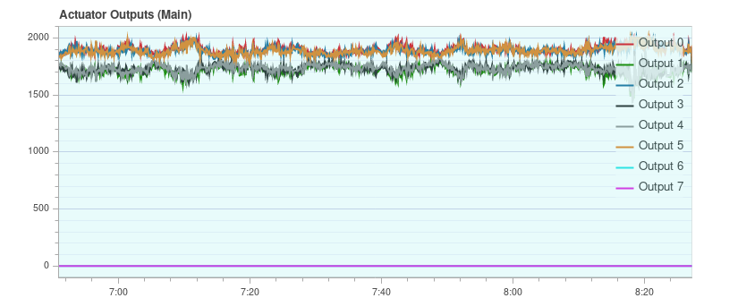
  <!-- https://logs.px4.io/plot_app?log=9eca6934-b657-4976-a32f-b2e56535f05f -->
- If the signals look very **noisy** (with high amplitudes), it can have two causes: sensor noise or vibrations passing through the controller (this shows up in other plots as well, see previous section) or too high PID gains. 这是一个极端的例子： 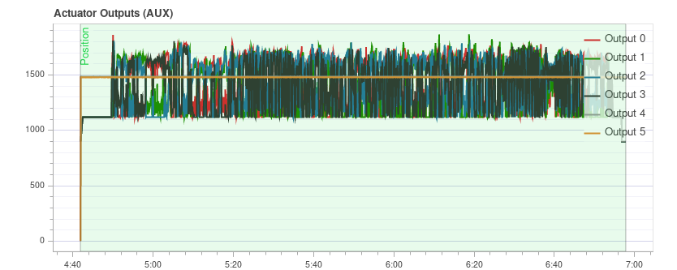

## GPS 不确定性

The *GPS Uncertainty* plot shows information from the GPS device:
- 使用卫星的数目 (应大约或多余 12 个)
- 水平位置精确度（应小于 1 米）
- 垂直位置精确度 (应小于 2 米)
- GPS fix: this is 3 for a 3D GPS fix, 4 for GPS + Dead Reckoning, 5 for RTK float and 6 for RTK fixed type

## GPS 噪声和干扰

The GPS Noise & Jamming plot is useful to check for GPS signal interferences and jamming. The GPS signal is very weak and thus it can easily be disturbed/jammed by components transmitting (via cable) or radiating in a frequency used by the GPS.

:::tip USB
3 is [known to be](https://www.usb.org/sites/default/files/327216.pdf) an effective GPS jamming source.
:::

The **jamming indicator** should be around or below 40. Values around 80 or higher are too high and the setup must be inspected. Signal interference is also noticeable as reduced accuracy and lower number of satellites up to the point where no GPS fix is possible.

This is an example without any interference:

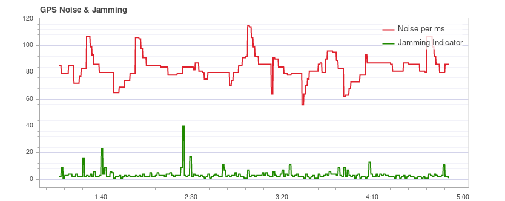

## 推力和磁场

The *Thrust and Magnetic Field* plot shows the thrust and the norm of the magnetic sensor measurement vector.

The norm should be constant over the whole flight and uncorrelated with the thrust. This is a good example where the norm is very close to constant: 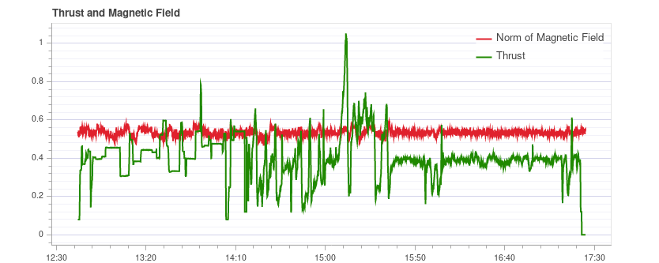

*If it is correlated*, it means that the current drawn by the motors (or other consumers) is influencing the magnetic field. This must be avoided as it leads to incorrect yaw estimation. The following plot shows a strong correlation between the thrust and the norm of the magnetometer: 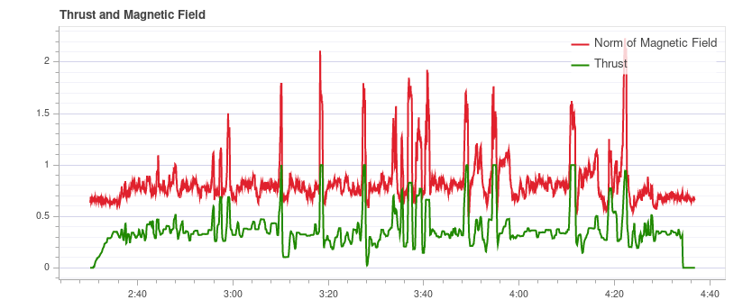

Solutions to this are:
- 使用外部磁强计 (避免使用内部磁强计)
- 如果使用外部磁强计，将其移到离强电流较远的地方(例如，使用 (较长的) GPS 天线)。

If the norm is uncorrelated but not constant, most likely it is not properly calibrated. However it could also be due to external disturbances (for example when flying close to metal constructs).

This example shows that the norm is non-constant, but it does not correlate with the thrust: 

## 估计器看门狗

The *Estimator Watchdog* plot shows the health report of the estimator. It should be constant zero.

This is what it should look like if there are no problems: 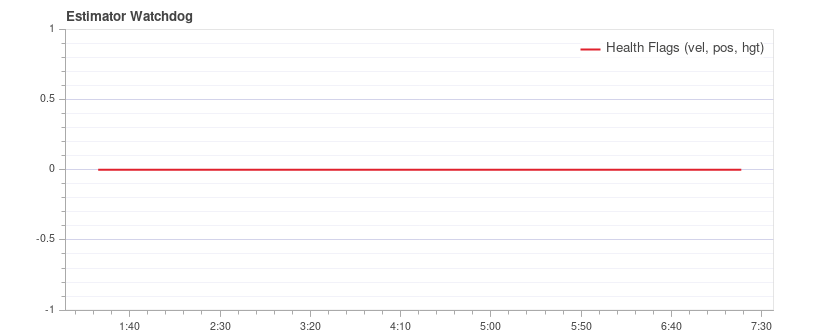

If one of the flags is non-zero, the estimator detected a problem that needs to be further investigated. Most of the time it is an issue with a sensor, for example magnetometer interferences. It usually helps to look at the plots of the corresponding sensor.
<!-- TODO: separate page for estimator issues? -->

Here is an example with magnetometer problems: 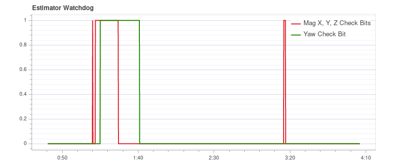

## 传感器数据的采样规律性

The sampling regularity plot provides insights into problems with the logging system and scheduling.

The amount of **logging dropouts** start to increase if the log buffer is too small, the logging rate is too high or a low-quality SD card is used.

:::note
Occasional dropouts can be expected on medium quality cards.
:::

The **delta t** shows the time difference between two logged IMU samples. It should be close to 4 ms because the data publishing rate is 250Hz. If there are spikes that are a multiple of that (and the estimator time slip does not increase), it means the logger skipped some samples. Occasionally this can happen because the logger runs at lower priority. If there are spikes that are not a multiple, it indicates an irregular sensor driver scheduling, which needs to be investigated.

The **estimator timeslip** shows the difference between the current time and the time of the integrated sensor intervals up to that time. If it changes it means either the estimator missed sensor data or the driver publishes incorrect integration intervals. It should stay at zero, but it can increase slightly for in-flight parameter changes, which is generally not an issue.

This is a good example: 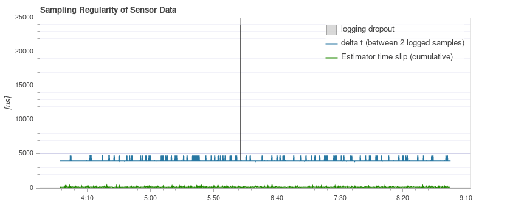

The following example contains too many dropouts, the quality of the used SD card was too low in that case (see [here](../dev_log/logging.md#sd-cards) for good SD cards):

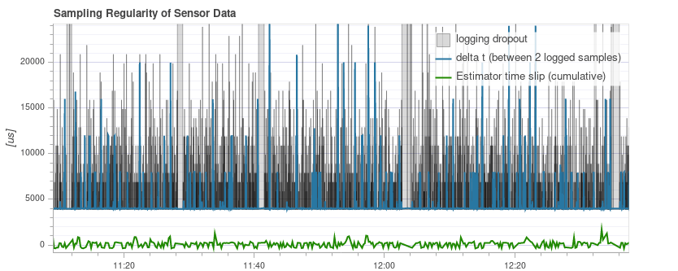

## 日志报文

This is a table with system error and warning messages. For example they show when a task becomes low on stack size.

The messages need to be examined individually, and not all of them indicate a problem. For example the following shows a kill-switch test: 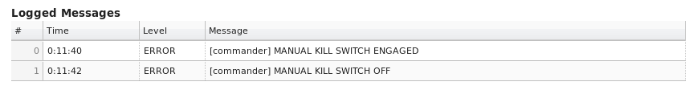

## 飞行/帧 日志审查实例

It is often worth looking at multiple charts for a particular flight when analyzing vehicle condition (different charts can better highlight some issues). This is particularly important when reviewing for possible vibration problems.

The section below groups a few (previously presented) charts by flight/vehicle.

### QAV-R 5" Racer

These charts are all from the same flight of a [QAV-R 5" Racer](../frames_multicopter/qav_r_5_kiss_esc_racer.md).
<!-- https://logs.px4.io/plot_app?log=cd88b091-ec89-457c-85f6-e63e4fa0f51d -->

They show a vehicle that has very low vibration:
- 致动器控制 FFT 显示，只在结束部分有一个最低的峰值，剩下的地方都很低且平坦。
- 谱密度大多为绿色，低频率只有很小的黄色。
- 原始加速度的 z 轴轨迹与 x/y 轴轨迹很好地分离开了。

### DJI F450

These charts are all from the same flight of a *DJI F450*.
<!-- https://logs.px4.io/plot_app?log=cd88b091-ec89-457c-85f6-e63e4fa0f51d -->

They show a vehicle that has low vibration (but not as low as the QAV-R above!):
- 致动器控制FFT在最底层显示峰值。 其余的大部分是平的，除了在 100Hz 左右有一个凸起 (这是螺旋桨的叶片通过频率) 。
- 光谱密度大多为绿色。 叶片通过频率再次可见。
- 原始加速度的 z 轴轨迹与 x/y 轴轨迹很好地分离开了。

### S500

These charts are all from the same flight of an S500.

They show a vehicle that has borderline-acceptable vibration:
- 致动器控制FFT在最底层显示峰值。 其余大部分都是平的，除了在 100Hz 左右有一个突起。
- 光谱密度大多为绿色，但比DJI F450 在 100Hz 时更黄。
- 原始加速度的 z 轴轨迹与 x/y 轴轨迹非常接近。 这是它开始对飞行性能产生负面影响的极限。

