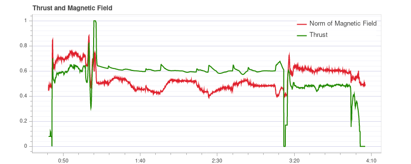

# 使用 Flight Review 进行日志分析

[飞行复查](http://logs.px4.io)可以绘制图表来分析一般的车辆状况。

这些图是不言自明的，但是需要一些经验来了解哪些范围是可以接受的，以及一个图应该是什么样的。 本页介绍如何解释这些情节并识别常见问题。

## 一般用法

许多图形共有的功能:

- 绘图背景色用于指示录制过程中的飞行模式 (其中图形取决于模式):  
    - **飞行模式：** 绘图主体背景颜色显示飞行模式。 将鼠标悬停在绘图上将显示飞行模式标签。
    - **VTOL 飞行模式 ：**VTOL 车辆还在图的底部显示 VTOL 模式为背景颜色 (多旋翼为蓝色, 固定翼为黄色, 过渡为红色)。
- 鼠标在特定的绘图轴上滚动可缩放该轴 (水平或垂直)。
- 鼠标在图形内滚动可缩放两个轴。

## PID 性能跟踪 {#tracking}

根据飞行模式, 车辆控制器可能会尝试跟踪位置、速度、高度或速率设定值 (跟踪的设定值取决于模式, 例如: 在稳定模式下没有速度设定值)。

**估计**线 (红色) 应与 **设定**线 (绿色) 密切匹配。 如果没有，在大多数情况下，需要调整该控制器的 PID 增益。

[多轴 PID 调优指南](../config_mc/pid_tuning_guide_multicopter.md)包含示例图和有关分析跟踪性能的信息。

> **Tip** 特别是对于速率控制器, 启用高速日志记录配置文件 ([SDLOG_PROFILE](../advanced_config/parameter_reference.md#SDLOG_PROFILE)) 在缩放时获取更多详细信息是很有用的。

## 振动

振动是多旋翼飞机中最常见的问题之一。 高振动可能导致：

- 飞行效率低, 飞行时间缩短
- 电机温度升高
- 增加材料磨损
- 无法严格调整车辆，导致飞行性能下降。
- 传感器接线
- 位置估计失败，可能偏离飞行。

因此，必须对振动水平保持警惕，并在必要时改进设置。

有一个时刻的振动明显过高，但是总体而言震动小更好。 然而在 "一切都好" 和 "水平太高" 之间有很大的差距。 这个范围取决于许多因素, 包括车辆的大小 - 因为较大的车辆有更高的惯性, 允许更多的软件过滤 (同时较大的车辆上的振动是较低的频率)。

下面的段落和部分提供了关于使用什么图来检查振动水平以及如何分析它们的信息。

> **Tip** 在分析振动时, 值得查看多个图表 (不同的图表可以更好地突出显示一些问题)。

### FFT 制动器控制

> **Note** 您需要启用高速日志记录配置文件 ([SDLOG_PROFILE](../advanced_config/parameter_reference.md#SDLOG_PROFILE)) 才能看到此图形。

此图显示了基于执行器控制信号 (速率控制器的 PID 输出) 的横滚、俯仰和偏航轴的频率图。 它有助于识别频率峰值和配置软件过滤器。 在最低端 (低于20赫兹) 时应该只有一个峰值, 其余的应该是低和平的。

请注意, 不同车辆的 y 轴缩放是不同的, 但同一车辆的日志可以直接相互比较。

#### 例子：良好的振动

[QAV-R 5" Racer](../frames_multicopter/qav_r_5_kiss_esc_racer.md) 框架 (极好的振动)。

> **Note**，上述卓越机型的振动特性意味着我们可以大大提高[软件过滤器](../config_mc/racer_setup.md#filters)的截止频率 (减少控制延迟) 。

DJI F450 框架 (良好振动)。

S500 框架：

> **Note** 虽然上面的图看起来不错，但[同一次飞行的原始加速度图](#raw_acc_s500)显示，x 和 y 的振动水平有点高。 这是一个很好的例子，说明为什么值得对比几个图！

#### 例子：不好的振动

这个例子显示了频率峰值接近 50 Hz (这是由于“松动”起落架引起的情况)。

### 加速度功率谱密度

这是一个二的维频率图，显示原始加速度计数据随时间的频率响应 (它显示 x、y 和 z 轴的和) 。 面积越黄，此时的频率响应和频率就越高。

理想的情况是，只有少数赫兹的最低部分是黄色，其余部分大多为绿色或蓝色。

#### 例子：良好的振动

[QAV-R 5" Racer](../frames_multicopter/qav_r_5_kiss_esc_racer.md) 框架 (极好的振动)。

 <!-- https://logs.px4.io/plot_app?log=cd88b091-ec89-457c-85f6-e63e4fa0f51d -->

DJI F450 框架 (良好振动)。 

> **注意** 您可以在大约 100 Hz 上看到双向旋转频率。

S500 框架： 

#### 例子：不好的振动

100Hz 左右的强黄线表明了一个潜在的问题，需要进一步研究 (首先查看其他图表)。

这个例子显示了频率峰值接近 50 Hz (这是由于起落架“松动“”引起的情况)。

> **Tip** 这可能是一个问题，因为它是一个与车辆动力学强相关的低频信息。 由于默认过滤器设置，50 到 80 Hz 的振动将不会被过滤。

非常高（不安全）振动！ 注意图表几乎完全黄色。

> **警告** 如此高的振动下不能飞行。

### 原始加速度

此图展示了x、y 和 z 轴的原加速计测量。 理想情况下，每条线都很细，能清楚地显示车辆的加速度。

根据经验，如果 z 轴图形在悬停或低速飞行时接触 x/y轴 图形，则振动水平太高。

> **Tip** 使用此图的最佳方法是将图像放大一点，使其显示飞行器悬停的部分。

#### 例子：良好的振动

[QAV-R 5" Racer](../frames_multicopter/qav_r_5_kiss_esc_racer.md) 框架 (极好的振动)。

DJI F450 框架 (良好振动)。 

<!-- https://logs.px4.io/plot_app?log=cd88b091-ec89-457c-85f6-e63e4fa0f51d -->

#### 例子：不好的振动

S500 框架： x 和 y 轴的边界振动水平有点高 (这是典型的S500机身)。 这是它开始对飞行性能产生负面影响的极限。

振动太高。 注意 z 轴与 x/y 轴重叠的图形：

振动太高。 注意 z 轴与 x/y 轴重叠的图形：

高度（不安全）振动。

> **警告** 如此高的振动下不能飞行。

### Fixing Vibration Problems {#solutions}

Often a source of vibration (or combination of multiple sources) cannot be identified from logs alone.

In this case the vehicle should be inspected. [Vibration Isolation](../assembly/vibration_isolation.md) explains some basic things you can check (and do) to reduce vibration levels.

## 制动器输出

*执行器输出*图显示发送到各个执行器 (电机/伺服) 的信号。 一般来说，它在最小和最大配置 PWM 值之间(例如，从 1000 到 2000)。

这是一个四旋翼的例子，一切正常 (所有信号都在范围内，近似重叠，没有太大的噪声): 

这个图可以帮助识别不同的问题:

- If one or more of the signals is at the maximum over a longer time, it means the controller runs into **saturation**. It is not necessarily a problem, for example when flying at full throttle this is expected. But if it happens for example during a mission, it's an indication that the vehicle is overweight for the amount of thrust that it can provide.
- For a multicopter the plot can be a good indication if the vehicle is **imbalanced**. It shows in the plot that one or more neighboring motors (two in case of a quadrotor) need to run at higher thrust on average. Note that this can also be the case if some motors provide more thrust than others or the ESCs are not calibrated. An imbalanced vehicle is generally not a big problem as the autopilot will automatically account for it. However it reduces the maximum achievable thrust and puts more strain on some motors, so it is better to balance the vehicle.
- An imbalance can also come from the yaw axis. The plot will look similar as in the previous case, but opposite motors will run higher or lower respectively. The cause is likely that one or more motors are tilted.
    
    This is an example from a hexarotor: motors 1, 3 and 6 run at higher thrust:  <!-- https://logs.px4.io/plot_app?log=9eca6934-b657-4976-a32f-b2e56535f05f -->

- If the signals look very **noisy** (with high amplitudes), it can have two causes: sensor noise or vibrations passing through the controller (this shows up in other plots as well, see previous section) or too high PID gains. This is an extreme example: 

## GPS 不确定性

*GPS 不确定性* 图显示 GPS 设备信息:

- Number of used satellites (should be around 12 or higher)
- Horizontal position accuracy (should be below 1 meter)
- Vertical position accuracy (should be below 2 meters)
- GPS fix: this is 3 for a 3D GPS fix, 5 for RTK float and 6 for RTK fixed type

## GPS 噪声和干扰

GPS 噪声与放大器干扰图是检测 GPS 信号干扰和干扰的有效手段。 GPS 信号非常弱，因此很容易被 (通过电缆) 发射或以 GPS 使用的频率辐射的组件干扰/拥塞。

> **Tip** USB 3 是[已知](https://www.intel.com/content/www/us/en/io/universal-serial-bus/usb3-frequency-interference-paper.html)的 GPS 干扰源。

**干扰指标** 应在 40 以下左右。 当约为 80 或者更高的值时，必须检查设置。 信号干扰也很明显，因为精度降低，卫星数量减少，直到无法进行 GPS 定位。

这是一个没有任何干扰的例子：

## 推力和磁场

*阈值和磁力字段* 图给出了磁传感器测量矢量的推力和范数。

在整个飞行过程中，标准应该是恒定的，与推力无关。 这是一个很好的例子，范数非常接近于常数： 

*如果相关*，这意味着电机(或其他用户) 所吸引的电流正在影响磁场。 必须避免这种情况，因为这会导致不正确的偏航估计。 下图显示了推力与磁强计范数之间的强相关性: 

解决办法是：

- Use an external magnetometer (avoid using the internal magnetometer)
- If using an external magnetometer, move it further away from strong currents (i.e. by using a (longer) GPS mast).

如果标准是不相关的，但不是恒定的，很可能它没有被正确校准。 然而，这也可能是由于外部动乱造成的（例如，在靠近金属结构时)。

这个例子表明范数不是常量，但它与推力无关: 

## 估计器看门狗

*估计或观察狗* 绘图显示了估计器的健康报告。 它应该是零常量。

如果没有问题，它应该是这样的: 

如果其中一个标志是非零的，则估计器将检测到需要进一步研究的问题。 其中大多数时间是由传感器引起的问题，例如磁强计干扰。 它通常有助于观察相应传感器的图形。 <!-- TODO: separate page for estimator issues? -->

这里是一个包含磁强计问题的例子： 

## 传感器数据的采样规律性

采样规律性图为测井系统和调度问题提供了深入的见解。

如果日志缓冲区太小，日志速度太高，或者使用低质量的 SD 卡，则**日志丢失**的数量会增加。

> **注意** 在中质量卡上预计会出现偶然丢帧。

**delta t** 表示两个记录 IMU 样本之间的时间差。 它应该接近 4 毫秒，因为数据发布率为 250Hz。 如果峰值是该值的倍数(并且估计器时间滑移不增加)，则意味着记录器跳过了一些样本。 有时会发生这种情况，因为日志程序以较低的优先级运行。 如果峰值不是多个，则表示传感器驱动程序调度不规律，需要进行研究。

由 **估计器时间戳** 可以看出在此时间之前，当前时间与集成传感器间隔时间的差异。 如果它改变了，这意味着要么估计器遗漏了传感器数据，要么驱动程序发布了不正确的集成间隔。 它应该保持在零，但它可以稍微增加飞行参数的变化，这通常不是一个问题。

这是一个很好的例子： 

下面的例子中有太多的掉帧，这种情况下使用的 SD 卡质量太低了 (高质量 SD 卡的例子看[这里](http://dev.px4.io/en/log/logging.html#sd-cards)):

## 日志报文

这是一个带有系统错误和预警信息的表格。 例如，当一个任务的堆栈大小变小时，它们就会显示出来。

需要单独审查这些信息，而不是所有这些信息都显示了一个问题。 例如，以下显示了安全开关的测试： 

## 飞行/帧 日志审查实例

在分析车辆状况时，通常值得查看多个飞行图表(不同的图表可以更好地突出某些问题)。 在审查可能的振动问题时，这一点尤其重要。

下一节按飞行/车辆将一些（以前提出的）图表分组。

### QAV-R 5" Racer

这些图表都来自同一架 [QAV-R 5"Racer](../frames_multicopter/qav_r_5_kiss_esc_racer.md) 的飞行。 <!-- https://logs.px4.io/plot_app?log=cd88b091-ec89-457c-85f6-e63e4fa0f51d -->

它们展示了一种振动很低的飞行器:

- Actuator Controls FFT shows only a single peak at the lowest end, with the rest low and flat.
- Spectral density is mostly green, with only a little yellow at the low frequencies.
- Raw Acceleration has z-axis trace well separated from the x/y-axis traces.

### DJI F450

这些图表都来自同一架 *DJI F450* 的飞行。 <!-- https://logs.px4.io/plot_app?log=cd88b091-ec89-457c-85f6-e63e4fa0f51d -->

他们展示了一种低振动的车辆（但不像上面的 QAV-R 那么低！）

- Actuator Controls FFT shows a peak at the lowest end. Most of the rest is flat, except for a bump at around 100Hz (this is the blade passing frequency of the propellers).
- Spectral density is mostly green. The blade passing frequency is again visible.
- 原始加速度的 z 轴轨迹与 x/y 轴轨迹很好地分离开了。

### S500

这些图表都来自同一架 S500 的飞行。

它们显示这些飞机的边界振动可以接受：

- 致动器控制FFT在最底层显示峰值。 Most of the rest is flat, except for a bump at around 100Hz.
- Spectral density is mostly green, but more yellow than for the DJI F450 at 100Hz.
- Raw Acceleration has z-axis trace fairly close to the x/y-axis traces. This is at the limit where it starts to negatively affect flight performance.

