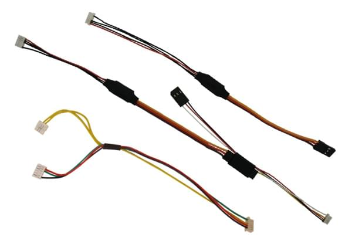

# 睿思凯（FrSky）数传功能

睿思凯遥测功能允许你在兼容的遥控器发射机上访问载具的 [遥测或状态信息](#messages)。

有效的 [遥测信息如下所示](#messages)，包括：飞行模式、电池信息、遥控信号强度、速度、高度等。 某些型号的发射机还可以提供声音和震动的反馈，这对于低电量和其他故障安全警告特别有用。

PX4平台支持睿思凯的 [S.port](#s_port)（新）和D.port（旧）两种类型的遥测数据接口。

## 硬件安装

A typical hardware setup for the Pixhawk/S.Port telemetry connection is shown below.


> **Note** The diagram below shows *only* the connection for telemetry! You will still need to [separately connect the reciever for RC channels](../getting_started/rc_transmitter_receiver.md#connecting-receivers).

The setup includes:

* 一个[睿思凯兼容遥控发射机](#transmitters)，比如睿思凯 Taranis X9D Plus；
* 一个[睿思凯遥测接收机](#receivers)，比如XSR和X8R；
* A cable to connect the FrSky receiver Smart Port to a flight controller UART.
    
    > **Warning** Except for [Pixracer](../flight_controller/pixracer.md), Pixhawk-series UART ports and receiver telemetry ports are incompatible, and must (usually) be connected via an adapter.
    
    <span></span>
    
    > **Tip** Usually it is cheaper and easier to buy a [ready made cable](#ready_made_cable) that contains this adapter and has the appropriate connectors for the autopilot and receiver. Creating a [DIY cable](#diy_cables) requires electronics assembly expertise.

### 成品转接线缆 {#ready_made_cable}

Ready-made cables (which include the required adapters) are available from:

* [Craft and Theory](http://www.craftandtheoryllc.com/telemetry-cable). Versions are available with DF-13 compatible *PicoBlade connectors* (for FMUv2/3DR Pixhawk, FMUv2/Holybro pix32) and *JST-GH connectors* (for FMUv3/Pixhawk 2 "The Cube" and FMUv4/PixRacer v1).
    
    [](http://www.craftandtheoryllc.com/telemetry-cable)

## PX4 Configuration {#configure}

[Configure the serial port](../peripherals/serial_configuration.md) on which FrSky will run using [TEL_FRSKY_CONFIG](../advanced_config/parameter_reference.md#TEL_FRSKY_CONFIG). There is no need to set the baud rate for the port, as this is configured by the driver.

> **Note**您可以使用任何可用的 uart, 但通常 `TELEM 2 ` 用于 frsky 遥测 ([Pixracer](../flight_controller/pixracer.md) 除外, 默认情况下, 它被预先配置为使用 *FrSky* 端口)。

<span></span>

> **Tip** 如果配置参数在 *QGroundControl* 中不可用, 则可能需要 添加驱动程序到固件 </1 >: ```drivers/telemetry/frsky_telemetry```</p> </blockquote> 
> 
> No further configuration is required; FrSky telemetry auto-starts when connected and detects D or S mode.
> 
> ## 兼容遥控发射机 {#transmitters}
> 
> You will need an RC transmitter that can receive the telemetry stream (and that is bound to the FrSky receiver).
> 
> Popular alternatives include:
> 
> * FrSky Taranis X9D Plus（推荐）
> * FrSky Taranis X9D
> * FrSky Taranis X9E
> * FrSky Taranis Q X7
> * Turnigy 9XR Pro
> 
> The above transmitters can display telemetry data without any further configuration. The following section(s) explain how you can customise telemetry display (for example, to create a better UI/UX).
> 
> ### Taranis脚本设置(LuaPilot) 
> 
> Compatible Taranis receivers (e.g. X9D Plus) running OpenTX 2.1.6 or newer can use the LuaPilot script to modify the displayed telemetry (as shown in the screenshot below).
> 
> 
> 
> Instructions for installing the script can be found here: [LuaPilot Taranis Telemetry script > Taranis Setup OpenTX 2.1.6 or newer](http://ilihack.github.io/LuaPilot_Taranis_Telemetry/)
> 
> If you open the `LuaPil.lua` script with a text editor, you can edit the configuration. Suggested modifications include:
> 
> * `local BattLevelmAh = -1` 使用载机计算的电池信息；
> * `local SayFlightMode = 0 `没有可供PX4飞行模式使用的WAV音频文件 遥测信息
> 
> ## 遥测信息 {#messages}
> 
> FrySky Telemetry can transmit most of the more useful status information from PX4. S-Port and D-Port receivers transmit different sets of messages, as listed in the following sections.
> 
> ### S-Port {#s_port}
> 
> S-Port receivers transmit the following messages from PX4 (from [here](https://github.com/iNavFlight/inav/blob/master/docs/Telemetry.md#available-smartport-sport-sensors)):
> 
> * **AccX, accy, accz:**加速度计数值。
> * **Alt:**基于气压计的高度, 初始化水平为零。
> * **Curr:**实际电流消耗 (安培)。
> * **Fuel:**当`电池容量`参数和 smartport_fuel_percent = on</1 >参数设置好了, 则剩余电池剩余容量百分比，否则显示电池消耗容量时, 。</li>
<li><strong>Alt:</strong>基于气压计的高度, 初始化水平为零。</li>
<li><strong>GPS:</strong>gps 坐标。</li>
<li><strong>GSpd:</strong>当前相对水平地面速度, 由 gps 计算。</li>
<li><strong>Hdg:</strong>机头朝向 (正北为 0°)。</li>
<li><strong>VFAS:</strong>实际电池电压值 (电压 frsky 安培传感器)。</li>
<li><strong>Vspd:</strong>垂直速度 (cm/s)。</li>
<li><strong>Tmp1:</strong><a href="../getting_started/flight_modes.md">飞行模式</a>, 作为整数发送: 18-手动, 23-定高, 22-定位, 27-任务, 26-保持, 28-返航, 19-特技, 24 0 离线, 20-自稳, 21-速率, 25-起飞, 29-下降, 30-跟随。</li>
<li><strong>Tmp2:</strong>gps 信息。 最右边的数字是 gps 定位类型 (0 = 无, 2 = 2d, 3 = 3d)。 其他数字是卫星的数量。</li>
</ul>

<blockquote>
  <p><strong>Note</strong>px4 不支持以下 "标准" s 端口消息: <strong>ASpd</strong>、<strong>A4</strong>。</p>
</blockquote>

<!-- FYI: 
Values of FRSKY_ID_TEMP1 and FRSKY_ID_TEMP1 set: 

- https://github.com/PX4/Firmware/blob/master/src/drivers/telemetry/frsky_telemetry/frsky_telemetry.cpp#L85  (get_telemetry_flight_mode)
- https://github.com/PX4/Firmware/blob/master/src/drivers/telemetry/frsky_telemetry/frsky_data.cpp#L234-L237 
Lua map of flight modes:
- https://github.com/ilihack/LuaPilot_Taranis_Telemetry/blob/master/SCRIPTS/TELEMETRY/LuaPil.lua#L790
-->

<h3>D-port</h3>

<p>D-Port receivers transmit the following messages (from <a href="https://github.com/cleanflight/cleanflight/blob/master/docs/Telemetry.md">here</a>):</p>

<ul>
<li><strong>AccX, accy, accz:</strong>加速度计数值。</li>
<li><strong>Alt:</strong>基于气压计的高度, 初始化水平为零。</li>
<li><strong>Cels:</strong>平均电池电压值 (电池电压除以电池片数)。</li>
<li><strong>Curr:</strong>实际电流消耗 (安培)。</li>
<li><strong>Fuel:</strong>如果设置了容量, 则剩余电池百分比, 否则显示消耗电量。</li>
<li><strong>Date:</strong>通电后运行时间。</li>
<li><strong>Alt:</strong>基于气压计的高度, 初始化水平为零。</li>
<li><strong>GPS:</strong>gps 坐标。</li>
<li><strong>GSpd:</strong>当前速度, 由 gps 计算。</li>
<li><strong>Hdg:</strong>机头朝向 (正北为 0°)。</li>
<li><strong>RPM:</strong>解锁后为油门数值, 否则为电池容量。 请注意, 在Taranis上，电池片数需要设置为12。</li>
<li><strong>Tmp1:</strong>飞行模式 (适用于 s-port)。</li>
<li><strong>Tmp2:</strong>gps 信息 (适用于 s-port)。</li>
<li><strong>VFAS:</strong>实际电池电压值 (电压 frsky 安培传感器)。</li>
<li><strong>Vspd:</strong>垂直速度 (cm/s)。</li>
</ul>

<h2 id="receivers">睿思凯遥测接收机</h2>

<p>Pixhawk/PX4 supports D (old) and S (new) FrSky telemetry. The table belows all FrSky receivers that support telemetry via a D/S.PORT (in theory all of these should work).</p>

<blockquote>
  <p><strong>Tip</strong>值得注意的是，下面列出的X系列接收机是推荐可用的，如XSR、X8R。 R系列和G系列还没有经过测试团队的测试，但是应该也是可以工作的。</p>
</blockquote>

<table>
<thead>
<tr>
  <th>接收机</th>
  <th>范围</th>
  <th>集成输出</th>
  <th>数字遥测输入</th>
  <th>尺寸</th>
  <th>重量</th>
</tr>
</thead>
<tbody>
<tr>
  <td>D4R-II</td>
  <td>1.5km</td>
  <td>CPPM (8)</td>
  <td>D.Port</td>
  <td>40x22.5x6mm</td>
  <td>5.8g</td>
</tr>
<tr>
  <td>D8R-XP</td>
  <td>1.5km</td>
  <td>CPPM (8)</td>
  <td>D.Port</td>
  <td>55x25x14mm</td>
  <td>12.4g</td>
</tr>
<tr>
  <td>D8R-II Plus</td>
  <td>1.5km</td>
  <td>否</td>
  <td>D.Port</td>
  <td>55x25x14mm</td>
  <td>12.4g</td>
</tr>
<tr>
  <td>X4R</td>
  <td>1.5km</td>
  <td>CPPM (8)</td>
  <td>Smart Port</td>
  <td>40x22.5x6mm</td>
  <td>5.8g</td>
</tr>
<tr>
  <td>X4R-SB</td>
  <td>1.5km</td>
  <td>S.Bus (16)</td>
  <td>Smart Port</td>
  <td>40x22.5x6mm</td>
  <td>5.8g</td>
</tr>
<tr>
  <td>X6R / S6R</td>
  <td>1.5km</td>
  <td>S.Bus (16)</td>
  <td>Smart Port</td>
  <td>47.42×23.84×14.7mm</td>
  <td>15.4g</td>
</tr>
<tr>
  <td>X8R / S8R</td>
  <td>1.5km</td>
  <td>S.Bus (16)</td>
  <td>Smart Port</td>
  <td>46.25 x 26.6 x 14.2mm</td>
  <td>16.6g</td>
</tr>
<tr>
  <td>XSR / XSR-M</td>
  <td>1.5km</td>
  <td>S.Bus (16) / CPPM (8)</td>
  <td>Smart Port</td>
  <td>26x19.2x5mm</td>
  <td>3.8g</td>
</tr>
<tr>
  <td>RX8R</td>
  <td>1.5km</td>
  <td>S.Bus (16)</td>
  <td>Smart Port</td>
  <td>46.25x26.6x14.2mm</td>
  <td>12.1g</td>
</tr>
<tr>
  <td>RX8R PRO</td>
  <td>1.5km</td>
  <td>S.Bus (16)</td>
  <td>Smart Port</td>
  <td>46.25x26.6x14.2mm</td>
  <td>12.1g</td>
</tr>
<tr>
  <td>R-XSR</td>
  <td>1.5km</td>
  <td>S.Bus (16) / CPPM (8)</td>
  <td>Smart Port</td>
  <td>16x11x5.4mm</td>
  <td>1.5g</td>
</tr>
<tr>
  <td>G-RX8</td>
  <td>1.5km</td>
  <td>S.Bus (16)</td>
  <td>Smart Port + integrated vario</td>
  <td>55.26<em>17</em>8mm</td>
  <td>5.8g</td>
</tr>
<tr>
  <td>R9</td>
  <td>10km</td>
  <td>S.Bus (16)</td>
  <td>Smart Port</td>
  <td>43.3x26.8x13.9mm</td>
  <td>15.8g</td>
</tr>
<tr>
  <td>R9 slim</td>
  <td>10km</td>
  <td>S.Bus (16)</td>
  <td>Smart Port</td>
  <td>43.3x26.8x13.9mm</td>
  <td>15.8g</td>
</tr>
</tbody>
</table>

<blockquote>
  <p><strong>Note</strong> 以上列表信息来源于： http://www.redsilico.com/frsky-receiver-chart and FrSky <a href="https://www.frsky-rc.com/product-category/receivers/">product documentation</a>.</p>
</blockquote>

<h2 id="diy_cables">自制转接线缆</h2>

<p>It is possible to create your own cables.
You will need connectors that are appropriate for your autopilot (e.g. <em>JST-GH connectors</em> for FMUv3/Pixhawk 2 "The Cube" and FMUv4/PixRacer v1, and DF-13 compatible <em>PicoBlade connectors</em> for older autopilots).</p>

<p>The Pixracer includes electronics for converting between S.PORT and UART signals, but for other boards you will need a UART to S.PORT adapter. 
These can be sourced from:</p>

<ul>
<li><a href="https://www.frsky-rc.com/product/ful-1/">FrSky FUL-1</a>: <a href="https://www.unmannedtechshop.co.uk/frsky-transmitter-receiver-upgrade-adapter-ful-1/">unmannedtech.co.uk</a></li>
<li>SPC: <a href="http://www.getfpv.com/frsky-smart-port-converter-cable.html">getfpv.com</a>, <a href="https://www.unmannedtechshop.co.uk/frsky-smart-port-converter-spc/">unmannedtechshop.co.uk</a> </li>
</ul>

<p>More information about the connections for different boards is given below.</p>

<h3>Pixracer to S-port 接收机</h3>

<p>Connect the Pixracer FrSky TX and RX lines together (solder the wires together) to the X series receiver's S.port pin. 
GND need not be attached as this will have been done when attaching to S.Bus (normal RC connection).</p>

<p>The S-port connection is shown below (using the provided I/O Connector).</p>

<p></p>

<p></p>

<h3>Pixracer to D-port 接收机</h3>

<blockquote>
  <p><strong>Tip</strong> 绝大多数用户现在更倾向于使用S.port。</p>
</blockquote>

<p>Connect the Pixracer FrSky TX line (FS out) to the receiver's RX line.
Connect the Pixracer FrSky RX line (FS in) to the receivers TX line.
GND need not be connected as this will have been done when attaching to RC/SBus (for normal RC).</p>


>     
>     <!-- Image would be nice -->

<h3>Pixhawk Pro</h3>

<p><a href="../flight_controller/pixhawk3_pro.md">Pixhawk 3 Pro</a> can be connected to TELEM4 (no additional software configuration is needed).
You will need to connect via a UART to S.PORT adapter board, or a <a href="#ready_made_cable">ready-made cable</a>.</p>

<h3 id="pixhawk_v2">其他飞控板</h3>

<p>Most other boards connect to the receiver for FrSky telemetry via the TELEM2 UART. 
This includes, for example: <a href="../flight_controller/pixhawk.md">Pixhawk 1</a>, <a href="../flight_controller/mro_pixhawk.md">mRo Pixhawk</a>, Pixhawk2.</p>

<p>You will need to connect via a UART to S.PORT adapter board, or a <a href="#ready_made_cable">ready-made cable</a>.</p>


>     
>     <!-- ideally add diagram here -->

<h2>更多信息</h2>

<p>For additional information, see the following links:</p>

<ul>
<li><a href="https://github.com/Clooney82/MavLink_FrSkySPort/wiki/1.2.-FrSky-Taranis-Telemetry">FrSky Taranis 遥测回传</a></li>
<li><a href="https://www.youtube.com/watch?v=x14DyvOU0Vc">Taranis X9D: 遥测回传设置</a> (视频教程)</li>
<li><a href="http://discuss.px4.io/t/px4-frsky-telemetry-setup-with-pixhawk2-and-x8r-receiver/6362">使用Pixhawk2 和 X8R 接收机进行Px4 FrSky 遥测回传设置 </a> (DIY 转接线)</li>
</ul>