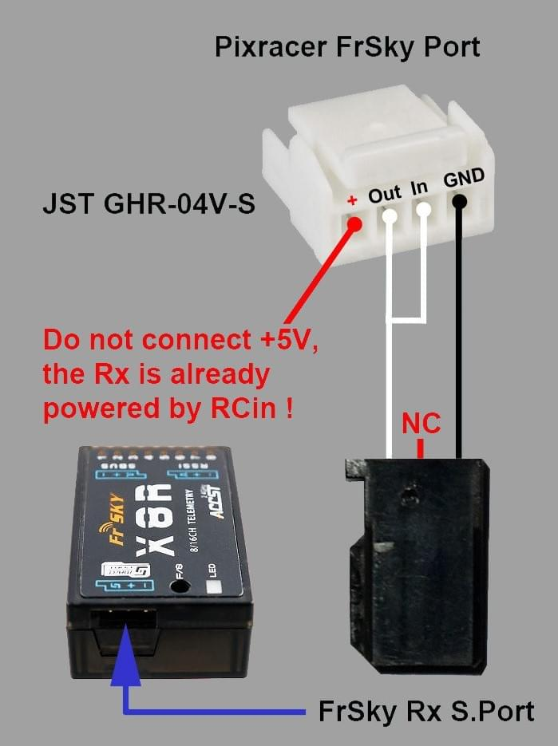

# 睿思凯（FrSky）数传功能

睿思凯遥测功能允许你在兼容的遥控器发射机上访问载具的 [遥测或状态信息](#messages)。

有效的 [遥测信息如下所示](#messages)，包括：飞行模式、电池信息、遥控信号强度、速度、高度等。 某些型号的发射机还可以提供声音和震动的反馈，这对于低电量和其他故障安全警告特别有用。

PX4平台支持睿思凯的 [S.port](#s_port)（新）和D.port（旧）两种类型的遥测数据接口。

## 硬件安装

一个典型的硬件安装如下所示


它包括：

* 一个[睿思凯兼容遥控发射机](#transmitters)，比如睿思凯 Taranis X9D Plus；
* 一个[睿思凯遥测接收机](#receivers)，比如XSR和X8R；
* 一根连接飞控遥测端口与睿思凯接收机的线缆（这与连接到RC通道的是分开的）

除了 [Pixracer](../flight_controller/pixracer.md) 之外，其他Pixhawk系列飞控的 UART 接口与接收机遥测接口是不兼容的，必须通过一个适配器进行连接。

> **Tip** 通常购买一个[成品转接线缆](#ready_made_cable)会更加实惠方便，它包含了一个适配器，并且有合适连接自驾仪与接收机的接头。 自制一个[DIY转接线缆](#diy_cables)需要专业的电子装配技术。

### 成品转接线缆 {#ready_made_cable}

可供获得的成品连接线缆有：

* [Craft and Theory](http://www.craftandtheoryllc.com/telemetry-cable). 以下版本是可用的，DF-13 兼容*PicoBlade 接头* (for FMUv2/3DR Pixhawk, FMUv2/HKPilot32) 和*JST-GH 接头* (for FMUv3/Pixhawk 2 "The Cube" /FMUv4/PixRacer v1).
    
    [](http://www.craftandtheoryllc.com/telemetry-cable)

## PX4配置

睿思凯遥控器使用[TEL_FRSKY_CONFIG](../advanced_config/parameter_reference.md#TEL_FRSKY_CONFIG)运行的[串口配置](../peripherals/serial_configuration.md). 无需设置端口的波特率, 因为这是由驱动程序配置的。

> **Note**您可以使用任何可用的 uart, 但通常 `TELEM 2 ` 用于 frsky 遥测 ([Pixracer](../flight_controller/pixracer.md) 除外, 默认情况下, 它被预先配置为使用 *FrSky* 端口)。

<span></span>

> **Tip** 如果配置参数在 *QGroundControl* 中不可用, 则可能需要 添加驱动程序到固件 </1 >: ```drivers/telemetry/frsky_telemetry```</p> </blockquote> 
> 
> 至此，不需要进一步的配置; frsky 遥测在连接时自动启动, 并检测d 或 s 模式的接收机。
> 
> ## 兼容遥控发射机 {#transmitters}
> 
> 您将需要一个可以接收遥测数据流的遥控发射机，并且绑定到了睿思凯的接收机。
> 
> 主流的可选方案有：
> 
> * FrSky Taranis X9D Plus（推荐）
> * FrSky Taranis X9D
> * FrSky Taranis X9E
> * FrSky Taranis Q X7
> * Turnigy 9XR Pro
> 
> 上面这些发射机无需任何进一步的配置即可显示遥测数据。 以下部分将解释如何自定义遥测显示界面（例如，创建更友好的UI/UX）。
> 
> ### Taranis脚本设置(LuaPilot) 
> 
> 运行OpenTX 2.1.6或更新版本的兼容Taranis发射机(例如X9D Plus)，可以使用LuaPilot脚本修改显示的遥测数据(如下面的截图所示)。
> 
> 
> 
> 这里可以找到安装脚本的说明: [LuaPilot Taranis Telemetry script > Taranis Setup OpenTX 2.1.6 or newer](http://ilihack.github.io/LuaPilot_Taranis_Telemetry/)
> 
> 如果您使用文本编辑工具打开`LuaPilot脚本`，您可以进行编辑配置。 建议修改包括：
> 
> * `local BattLevelmAh = -1` 使用载机计算的电池信息；
> * `local SayFlightMode = 0 `没有可供PX4飞行模式使用的WAV音频文件 遥测信息
> 
> ## 遥测信息 {#messages}
> 
> 睿思凯遥测技术可以从PX4传输大部分有用的状态信息回来。 S. port和D. port接收机传输不同的消息集，如下所示。
> 
> ### S-Port {#s_port}
> 
> S-Port接收机从 PX4传输以下信息 (from [here](https://github.com/iNavFlight/inav/blob/master/docs/Telemetry.md#available-smartport-sport-sensors)):
> 
> * **AccX, accy, accz:**加速度计数值。
> * **Alt:**基于气压计的高度, 初始化水平为零。
> * **Curr:**实际电流消耗 (安培)。
> * **Fuel:**当`电池容量`参数和 smartport_fuel_percent = on</1 >参数设置好了, 则剩余电池剩余容量百分比，否则显示电池消耗容量时, 。</li>
<li><strong>Alt:</strong>基于气压计的高度, 初始化水平为零。</li>
<li><strong>GPS:</strong>gps 坐标。</li>
<li><strong>GSpd:</strong>当前相对水平地面速度, 由 gps 计算。</li>
<li><strong>Hdg:</strong>机头朝向 (正北为 0°)。</li>
<li><strong>VFAS:</strong>实际电池电压值 (电压 frsky 安培传感器)。</li>
<li><strong>Vspd:</strong>垂直速度 (cm/s)。</li>
<li><strong>Tmp1:</strong><a href="../getting_started/flight_modes.md">飞行模式</a>, 作为整数发送: 18-手动, 23-定高, 22-定位, 27-任务, 26-保持, 28-返航, 19-特技, 24 0 离线, 20-自稳, 21-速率, 25-起飞, 29-下降, 30-跟随。</li>
<li><strong>Tmp2:</strong>gps 信息。 最右边的数字是 gps 定位类型 (0 = 无, 2 = 2d, 3 = 3d)。 其他数字是卫星的数量。</li>
</ul>

<blockquote>
  <p><strong>Note</strong>px4 不支持以下 "标准" s 端口消息: <strong>ASpd</strong>、<strong>A4</strong>。</p>
</blockquote>

<!-- FYI: 
Values of FRSKY_ID_TEMP1 and FRSKY_ID_TEMP1 set: 

- https://github.com/PX4/Firmware/blob/master/src/drivers/telemetry/frsky_telemetry/frsky_telemetry.cpp#L85  (get_telemetry_flight_mode)
- https://github.com/PX4/Firmware/blob/master/src/drivers/telemetry/frsky_telemetry/frsky_data.cpp#L234-L237 
Lua map of flight modes:
- https://github.com/ilihack/LuaPilot_Taranis_Telemetry/blob/master/SCRIPTS/TELEMETRY/LuaPil.lua#L790
-->

<h3>D-port</h3>

<p>D-Port receivers transmit the following messages (from <a href="https://github.com/cleanflight/cleanflight/blob/master/docs/Telemetry.md">here</a>):</p>

<ul>
<li><strong>AccX, accy, accz:</strong>加速度计数值。</li>
<li><strong>Alt:</strong>基于气压计的高度, 初始化水平为零。</li>
<li><strong>Cels:</strong>平均电池电压值 (电池电压除以电池片数)。</li>
<li><strong>Curr:</strong>实际电流消耗 (安培)。</li>
<li><strong>Fuel:</strong>如果设置了容量, 则剩余电池百分比, 否则显示消耗电量。</li>
<li><strong>Date:</strong>通电后运行时间。</li>
<li><strong>Alt:</strong>基于气压计的高度, 初始化水平为零。</li>
<li><strong>GPS:</strong>gps 坐标。</li>
<li><strong>GSpd:</strong>当前速度, 由 gps 计算。</li>
<li><strong>Hdg:</strong>机头朝向 (正北为 0°)。</li>
<li><strong>RPM:</strong>解锁后为油门数值, 否则为电池容量。 请注意, 在Taranis上，电池片数需要设置为12。</li>
<li><strong>Tmp1:</strong>飞行模式 (适用于 s-port)。</li>
<li><strong>Tmp2:</strong>gps 信息 (适用于 s-port)。</li>
<li><strong>VFAS:</strong>实际电池电压值 (电压 frsky 安培传感器)。</li>
<li><strong>Vspd:</strong>垂直速度 (cm/s)。</li>
</ul>

<h2 id="receivers">睿思凯遥测接收机</h2>

<p>Pixhawk/PX4支持睿思凯的D. port和S. port遥测功能。 下表是所有通过D.port/S.port支持遥测功能的睿思凯接收机。（理论上，这些都是可以正常工作的。）</p>

<blockquote>
  <p><strong>Tip</strong>值得注意的是，下面列出的X系列接收机是推荐可用的，如XSR、X8R。 R系列和G系列还没有经过测试团队的测试，但是应该也是可以工作的。</p>
</blockquote>

<table>
<thead>
<tr>
  <th>接收机</th>
  <th>范围</th>
  <th>集成输出</th>
  <th>数字遥测输入</th>
  <th>尺寸</th>
  <th>重量</th>
</tr>
</thead>
<tbody>
<tr>
  <td>D4R-II</td>
  <td>1.5km</td>
  <td>CPPM (8)</td>
  <td>D.Port</td>
  <td>40x22.5x6mm</td>
  <td>5.8g</td>
</tr>
<tr>
  <td>D8R-XP</td>
  <td>1.5km</td>
  <td>CPPM (8)</td>
  <td>D.Port</td>
  <td>55x25x14mm</td>
  <td>12.4g</td>
</tr>
<tr>
  <td>D8R-II Plus</td>
  <td>1.5km</td>
  <td>否</td>
  <td>D.Port</td>
  <td>55x25x14mm</td>
  <td>12.4g</td>
</tr>
<tr>
  <td>X4R</td>
  <td>1.5km</td>
  <td>CPPM (8)</td>
  <td>Smart Port</td>
  <td>40x22.5x6mm</td>
  <td>5.8g</td>
</tr>
<tr>
  <td>X4R-SB</td>
  <td>1.5km</td>
  <td>S.Bus (16)</td>
  <td>Smart Port</td>
  <td>40x22.5x6mm</td>
  <td>5.8g</td>
</tr>
<tr>
  <td>X6R / S6R</td>
  <td>1.5km</td>
  <td>S.Bus (16)</td>
  <td>Smart Port</td>
  <td>47.42×23.84×14.7mm</td>
  <td>15.4g</td>
</tr>
<tr>
  <td>X8R / S8R</td>
  <td>1.5km</td>
  <td>S.Bus (16)</td>
  <td>Smart Port</td>
  <td>46.25 x 26.6 x 14.2mm</td>
  <td>16.6g</td>
</tr>
<tr>
  <td>XSR / XSR-M</td>
  <td>1.5km</td>
  <td>S.Bus (16) / CPPM (8)</td>
  <td>Smart Port</td>
  <td>26x19.2x5mm</td>
  <td>3.8g</td>
</tr>
<tr>
  <td>RX8R</td>
  <td>1.5km</td>
  <td>S.Bus (16)</td>
  <td>Smart Port</td>
  <td>46.25x26.6x14.2mm</td>
  <td>12.1g</td>
</tr>
<tr>
  <td>RX8R PRO</td>
  <td>1.5km</td>
  <td>S.Bus (16)</td>
  <td>Smart Port</td>
  <td>46.25x26.6x14.2mm</td>
  <td>12.1g</td>
</tr>
<tr>
  <td>R-XSR</td>
  <td>1.5km</td>
  <td>S.Bus (16) / CPPM (8)</td>
  <td>Smart Port</td>
  <td>16x11x5.4mm</td>
  <td>1.5g</td>
</tr>
<tr>
  <td>G-RX8</td>
  <td>1.5km</td>
  <td>S.Bus (16)</td>
  <td>Smart Port + integrated vario</td>
  <td>55.26<em>17</em>8mm</td>
  <td>5.8g</td>
</tr>
<tr>
  <td>R9</td>
  <td>10km</td>
  <td>S.Bus (16)</td>
  <td>Smart Port</td>
  <td>43.3x26.8x13.9mm</td>
  <td>15.8g</td>
</tr>
<tr>
  <td>R9 slim</td>
  <td>10km</td>
  <td>S.Bus (16)</td>
  <td>Smart Port</td>
  <td>43.3x26.8x13.9mm</td>
  <td>15.8g</td>
</tr>
</tbody>
</table>

<blockquote>
  <p><strong>Note</strong> 以上列表信息来源于： http://www.redsilico.com/frsky-receiver-chart and FrSky <a href="https://www.frsky-rc.com/product-category/receivers/">product documentation</a>.</p>
</blockquote>

<h2 id="diy_cables">自制转接线缆</h2>

<p>自制连接线缆也是可行的。
您将需要适合你的自驾仪的连接头。比如<em>JST-GH 接头</em>（FMUv3/Pixhawk 2 "The Cube" / FMUv4/PixRacer v1)，以及DF-13兼容<em>PicoBlade接头</em>(FMUv2/3DR Pixhawk, FMUv2/HKPilot32）。</p>

<p>The Pixracer includes electronics for converting between S.PORT and UART signals, but for other boards you will need a UART to S.PORT adapter. 
他们可以从以下渠道获取：</p>

<ul>
<li><a href="https://www.frsky-rc.com/product/ful-1/">FrSky FUL-1</a>: <a href="https://www.unmannedtechshop.co.uk/frsky-transmitter-receiver-upgrade-adapter-ful-1/">unmannedtech.co.uk</a></li>
<li>SPC: <a href="http://www.getfpv.com/frsky-smart-port-converter-cable.html">getfpv.com</a>, <a href="https://www.unmannedtechshop.co.uk/frsky-smart-port-converter-spc/">unmannedtechshop.co.uk</a> </li>
</ul>

<p>关于不同飞控板连接头的更多信息如下所示。</p>

<h3>Pixracer to S-port 接收机</h3>

<p>将Pixracer中的FrSky端口的TX和RX连接到一起，再连接到X系列接收机的S.port端口。 
GND不需要连接，因为这将在连接Subs时完成（常规遥控器连接）。</p>

<p>	S. port的连接方式如下图所示，使用提供的I/O连接头。</p>

<p></p>

<p></p>

<h3>Pixracer to D-port 接收机</h3>

<blockquote>
  <p><strong>Tip</strong> 绝大多数用户现在更倾向于使用S.port。</p>
</blockquote>

<p>将Pixracer中FrSky端口的TX（FS out）连接到接收机的RX,
将Pixracer中FrSky端口的RX（FS out）连接到接收机的TX。
GND不需要连接，因为这将在连接RC/Subs时完成。</p>


>     
>     <!-- Image would be nice -->

<h3>Pixhawk Pro</h3>

<p>Piahawk 3 Pro可以连接到TELEM4端口，无需额外的软件配置。
您将需要通过一个UART-S.PORT适配器进行连接，或者一个成品转接线缆。</p>

<h3 id="pixhawk_v2">其他飞控板</h3>

<p>大部分其他型号飞控板是通过TELEM2端口连接到接收机，从而使用睿思凯的遥测功能， 
这其中包括了：Pixhawk 1, mRo Pixhawk, Pixhawk2。</p>

<p>您将需要通过一个UART-S.PORT适配器进行连接，或者一个成品转接线缆。</p>


>     
>     <!-- ideally add diagram here -->

<h2>更多信息</h2>

<p>更多其他信息，请访问以下链接</p>

<ul>
<li><a href="https://github.com/Clooney82/MavLink_FrSkySPort/wiki/1.2.-FrSky-Taranis-Telemetry">FrSky Taranis 遥测回传</a></li>
<li><a href="https://www.youtube.com/watch?v=x14DyvOU0Vc">Taranis X9D: 遥测回传设置</a> (视频教程)</li>
<li><a href="http://discuss.px4.io/t/px4-frsky-telemetry-setup-with-pixhawk2-and-x8r-receiver/6362">使用Pixhawk2 和 X8R 接收机进行Px4 FrSky 遥测回传设置 </a> (DIY 转接线)</li>
</ul>