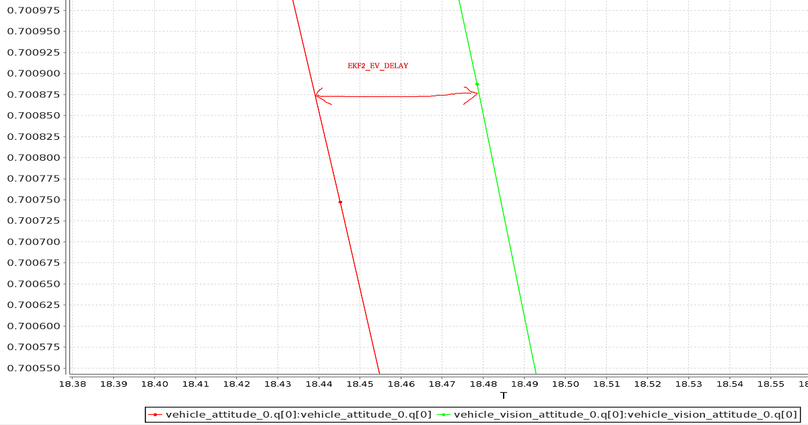

# 利用视觉或运动捕捉系统进行位置估计

可视惯性测距（VIO）和运动捕捉（MOCAP）系统允许载具在全局位置源不可用或不可靠时（例如在室内，或在桥下飞行时）导航。 等等……

VIO 和 MOCAP 都从“视觉”信息中确定飞机的 *pose* （位置和姿态）。 它们之间的主要区别是框架透视图：
- VIO 使用 *板载传感器 * 从车辆的角度获取姿势数据（见 [egomotion](https://en.wikipedia.org/wiki/Visual_odometry#Egomotion)）。
- MoCap 使用 *离板摄像机* 系统在 3D 空间中获取飞机姿态数据（即它是一个外部系统，告诉飞机其姿态）。

任何类型系统的 Pose 数据都可用于更新基于 PX4 自动驾驶仪的局部位置估计（相对于本地源），也可以选择融合到飞机姿态估计中。 Additionally, if the external pose system also provides linear velocity measurements, it can be used to improve the state estimate (fusion of linear velocity measurements is only supported by the EKF2).

本主题介绍如何配置基于 px4 的系统，以便从 MoCap/VIO 系统（通过 ROS 或其他 MAVLink 系统）获取数据，更具体地说明如何设置 MoCap 系统，如 VICON 和 Optitrack，以及基于视觉的估计系统（如 [ROVIO](https://github.com/ethz-asl/rovio)、[SVO](https://github.com/uzh-rpg/rpg_svo) 和 [PTAM](https://github.com/ethz-asl/ethzasl_ptam)）。

:::note
The instructions differ depending on whether you are using the EKF2 or LPE estimator.
:::

## PX4 MAVLink 集成

PX4 uses the following MAVLink messages for getting external position information, and maps them to [uORB topics](../middleware/uorb.md):

| MAVLink                                                                                                                                                                  | uORB                      |
| ------------------------------------------------------------------------------------------------------------------------------------------------------------------------ | ------------------------- |
| [VISION_POSITION_ESTIMATE](https://mavlink.io/en/messages/common.html#VISION_POSITION_ESTIMATE)                                                                        | `vehicle_visual_odometry` |
| [ODOMETRY](https://mavlink.io/en/messages/common.html#ODOMETRY) (`frame_id =` [MAV_FRAME_VISION_NED](https://mavlink.io/en/messages/common.html#MAV_FRAME_VISION_NED)) | `vehicle_visual_odometry` |
| [ATT_POS_MOCAP](https://mavlink.io/en/messages/common.html#ATT_POS_MOCAP)                                                                                              | `vehicle_mocap_odometry`  |
| [ODOMETRY](https://mavlink.io/en/messages/common.html#ODOMETRY) (`frame_id =` [MAV_FRAME_MOCAP_NED](https://mavlink.io/en/messages/common.html#MAV_FRAME_MOCAP_NED))   | `vehicle_mocap_odometry`  |

EKF2 only subscribes to `vehicle_visual_odometry` topics and can hence only process the first two messages (a MoCap system must generate these messages to work with EKF2). The odometry message is the only message that can send also linear velocities to PX4. The LPE estimator subscribes to both topics, and can hence process all the above messages.

:::tip EFK2 is the default estimator used by PX4. It is better tested and supported than LPE, and should be used by preference.
:::

The messages should be streamed at between 30Hz (if containing covariances) and 50 Hz.

The following MAVLink "vision" messages are not currently supported by PX4: [GLOBAL_VISION_POSITION_ESTIMATE](https://mavlink.io/en/messages/common.html#GLOBAL_VISION_POSITION_ESTIMATE), [VISION_SPEED_ESTIMATE](https://mavlink.io/en/messages/common.html#VISION_SPEED_ESTIMATE), [VICON_POSITION_ESTIMATE](https://mavlink.io/en/messages/common.html#VICON_POSITION_ESTIMATE)


## 参考机架

例如，如果使用 optitrack 框架，则本地框架在水平面上具有 $$x$$ 和 $$z$$（*x* 正面和 *z* 右），而 *y* 轴是垂直的，指向上方。 通过如下转换我们可以转换optrack坐标系到NED系中。 The heading of the reference frame of the PX4 estimator and the one of the external pose estimate will not match in most cases. Therefore the reference frame of the external pose estimate is named differently, it is called [MAV_FRAME_LOCAL_FRD](https://mavlink.io/en/messages/common.html#MAV_FRAME_LOCAL_FRD).

Depending on the source of your reference frame, you will need to apply a custom transformation to the pose estimate before sending the MAVLink Vision/MoCap message. This is necessary to change the orientation of the parent and child frame of the pose estimate, such that it fits the PX4 convention. Have a look at the MAVROS [*odom* plugin](https://github.com/mavlink/mavros/blob/master/mavros_extras/src/plugins/odom.cpp) for the necessary transformations.

在方向方面，保持标量部分 *w* 四元数，并以相同的方式交换矢量部分 *x*、*y* 和 *z*。 您可以将此技巧应用于每个系统-如果您需要获取 NED 帧，请相应地查看您的 MoCap 输出和交换轴。

For example, if using the Optitrack framework the local frame has $x{}$ and $z{}$ on the horizontal plane (*x* front and *z* right) while *y* axis is vertical and pointing up. A simple trick is swapping axis in order to obtained NED convention.

[EKF2_EV_DELAY](../advanced/parameter_reference.md#EKF2_EV_DELAY) 是相对于 IMU 测量的 *Vision 位置估计延迟 *。
```
x_{mav} = x_{mocap}
y_{mav} = z_{mocap}
z_{mav} = - y_{mocap}
```

Regarding the orientation, keep the scalar part *w* of the quaternion the same and swap the vector part *x*, *y* and *z* in the same way. You can apply this trick with every system - if you need to obtain a NED frame, look at your MoCap output and swap axis accordingly.


## EKF2 调参/配置

Note: this is a quick overview. For more detailed information, check the [EKF2 tuning guide](../advanced_config/tuning_the_ecl_ekf.md)

The following parameters must be set to use external position information with EKF2 (these can be set in *QGroundControl* > **Vehicle Setup > Parameters > EKF2**).

| 参数                                                                                                                                                                                                            | 外部位置估计的设置                                                             |
| ------------------------------------------------------------------------------------------------------------------------------------------------------------------------------------------------------------- | --------------------------------------------------------------------- |
| [EKF2_AID_MASK](../advanced_config/parameter_reference.md#EKF2_AID_MASK)                                                                                                                                    | 设置 *视觉位置合成* 和 *视觉偏航合成*                                                |
| [EKF2_HGT_MODE](../advanced_config/parameter_reference.md#EKF2_HGT_MODE)                                                                                                                                    | 设置为 *Vision* 使用视觉作为高度估计的主要来源。                                         |
| [EKF2_EV_DELAY](../advanced_config/parameter_reference.md#EKF2_EV_DELAY)                                                                                                                                    | 设置为测量的时间戳和 "实际" 捕获时间之间的差异。 有关详细信息，请参阅 [below](#tuning-EKF2_EV_DELAY)。 |
| [EKF2_EV_POS_X](../advanced/parameter_reference.md#EKF2_EV_POS_X), [EKF2_EV_POS_Y](../advanced/parameter_reference.md#EKF2_EV_POS_Y), [EKF2_EV_POS_Z](../advanced/parameter_reference.md#EKF2_EV_POS_Z) | 设置视觉传感器（或 MoCap 标记）相对于机器人的车身框架的位置。                                    |

:::tip
Reboot the flight controller in order for parameter changes to take effect.
:::

<a id="tuning-EKF2_EV_DELAY"></a>

#### 调参 EKF2_EV_DELAY

[EKF2_EV_DELAY](../advanced_config/parameter_reference.md#EKF2_EV_DELAY) is the *Vision Position Estimator delay relative to IMU measurements*.

该值可以通过不同的参数一起调整，在动态变化中来保证最低 EKF 。

Technically this can be set to 0 if there is correct timestamping (not just arrival time) and timesync (e.g NTP) between MoCap and (for example) ROS computers. In reality, this needs some empirical tuning since delays in the entire MoCap->PX4 chain are very setup-specific. It is rare that a system is setup with an entirely synchronised chain!

A rough estimate of the delay can be obtained from logs by checking the offset between IMU rates and the EV rates:




:::note
A plot of external data vs. onboard estimate (as above) can be generated using [FlightPlot](../log/flight_log_analysis.md#flightplot) or similar flight analysis tools.
:::

The value can further be tuned by varying the parameter to find the value that yields the lowest EKF innovations during dynamic maneuvers.

## LPE 调参/配置

You will first need to [switch to the LPE estimator](../advanced/switching_state_estimators.md) by setting the [SYS_MC_EST_GROUP](../advanced_config/parameter_reference.md#SYS_MC_EST_GROUP) parameter.


:::note
If targeting `px4_fmu-v2` hardware you will also need to use a firmware version that includes the LPE module (firmware for other FMU-series hardware includes both LPE and EKF). The LPE version can be found in the zip file for each PX4 release or it can be built from source using the build command `make px4_fmu-v2_lpe`. See [Building the Code](../dev_setup/building_px4.md) for more details.
:::

### 启用外部位置输入

The following parameters must be set to use external position information with LPE (these can be set in *QGroundControl* > **Vehicle Setup > Parameters > Local Position Estimator**).

| 参数                                                                         | 外部位置估计的设置                                                                                                                                                 |
| -------------------------------------------------------------------------- | --------------------------------------------------------------------------------------------------------------------------------------------------------- |
| [LPE_FUSION](../advanced_config/parameter_reference.md#LPE_FUSION)         | 如果选中了 *fuse 视觉位置 *（默认情况下启用），则启用视觉集成。                                                                                                                      |
| [ATT_EXT_HDG_M](../advanced_config/parameter_reference.md#ATT_EXT_HDG_M) | 设置为1或 2，以启用外部标题集成。 Set to 1 or 2 to enable external heading integration. Setting it to 1 will cause vision to be used, while 2 enables MoCap heading use. |


### 禁用气压计融合

MAVROS 具有插件，可使用以下管道从 VIO 或 MOCAP 系统中继可视化估计：

您可以将上述任何管道与 LPE 一起使用。

### 滤波噪声参数调参

如果您使用的是 EKF2，则仅支持 "视觉" 管道。 If you're working with EKF2, only the "vision" pipelines are supported. To use MoCap data with EKF2 you will have to [remap](http://wiki.ros.org/roslaunch/XML/remap) the pose topic that you get from MoCap: You may need to set them lower than the allowed minimum and force-save.

:::tip
If performance is still poor, try increasing the [LPE_PN_V](../advanced_config/parameter_reference.md#LPE_PN_V) parameter. This will cause the estimator to trust measurements more during velocity estimation.
:::

## 使用 ROS

ROS is not *required* for supplying external pose information, but is highly recommended as it already comes with good integrations with VIO and MoCap systems. PX4 must already have been set up as above.

### 将数据输入 ROS

VIO and MoCap systems have different ways of obtaining pose data, and have their own setup and topics.

The setup for specific systems is covered [below](#setup_specific_systems). When using external heading estimation, magnetic North is ignored and faked with a vector corresponding to world *x* axis (which can be placed freely during Vision/MoCap calibration). Yaw angle is therefore given with respect to local *x*.

<a id="relaying_pose_data_to_px4"></a>

### 将数据回传给 PX4

MAVROS has plugins to relay a visual estimation from a VIO or MoCap system using the following pipelines:

| ROS                      | MAVLink                                                                                                                                                                  | uORB                      |
| ------------------------ | ------------------------------------------------------------------------------------------------------------------------------------------------------------------------ | ------------------------- |
| /mavros/vision_pose/pose | [VISION_POSITION_ESTIMATE](https://mavlink.io/en/messages/common.html#VISION_POSITION_ESTIMATE)                                                                        | `vehicle_visual_odometry` |
| /mavros/odometry/odom    | [ODOMETRY](https://mavlink.io/en/messages/common.html#ODOMETRY) (`frame_id =` [MAV_FRAME_VISION_NED](https://mavlink.io/en/messages/common.html#MAV_FRAME_VISION_NED)) | `vehicle_visual_odometry` |
| /mavros/mocap/pose       | [ATT_POS_MOCAP](https://mavlink.io/en/messages/common.html#ATT_POS_MOCAP)                                                                                              | `vehicle_mocap_odometry`  |
| /mavros/odometry/odom    | [ODOMETRY](https://mavlink.io/en/messages/common.html#ODOMETRY) (`frame_id =` [MAV_FRAME_VISION_NED](https://mavlink.io/en/messages/common.html#MAV_FRAME_VISION_NED)) | `vehicle_mocap_odometry`  |

You can use any of the above pipelines with LPE.

If you're working with EKF2, only the "vision" pipelines are supported. To use MoCap data with EKF2 you will have to [remap](http://wiki.ros.org/roslaunch/XML/remap) the pose topic that you get from MoCap:
- MoCap ROS topics of type `geometry_msgs/PoseStamped` or `geometry_msgs/PoseWithCovarianceStamped` must be remapped to `/mavros/vision_pose/pose`. The `geometry_msgs/PoseStamped` topic is most common as MoCap doesn't usually have associated covariances to the data. `geometry_msgs/PoseStamped` 主题是最常见的，因为 mocap 通常没有与数据相关的协方差。
- If you get data through a `nav_msgs/Odometry` ROS message then you will need to remap it to `/mavros/odometry/odom`.
- The odometry frames `frame_id = odom`, `child_frame_id = base_link` can be changed by updating the file in `mavros/launch/px4_config.yaml`. However, the current version of mavros (`1.3.0`) needs to be able to use the tf tree to find a transform from `frame_id` to the hardcoded frame `odom_ned`. The same applies to the `child_frame_id`, which needs to be connected in the tf tree to the hardcoded frame `base_link_frd`. If you are using mavros `1.2.0` and you didn't update the file `mavros/launch/px4_config.yaml`, then you can safely use the odometry frames `frame_id = odom`, `child_frame_id = base_link` without much worry.
- **Note** Remapping pose topics is covered above [Relaying pose data to PX4](#relaying_pose_data_to_px4) (`/vrpn_client_node/<rigid_body_name>/pose` is of type `geometry_msgs/PoseStamped`).


### 参考框架和 ROS

The local/world and world frames used by ROS and PX4 are different.

| 框架    | ROS                                                                           | PX4                                           |
| ----- | ----------------------------------------------------------------------------- | --------------------------------------------- |
| 机体    | FRD (X **F**orward, Y **R**ight, Z **D**own)                                  | FRD (X **F**orward, Y **R**ight 和 Z **D**own) |
| 世界坐标系 | ENU (X **E**ast, Y **N**orth and Z Up), with the naming being `odom` or `map` | NED (X **N**orth, Y **E**ast, Z **D**own)     |

The following steps explain how to feed position estimates from an [OptiTrack](http://optitrack.com/systems/#robotics) system to PX4. It is assumed that the MoCap system is calibrated. See [this video](https://www.youtube.com/watch?v=cNZaFEghTBU) for a tutorial on the calibration process. 假定 mocap 系统已校准。

如果你把机体命名为 `robot1`，你会得到一个主题，比如 `/vrpn_client_node/robot1/pose`


With EKF2 when using external heading estimation, magnetic north can either be ignored and or the heading offset to magnetic north can be calculated and compensated. Depending on your choice the yaw angle is given with respect to either magnetic north or local *x*.

:::note
When creating the rigid body in the MoCap software, remember to first align the robot's local *x* axis with the world *x* axis otherwise the yaw estimate will have an offset. This can stop the external pose estimate fusion from working properly. Yaw angle should be zero when body and reference frame align.
:::

在设置了上述（特定）系统之一之后，您现在应该可以进行测试了。 After setting up one of the (specific) systems described above you should now be ready to test. The instructions below show how to do so for MoCap and VIO systems If you have an Optitrack system you can use [mocap_optitrack](https://github.com/ros-drivers/mocap_optitrack) node which streams the object pose on a ROS topic already in ENU. With a remapping you can directly publish it on `mocap_pose_estimate` as it is without any transformation and MAVROS will take care of NED conversions.

The MAVROS odometry plugin makes it easy to handle the coordinate frames. It uses ROS's tf package. Your external pose system might have a completely different frame convention that does not match the one of PX4. The body frame of the external pose estimate can depend on how you set the body frame in the MOCAP software or on how you mount the VIO sensor on the drone. The MAVROS odometry plugin needs to know how the external pose's child frame is oriented with respect to either the airframe's FRD or FLU body frame known by MAVROS. You therefore have to add the external pose's body frame to the tf tree. This can be done by including an adapted version of the following line into your ROS launch file.

```
  <node pkg="tf" type="static_transform_publisher" name="tf_baseLink_externalPoseChildFrame"
        args="0 0 0 <yaw> <pitch> <roll> base_link <external_pose_child_frame> 1000"/>
```
Make sure that you change the values of yaw, pitch and roll such that it properly attaches the external pose's body frame to the `base_link` or `base_link_frd`. Have a look at the [tf package](http://wiki.ros.org/tf#static_transform_publisher) for further help on how to specify the transformation between the frames. You can use rviz to check if you attached the frame right. The name of the `external_pose_child_frame` has to match the child_frame_id of your `nav_msgs/Odometry` message. The same also applies for the reference frame of the external pose. You have to attach the reference frame of the external pose as child to either the `odom` or `odom_frd` frame. Adapt therefore the following code line accordingly.
```
  <node pkg="tf" type="static_transform_publisher" name="tf_odom_externalPoseParentFrame"
        args="0 0 0 <yaw> <pitch> <roll> odom <external_pose_parent_frame> 1000"/>
```
Put the robot on the ground and start streaming MoCap feedback. 油门杆推到最低并解锁。 油门杆推到最低并解锁。

此时，设置为位置控制模式。 如果切换成功，飞控会闪绿灯。 绿灯代表：你的外部位置信息已经注入到飞控中，并且位置控制模式已经切换成功。

<a id="setup_specific_systems"></a>

## 特定的系统设置

### 光学跟踪 MoCap

油门杆居中，这是油门控制死区。 It is assumed that the MoCap system is calibrated. 同理对于另一个杆。

#### 设置 *Motive* mocap 软件

* 将无人机的前进方向与 [system + x-axiss](https://v20.wiki.optitrack.com/index.php?title=Template:Coordinate_System) 对齐
* [Define a rigid body in the Motive software](https://www.youtube.com/watch?v=1e6Qqxqe-k0)。 [Define a rigid body in the Motive software](https://www.youtube.com/watch?v=1e6Qqxqe-k0). Give the robot a name that does not contain spaces, e.g. `robot1` instead of `Rigidbody 1`
* [启用帧广播和 VRPN 流](https://www.youtube.com/watch?v=yYRNG58zPFo)
* 将 "向上" 轴设置为 z 轴（默认值为 y）

#### 将数据输入 ROS

* 安装 `vrpn_client_ros` 包
* You can get each rigid body pose on an individual topic by running bash roslaunch vrpn_client_ros sample.launch server:=
  ```bash
  roslaunch vrpn_client_ros sample.launch server:=<mocap machine ip>
  ```

If you named the rigidbody as `robot1`, you will get a topic like `/vrpn_client_node/robot1/pose`

#### 重新映射/重新映射位置数据

MAVROS provides a plugin to relay pose data published on `/mavros/vision_pose/pose` to PX4. Assuming that MAVROS is running, you just need to **remap** the pose topic that you get from MoCap `/vrpn_client_node/<rigid_body_name>/pose` directly to `/mavros/vision_pose/pose`. Note that there is also a `mocap` topic that MAVROS provides to feed `ATT_POS_MOCAP` to PX4, but it is not applicable for EKF2. However, it is applicable with LPE.

:::note
Remapping pose topics is covered above [Relaying pose data to PX4](#relaying_pose_data_to_px4) (`/vrpn_client_node/<rigid_body_name>/pose` is of type `geometry_msgs/PoseStamped`).
:::

Assuming that you have configured EKF2 parameters as described above, PX4 now is set and fusing MoCap data.

You are now set to proceed to the first flight.


## 第一次飞行

After setting up one of the (specific) systems described above you should now be ready to test. The instructions below show how to do so for MoCap and VIO systems

### MoCap First Flight

Be sure to perform the following checks before your first flight:

* Set the PX4 parameter `MAV_ODOM_LP` to 1. PX4 will then stream back the received external pose as MAVLink [ODOMETRY](https://mavlink.io/en/messages/common.html#ODOMETRY) messages.
* You can check these MAVLink messages with the *QGroundControl* [MAVLink Inspector](https://docs.qgroundcontrol.com/en/analyze_view/mavlink_inspector.html) In order to do this, yaw the vehicle until the quaternion of the `ODOMETRY` message is very close to a unit quaternion. (w=1, x=y=z=0)
* At this point the body frame is aligned with the reference frame of the external pose system. If you do not manage to get a quaternion close to the unit quaternion without rolling or pitching your vehicle, your frame probably still have a pitch or roll offset. Do not proceed if this is the case and check your coordinate frames again.
* Once aligned you can pick the vehicle up from the ground and you should see the position's z coordinate decrease. Moving the vehicle in forward direction, should increase the position's x coordinate. While moving the vehicle to the right should increase the y coordinate. In the case you send also linear velocities from the external pose system, you should also check the linear velocities. Check that the linear velocities are in expressed in the *FRD* body frame reference frame.
* Set the PX4 parameter `MAV_ODOM_LP` back to 0. PX4 will stop streaming this message back.

If those steps are consistent, you can try your first flight.

Put the robot on the ground and start streaming MoCap feedback. Lower your left (throttle) stick and arm the motors.

At this point, with the left stick at the lowest position, switch to position control. You should have a green light. The green light tells you that position feedback is available and position control is now activated.

Put your left stick at the middle, this is the dead zone. With this stick value, the robot maintains its altitude; raising the stick will increase the reference altitude while lowering the value will decrease it. Same for right stick on x and y.

Increase the value of the left stick and the robot will take off, put it back to the middle right after. Check if it is able to keep its position.

If it works, you may want to set up an [offboard](offboard_control.md) experiment by sending position-setpoint from a remote ground station.
