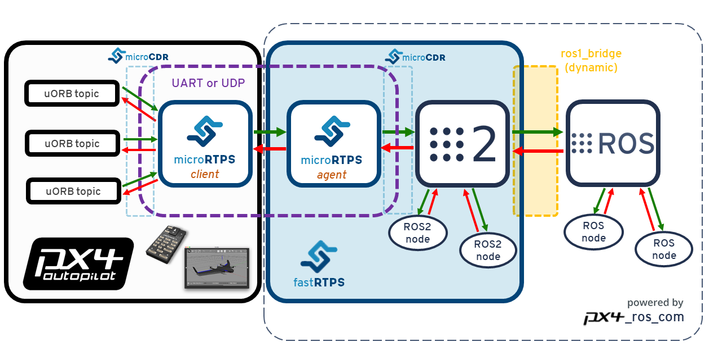

# ROS (1) via ROS 2 Bridge (User Guide)

This topic explains how use ROS (1) with PX4, by bridging via [ROS 2](../ros/ros2.md).

It provides an overview of the ROS-ROS2-PX4 architecture, along with instructions on how to install all the needed software and build ROS (1) applications. It also covers how to run/setup ROS 2 and ROS 1 workspaces at the same time.

:::note
Generally you might use this setup rather than bridging [ROS (1) with MAVROS](../ros/ros1.md) if you want deeper access to PX4 than granted by MAVLink, or if you want to use both ROS2 and ROS (1) applications.
:::

:::note
This setup, and these instructions *depend* on [ROS 2](../ros/ros2.md). We highly recommend you read up on ROS 2 first.
:::

:::warning
Note The PX4 development team recommend that all users [upgrade to ROS 2](../ros/ros2.md).
:::

## Overview

The application pipeline for ROS (1) bridged over ROS 2 is shown below.



Essentially it is the same as for ROS 2, except that there is an additional [`ros1_bridge`](https://github.com/ros2/ros1_bridge) package (by Open Robotics) that translates messages between the two versions. This is needed because the original version of ROS does not support RTPS.

The other main difference is that the `px4_ros_com` and `px4_msgs` packages a separate `ros1` branch that generates the ROS message headers and source files for using **with** the `ros1_bridge`. This branch also includes example listener and advertiser nodes.


## Installation & Setup

Follow the instructions in [ROS 2 User Guide > Installation & Setup](../ros/ros2_comm.md#installation-setup) to install ROS 2.

### Build ROS (1) Workspace

Since the ROS requires a different environments from ROS to you will need to create a separate workspace. This will include the `ros` branch of `px4_ros_com` and `px4_msgs`, along with the `ros1_bridge`.

To create and build the workspace:

1. Create the ROS 1 workspace directory using:
   ```sh
   $ mkdir -p ~/px4_ros_com_ros1/src
   ```
1. Clone the ROS 1 bridge packages `px4_ros_com` and `px4_msgs` to the `/src` directory (the `ros1` branch):
   ```sh
   $ git clone https://github.com/PX4/px4_ros_com.git ~/px4_ros_com_ros1/src/px4_ros_com -b ros1 # clones the 'ros1' branch
   $ git clone https://github.com/PX4/px4_msgs.git ~/px4_ros_com_ros1/src/px4_msgs -b ros1
   ```
1. Use the `build_ros1_bridge.bash` script to build the ROS workspace (including `px4_ros_com`, `px4_msgs`, and `ros1_bridge`).
   <!-- we didn't clone `ros1_bridge` ? -->
   ```sh
   $ git checkout ros1
   $ cd scripts
   $ source build_ros1_bridge.bash
   ```
:::tip
You can also build both ROS (1) and ROS 2 workspaces with a single script: `build_all.bash`. The most common way of using it, is by passing the ROS(1) workspace directory path and PX4 Autopilot directory path:
   ```sh
   $ source build_all.bash --ros1_ws_dir <path/to/px4_ros_com_ros1/ws>
   ```

### Sanity Check the Installation

As discussed in [ROS 2 User Guide > Sanity Check the Installation](../ros/ros2_comm.md#sanity-check-the-installation) a good way to verify the installation is to test that the bridge can communicate with PX4 by running it against the PX4 simulator.

To use ROS (1) **and** ROS 2 (you need both for this!):

1. [Setup your PX4 Ubuntu Linux development environment](../dev_setup/dev_env_linux_ubuntu.md) - the default instructions get the latest version of PX4 source and install all the needed tools.
1. Open a new terminal in the root of the **PX4 Autopilot** project, and then start a PX4 Gazebo simulation using:
   ```sh
   make px4_sitl_rtps gazebo
   ```
   Once PX4 has fully started the terminal will display the [NuttShell/System Console](../debug/system_console.md).

1. On another terminal, source the ROS 2 environment and workspace and launch the `ros1_bridge` (this allows ROS 2 and ROS nodes to communicate with each other). Also set the `ROS_MASTER_URI` where the `roscore` is/will be running:
   ```sh
   $ source /opt/ros/dashing/setup.bash
   $ source ~/px4_ros_com_ros2/install/local_setup.bash
   $ export ROS_MASTER_URI=http://localhost:11311
   $ ros2 run ros1_bridge dynamic_bridge
   ```

1. On another terminal, source the ROS workspace and launch the `sensor_combined` listener node. Since you are launching through `roslaunch`, this will also automatically start the `roscore`:
   ```sh
   $ source ~/px4_ros_com_ros1/install/setup.bash
   $ roslaunch px4_ros_com sensor_combined_listener.launch
   ```

1. On another terminal, source the ROS 2 workspace and then start the `micrortps_agent` daemon with UDP as the transport protocol:
   ```sh
   $ source ~/px4_ros_com_ros2/install/setup.bash
   $ micrortps_agent -t UDP
   ```

1. On the [NuttShell/System Console](../debug/system_console.md), start the `micrortps_client` daemon also in UDP:
   ```sh
   > micrortps_client start -t UDP
   ```

   If the bridge is working correctly you will be able to see the data being printed on the terminal/console where you launched the ROS listener.
   ```sh
   RECEIVED DATA FROM SENSOR COMBINED
   ================================
   ts: 870938190
   gyro_rad[0]: 0.00341645
   gyro_rad[1]: 0.00626475
   gyro_rad[2]: -0.000515705
   gyro_integral_dt: 4739
   accelerometer_timestamp_relative: 0
   accelerometer_m_s2[0]: -0.273381
   accelerometer_m_s2[1]: 0.0949186
   accelerometer_m_s2[2]: -9.76044
   accelerometer_integral_dt: 4739
   ```

:::note
When using the `build_all.bash` script, it automatically opens and sources all the required terminals, so you just have to run the respective apps in each terminal.
:::

## Creating a ROS (1) listener

Since the creation of ROS nodes is a well known and documented process, we are going to leave this section out from this guide, and you can find an example of a ROS listener for `sensor_combined` messages the `ros1` branch of the `px4_ros_com` repository, under the following path `src/listeners/`.

