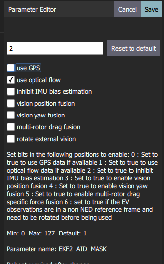

# 光流

*Optical Flow* uses a downward facing camera and a downward facing distance sensor for velocity estimation. Optical Flow based navigation is enabled by the estimators: EKF2 and LPE (deprecated).

## Setup

An Optical Flow setup requires a downward facing camera and a [distance sensor](../sensor/rangefinders.md) (preferably a LiDAR). These can be connected via MAVLink, I2C or any other bus that supports the peripheral.

> **Note** If connected to PX4 via MAVLink the Optical Flow device must publish to the [OPTICAL_FLOW_RAD](https://mavlink.io/en/messages/common.html#OPTICAL_FLOW_RAD) topic, and the distance sensor must publish to the [DISANCE_SENSOR](https://mavlink.io/en/messages/common.html#DISTANCE_SENSOR) topic.

The output of the flow when moving in different directions must be as follows:

| Vehicle movement | Integrated flow |
| ---------------- | --------------- |
| Forwards         | + Y             |
| Backwards        | - Y             |
| Right            | - X             |
| Left             | + X             |

For pure rotations the `integrated_xgyro` and `integrated_x` (respectively `integrated_ygyro` and `integrated_y`) have to be the same.

An popular setup is the [PX4Flow](../sensor/px4flow.md) and [Lidar-Lite](../sensor/lidar_lite.md), as shown below.

## Flow Sensors/Cameras

### PX4Flow

[PX4Flow](../sensor/px4flow.md) is an optical flow camera that works indoors and and in low outdoor light conditions without the need for an illumination LED. It is one of the easiest and most established ways to calculate the optical flow.

### PMW3901-Based Sensors

[PMW3901](../sensor/pmw3901.md) is an optical flow tracking sensor similar to what you would find in a computer mouse, but adapted to work between 80 mm and infinity. It is used in a number of products, including some from: Bitcraze, Tindie, Hex, Thone and Alientek.

### Other Cameras/Sensors

It is also possible to use a board/quad that has an integrated camera (e.g. Snapdragon Flight). For this the [Optical Flow repo](https://github.com/PX4/OpticalFlow) can be used (see also [snap_cam](https://github.com/PX4/snap_cam)).

## Range Finders

You can use any supported [distance sensor](../sensor/rangefinders.md). However we recommend using LIDAR rather than sonar sensors, because of their robustness and accuracy.

## Estimators

### Extended Kalman Filter (EKF2) {#ekf2}

For optical flow fusion using EKF2, set the use optical flow flag in the [EKF2_AID_MASK](../advanced_config/parameter_reference.md#EKF2_AID_MASK) parameter, as shown using QGroundControl below:

If your optical flow sensor is offset from the vehicle centre, you can set this using the following parameters.

| Parameter                                                                                           | Description                                                             |
| --------------------------------------------------------------------------------------------------- | ----------------------------------------------------------------------- |
| [EKF2_OF_POS_X](../advanced_config/parameter_reference.md#EKF2_OF_POS_X) | X position of optical flow focal point in body frame (default is 0.0m). |
| [EKF2_OF_POS_Y](../advanced_config/parameter_reference.md#EKF2_OF_POS_Y) | Y position of optical flow focal point in body frame (default is 0.0m). |
| [EKF2_OF_POS_Z](../advanced_config/parameter_reference.md#EKF2_OF_POS_Z) | Z position of optical flow focal point in body frame (default is 0.0m). |