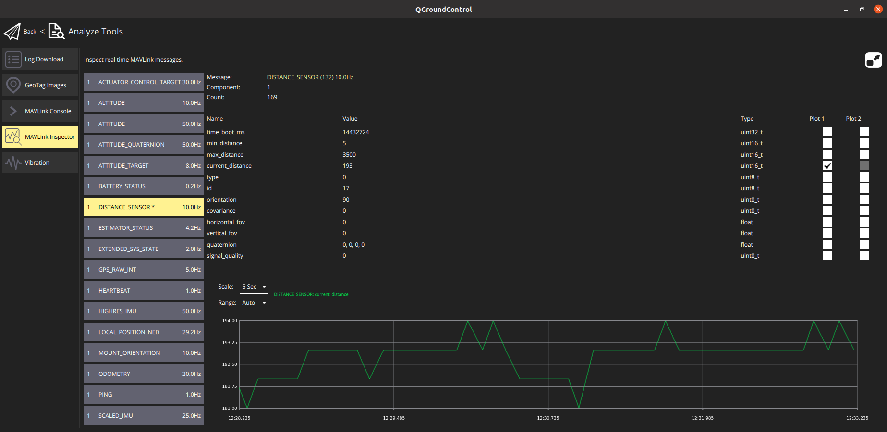

# 距离传感器（测距仪）

距离传感器提供的距离测量可用于[地形跟随](../flying/terrain_following_holding.md#terrain_following)、[地形保持](../flying/terrain_following_holding.md#terrain_hold)（即精确悬停拍摄）、改善着陆行为（[距离辅助](../flying/terrain_following_holding.md#range_aid)）、监管高度限制警告、碰撞预防等。

本节列出了PX4支持的距离传感器（链接到更详细的文档）、所有测距仪所需的[通用配置](#configuration)、[测试](#testing)和[模拟](#simulation)信息。 更详细的设置和配置信息在下方（和侧边栏）的主题链接中提供


## 支持的测距仪

### ARK Flow

[ARK Flow](../uavcan/ark_flow.md) 是一个开源的飞行时间 (ToF) 和光流模块, 能够测量从 8cm 到 30m 的距离. 它可以通过CAN1接口连接至飞控，允许通过CAN2接口添加传感器。 它运行 PX4 固件，支持U[AVCAN](../uavcan/README.md) [固件更新](../uavcan/node_firmware.md)，并被打包成一个小尺寸。


### Holybro ST VL53L1X 激光雷达

[VL53L1X](http://www.holybro.com/product/vl53l1x/)是最先进的飞行时间（ToF）激光测距传感器，增强了ST FlightSense™ 产品系列。 它是市场上速度最快的微型 ToF 传感器，精确测距可达 4 m，快速测距频率可达 50 Hz。

它带有一个 JST GHR 4 针连接器，与 [Pixhawk 4](../flight_controller/pixhawk4.md)、[Pixhawk 5X](../flight_controller/pixhawk5x.md)和其他遵循 [Pixhawk 连接器标准](https://github.com/pixhawk/Pixhawk-Standards/blob/master/DS-009%20Pixhawk%20Connector%20Standard.pdf) 的飞行控制器上的 I2C 端口兼容。

### 激光雷达精简版

[激光雷达精简版](../sensor/lidar_lite.md) 是一款紧凑、高性能的光学远距离测量测距仪。 它的传感器范围为 (5cm - 40m)，可以连接到 PWM 或 I2C 端口。

### MaxBotix I2CXL-MaxSonar-EZ

MaxBotix [I2CXL-MaxSonar-EZ](https://www.maxbotix.com/product-category/i2cxl-maxsonar-ez-products) 测距 有许多基于声纳的相对短程测距仪 ，适用于辅助起飞/着陆和避免碰撞。 这些可以使用 I2C 端口连接。

测距仪通过使用参数[SENS_EN_MB12XX](../advanced_config/parameter_reference.md#SENS_EN_MB12XX)启用。

### Lightware LIDARs

[Lightware SFxx Lidar](../sensor/sfxx_lidar.md) 提供一个宽范围的轻量级激光高度计，适用于许多无人机应用。

PX4 支持: SF11/c 和 SF/LW20. PX4 也可用于一下停产的型号: SF02, SF10/a, SF10/b, SF10/c.

### TeraRanger 测距仪

[TeraRanger](../sensor/teraranger.md) 提供了一些基于红外光飞行时间(ToF)技术的轻量级距离测量传感器。 他们通常比声纳更快、范围更大、比基于激光的系统更小、更轻。

PX4 提供以下通过 I2C总线连接的型号：TeraRanger One, TeraRanger Evo 60m 和 TeraRanger Evo 600Hz。


### Ainstein US-D1 标准雷达高度计

The *Ainstein* [US-D1 Standard Radar Altimeter](../sensor/ulanding_radar.md) is compact microwave rangefinder that has been optimised for use on UAVs. 它有大约50米的感测范围。 该产品的一个特别优势是它可以在所有天气条件下和所有地形类型（包括水）上有效运行。


### LeddarOne

[LeddarOne](../sensor/leddar_one.md) 是一种小型激光雷达模块，具有窄而漫反射的光束，在一个坚固、可靠、经济高效的组件中提供出色的整体探测范围和性能。 它的遥感范围从1厘米到40米不等，需要与UART/串行总线连接。


### TFmini

[Benewake TFmini Lidar](../sensor/tfmini.md) 是一个的小巧、低成本、低功率的激光测距拥有 12m 的测量范围


### PSK-CM8JL65-CC5

The [Lanbao PSK-CM8JL65-CC5 ToF Infrared Distance Measuring Sensor](../sensor/cm8jl65_ir_distance_sensor.md) is a very small (38 mm x 18mm x 7mm, <10g) IR distance sensor with a 0.17m-8m range and millimeter resolution. It must be connected to a UART/serial bus.

### Avionics Anonymous UAVCAN 激光高度计接口

[Avionics Anonymous UAVCAN 激光高度计接口](../uavcan/avanon_laser_interface.md) 允许几种常见的测距仪 (例如 [Lightware SF11/c, SF30/D](../sensor/sfxx_lidar.md), 等) 连接到 [UAVCAN](../uavcan/README.md) 总线, 这是一个比 I2C 更强大的接口.

<span id="configuration"></span>
## 配置/设置

测距仪通常连接到串口(PWM)或者 I2C 接口(取决于设备驱动），并通过设置特定的参数在端口上启用。

The hardware and software setup that is *specific to each distance sensor* is covered in their individual topics.

The generic configuration that is *common to all distance sensors*, covering both the physical setup and usage, is given below.


### 常规配置

The common rangefinder configuration is specified using [EKF2\_RNG\_*](../advanced_config/parameter_reference.md#EKF2_RNG_AID) parameters. 这些包括（非详尽）：
- [EKF2_RNG_POS_X](../advanced_config/parameter_reference.md#EKF2_RNG_POS_X), [EKF2_RNG_POS_Y](../advanced_config/parameter_reference.md#EKF2_RNG_POS_Y), [EKF2_RNG_POS_Z](../advanced_config/parameter_reference.md#EKF2_RNG_POS_Z) - 测距仪在 X、Y、Z 方向上与车辆重心的偏移量。
- [EKF2_RNG_PITCH](../advanced_config/parameter_reference.md#EKF2_RNG_PITCH) - 0 度值（默认值）对应于测距仪与车辆垂直轴精确对齐（即垂直向下），而 90 度表示测距仪指向前方。 如果使用非零间距，则使用简单的三角法计算到地面的距离。
- [EKF2_RNG_DELAY](../advanced_config/parameter_reference.md#EKF2_RNG_DELAY) - 数据从传感器到达估计器的近似延迟。
- [EKF2_RNG_SFE](../advanced_config/parameter_reference.md#EKF2_RNG_SFE) - Range finder range dependent noise scaler.
- [EKF2_RNG_NOISE](../advanced_config/parameter_reference.md#EKF2_RNG_NOISE) - 测距仪融合的测量噪声


## 测试

测试测距仪最简单的方法是改变距离并与 PX4 检测到的值进行比较 以下部分显示了一些获取测量范围的方法。

### QGroundControl MAVLink 检查器

The *QGroundControl MAVLink Inspector* lets you view messages sent from the vehicle, including `DISTANCE_SENSOR` information from the rangefinder. The main difference between the tools is that the *Analyze* tool can plot values in a graph.

:::note
发送的消息取决于车辆配置。 `DISTANCE_SENSOR`只有在联网车辆安装了测距仪并发布传感器值时，您才会收到消息。
:::

查看测距仪输出：

1. Open the menu **Q > Select Tool > Analyze Tools**:

   
1. 选择消息`DISTANCE_SENSOR`，然后选中plot复选框`current_distance`。 工具将会绘制结果： 

### QGroundControl MAVLink 控制台

You can also use the *QGroundControl MAVLink Console* to observe the `distance_sensor` uORB topic:
```sh
listener distance_sensor 5
```

:::note
The *QGroundControl MAVLink Console* works when connected to Pixhawk or other NuttX targets, but not the Simulator. 在模拟器上可以直接在终端中运行命令。
:::

For more information see: [Development > Debugging/Logging > Sensor/Topic Debugging using the Listener Command](../debug/sensor_uorb_topic_debugging.md).


## 仿真

激光测距和声纳测距仪可以在[Gazebo Simulator](../simulation/gazebo.md)上使用。 要做到这一点，你必须在启动模拟器时使用一个拥有测距仪的机体模型。

iris 光流模型包括激光雷达测距仪：
```sh
make px4_sitl gazebo_iris_opt_flow
```

typhoon_h480 包括一个声纳测距仪：
```sh
make px4_sitl gazebo_typhoon_h480
```

如果你需要使用一个不同的车辆，你可以在它的配置文件中包含此模型。 你可以看到如何在相应的 Iris 和 Typhoon 配置文件：
- [iris_opt_flow.sdf](https://github.com/PX4/sitl_gazebo/blob/master/models/iris_opt_flow/iris_opt_flow.sdf)
  ```xml
    <include>
      <uri>model://lidar</uri>
      <pose>-0.12 0 0 0 3.1415 0</pose>
    </include>
    <joint name="lidar_joint" type="revolute">
      <child>lidar::link</child>
      <parent>iris::base_link</parent>
      <axis>
        <xyz>0 0 1</xyz>
        <limit>
          <upper>0</upper>
          <lower>0</lower>
        </limit>
      </axis>
    </joint>
   ```
- [typhoon_h480.sdf](https://github.com/PX4/PX4-SITL_gazebo/blob/main/models/typhoon_h480/typhoon_h480.sdf.jinja#L1131-L1145)
  ```xml
    <include>
      <uri>model://sonar</uri>
    </include>
    <joint name="sonar_joint" type="revolute">
      <child>sonar_model::link</child>
      <parent>typhoon_h480::base_link</parent>
      <axis>
        <xyz>0 0 1</xyz>
        <limit>
          <upper>0</upper>
          <lower>0</lower>
        </limit>
      </axis>
    </joint>
  ```
