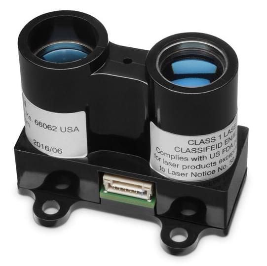

# Distance Sensors (Rangefinders)

Distance sensors provide distance measurement that can be used for terrain following, precision hovering (e.g. for photography), warning of regulatory height limits, collision avoidance etc.

This section lists the distance sensors supported by PX4 (linked to more detailed documentation), the [generic configuration](#configuration) required for all rangefinders, [testing](#testing), and [simulation](#simulation) information. More detailed setup and configuration information is provided in the topics linked below (and sidebar).



## Supported Rangefinders

### Lidar-Lite

[Lidar-Lite](../sensor/lidar_lite.md) is a compact, high-performance optical distant measurement rangefinder. It has a sensor range from (5cm - 40m) and can be connected to either PWM or I2C ports.

### MaxBotix I2CXL-MaxSonar-EZ

The MaxBotix [I2CXL-MaxSonar-EZ](https://www.maxbotix.com/product-category/i2cxl-maxsonar-ez-products) range has a number of relatively short-ranged sonar based rangefinders that are suitable for assisted takeoff/landing and collision avoidance. These can be connected using an I2C port.

The rangefinders are enabled using the parameter [SENS_EN_MB12XX](../advanced_config/parameter_reference.md#SENS_EN_MB12XX).

### Lightware LIDARs

[Lightware SFxx Lidar](../sensor/sfxx_lidar.md) provide a range of lightweight "laser altimeters" that are suitable for many drone applications:

* [SF02](http://lightware.co.za/shop2017/proximity-sensors/1-sf02f.html)
* [SF10/A](http://lightware.co.za/shop2017/drone-altimeters/26-sf10a-25-m.html) (25 m)
* [SF10/B](http://lightware.co.za/shop2017/drone-altimeters/25-sf10b-50-m.html) (50 m)
* SF10/C (100m) (Discontinued)
* [SF11/C](http://lightware.co.za/shop2017/drone-altimeters/44-sf11c-120-m.html) (120 m)
* [SF/LW20](http://lightware.co.za/shop2017/drone-altimeters/51-lw20-100-m.html) (100 m) - Waterproofed (IP67) with servo for sense-and-avoid applications

Drivers exist for both I2C and serial ports (not all devices are supported for both serial and I2C).

### TeraRanger Rangefinders

[TeraRanger](../sensor/teraranger.md) provide a number of lightweight distance measurement sensors based on infrared Time-of-Flight (ToF) technology. They are typically faster and have greater range than sonar, and smaller and lighter than laser-based systems.

PX4 supports the following models connected via the I2C bus: TeraRanger One, TeraRanger Evo 60m and TeraRanger Evo 600Hz.

### uLanding Radar

The [*Aerotenna* uLanding Radar](../sensor/ulanding_radar.md) is compact microwave rangefinder that has been optimised for use on UAVs. It has a sensing range of 45m. A particular advantages of this product are that it can operate effectively in all weather conditions and over all terrain types (including water).

### LeddarOne

[LeddarOne](../sensor/leddar_one.md) is small Lidar module with a narrow, yet diffuse beam that offers excellent overall detection range and performance, in a robust, reliable, cost-effective package. It has a sensing range from 1cm to 40m and needs to be connected to a UART/serial bus.

### TFmini

The [Benewake TFmini Lidar](../sensor/tfmini.md) is a tiny, low cost, and low power LIDAR with 12m range.

### Other

PX4 also supports the Bebop rangefinder.

## Configuration/Setup {#configuration}

Rangefinders are usually connected to either a serial (PWM) or I2C port (depending on the device driver), and are enabled on the port by setting a particular parameter. The hardware and software setup that is specific to each rangefinder is covered in their respective topics.

The generic rangefinder configuration, covering both the physical setup and usage is covered below.

### Generic Configuration

The generic rangefinder configuration is specified using [EKF2*RNG**](../advanced_config/parameter_reference.md#EKF2_RNG_AID) parameters: These include (non exhaustively):

* [EKF2_RNG_PITCH](../advanced_config/parameter_reference.md#EKF2_RNG_POS_X), [EKF2_RNG_POS_X](../advanced_config/parameter_reference.md#EKF2_RNG_POS_X), [EKF2_RNG_POS_Y](../advanced_config/parameter_reference.md#EKF2_RNG_POS_Y), [EKF2_RNG_POS_Z](../advanced_config/parameter_reference.md#EKF2_RNG_POS_Z) - Offset of the rangefinder from the centre of the vehicle body. 
* [EKF2_RNG_DELAY](../advanced_config/parameter_reference.md#EKF2_RNG_DELAY) - approximate delay of data reaching the estimator from the sensor.
* [EKF2*RNG\_A*\*](../advanced_config/parameter_reference.md#EKF2_RNG_AID) - limits and consistency checks when using the sensor for the [range aid feature](../advanced_config/parameter_reference.md#feature).

### Usage/Features {#features}

Rangefinders can be enabled to support flight in two ways:

1. Set [EKF2_HGT_MODE](../advanced_config/parameter_reference.md#EKF2_HGT_MODE) to *Range finder* (`2`). This makes the rangefinder the primary source of height estimation (the default altitude sensor is the barometer).
2. Set [EKF2_RNG_AID](../advanced_config/parameter_reference.md#EKF2_RNG_AID) to `1`. This makes the vehicle use the rangefinder as the primary source when it is safe to use, but will otherwise use the sensor specified in `EKF2_HGT_MODE`. 
    * Specifically, the rangefinder is enabled when: 
        * velocity < [EKF2_RNG_A_VMAX](../advanced_config/parameter_reference.md#EKF2_RNG_A_VMAX)
        * distance to ground < [EKF2_RNG_A_HMAX](../advanced_config/parameter_reference.md#EKF2_RNG_A_HMAX)
    * Other parameters affecting "Range aid" are prefixed with `EKF2\_RNG\_A\_`.

## Testing {#testing}

The easiest way to test the rangefinder is to vary the range and compare to the values detected by PX4. The sections below show some approaches to getting the measured range.

### QGroundControl Analyze Tool

The *QGroundControl Analyze Tool* tool and *QGroundControl MAVLink Inspector* let you view messages sent from the vehicle, including `DISTANCE_SENSOR` information from the rangefinder. The main difference between the tools is that the *Analyze* tool can plot values in a graph.

> **Note** The messages that are sent depend on the vehicle configuration. You will only get `DISTANCE_SENSOR` messages if the connected vehicle has a rangefinder installed and is publishing sensor values.

To view the rangefinder output:

1. Open the menu **Widgets > Analyze**:
    
    

2. Select the message `DISTANCE_SENSOR.current_value`. The tool will then plot the result: 

### QGroundControl MAVLink Console

You can also use the *QGroundControl MAVLink Console* to observe the `distance_sensor` uORB topic:

```sh
listener distance_sensor 5
```

> **Note** The *QGroundControl MAVLink Console* works when connected to Pixhawk or other NuttX targets, but not the Simulator. On the Simulator you can run the commands directly in the terminal.

For more information see: [Sensor/Topic Debugging using the Listener Command](https://dev.px4.io/en/debug/sensor_uorb_topic_debugging.html) (PX4 Development Guide).

## Simulation {#simulation}

Lidar and sonar rangefinders can be used in the [Gazebo Simulator](https://dev.px4.io/en/simulation/gazebo.html) (PX4 Development Guide). To do this you must start the simulator using a vehicle model that includes the rangefinder.

The iris optical flow model includes a Lidar rangefinder:

```sh
make px4_sitl gazebo_iris_opt_flow
```

The typhoon_h480 includes a sonar rangefinder:

```sh
make px4_sitl gazebo_typhoon_h480
```

If you need to use a different vehicle you can include the model in its configuration file. You can see how in the respective Iris and Typhoon configuration files:

* [iris_opt_flow.sdf](https://github.com/PX4/sitl_gazebo/blob/master/models/iris_opt_flow/iris_opt_flow.sdf) 
        xml
        &lt;include&gt;
          &lt;uri&gt;model://sonar&lt;/uri&gt;
        &lt;/include&gt;
        &lt;joint name="sonar_joint" type="revolute"&gt;
          &lt;child&gt;sonar_model::link&lt;/child&gt;
          &lt;parent&gt;typhoon_h480::base_link&lt;/parent&gt;
          &lt;axis&gt;
            &lt;xyz&gt;0 0 1&lt;/xyz&gt;
            &lt;limit&gt;
              &lt;upper&gt;0&lt;/upper&gt;
              &lt;lower&gt;0&lt;/lower&gt;
            &lt;/limit&gt;
          &lt;/axis&gt;
        &lt;/joint&gt;

* [typhoon_h480.sdf](https://github.com/PX4/sitl_gazebo/blob/master/models/typhoon_h480/typhoon_h480.sdf#L1144) 
        xml
        &lt;include&gt;
          &lt;uri&gt;model://lidar&lt;/uri&gt;
          &lt;pose&gt;-0.12 0 0 0 3.1415 0&lt;/pose&gt;
        &lt;/include&gt;
        &lt;joint name="lidar_joint" type="revolute"&gt;
          &lt;child&gt;lidar::link&lt;/child&gt;
          &lt;parent&gt;iris::base_link&lt;/parent&gt;
          &lt;axis&gt;
            &lt;xyz&gt;0 0 1&lt;/xyz&gt;
            &lt;limit&gt;
              &lt;upper&gt;0&lt;/upper&gt;
              &lt;lower&gt;0&lt;/lower&gt;
            &lt;/limit&gt;
          &lt;/axis&gt;
        &lt;/joint&gt;

## 更多信息：

* [Rangefinder](https://pixhawk.org/peripherals/rangefinder) (Pixhawk.org) - Rangefinders supported by Pixhawk