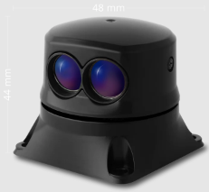

# Lightware SF45/B Rotary Lidar

LightWare [SF45/B](https://lightwarelidar.com/shop/sf45-b-50-m/) is an extremely small and light rotating Lidar with a range of 50m.
It can be used to enable [Collision Prevention](../computer_vision/collision_prevention.md) without a companion computer.



:::info
The lidar driver is not included in the default build of PX4.
You will need to [create and use a custom build](#add-the-driver-to-the-px4-build).
:::

## LightWare Studio Setup

In the [LightWare Studio](https://www.lightwarelidar.com/resources-software) app set following values:

| 参数        | 描述     |
| --------- | ------ |
| Baud rate | 921600 |

Make sure the scan angles are set so that nothing on the drone interferes with the measurements.
The driver and [Collision Prevention](../computer_vision/collision_prevention.md) automatically handle angles different from the maximum angles.

## 硬件安装

The rangefinder can be connected to any unused serial port, such as `TELEM2`.
[Parameter Configuration](#parameter-configuration) explains how to configure the port to use and the other properties of the rangefinder.

## PX4 Setup

### Add the Driver to the PX4 Build

The driver for this LiDar is not included in PX4 firmware by default.

You will need to:

1. Add the [lightware_sf45_serial](../modules/modules_driver_distance_sensor.md#lightware-sf45-serial) driver to firmware:
   - Install and open [menuconfig](../hardware/porting_guide_config.md#px4-menuconfig-setup)
   - In [menuconfig](../hardware/porting_guide_config.md#px4-menuconfig-setup), navigate to **Drivers > Distance sensors**
   - Select/Enable `lightware_sf45_serial`
2. [Build PX4](../dev_setup/building_px4.md) for your flight controller target and then upload the new firmware.

### Parameter Configuration

You will need to configure PX4 to indicate the serial port to which the sensor is connected (as per [Serial Port Configuration](../peripherals/serial_configuration.md)) and also the orientation and other properties of the sensor.

The [parameters to change](../advanced_config/parameters.md) are listed in the table.

| 参数                                                                                                                                                                         | 描述                                                                       |
| -------------------------------------------------------------------------------------------------------------------------------------------------------------------------- | ------------------------------------------------------------------------ |
| <a id="SENS_EN_SF45_CFG"></a>[SENS_EN_SF45_CFG](../advanced_config/parameter_reference.md#SENS_EN_SF45_CFG) | Set to the serial port you have the sensor connected to. |
| <a id="SF45_ORIENT_CFG"></a>[SF45_ORIENT_CFG](../advanced_config/parameter_reference.md#SF45_ORIENT_CFG)                         | Set the orientation of the sensor (facing up or down) |
| <a id="SF45_UPDATE_CFG"></a>[SF45_UPDATE_CFG](../advanced_config/parameter_reference.md#SF45_UPDATE_CFG)                         | Set the update rate                                                      |
| <a id="SF45_YAW_CFG"></a>[SF45_YAW_CFG](../advanced_config/parameter_reference.md#SF45_YAW_CFG)                                  | Set the yaw orientation                                                  |

## 测试

You can confirm that the sensor is correctly configured by connecting QGroundControl, and observing that [OBSTACLE_DISTANCE](https://mavlink.io/en/messages/common.html#OBSTACLE_DISTANCE) is present in the [MAVLink Inspector](https://docs.qgroundcontrol.com/master/en/qgc-user-guide/analyze_view/mavlink_inspector.html).

The obstacle overlay in QGC will look like this:


## Driver Implementation

The [sensor driver](../modules/modules_driver_distance_sensor.md#lightware-sf45-serial) publishes the [ObstacleDistance](../msg_docs/ObstacleDistance.md) UORB Message that is used by PX4 [Collision Prevention](../computer_vision/collision_prevention.md).
The measurements in each sector will correspond to the lowest measurement the sensor had in that corresponding sector.
The data is then published to the [OBSTACLE_DISTANCE](https://mavlink.io/en/messages/common.html#OBSTACLE_DISTANCE) MAVLink message.

## 故障处理

### Errors and Jerky Movements

Start-up issues, jerky movements, or a lot of communication errors displayed with `lightware_sf45_serial status` could mean that the sensor is not getting enough power.

According to its datasheet, the sensor needs 300 mA of current at 5V.
The supplied cable is fairly long and when connected to the 5V supply, such as the flight controller `TELEM2` port, the voltage at the rangefinder may drop below the required level.
One mitigation/alternative is to power the SF45 via a separate step-down converter from battery voltage, ensuring that there are 5V across the rangefinder itself.

### Debugging with PlotJuggler

Debugging problems with distance sensors is much easier if you can plot the [OBSTACLE_DISTANCE](https://mavlink.io/en/messages/common.html#OBSTACLE_DISTANCE) message in an x-y plot, because this lets you directly see the orientation of the measurement in respect of the drone.

The video below shows how you can view such a plot in PlotJuggler.

<lite-youtube videoid="VwEd_7aiLEo" title="PX4 Autopilot: SF45 rangefinder - collision prevention "/>

In order to generate this kind of plot you will need to add the following reactive Lua scripts to PlotJuggler.
If you save these scripts and then add new data, you will see a new timeseries called `obstacle_distance_xy`, which is the same as is displayed in the video.

:::tip
The [Plotting Obstacle Distance and Minimum Distance in Real-Time with PlotJuggler](../computer_vision/collision_prevention.md#plotting-obstacle-distance-and-minimum-distance-in-real-time-with-plotjuggler) in the _Collision Prevention_ topic has a more detailed example of how use Reactive scripts in PlotJuggler.
:::

**Global code, executed once:**

```reactive
obs_dist_xy = ScatterXY.new("obstacle_distance_xy")
```

**function(tracker_time)**

```reactive
obs_dist_xy:clear()

i = 0
angle_offset = TimeseriesView.find("obstacle_distance/angle_offset")
increment = TimeseriesView.find("obstacle_distance/increment")

while(true) do

str = string.format("obstacle_distance/distances.%02d", i)
distance = TimeseriesView.find( str )

if distance == nil then break end
angle = angle_offset:atTime(tracker_time) + i * increment:atTime(tracker_time)

y = distance:atTime(tracker_time) * math.cos(math.rad(angle))
x = distance:atTime(tracker_time) * math.sin(math.rad(angle))

obs_dist_xy:push_back(x, y)

i = i + 1
end
```

:::tip
To also see the fused `obstacle_distance`, you can just adapt the script to work on the `obstacle_distance_fused` message.
:::
