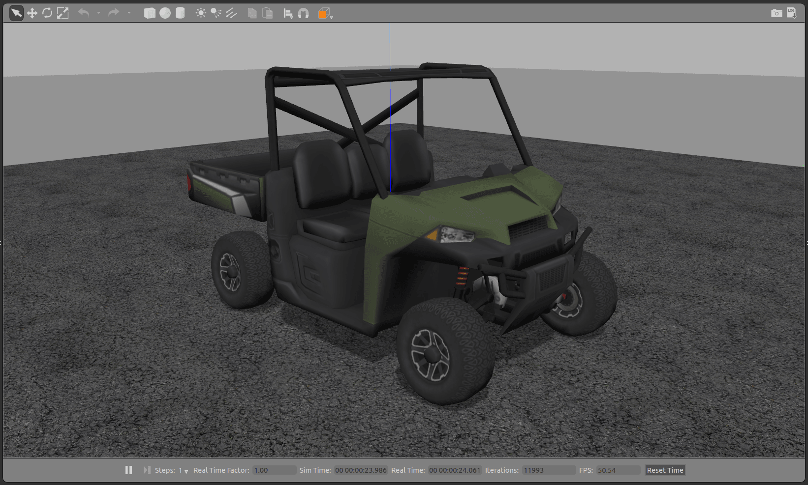
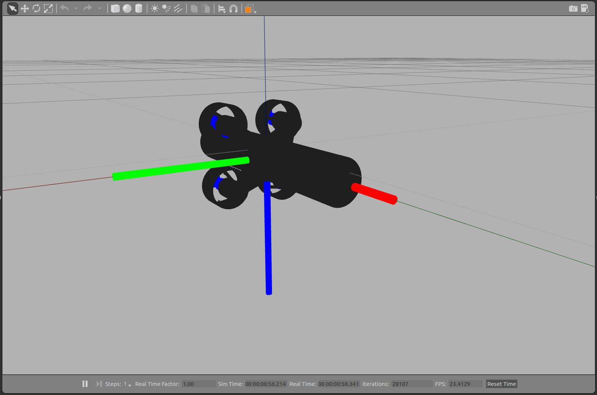

# Gazebo 机型

This topic lists/displays the vehicles supported by the PX4 [Gazebo](../simulation/gazebo.md) simulation and the `make` commands required to run them (the commands are run from a terminal in the **PX4-Autopilot** directory).

支持的机型种类包括：多旋翼、VTOL、尾座式 VTOL、固定翼、无人车、潜艇/无人水下航行器。

:::tip
For the full list of build targets run `make px4_sitl list_vmd_make_targets` (and filter on those that start with `gazebo_`).
:::

:::note
The [Gazebo](../simulation/gazebo.md) page shows how to install Gazebo, how to enable video and load custom maps, and many other configuration options.
:::

## 多旋翼
<a id="quadrotor"></a>

### 四旋翼（默认）

```sh
make px4_sitl gazebo
```

<a id="quadrotor_optical_flow"></a>

### 带光流的四旋翼

```sh
make px4_sitl gazebo_iris_opt_flow
```

<a id="3dr_solo"></a>

### 3DR Solo（四旋翼）

```sh
make px4_sitl gazebo_solo
```


<a id="typhoon_h480"></a>

### Typhoon H480（六旋翼）

```
make px4_sitl gazebo_typhoon_h480
```


:::note
This target also supports [video streaming simulation](../simulation/gazebo.md#video-streaming).
:::

<a id="fixed_wing"></a>

## Plane/Fixed Wing

<a id="standard_plane"></a>

### 标准构型的固定翼飞机

```sh
make px4_sitl gazebo_plane
```


<a id="standard_plane_catapult"></a>

#### Standard Plane with Catapult Launch

```sh
make px4_sitl gazebo_plane_catapult
```

This model simulates hand/catapult launch, which can be used for [fixed wing takeoff](../flying/fixed_wing_takeoff.md#fixed-wing-takeoff) in position mode, takeoff mode, or missions.

The plane will automatically be launched as soon as the vehicle is armed.


## 垂直起降

<a id="standard_vtol"></a>

### 标准垂起

```sh
make px4_sitl gazebo_standard_vtol
```


<a id="tailsitter_vtol"></a>

### 尾座式垂起

```sh
make px4_sitl gazebo_tailsitter
```


<a id="ugv"></a>

## Unmmanned Ground Vehicle (UGV/Rover/Car)

### Ackermann UGV

```sh
make px4_sitl gazebo_rover
```



### Differential UGV

```sh
make px4_sitl gazebo_r1_rover
```


<a id="uuv"></a>

## Unmanned Underwater Vehicle (UUV/Submarine)

<a id="uuv_hippocampus"></a>

### HippoCampus TUHH UUV

```sh
make px4_sitl gazebo_uuv_hippocampus
```



<a id="usv"></a>

## Unmanned Surface Vehicle (USV/Boat)

<a id="usv_boat"></a>

### 船舶

```sh
make px4_sitl gazebo_boat
```


<a id="airship"></a>

## 旋翼机

<a id="cloudship"></a>

### Cloudship

```sh
make px4_sitl gazebo_cloudship
```


